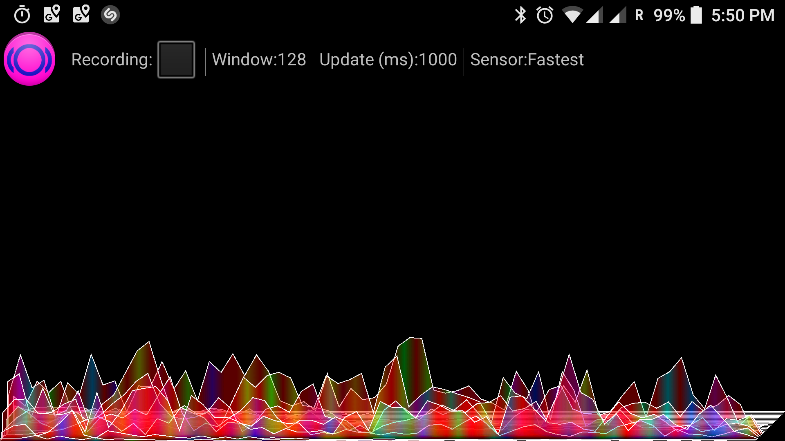

I'm pickin' up good vibrations....  Let's look at the in detail 

Vibrations and movement are around us.  And android phones have accelerometers.  And computing power. Let's have 
some fun. We use accelerometer, FFT and some code to display results as waterfall. Color codes phase,   amplitide codes energy 
for a frequency.  Unfortunately,  accelerometer sampling timing is not very precise - so it can not be used fo serious measurements. 
Nevertheless,  you can clearly see some cool results when using this on a plane.

 * See full source on [Github](https://github.com/ko5tik/accanalyser)
 * Question and discussion on [G+](https://plus.google.com/+KonstantinPribluda/posts/fspDGfZnPNK )

  
    
    
    
https://plus.google.com/+KonstantinPribluda/posts/fspDGfZnPNK    
