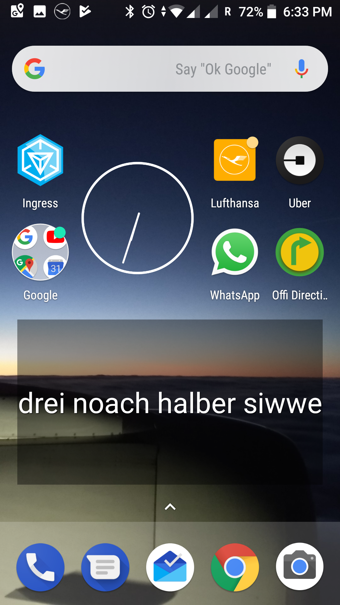

### Halb elf

Zeit auf dem Bildschirm. Als Text. In verschiedenen Dialekten.

Diese App zeigt die Uhrzeit in verschiedenen deutscheDIalekte auf dem Buldschirm. Sonst tut es nichts.  Es ist ein Widget. Und es 
ist möglich  mehrere verschiedene Varianten gleichzeitig zu verwenden. 
 

Or Get APK from here: [literalclock_1_3.apk](literalclock_1_3.apk)

