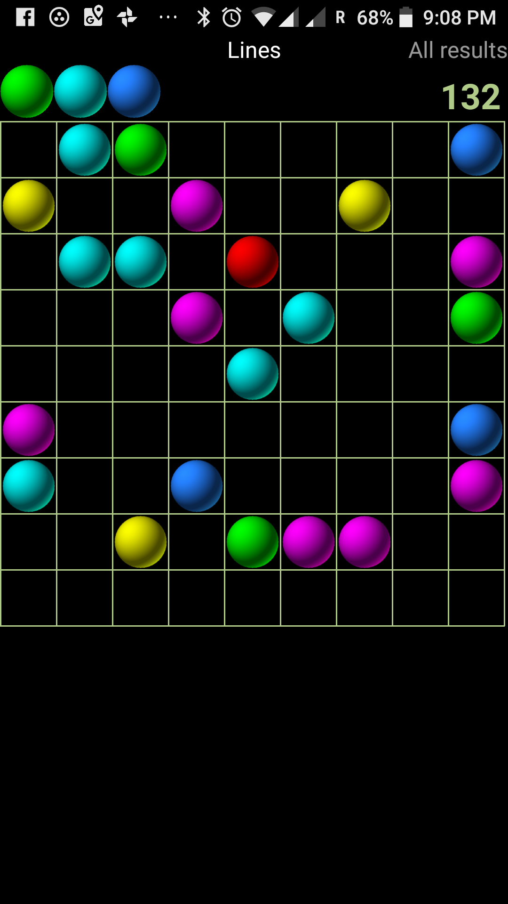

Logic and concentration game. Arrange color balls in straight lines of 5 
or more to remove them and earn points. New balls are placed on every turn. 
Game is open end - as long as you have space you can play

Tap the ball,  tap the place where you like it to go. On the next turn there will be 3 new balls (see preview colors on top). 
You can undo last move (see this arrow next to preview?).  Try to get  lines longer than 5 - there will be more points.  Hey, and lines can cross!

Beware: this is major time sink. 

Or Get APK from here: [Lines.apk](lines.apk)

### Changelog

 - 1.30: Spanish translation
 - 1.25: Reduced necessary permissions and improved android market visibility
 - 1.24: Improved shadow highscores - now displays player name if available
 - 1.23: Introduced shadow highscores - active games are displayed dimmed. 
 - 1.20: Fixed ugly bug in highscore submission. Good news: your scores are safe just open global highscores,  hit menu and choose "synchronize" - your scores will be uploaded in next 30 minutes.  Game is now localized to korean language.
 - 1.17: Improved ranking display and fixed problems with accidental global score list truncation (please synchronize)
 - 1.16: Introduced person ranking in highscore system

 

