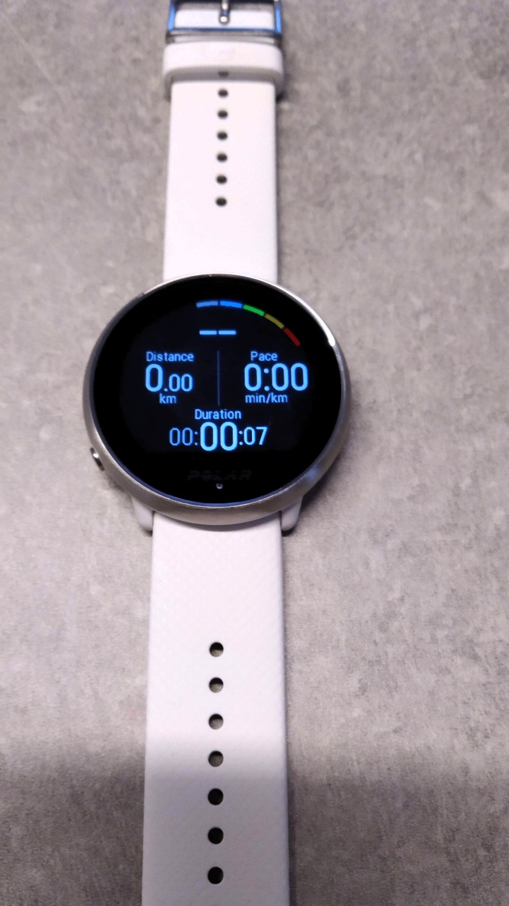
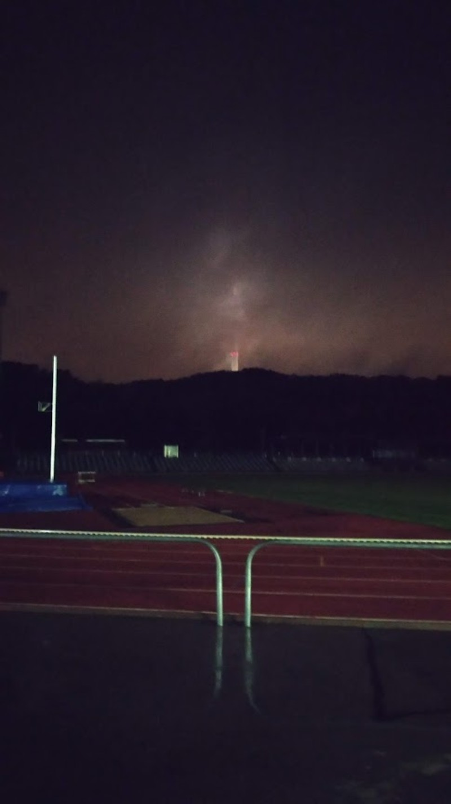

Старый добрый М430 порядком поднадоел,  да и датчик  пульса натирает.  А тем временем накопились мили у люфгансов -  хороший повод порадовать себя обновкой - Polar Ignite
   
 

### Знакомьтесь:

Вынглядит модно,  легкие, пульс берут с запястья.  Браслет пластиковый но очень приятный на ощупь. Дисплей яркий и цветной.  Тач скрин. Одна кнопка.  

#### Функционал

Предназначены как нетрудно догадаться  для записи и последующего анализа тренировок. Записывает как пульс так и ГПС-Треки.  Вроде даже умеют определять  стиль плавания и следить за техникой (но я не проверял).  Отличают бег на [дорожке](https://www.strava.com/activities/2761489294) от улицы (правда непонятно это сами часы или поларовский веб сервис).  Синхронизируются с телефоном или по проводу с компьютером.

Заряжаются полностью примерно за час,  батарейки хватает на 4 дня или часов на 8 спорта.  Зарядный кабель весьма оригинальный - но естественно прилагается. Стардартный разьем УСБ был слабым местом на предидущих моделях - теперь ставят магнитый разьем системы хрен сломаешь. Полное и безоговорочное одобрение. 

#### Новое и интересное

Пульс теперь можно и нужно записывать постояно - заодно можно сделить за качеством  и количеством сна. Есть в наличии странное дыхательное упражнение - помогающее по словам производителя собраться и успокиться. А еще можно использовать ночью в качестве фонарика - довольно удобно.  И самое главное -  больще нет отдельного датчика на грудь который трет и доедает батарейку когда от него меньше всего этого ожидаешь. 

#### Использование по назначению

Да, их можно использовать для тренировок. Содержимое дисплея настраивантся под себя при помощи  вебсервиса.  Там же можно  создавать себе шаблоны для тренировок -  хоть интевальные,  хоть фартлек  1 минута медленно и одна быстро [и так 25 раз](https://www.strava.com/activities/2762552917), хоть по времени, хоть по расстоянию и даже в перемешку.  Фазы тренировки  обозначаются хорошо заметной вибрацией.

Однако есть и недостатки - тачскрин не очень удобен во время тренировок.  Особенно когда холодно и в перчатках. Да и свайпать влево / право / вверх / вниз на бегу как то затруднительно.  Кнопки тут явно лучше.

Но самым главным недостатком является отсутствие ручной остановкм времени.  Совершенно казалось бы базовая и необходимая фунция - но маркетологи решили иначе.  Так что хрен вам дорогие товарищи, а не [12 раз по 400 - 200 - 100](https://www.strava.com/activities/2653698971). Так что для серьезных беговых тренировок эта модель не подходит.  Придется отдать детям.

 #### Оно вам надо?
 
 Если вам просто надо тренироваться для здоровья и развлечения то этот прибор удовлетрорит все ваши нужды.   Однако если ваша бегозависимость зашла далеко,  то лучше чуть чуть добавить миль или денег и взять  модель с кнопками  и без тачскрина.   Увидимся на стадионе.
 

