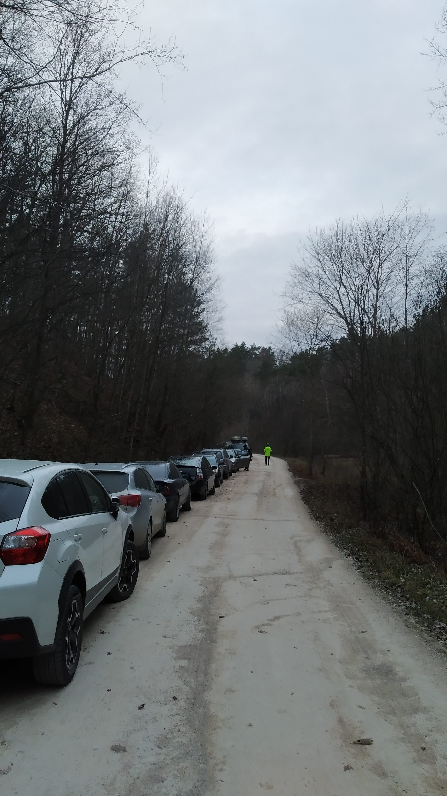
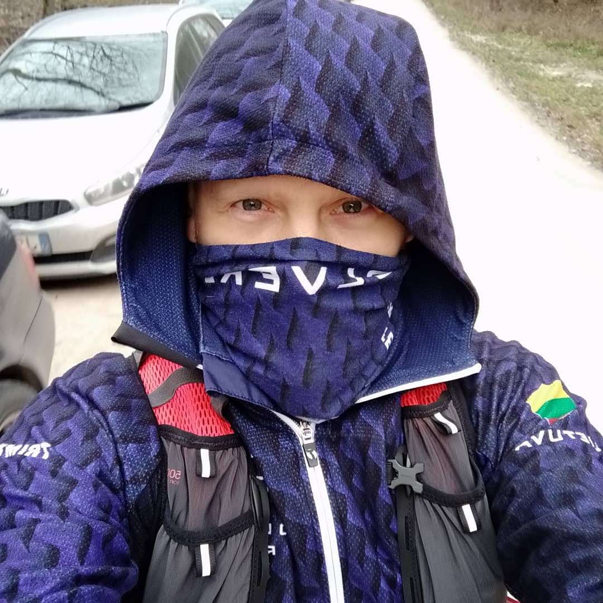
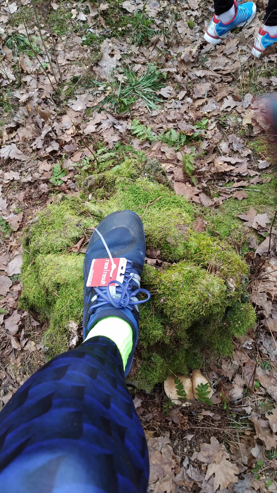
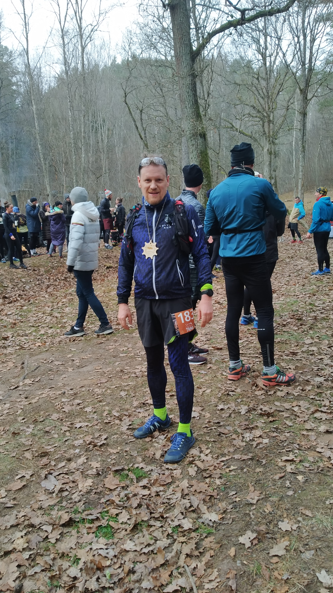

Сезон трэйлов подходит к концу,  и как не поучаствовать в [завершающем этапе трэйл-серии](https://laukinistrail.weebly.com/d363kscarontos-finalinis-etapas.html), на первом этапе которой [я сломал ногу](../rehab_1/)?  
 
 
 Едем [в Дукштос!](https://www.google.lt/maps/place/Karmazin%C5%B3+poilsiaviet%C4%97/@54.8133795,24.9464127,15z/data=!4m13!1m7!3m6!1s0x46dd884e019037cb:0x2600d18d4c453861!2zRMWra8WhdG9z!3b1!8m2!3d54.8222509!4d24.9734029!3m4!1s0x0:0xee3e0538889cb4e7!8m2!3d54.81386!4d24.9623242)  Это типичная
 литовская деревня, примерно в 20 километрах от Вильнюса.  Рядом есть заповедник, какая то археология, протекает великая литовская река
 Нерис - самое место для того, чтобы проложить трассу для трэйла (хотя, если поразмыслить - а где в Литве *неподходящее* место для организации трэйл-рана? Нет тут таких мест).
 
 
 
 От дороги до старта метров 400,  но опытный посетитель знает, что все парковочные места уже заняты, а развернуться внизу негде. Поэтому трусцой на разминку по холодку.
 Зато вся грязь подмерзла.
 
 
  
 Получаем номера - [и побежали](https://www.strava.com/activities/2885223732).  
  
 
  
 Трасса технически сложная - набор высоты за раз  не больше 50 метров, но максмиальный уклон при этом 50%.
 И вниз тоже.  А еще сомнительные деревянные ступеньки. Сразу вспоминается  сачкование на ОФП и в тренажерке.  В очередной раз пообещал себе что буду умненький,
 благоразумненький м прилежненький.  И не буду нарушать режим и всегда буду слушать тренера.  Соперникам, правда, тоже не легче - а то, что я проигрываю на технических участках,
 неплохо отыгрывается на ровном в спокойном (4.30) темпе. 
 
 
 
 
 Прибегаем,  получаем медальку,  пьем чай и едем домой.  Результат сравнимый [с прошлым годом](https://www.strava.com/activities/1982023798) - но средний пульс при этом ниже (160 - 153).  
 
 Зимние советы начинающему трейлобегателю:
  * если взять с собой в рюкзак олимпийку, маечку и штаны, то можно после забега тусоваться в теплом.
  * прозрачные защитные очки из магазина рабочей одежды за 2 евро - точно такие же как их спортивного за 30.
  * тот, кто бегает технические участки осторожно, обычно выигрывает у слишком резвых спортсменов сломавших лодыжку.
  

А через 4 недели у нас будет [Рождественский забег](http://www.kaledinisbegimas.lt/) -  маски кроликов, слонов и алкоголиков приветствуются.
  
  
  
 
