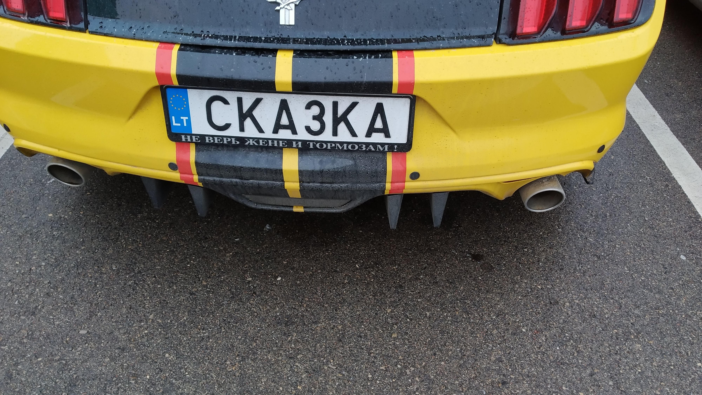

Недавео на стоянкке в ИКЕЕ увидел  машину с пацанским номером СКА3КА.   Да и  знакомый повесил себе на поршика номер ARR0W -  и подумалось мне,  а какие еще можно придумать?   Дай програмисту в руки яву и словарь  русского языка -  и получится ТЕ3АВРАТОР

 <span class="more"></span>

 
 
В литве за некоторую денежку можно сделать себе красивые и остроумнуе номера.    С некоторыми условиями  -   только латинские буквы  и должна быть как минимум одна цифра.  Значит можно использовать   бувквы  АВЕКМНОРСТУХ (как и на российских номорах) а также букву З (или цифру 3).  О заодно поработает как 0.

Первым делом крадем орфографический словарь ( [например тут](https://github.com/danakt/russian-words) )

Берем в рукм яву и пишем жутко сложную программу:

```java
  public static void main(String[] args) throws IOException
  {
    

    final Pattern pattern = Pattern.compile("[АВЕКМНОРСТУХЗ]*");
    // read file  line by line
    final BufferedReader bufferedReader = Files.newBufferedReader(new File(args[0]).toPath(), Charset.forName("windows-1251"));
    // process line by line
    bufferedReader.lines()
      // shall be longer than 2 characters
      .filter(s -> s.length() > 2)
      // to upper case
      .map(s -> s.toUpperCase())
      // shall contain at least an О or З for sake of single digit requirement
      .filter(s -> s.contains("O") || s.contains("З"))
      // and only certain characters
      .filter(s -> pattern.matcher(s).matches())
      // sort this
      .sorted()
      // print this out
      .forEach(System.out::println);

  }
```

И выбираем любимое слово:  ( или [ищем свою фамилию](#фамилии) )

### Слова
```
АВТОВАЗ
АВТОВАЗА
АВТОВАЗЕ
АВТОВАЗОМ
АВТОВАЗУ
АВТОТОРМОЗ
АВТОТОРМОЗА
АВТОТОРМОЗАМ
АВТОТОРМОЗАХ
АВТОТОРМОЗЕ
АВТОТОРМОЗОВ
АВТОТОРМОЗОМ
АВТОТОРМОЗУ
АЗА
АЗА
АЗАМ
АЗАМА
АЗАМАТ
АЗАМАТА
АЗАМАТУ
АЗАР
АЗАРОВ
АЗАРОВО
АЗАРТ
АЗАРТА
АЗАРТЕ
АЗАРТЕН
АЗАРТНА
АЗАРТНЕЕ
АЗАРТНО
АЗАРТНОЕ
АЗАРТНОМ
АЗАРТНОМУ
АЗАРТО
АЗАРТОМ
АЗАРТУ
АЗАТ
АЗАХ
АЗЕ
АЗО
АЗОВ
АЗОВ
АЗОВА
АЗОВЕ
АЗОВОМ
АЗОВСКОЕ
АЗОВСКОМ
АЗОВСКОМУ
АЗОВУ
АЗОМ
АЗОРКА
АЗОРКЕ
АЗОРКУ
АЗОРСКОЕ
АЗОРСКОМ
АЗОРСКОМУ
АЗОТ
АЗОТА
АЗОТЕ
АЗОТНО
АЗОТНОВАТОЕ
АЗОТНОВАТОМ
АЗОТНОВАТОМУ
АЗОТНОЕ
АЗОТНОМ
АЗОТНОМУ
АЗОТОМ
АЗОТОМЕТР
АЗОТУ
АЗС
АЗУ
АЗУР
АЗХАР
АМАВРОЗ
АМАВРОЗА
АМАВРОЗЕ
АМАВРОЗОМ
АМАВРОЗУ
АМАЗОНКА
АМАЗОНКА
АМАЗОНКАМ
АМАЗОНКАХ
АМАЗОНКЕ
АМАЗОНКУ
АМАЗОНОК
АМАЗОНСКОЕ
АМАЗОНСКОМ
АМАЗОНСКОМУ
АНАКРУЗА
АНАМНЕЗ
АНАМНЕЗА
АНАМНЕЗАМ
АНАМНЕЗАХ
АНАМНЕЗЕ
АНАМНЕЗОВ
АНАМНЕЗОМ
АНАМНЕЗУ
АНАСТОМОЗ
АНАСТОМОЗА
АНАСТОМОЗЕ
АНАСТОМОЗОМ
АНАСТОМОЗУ
АНАТАЗ
АНАТАЗА
АНАТАЗЕ
АНАТАЗОМ
АНАТАЗУ
АНТРАКНОЗ
АНТРАКНОЗА
АНТРАКНОЗЕ
АНТРАКНОЗОМ
АНТРАКНОЗУ
АОЗТ
АРАХНОЗАМ
АРАХНОЗАХ
АРЗАМАС
АРЗАМАСА
АРЗАМАСЕ
АРЗАМАСОМ
АРЗАМАССКОЕ
АРЗАМАССКОМ
АРЗАМАССКОМУ
АРЗАМАСУ
АРКАНЗАС
АРКАНЗАС
АРКАНЗАСА
АРКАНЗАСЕ
АРКАНЗАСОМ
АРКАНЗАССКОЕ
АРКАНЗАССКОМ
АРКАНЗАССКОМУ
АРКАНЗАСУ
АРСЕНАЗО
АРТРОЗ
АРТРОЗА
АРТРОЗЕ
АРТРОЗОМ
АРТРОЗУ
АРХОЗАВР
АРХОЗАВРА
АРХОЗАВРАМ
АРХОЗАВРАХ
АРХОЗАВРЕ
АРХОЗАВРОВ
АРХОЗАВРОМ
АРХОЗАВРУ
АТЕРОМАТОЗ
АТЕТОЗ
ВАЗ
ВАЗА
ВАЗАМ
ВАЗАХ
ВАЗЕ
ВАЗОВОЕ
ВАЗОВОМ
ВАЗОВОМУ
ВАЗОМОТОР
ВАЗОМОТОРНОЕ
ВАЗОМОТОРНОМ
ВАЗОМОТОРНОМУ
ВАЗОН
ВАЗОНА
ВАЗОНАМ
ВАЗОНАХ
ВАЗОНЕ
ВАЗОНОВ
ВАЗОНОМ
ВАЗОНУ
ВАЗУ
ВАНТОЗ
ВАНТУЗ
ВАНТУЗА
ВАНТУЗАМ
ВАНТУЗАХ
ВАНТУЗЕ
ВАНТУЗОВ
ВАНТУЗОМ
ВАНТУЗУ
ВВЕЗ
ВВЕЗ
ВВЕЗЕМ
ВВЕЗЕМ
ВВЕЗЕН
ВВЕЗЕН
ВВЕЗЕНА
ВВЕЗЕНА
ВВЕЗЕННОЕ
ВВЕЗЕННОЕ
ВВЕЗЕННОМ
ВВЕЗЕННОМ
ВВЕЗЕННОМУ
ВВЕЗЕННОМУ
ВВЕЗЕНО
ВВЕЗЕНО
ВВЕЗЕТ
ВВЕЗЕТ
ВВЕЗЕТЕ
ВВЕЗЕТЕ
ВВЕЗУ
ВВЕЗУТ
ВВОЗ
ВВОЗА
ВВОЗЕ
ВВОЗКА
ВВОЗКЕ
ВВОЗКУ
ВВОЗНОЕ
ВВОЗНОМ
ВВОЗНОМУ
ВВОЗОМ
ВВОЗУ
ВЕЗ
ВЕЗ
ВЕЗЕМ
ВЕЗЕМ
ВЕЗЕН
ВЕЗЕН
ВЕЗЕНА
ВЕЗЕНА
ВЕЗЕННОЕ
ВЕЗЕННОЕ
ВЕЗЕННОМ
ВЕЗЕННОМ
ВЕЗЕННОМУ
ВЕЗЕННОМУ
ВЕЗЕНО
ВЕЗЕНО
ВЕЗЕТ
ВЕЗЕТ
ВЕЗЕТЕ
ВЕЗЕТЕ
ВЕЗТ
ВЕЗУ
ВЕЗУТ
ВЕНОЗНОЕ
ВЕНОЗНОМ
ВЕНОЗНОМУ
ВЕРОНЕЗЕ
ВЕТХОЗАВЕТН
ВЕТХОЗАВЕТНО
ВЕТХОЗАВЕТНОЕ
ВЕТХОЗАВЕТНОМ
ВЕТХОЗАВЕТНОМУ
ВЗА
ВЗАЕМ
ВЗАЕМ
ВЗАКРУТ
ВЗАМЕН
ВЗАСОС
ВЗВ
ВЗВАР
ВЗВЕ
ВЗВО
ВЗВОЕМ
ВЗВОЕТ
ВЗВОЕТЕ
ВЗВОЗ
ВЗЕ
ВЗМАХ
ВЗМАХА
ВЗМАХАМ
ВЗМАХАХ
ВЗМАХЕ
ВЗМАХНЕМ
ВЗМАХНЕМ
ВЗМАХНЕТ
ВЗМАХНЕТ
ВЗМАХНЕТЕ
ВЗМАХНЕТЕ
ВЗМАХНУ
ВЗМАХНУВ
ВЗМАХНУТ
ВЗМАХОВ
ВЗМАХОМ
ВЗМАХУ
ВЗМЕТ
ВЗМЕТ
ВЗМЕТА
ВЗМЕТА
ВЗМЕТАВ
ВЗМЕТАЕМ
ВЗМЕТАЕТ
ВЗМЕТАЕТЕ
ВЗМЕТАМ
ВЗМЕТАН
ВЗМЕТАН
ВЗМЕТАНА
ВЗМЕТАНА
ВЗМЕТАННОЕ
ВЗМЕТАННОЕ
ВЗМЕТАННОМ
ВЗМЕТАННОМ
ВЗМЕТАННОМУ
ВЗМЕТАННОМУ
ВЗМЕТАНО
ВЗМЕТАНО
ВЗМЕТАХ
ВЗМЕТЕ
ВЗМЕТЕ
ВЗМЕТЕН
ВЗМЕТЕН
ВЗМЕТЕНА
ВЗМЕТЕНА
ВЗМЕТЕННОЕ
ВЗМЕТЕННОЕ
ВЗМЕТЕННОМ
ВЗМЕТЕННОМ
ВЗМЕТЕННОМУ
ВЗМЕТЕННОМУ
ВЗМЕТЕНО
ВЗМЕТЕНО
ВЗМЕТНЕМ
ВЗМЕТНЕМ
ВЗМЕТНЕТ
ВЗМЕТНЕТ
ВЗМЕТНЕТЕ
ВЗМЕТНЕТЕ
ВЗМЕТНУ
ВЗМЕТНУВ
ВЗМЕТНУТ
ВЗМЕТОМ
ВЗМЕТОМ
ВЗМЕТУ
ВЗМЕТУ
ВЗМОЕМ
ВЗМОЕТ
ВЗМОЕТЕ
ВЗМОК
ВЗМОКАЕМ
ВЗМОКАЕТ
ВЗМОКАЕТЕ
ВЗМОКНЕМ
ВЗМОКНЕТ
ВЗМОКНЕТЕ
ВЗМОКНУ
ВЗМОКНУВ
ВЗМОКНУТ
ВЗНЕС
ВЗНЕС
ВЗНЕСЕМ
ВЗНЕСЕМ
ВЗНЕСЕН
ВЗНЕСЕН
ВЗНЕСЕНА
ВЗНЕСЕНА
ВЗНЕСЕННОЕ
ВЗНЕСЕННОЕ
ВЗНЕСЕННОМ
ВЗНЕСЕННОМ
ВЗНЕСЕННОМУ
ВЗНЕСЕННОМУ
ВЗНЕСЕНО
ВЗНЕСЕНО
ВЗНЕСЕТ
ВЗНЕСЕТ
ВЗНЕСЕТЕ
ВЗНЕСЕТЕ
ВЗНЕСУ
ВЗНЕСУТ
ВЗНО
ВЗНОС
ВЗНОСА
ВЗНОСАМ
ВЗНОСАХ
ВЗНОСЕ
ВЗНОСОВ
ВЗНОСОМ
ВЗНОСУ
ВЗО
ВЗОР
ВЗОРА
ВЗОРАМ
ВЗОРАХ
ВЗОРВАВ
ВЗОРВАН
ВЗОРВАНА
ВЗОРВАННОЕ
ВЗОРВАННОМ
ВЗОРВАННОМУ
ВЗОРВАНО
ВЗОРВЕМ
ВЗОРВЕМ
ВЗОРВЕТ
ВЗОРВЕТ
ВЗОРВЕТЕ
ВЗОРВЕТЕ
ВЗОРВУ
ВЗОРВУТ
ВЗОРЕ
ВЗОРОВ
ВЗОРОМ
ВЗОРУ
ВЗР
ВЗРАСТАЕМ
ВЗРАСТАЕТ
ВЗРАСТАЕТЕ
ВЗРАСТЕМ
ВЗРАСТЕМ
ВЗРАСТЕТ
ВЗРАСТЕТ
ВЗРАСТЕТЕ
ВЗРАСТЕТЕ
ВЗРАСТУ
ВЗРАСТУТ
ВЗРЕВЕВ
ВЗРЕВЕМ
ВЗРЕВЕМ
ВЗРЕВЕТ
ВЗРЕВЕТ
ВЗРЕВЕТЕ
ВЗРЕВЕТЕ
ВЗРЕВНОВАВ
ВЗРЕВНУЕМ
ВЗРЕВНУЕТ
ВЗРЕВНУЕТЕ
ВЗРЕВУ
ВЗРЕВУТ
ВЗРЕЗ
ВЗРЕЗА
ВЗРЕЗАВ
ВЗРЕЗАН
ВЗРЕЗАНА
ВЗРЕЗАННОЕ
ВЗРЕЗАННОМ
ВЗРЕЗАННОМУ
ВЗРЕЗАНО
ВЗРЕЗЕ
ВЗРЕЗОМ
ВЗРЕЗУ
ВЗРОС
ВМАЗАВ
ВМАЗАН
ВМАЗАНА
ВМАЗАННОЕ
ВМАЗАННОМ
ВМАЗАННОМУ
ВМАЗАНО
ВМАЗКА
ВМЕРЗ
ВМЕРЗ
ВМЕРЗАЕМ
ВМЕРЗАЕТ
ВМЕРЗАЕТЕ
ВМЕРЗНЕМ
ВМЕРЗНЕМ
ВМЕРЗНЕТ
ВМЕРЗНЕТ
ВМЕРЗНЕТЕ
ВМЕРЗНЕТЕ
ВМЕРЗНУ
ВМЕРЗНУ
ВМЕРЗНУВ
ВМЕРЗНУВ
ВМЕРЗНУТ
ВМЕРЗНУТ
ВНЕЗ
ВНЕЗА
ВНЕЗАТМЕННОЕ
ВНЕЗАТМЕННОМ
ВНЕЗАТМЕННОМУ
ВНЕЗЕМНОЕ
ВНЕЗЕМНОМ
ВНЕЗЕМНОМУ
ВНЕСЕЗОННОЕ
ВНЕСЕЗОННОМ
ВНЕСЕЗОННОМУ
ВОВТУЗЕНКО
ВОЗ
ВОЗА
ВОЗАМ
ВОЗАХ
ВОЗВ
ВОЗВЕ
ВОЗВР
ВОЗВРА
ВОЗВРАТ
ВОЗВРАТА
ВОЗВРАТАМ
ВОЗВРАТАХ
ВОЗВРАТЕ
ВОЗВРАТНО
ВОЗВРАТНОЕ
ВОЗВРАТНОМ
ВОЗВРАТНОМУ
ВОЗВРАТОВ
ВОЗВРАТОМ
ВОЗВРАТУ
ВОЗЕ
ВОЗЗ
ВОЗЗВАВ
ВОЗЗОВЕМ
ВОЗЗОВЕМ
ВОЗЗОВЕТ
ВОЗЗОВЕТ
ВОЗЗОВЕТЕ
ВОЗЗОВЕТЕ
ВОЗЗОВУ
ВОЗЗОВУТ
ВОЗЗР
ВОЗКА
ВОЗКАМ
ВОЗКАХ
ВОЗКЕ
ВОЗКОВ
ВОЗКОМ
ВОЗКУ
ВОЗМ
ВОЗМО
ВОЗМУ
ВОЗМУТ
ВОЗН
ВОЗНА
ВОЗНАМЕ
ВОЗНЕ
ВОЗНЕН
ВОЗНЕНА
ВОЗНЕС
ВОЗНЕС
ВОЗНЕСЕМ
ВОЗНЕСЕМ
ВОЗНЕСЕН
ВОЗНЕСЕН
ВОЗНЕСЕНА
ВОЗНЕСЕНА
ВОЗНЕСЕНН
ВОЗНЕСЕННОЕ
ВОЗНЕСЕННОЕ
ВОЗНЕСЕННОМ
ВОЗНЕСЕННОМ
ВОЗНЕСЕННОМУ
ВОЗНЕСЕННОМУ
ВОЗНЕСЕНО
ВОЗНЕСЕНО
ВОЗНЕСЕНСК
ВОЗНЕСЕНСКО
ВОЗНЕСЕНСКОЕ
ВОЗНЕСЕНСКОМ
ВОЗНЕСЕНСКОМУ
ВОЗНЕСЕНСКУ
ВОЗНЕСЕТ
ВОЗНЕСЕТ
ВОЗНЕСЕТЕ
ВОЗНЕСЕТЕ
ВОЗНЕСУ
ВОЗНЕСУТ
ВОЗНО
ВОЗО
ВОЗОВ
ВОЗОК
ВОЗОМ
ВОЗР
ВОЗРА
ВОЗРАЗ
ВОЗРАС
ВОЗРАСТ
ВОЗРАСТА
ВОЗРАСТАЕМ
ВОЗРАСТАЕТ
ВОЗРАСТАЕТЕ
ВОЗРАСТАМ
ВОЗРАСТАХ
ВОЗРАСТЕ
ВОЗРАСТЕМ
ВОЗРАСТЕМ
ВОЗРАСТЕТ
ВОЗРАСТЕТ
ВОЗРАСТЕТЕ
ВОЗРАСТЕТЕ
ВОЗРАСТНОЕ
ВОЗРАСТНОМ
ВОЗРАСТНОМУ
ВОЗРАСТОВ
ВОЗРАСТОМ
ВОЗРАСТУ
ВОЗРАСТУТ
ВОЗРОС
ВОЗУ
ВОКЗ
ВОНЗ
ВОНЗАЕМ
ВОНЗАЕМОЕ
ВОНЗАЕМОМ
ВОНЗАЕМОМУ
ВОНЗАЕТ
ВОНЗАЕТЕ
ВОНЗЕН
ВОНЗЕН
ВОНЗЕНА
ВОНЗЕНА
ВОНЗЕННОЕ
ВОНЗЕННОЕ
ВОНЗЕННОМ
ВОНЗЕННОМ
ВОНЗЕННОМУ
ВОНЗЕННОМУ
ВОНЗЕНО
ВОНЗЕНО
ВРАЗ
ВРАЗВЕС
ВРАЗМАХ
ВРАЗМЕТ
ВРАЗМЕТ
ВРАЗНОС
ВРАЗРЕЗ
ВРЕЗАВ
ВРЕЗАЕМ
ВРЕЗАЕМОЕ
ВРЕЗАЕМОМ
ВРЕЗАЕМОМУ
ВРЕЗАЕТ
ВРЕЗАЕТЕ
ВРЕЗАН
ВРЕЗАНА
ВРЕЗАННОЕ
ВРЕЗАННОМ
ВРЕЗАННОМУ
ВРЕЗАНО
ВРЕЗКА
ВРЕЗКАМ
ВРЕЗКАХ
ВРЕЗКЕ
ВРЕЗКУ
ВРЕЗНОЕ
ВРЕЗНОМ
ВРЕЗНОМУ
ВРЕЗОК
ВТУЗ
ВТУЗА
ВТУЗАМ
ВТУЗАХ
ВТУЗЕ
ВТУЗОВ
ВТУЗОВКА
ВТУЗОМ
ВТУЗУ
ВУЗ
ВУЗА
ВУЗАМ
ВУЗАХ
ВУЗЕ
ВУЗКОМ
ВУЗОВ
ВУЗОВКА
ВУЗОВСКОЕ
ВУЗОВСКОМ
ВУЗОВСКОМУ
ВУЗОМ
ВУЗУ
ЕРЗАЕМ
ЕРЗАЕМ
ЕРЗАЕТ
ЕРЗАЕТ
ЕРЗАЕТЕ
ЕРЗАЕТЕ
ЗАА
ЗААРЕСТОВ
ЗААРЕСТОВАВ
ЗААРЕСТОВАН
ЗААРЕСТОВАНА
ЗААРЕСТОВАННОЕ
ЗААРЕСТОВАННОМ
ЗААРЕСТОВАННОМУ
ЗААРЕСТОВАНО
ЗААРЕСТУЕМ
ЗААРЕСТУЕТ
ЗААРЕСТУЕТЕ
ЗААРКАНЕН
ЗААРКАНЕНА
ЗААРКАНЕННОЕ
ЗААРКАНЕННОМ
ЗААРКАНЕННОМУ
ЗААРКАНЕНО
ЗААХАВ
ЗААХАЕМ
ЗААХАЕТ
ЗААХАЕТЕ
ЗАВ
ЗАВА
ЗАВАМ
ЗАВАРЕН
ЗАВАРЕНА
ЗАВАРЕННОЕ
ЗАВАРЕННОМ
ЗАВАРЕННОМУ
ЗАВАРЕНО
ЗАВАРКА
ЗАВАРКЕ
ЗАВАРКУ
ЗАВАРНОЕ
ЗАВАРНОМ
ЗАВАРНОМУ
ЗАВАРУХ
ЗАВАРУХА
ЗАВАРУХАМ
ЗАВАРУХАХ
ЗАВАРУХЕ
ЗАВАРУХУ
ЗАВАХ
ЗАВЕ
ЗАВЕЗ
ЗАВЕЗ
ЗАВЕЗЕМ
ЗАВЕЗЕМ
ЗАВЕЗЕН
ЗАВЕЗЕН
ЗАВЕЗЕНА
ЗАВЕЗЕНА
ЗАВЕЗЕННОЕ
ЗАВЕЗЕННОЕ
ЗАВЕЗЕННОМ
ЗАВЕЗЕННОМ
ЗАВЕЗЕННОМУ
ЗАВЕЗЕННОМУ
ЗАВЕЗЕНО
ЗАВЕЗЕНО
ЗАВЕЗЕТ
ЗАВЕЗЕТ
ЗАВЕЗЕТЕ
ЗАВЕЗЕТЕ
ЗАВЕЗУ
ЗАВЕЗУТ
ЗАВЕРЕН
ЗАВЕРЕНА
ЗАВЕРЕННОЕ
ЗАВЕРЕННОМ
ЗАВЕРЕННОМУ
ЗАВЕРЕНО
ЗАВЕРКА
ЗАВЕРКЕ
ЗАВЕРКУ
ЗАВЕРН
ЗАВЕРНЕМ
ЗАВЕРНЕМ
ЗАВЕРНЕТ
ЗАВЕРНЕТ
ЗАВЕРНЕТЕ
ЗАВЕРНЕТЕ
ЗАВЕРНОЕ
ЗАВЕРНУ
ЗАВЕРНУВ
ЗАВЕРНУТ
ЗАВЕРНУТ
ЗАВЕРНУТА
ЗАВЕРНУТА
ЗАВЕРНУТО
ЗАВЕРНУТО
ЗАВЕРНУТОЕ
ЗАВЕРНУТОЕ
ЗАВЕРНУТОМ
ЗАВЕРНУТОМ
ЗАВЕРНУТОМУ
ЗАВЕРНУТОМУ
ЗАВЕРСТАН
ЗАВЕРСТАН
ЗАВЕРСТАНА
ЗАВЕРСТАНА
ЗАВЕРСТАННОЕ
ЗАВЕРСТАННОЕ
ЗАВЕРСТАННОМ
ЗАВЕРСТАННОМ
ЗАВЕРСТАННОМУ
ЗАВЕРСТАННОМУ
ЗАВЕРСТАНО
ЗАВЕРСТАНО
ЗАВЕРСТКА
ЗАВЕРСТКА
ЗАВЕРСТКЕ
ЗАВЕРСТКЕ
ЗАВЕРСТКУ
ЗАВЕРСТКУ
ЗАВЕРТАХ
ЗАВЕРТЕВ
ЗАВЕРТКА
ЗАВЕРТКА
ЗАВЕРТКЕ
ЗАВЕРТКЕ
ЗАВЕРТКУ
ЗАВЕРТКУ
ЗАВЕС
ЗАВЕСА
ЗАВЕСЕ
ЗАВЕСКА
ЗАВЕСКЕ
ЗАВЕСКУ
ЗАВЕСУ
ЗАВЕТ
ЗАВЕТА
ЗАВЕТАМ
ЗАВЕТАХ
ЗАВЕТЕ
ЗАВЕТНО
ЗАВЕТНОЕ
ЗАВЕТНОМ
ЗАВЕТНОМУ
ЗАВЕТОВ
ЗАВЕТОМ
ЗАВЕТРЕН
ЗАВЕТРЕНА
ЗАВЕТРЕННОЕ
ЗАВЕТРЕННОМ
ЗАВЕТРЕННОМУ
ЗАВЕТРЕНО
ЗАВЕТУ
ЗАВКОМ
ЗАВКОМА
ЗАВКОМАМ
ЗАВКОМАХ
ЗАВКОМЕ
ЗАВКОМОВ
ЗАВКОМОМ
ЗАВКОМУ
ЗАВО
ЗАВОВ
ЗАВОЕВ
ЗАВОЕВАВ
ЗАВОЕВАН
ЗАВОЕВАН
ЗАВОЕВАНА
ЗАВОЕВАНА
ЗАВОЕВАННОЕ
ЗАВОЕВАННОЕ
ЗАВОЕВАННОМ
ЗАВОЕВАННОМ
ЗАВОЕВАННОМУ
ЗАВОЕВАННОМУ
ЗАВОЕВАНО
ЗАВОЕВАНО
ЗАВОЕМ
ЗАВОЕТ
ЗАВОЕТЕ
ЗАВОЗ
ЗАВОЗА
ЗАВОЗАМ
ЗАВОЗАХ
ЗАВОЗЕ
ЗАВОЗКА
ЗАВОЗКЕ
ЗАВОЗКУ
ЗАВОЗНОЕ
ЗАВОЗНОМ
ЗАВОЗНОМУ
ЗАВОЗОВ
ЗАВОЗОМ
ЗАВОЗУ
ЗАВОМ
ЗАВОРОТ
ЗАВОРОТА
ЗАВОРОТАМ
ЗАВОРОТАХ
ЗАВОРОТЕ
ЗАВОРОТОВ
ЗАВОРОТОМ
ЗАВОРОТУ
ЗАВОРОХА
ЗАВСЕКТОРОМ
ЗАВТ
ЗАВТР
ЗАВТРА
ЗАВТРАК
ЗАВТРАКА
ЗАВТРАКАЕМ
ЗАВТРАКАЕТ
ЗАВТРАКАЕТЕ
ЗАВТРАКАМ
ЗАВТРАКАХ
ЗАВТРАКЕ
ЗАВТРАКОВ
ЗАВТРАКОМ
ЗАВТРАКУ
ЗАВТРАМУ
ЗАВТРЕМУ
ЗАВУ
ЗАВХОЗ
ЗАВХОЗА
ЗАВХОЗАМ
ЗАВХОЗАХ
ЗАВХОЗЕ
ЗАВХОЗОВ
ЗАВХОЗОМ
ЗАВХОЗУ
ЗАЕ
ЗАЕВ
ЗАЕЗ
ЗАЕК
ЗАЕМ
ЗАЕМ
ЗАЕМНОЕ
ЗАЕМНОЕ
ЗАЕМНОМ
ЗАЕМНОМ
ЗАЕМНОМУ
ЗАЕМНОМУ
ЗАЕРЗАВ
ЗАЕРЗАВ
ЗАЕРЗАЕМ
ЗАЕРЗАЕМ
ЗАЕРЗАЕТ
ЗАЕРЗАЕТ
ЗАЕРЗАЕТЕ
ЗАЕРЗАЕТЕ
ЗАЕСТ
ЗАЕХАВ
ЗАЕХАТ
ЗАЗ
ЗАЗВАВ
ЗАЗВАН
ЗАЗВАНА
ЗАЗВАННОЕ
ЗАЗВАННОМ
ЗАЗВАННОМУ
ЗАЗВАНО
ЗАЗВЕН
ЗАЗВЕНЕВ
ЗАЗЕ
ЗАЗНАЕК
ЗАЗНАМО
ЗАЗО
ЗАЗОВЕМ
ЗАЗОВЕМ
ЗАЗОВЕТ
ЗАЗОВЕТ
ЗАЗОВЕТЕ
ЗАЗОВЕТЕ
ЗАЗОВУ
ЗАЗОВУТ
ЗАЗОР
ЗАЗОРА
ЗАЗОРАМ
ЗАЗОРАХ
ЗАЗОРЕ
ЗАЗОРЕН
ЗАЗОРНА
ЗАЗОРНЕЕ
ЗАЗОРНО
ЗАЗОРНОЕ
ЗАЗОРНОМ
ЗАЗОРНОМУ
ЗАЗОРОВ
ЗАЗОРОМ
ЗАЗОРУ
ЗАК
ЗАКА
ЗАКАВКАЗСКОЕ
ЗАКАВКАЗСКОМ
ЗАКАВКАЗСКОМУ
ЗАКАЕВ
ЗАКАЕМ
ЗАКАЗ
ЗАКАЗА
ЗАКАЗАВ
ЗАКАЗАМ
ЗАКАЗАН
ЗАКАЗАНА
ЗАКАЗАННОЕ
ЗАКАЗАННОМ
ЗАКАЗАННОМУ
ЗАКАЗАНО
ЗАКАЗАХ
ЗАКАЗЕ
ЗАКАЗНОЕ
ЗАКАЗНОМ
ЗАКАЗНОМУ
ЗАКАЗОВ
ЗАКАЗОМ
ЗАКАЗУ
ЗАКАМЕНЕВ
ЗАКАМЕНЕЕМ
ЗАКАМЕНЕЕТ
ЗАКАМЕНЕЕТЕ
ЗАКАТ
ЗАКАТА
ЗАКАТАВ
ЗАКАТАЕМ
ЗАКАТАЕТ
ЗАКАТАЕТЕ
ЗАКАТАМ
ЗАКАТАН
ЗАКАТАНА
ЗАКАТАННОЕ
ЗАКАТАННОМ
ЗАКАТАННОМУ
ЗАКАТАНО
ЗАКАТАХ
ЗАКАТЕ
ЗАКАТКА
ЗАКАТКЕ
ЗАКАТКУ
ЗАКАТНОЕ
ЗАКАТНОМ
ЗАКАТНОМУ
ЗАКАТОВ
ЗАКАТОМ
ЗАКАТУ
ЗАКВАКАВ
ЗАКВАКАЕМ
ЗАКВАКАЕТ
ЗАКВАКАЕТЕ
ЗАКВАСКА
ЗАКВАСКЕ
ЗАКВАСКУ
ЗАКО
ЗАКОВАВ
ЗАКОВАН
ЗАКОВАНА
ЗАКОВАННОЕ
ЗАКОВАННОМ
ЗАКОВАННОМУ
ЗАКОВАНО
ЗАКОВКА
ЗАКОВКЕ
ЗАКОВКУ
ЗАКОМАРА
ЗАКОН
ЗАКОНА
ЗАКОНАМ
ЗАКОНАХ
ЗАКОНЕ
ЗАКОНЕН
ЗАКОНН
ЗАКОННА
ЗАКОННО
ЗАКОННОЕ
ЗАКОННОМ
ЗАКОННОМУ
ЗАКОНО
ЗАКОНОВ
ЗАКОНОМ
ЗАКОНОМЕРЕН
ЗАКОНОМЕРНА
ЗАКОНОМЕРНО
ЗАКОНОМЕРНОЕ
ЗАКОНОМЕРНОМ
ЗАКОНОМЕРНОМУ
ЗАКОНТРАКТОВАВ
ЗАКОНТРАКТОВАН
ЗАКОНТРАКТОВАНА
ЗАКОНТРАКТОВАННОЕ
ЗАКОНТРАКТОВАННОМ
ЗАКОНТРАКТОВАННОМУ
ЗАКОНТРАКТОВАНО
ЗАКОНТРАКТУЕМ
ЗАКОНТРАКТУЕТ
ЗАКОНТРАКТУЕТЕ
ЗАКОНТУРНОЕ
ЗАКОНТУРНОМ
ЗАКОНТУРНОМУ
ЗАКОНУ
ЗАКОРЕНЕ
ЗАКОРКАХ
ЗАКОС
ЗАКОСНЕВ
ЗАКОСНЕЕМ
ЗАКОСНЕЕТ
ЗАКОСНЕЕТЕ
ЗАКОСТЕНЕВ
ЗАКОСТЕНЕЕМ
ЗАКОСТЕНЕЕТ
ЗАКОСТЕНЕЕТЕ
ЗАКР
ЗАКРА
ЗАКРАЕК
ЗАКРАС
ЗАКРАСКА
ЗАКРАСКЕ
ЗАКРАСКУ
ЗАКРАСНЕВ
ЗАКРАСНЕЕМ
ЗАКРАСНЕЕТ
ЗАКРАСНЕЕТЕ
ЗАКРОЕМ
ЗАКРОЕТ
ЗАКРОЕТЕ
ЗАКРОМ
ЗАКРОМА
ЗАКРОМАМ
ЗАКРОМАХ
ЗАКРОМЕ
ЗАКРОМОВ
ЗАКРОМОМ
ЗАКРОМУ
ЗАКРУ
ЗАКРУТКА
ЗАКРУТКЕ
ЗАКРУТКУ
ЗАКСЕНХАУЗЕН
ЗАКУ
ЗАКУЕМ
ЗАКУЕМ
ЗАКУЕТ
ЗАКУЕТ
ЗАКУЕТЕ
ЗАКУЕТЕ
ЗАКУКАРЕКАВ
ЗАКУКАРЕКАЕМ
ЗАКУКАРЕКАЕТ
ЗАКУКАРЕКАЕТЕ
ЗАКУКОВАВ
ЗАКУКУЕМ
ЗАКУКУЕТ
ЗАКУКУЕТЕ
ЗАКУР
ЗАКУРЕН
ЗАКУРЕНА
ЗАКУРЕННОЕ
ЗАКУРЕННОМ
ЗАКУРЕННОМУ
ЗАКУРЕНО
ЗАКУРКА
ЗАКУСАВ
ЗАКУСАЕМ
ЗАКУСАЕТ
ЗАКУСАЕТЕ
ЗАКУСАН
ЗАКУСАНА
ЗАКУСАННОЕ
ЗАКУСАННОМ
ЗАКУСАННОМУ
ЗАКУСАНО
ЗАКУСК
ЗАКУСКА
ЗАКУСКАМ
ЗАКУСКАХ
ЗАКУСКЕ
ЗАКУСКУ
ЗАКУСОК
ЗАКУСОН
ЗАКУСОНА
ЗАКУСОНЕ
ЗАКУСОНОМ
ЗАКУСОНУ
ЗАКУТ
ЗАКУТА
ЗАКУТАВ
ЗАКУТАЕМ
ЗАКУТАЕТ
ЗАКУТАЕТЕ
ЗАКУТАН
ЗАКУТАНА
ЗАКУТАННОЕ
ЗАКУТАННОМ
ЗАКУТАННОМУ
ЗАКУТАНО
ЗАКУТАХ
ЗАКУТКА
ЗАКУТКАМ
ЗАКУТКАХ
ЗАКУТКЕ
ЗАКУТКОВ
ЗАКУТКОМ
ЗАКУТКУ
ЗАКУТОК
ЗАМ
ЗАМА
ЗАМАЗАВ
ЗАМАЗАН
ЗАМАЗАНА
ЗАМАЗАННОЕ
ЗАМАЗАННОМ
ЗАМАЗАННОМУ
ЗАМАЗАНО
ЗАМАЗКА
ЗАМАЗКАМ
ЗАМАЗКАХ
ЗАМАЗКЕ
ЗАМАЗКУ
ЗАМАЗОК
ЗАМАМ
ЗАМАН
ЗАМАНЕН
ЗАМАНЕН
ЗАМАНЕНА
ЗАМАНЕНА
ЗАМАНЕННОЕ
ЗАМАНЕННОЕ
ЗАМАНЕННОМ
ЗАМАНЕННОМ
ЗАМАНЕННОМУ
ЗАМАНЕННОМУ
ЗАМАНЕНО
ЗАМАНЕНО
ЗАМАРАВ
ЗАМАРАЕМ
ЗАМАРАЕТ
ЗАМАРАЕТЕ
ЗАМАРАН
ЗАМАРАНА
ЗАМАРАННОЕ
ЗАМАРАННОМ
ЗАМАРАННОМУ
ЗАМАРАНО
ЗАМАРАХА
ЗАМАТЕРЕВ
ЗАМАТЕРЕЕМ
ЗАМАТЕРЕЕТ
ЗАМАТЕРЕЕТЕ
ЗАМАХ
ЗАМАХАВ
ЗАМАХАЕМ
ЗАМАХАЕТ
ЗАМАХАЕТЕ
ЗАМАХН
ЗАМЕ
ЗАМЕН
ЗАМЕНА
ЗАМЕНАМ
ЗАМЕНАХ
ЗАМЕНЕ
ЗАМЕНЕН
ЗАМЕНЕН
ЗАМЕНЕНА
ЗАМЕНЕНА
ЗАМЕНЕННОЕ
ЗАМЕНЕННОЕ
ЗАМЕНЕННОМ
ЗАМЕНЕННОМ
ЗАМЕНЕННОМУ
ЗАМЕНЕННОМУ
ЗАМЕНЕНО
ЗАМЕНЕНО
ЗАМЕНН
ЗАМЕНУ
ЗАМЕР
ЗАМЕРА
ЗАМЕРАМ
ЗАМЕРАХ
ЗАМЕРЕ
ЗАМЕРЕВ
ЗАМЕРЕН
ЗАМЕРЕНА
ЗАМЕРЕННОЕ
ЗАМЕРЕННОМ
ЗАМЕРЕННОМУ
ЗАМЕРЕНО
ЗАМЕРЗ
ЗАМЕРЗ
ЗАМЕРЗАЕМ
ЗАМЕРЗАЕТ
ЗАМЕРЗАЕТЕ
ЗАМЕРЗНЕМ
ЗАМЕРЗНЕМ
ЗАМЕРЗНЕТ
ЗАМЕРЗНЕТ
ЗАМЕРЗНЕТЕ
ЗАМЕРЗНЕТЕ
ЗАМЕРЗНУ
ЗАМЕРЗНУ
ЗАМЕРЗНУВ
ЗАМЕРЗНУВ
ЗАМЕРЗНУТ
ЗАМЕРЗНУТ
ЗАМЕРНОЕ
ЗАМЕРНОМ
ЗАМЕРНОМУ
ЗАМЕРОВ
ЗАМЕРОМ
ЗАМЕРТВО
ЗАМЕРУ
ЗАМЕС
ЗАМЕСА
ЗАМЕСАМ
ЗАМЕСАХ
ЗАМЕСЕ
ЗАМЕСОВ
ЗАМЕСОМ
ЗАМЕСТ
ЗАМЕСТО
ЗАМЕСУ
ЗАМЕТ
ЗАМЕТ
ЗАМЕТА
ЗАМЕТА
ЗАМЕТАЕМ
ЗАМЕТАЕМОЕ
ЗАМЕТАЕМОМ
ЗАМЕТАЕМОМУ
ЗАМЕТАЕТ
ЗАМЕТАЕТЕ
ЗАМЕТАМ
ЗАМЕТАН
ЗАМЕТАН
ЗАМЕТАНА
ЗАМЕТАНА
ЗАМЕТАННОЕ
ЗАМЕТАННОЕ
ЗАМЕТАННОМ
ЗАМЕТАННОМ
ЗАМЕТАННОМУ
ЗАМЕТАННОМУ
ЗАМЕТАНО
ЗАМЕТАНО
ЗАМЕТАХ
ЗАМЕТЕ
ЗАМЕТЕ
ЗАМЕТЕМ
ЗАМЕТЕМ
ЗАМЕТЕН
ЗАМЕТЕН
ЗАМЕТЕНА
ЗАМЕТЕНА
ЗАМЕТЕННОЕ
ЗАМЕТЕННОЕ
ЗАМЕТЕННОМ
ЗАМЕТЕННОМ
ЗАМЕТЕННОМУ
ЗАМЕТЕННОМУ
ЗАМЕТЕНО
ЗАМЕТЕНО
ЗАМЕТЕТ
ЗАМЕТЕТ
ЗАМЕТЕТЕ
ЗАМЕТЕТЕ
ЗАМЕТКА
ЗАМЕТКА
ЗАМЕТКАМ
ЗАМЕТКАХ
ЗАМЕТКЕ
ЗАМЕТКЕ
ЗАМЕТКУ
ЗАМЕТКУ
ЗАМЕТН
ЗАМЕТНА
ЗАМЕТНЕЕ
ЗАМЕТНО
ЗАМЕТНОЕ
ЗАМЕТНОМ
ЗАМЕТНОМУ
ЗАМЕТО
ЗАМЕТОВ
ЗАМЕТОВА
ЗАМЕТОВУ
ЗАМЕТОК
ЗАМЕТОМ
ЗАМЕТОМ
ЗАМЕТУ
ЗАМЕТУ
ЗАМЕТУТ
ЗАМК
ЗАМКА
ЗАМКАМ
ЗАМКАХ
ЗАМКЕ
ЗАМКНЕМ
ЗАМКНЕМ
ЗАМКНЕТ
ЗАМКНЕТ
ЗАМКНЕТЕ
ЗАМКНЕТЕ
ЗАМКНУ
ЗАМКНУВ
ЗАМКНУТ
ЗАМКНУТА
ЗАМКНУТО
ЗАМКНУТОЕ
ЗАМКНУТОМ
ЗАМКНУТОМУ
ЗАМКОВ
ЗАМКОВОЕ
ЗАМКОВОМ
ЗАМКОВОМУ
ЗАМКОМ
ЗАМКУ
ЗАМНЕМ
ЗАМНЕМ
ЗАМНЕТ
ЗАМНЕТ
ЗАМНЕТЕ
ЗАМНЕТЕ
ЗАМНУ
ЗАМНУТ
ЗАМО
ЗАМОВ
ЗАМОЕМ
ЗАМОЕТ
ЗАМОЕТЕ
ЗАМОК
ЗАМОМ
ЗАМОР
ЗАМОРА
ЗАМОРЕ
ЗАМОРЕН
ЗАМОРЕН
ЗАМОРЕНА
ЗАМОРЕНА
ЗАМОРЕННА
ЗАМОРЕННА
ЗАМОРЕННО
ЗАМОРЕННО
ЗАМОРЕННОЕ
ЗАМОРЕННОЕ
ЗАМОРЕННОМ
ЗАМОРЕННОМ
ЗАМОРЕННОМУ
ЗАМОРЕННОМУ
ЗАМОРЕНО
ЗАМОРЕНО
ЗАМОРОЗКА
ЗАМОРОЗКАМ
ЗАМОРОЗКАХ
ЗАМОРОЗКЕ
ЗАМОРОЗКУ
ЗАМОРОЗОК
ЗАМОРОМ
ЗАМОРС
ЗАМОРСКОЕ
ЗАМОРСКОМ
ЗАМОРСКОМУ
ЗАМОРУ
ЗАМОСКВО
ЗАМОТАВ
ЗАМОТАЕМ
ЗАМОТАЕТ
ЗАМОТАЕТЕ
ЗАМОТАН
ЗАМОТАНА
ЗАМОТАННОЕ
ЗАМОТАННОМ
ЗАМОТАННОМУ
ЗАМОТАНО
ЗАМРЕМ
ЗАМРЕМ
ЗАМРЕТ
ЗАМРЕТ
ЗАМРЕТЕ
ЗАМРЕТЕ
ЗАМРУ
ЗАМРУТ
ЗАМУ
ЗАМУРЗАННОЕ
ЗАМУРЗАННОМ
ЗАМУРЗАННОМУ
ЗАМУРОВАВ
ЗАМУРОВАН
ЗАМУРОВАНА
ЗАМУРОВАННОЕ
ЗАМУРОВАННОМ
ЗАМУРОВАННОМУ
ЗАМУРОВАНО
ЗАМУРУЕМ
ЗАМУРУЕТ
ЗАМУРУЕТЕ
ЗАМУСОРЕН
ЗАМУСОРЕНА
ЗАМУСОРЕННОЕ
ЗАМУСОРЕННОМ
ЗАМУСОРЕННОМУ
ЗАМУСОРЕНО
ЗАМУТНЕН
ЗАМУТНЕН
ЗАМУТНЕНА
ЗАМУТНЕНА
ЗАМУТНЕННОЕ
ЗАМУТНЕННОЕ
ЗАМУТНЕННОМ
ЗАМУТНЕННОМ
ЗАМУТНЕННОМУ
ЗАМУТНЕННОМУ
ЗАМУТНЕНО
ЗАМУТНЕНО
ЗАН
ЗАНА
ЗАНАВ
ЗАНАВЕ
ЗАНАВЕС
ЗАНАВЕСА
ЗАНАВЕСАМ
ЗАНАВЕСАХ
ЗАНАВЕСЕ
ЗАНАВЕСКА
ЗАНАВЕСКАМ
ЗАНАВЕСКАХ
ЗАНАВЕСКЕ
ЗАНАВЕСКУ
ЗАНАВЕСО
ЗАНАВЕСОВ
ЗАНАВЕСОК
ЗАНАВЕСОМ
ЗАНАВЕСУ
ЗАНЕ
ЗАНЕМЕВ
ЗАНЕМЕЕМ
ЗАНЕМЕЕТ
ЗАНЕМЕЕТЕ
ЗАНЕС
ЗАНЕС
ЗАНЕСЕМ
ЗАНЕСЕМ
ЗАНЕСЕН
ЗАНЕСЕН
ЗАНЕСЕНА
ЗАНЕСЕНА
ЗАНЕСЕННОЕ
ЗАНЕСЕННОЕ
ЗАНЕСЕННОМ
ЗАНЕСЕННОМ
ЗАНЕСЕННОМУ
ЗАНЕСЕННОМУ
ЗАНЕСЕНО
ЗАНЕСЕНО
ЗАНЕСЕТ
ЗАНЕСЕТ
ЗАНЕСЕТЕ
ЗАНЕСЕТЕ
ЗАНЕСТ
ЗАНЕСУ
ЗАНЕСУТ
ЗАНО
ЗАНОВО
ЗАНОЕМ
ЗАНОЕТ
ЗАНОЕТЕ
ЗАНОЗ
ЗАНОЗА
ЗАНОЗАМ
ЗАНОЗАХ
ЗАНОЗЕ
ЗАНОЗКА
ЗАНОЗУ
ЗАНОС
ЗАНОСА
ЗАНОСАМ
ЗАНОСАХ
ЗАНОСЕ
ЗАНОСНОЕ
ЗАНОСНОМ
ЗАНОСНОМУ
ЗАНОСОВ
ЗАНОСОМ
ЗАНОСУ
ЗАНУМЕРОВАВ
ЗАНУМЕРОВАН
ЗАНУМЕРОВАНА
ЗАНУМЕРОВАННОЕ
ЗАНУМЕРОВАННОМ
ЗАНУМЕРОВАННОМУ
ЗАНУМЕРОВАНО
ЗАНУМЕРУЕМ
ЗАНУМЕРУЕТ
ЗАНУМЕРУЕТЕ
ЗАНУТАНО
ЗАО
ЗАО
ЗАОЗЕРНОЕ
ЗАОЗЕРНОЕ
ЗАОЗЕРНОМ
ЗАОЗЕРНОМ
ЗАОЗЕРНОМУ
ЗАОЗЕРНОМУ
ЗАОКЕАНСКОЕ
ЗАОКЕАНСКОМ
ЗАОКЕАНСКОМУ
ЗАОРАВ
ЗАОРЕМ
ЗАОРЕМ
ЗАОРЕТ
ЗАОРЕТ
ЗАОРЕТЕ
ЗАОРЕТЕ
ЗАОРУ
ЗАОРУТ
ЗАОСТ
ЗАОСТРЕН
ЗАОСТРЕН
ЗАОСТРЕНА
ЗАОСТРЕНА
ЗАОСТРЕННА
ЗАОСТРЕННА
ЗАОСТРЕННО
ЗАОСТРЕННО
ЗАОСТРЕННОЕ
ЗАОСТРЕННОЕ
ЗАОСТРЕННОМ
ЗАОСТРЕННОМ
ЗАОСТРЕННОМУ
ЗАОСТРЕННОМУ
ЗАОСТРЕНО
ЗАОСТРЕНО
ЗАОХАВ
ЗАОХАЕМ
ЗАОХАЕТ
ЗАОХАЕТЕ
ЗАР
ЗАРА
ЗАРАЗ
ЗАРАЗА
ЗАРАЗАМ
ЗАРАЗАХ
ЗАРАЗЕ
ЗАРАЗЕН
ЗАРАЗНА
ЗАРАЗНО
ЗАРАЗНОЕ
ЗАРАЗНОМ
ЗАРАЗНОМУ
ЗАРАЗУ
ЗАРАН
ЗАРАНЕ
ЗАРАНЕЕ
ЗАРАСТАЕМ
ЗАРАСТАЕТ
ЗАРАСТАЕТЕ
ЗАРАСТЕМ
ЗАРАСТЕМ
ЗАРАСТЕТ
ЗАРАСТЕТ
ЗАРАСТЕТЕ
ЗАРАСТЕТЕ
ЗАРАСТУ
ЗАРАСТУТ
ЗАРАТУСТРА
ЗАРЕ
ЗАРЕВ
ЗАРЕВ
ЗАРЕВА
ЗАРЕВАМ
ЗАРЕВАН
ЗАРЕВАН
ЗАРЕВАННА
ЗАРЕВАННА
ЗАРЕВАННО
ЗАРЕВАННО
ЗАРЕВАННОЕ
ЗАРЕВАННОЕ
ЗАРЕВАННОМ
ЗАРЕВАННОМ
ЗАРЕВАННОМУ
ЗАРЕВАННОМУ
ЗАРЕВАХ
ЗАРЕВЕ
ЗАРЕВЕВ
ЗАРЕВЕМ
ЗАРЕВЕМ
ЗАРЕВЕТ
ЗАРЕВЕТ
ЗАРЕВЕТЕ
ЗАРЕВЕТЕ
ЗАРЕВНОВАВ
ЗАРЕВНУЕМ
ЗАРЕВНУЕТ
ЗАРЕВНУЕТЕ
ЗАРЕВО
ЗАРЕВОЕ
ЗАРЕВОМ
ЗАРЕВОМУ
ЗАРЕВУ
ЗАРЕВУТ
ЗАРЕЗ
ЗАРЕЗАВ
ЗАРЕЗАН
ЗАРЕЗАНА
ЗАРЕЗАННОЕ
ЗАРЕЗАННОМ
ЗАРЕЗАННОМУ
ЗАРЕЗАНО
ЗАРЕЗУ
ЗАРОВНЕН
ЗАРОВНЕНА
ЗАРОВНЕННОЕ
ЗАРОВНЕННОМ
ЗАРОВНЕННОМУ
ЗАРОВНЕНО
ЗАРОЕМ
ЗАРОЕТ
ЗАРОЕТЕ
ЗАРОЗОВЕВ
ЗАРОЗОВЕЕТ
ЗАРОК
ЗАРОКА
ЗАРОКАМ
ЗАРОКАХ
ЗАРОКЕ
ЗАРОКОВ
ЗАРОКОМ
ЗАРОКОТАВ
ЗАРОКУ
ЗАРОНЕН
ЗАРОНЕНА
ЗАРОНЕННОЕ
ЗАРОНЕННОМ
ЗАРОНЕННОМУ
ЗАРОНЕНО
ЗАРОС
ЗАРОСТНО
ЗАРОСТОК
ЗАС
ЗАСАХАРЕН
ЗАСАХАРЕНА
ЗАСАХАРЕННОЕ
ЗАСАХАРЕННОМ
ЗАСАХАРЕННОМУ
ЗАСАХАРЕНО
ЗАСВАТАН
ЗАСВАТАНА
ЗАСВАТАННОЕ
ЗАСВАТАННОМ
ЗАСВАТАННОМУ
ЗАСВАТАНО
ЗАСВЕ
ЗАСВЕР
ЗАСВЕРКА
ЗАСВЕРКАВ
ЗАСВЕРКАЕМ
ЗАСВЕРКАЕТ
ЗАСВЕРКАЕТЕ
ЗАСВЕТ
ЗАСВЕТКА
ЗАСВЕТКАМ
ЗАСВЕТКАХ
ЗАСВЕТКЕ
ЗАСВЕТКУ
ЗАСВЕТОК
ЗАСЕ
ЗАСЕВ
ЗАСЕВА
ЗАСЕВАЕМ
ЗАСЕВАЕМОЕ
ЗАСЕВАЕМОМ
ЗАСЕВАЕМОМУ
ЗАСЕВАЕТ
ЗАСЕВАЕТЕ
ЗАСЕВАМ
ЗАСЕВАХ
ЗАСЕВЕ
ЗАСЕВОВ
ЗАСЕВОМ
ЗАСЕВУ
ЗАСЕЕМ
ЗАСЕЕТ
ЗАСЕЕТЕ
ЗАСЕК
ЗАСЕК
ЗАСЕКА
ЗАСЕКАЕМ
ЗАСЕКАЕМОЕ
ЗАСЕКАЕМОМ
ЗАСЕКАЕМОМУ
ЗАСЕКАЕТ
ЗАСЕКАЕТЕ
ЗАСЕКОВ
ЗАСЕКУ
ЗАСЕКУТ
ЗАСКАКАВ
ЗАСКОК
ЗАСКОКА
ЗАСКОКАМ
ЗАСКОКАХ
ЗАСКОКЕ
ЗАСКОКОВ
ЗАСКОКОМ
ЗАСКОКУ
ЗАСКОРУЗ
ЗАСМ
ЗАСМЕ
ЗАСМЕЕМ
ЗАСМЕЕМ
ЗАСМЕЕТ
ЗАСМЕЕТ
ЗАСМЕЕТЕ
ЗАСМЕЕТЕ
ЗАСМОРКАННОЕ
ЗАСМОРКАННОМ
ЗАСМОРКАННОМУ
ЗАСН
ЗАСНЕМ
ЗАСНЕМ
ЗАСНЕТ
ЗАСНЕТ
ЗАСНЕТЕ
ЗАСНЕТЕ
ЗАСНУ
ЗАСНУВ
ЗАСНУТ
ЗАСОВ
ЗАСОВА
ЗАСОВАМ
ЗАСОВАХ
ЗАСОВЕ
ЗАСОВОВ
ЗАСОВОМ
ЗАСОВУ
ЗАСОР
ЗАСОРА
ЗАСОРАМ
ЗАСОРАХ
ЗАСОРЕ
ЗАСОРЕН
ЗАСОРЕН
ЗАСОРЕНА
ЗАСОРЕНА
ЗАСОРЕННОЕ
ЗАСОРЕННОЕ
ЗАСОРЕННОМ
ЗАСОРЕННОМ
ЗАСОРЕННОМУ
ЗАСОРЕННОМУ
ЗАСОРЕНО
ЗАСОРЕНО
ЗАСОРОВ
ЗАСОРОМ
ЗАСОРУ
ЗАСОС
ЗАСОСА
ЗАСОСАВ
ЗАСОСАМ
ЗАСОСАН
ЗАСОСАНА
ЗАСОСАННОЕ
ЗАСОСАННОМ
ЗАСОСАННОМУ
ЗАСОСАНО
ЗАСОСАХ
ЗАСОСЕ
ЗАСОСЕМ
ЗАСОСЕМ
ЗАСОСЕТ
ЗАСОСЕТ
ЗАСОСЕТЕ
ЗАСОСЕТЕ
ЗАСОСОВ
ЗАСОСОМ
ЗАСОСУ
ЗАСОСУТ
ЗАСОХ
ЗАСОХНЕМ
ЗАСОХНЕТ
ЗАСОХНЕТЕ
ЗАСОХНУ
ЗАСОХНУВ
ЗАСОХНУТ
ЗАСТ
ЗАСТА
ЗАСТАВ
ЗАСТАВА
ЗАСТАВАМ
ЗАСТАВАХ
ЗАСТАВЕ
ЗАСТАВКА
ЗАСТАВКАМ
ЗАСТАВКАХ
ЗАСТАВКЕ
ЗАСТАВКУ
ЗАСТАВНОЕ
ЗАСТАВНОМ
ЗАСТАВНОМУ
ЗАСТАВОК
ЗАСТАВУ
ЗАСТАЕМ
ЗАСТАЕМ
ЗАСТАЕТ
ЗАСТАЕТ
ЗАСТАЕТЕ
ЗАСТАЕТЕ
ЗАСТАНЕМ
ЗАСТАНЕТ
ЗАСТАНЕТЕ
ЗАСТАНУ
ЗАСТАНУТ
ЗАСТАРЕ
ЗАСТАРЕВ
ЗАСТАРЕЕТ
ЗАСТАТ
ЗАСТЕН
ЗАСТЕНКА
ЗАСТЕНКАМ
ЗАСТЕНКАХ
ЗАСТЕНКЕ
ЗАСТЕНКОВ
ЗАСТЕНКОМ
ЗАСТЕНКУ
ЗАСТЕНОК
ЗАСТО
ЗАСТОЕ
ЗАСТОЕМ
ЗАСТОНА
ЗАСТОНАВ
ЗАСТОНАЕМ
ЗАСТОНАЕТ
ЗАСТОНАЕТЕ
ЗАСТОНЕТ
ЗАСТР
ЗАСТРАХОВАВ
ЗАСТРАХОВАН
ЗАСТРАХОВАНА
ЗАСТРАХОВАННОЕ
ЗАСТРАХОВАННОМ
ЗАСТРАХОВАННОМУ
ЗАСТРАХОВАНО
ЗАСТРАХУЕМ
ЗАСТРАХУЕТ
ЗАСТРАХУЕТЕ
ЗАСТРЕВАЕМ
ЗАСТРЕВАЕТ
ЗАСТРЕВАЕТЕ
ЗАСТРЕКОТАВ
ЗАСТРЕХА
ЗАСТРЕХУ
ЗАСТРОЕК
ЗАСТРОЕН
ЗАСТРОЕНА
ЗАСТРОЕННОЕ
ЗАСТРОЕННОМ
ЗАСТРОЕННОМУ
ЗАСТРОЕНО
ЗАСТУ
ЗАСТУКАВ
ЗАСТУКАЕМ
ЗАСТУКАЕТ
ЗАСТУКАЕТЕ
ЗАСТУКАН
ЗАСТУКАНА
ЗАСТУКАННОЕ
ЗАСТУКАННОМ
ЗАСТУКАННОМУ
ЗАСТУКАНО
ЗАСУ
ЗАСУН
ЗАСУНЕМ
ЗАСУНЕТ
ЗАСУНЕТЕ
ЗАСУНУ
ЗАСУНУВ
ЗАСУНУТ
ЗАСУНУТА
ЗАСУНУТО
ЗАСУНУТОЕ
ЗАСУНУТОМ
ЗАСУНУТОМУ
ЗАСУХ
ЗАСУХА
ЗАСУХАМ
ЗАСУХАХ
ЗАСУХЕ
ЗАСУХУ
ЗАТ
ЗАТАВРЕН
ЗАТАВРЕН
ЗАТАВРЕНА
ЗАТАВРЕНА
ЗАТАВРЕННОЕ
ЗАТАВРЕННОЕ
ЗАТАВРЕННОМ
ЗАТАВРЕННОМ
ЗАТАВРЕННОМУ
ЗАТАВРЕННОМУ
ЗАТАВРЕНО
ЗАТАВРЕНО
ЗАТАЕН
ЗАТАЕН
ЗАТАЕНА
ЗАТАЕНА
ЗАТАЕННА
ЗАТАЕННА
ЗАТАЕННО
ЗАТАЕННО
ЗАТАЕННОЕ
ЗАТАЕННОЕ
ЗАТАЕННОМ
ЗАТАЕННОМ
ЗАТАЕННОМУ
ЗАТАЕННОМУ
ЗАТАЕНО
ЗАТАЕНО
ЗАТАКТ
ЗАТАКТА
ЗАТАКТАМ
ЗАТАКТАХ
ЗАТАКТЕ
ЗАТАКТНОЕ
ЗАТАКТНОМ
ЗАТАКТНОМУ
ЗАТАКТОВ
ЗАТАКТОМ
ЗАТАКТУ
ЗАТАРА
ЗАТАРАХТЕВ
ЗАТАРЕН
ЗАТАРЕНА
ЗАТАРЕННОЕ
ЗАТАРЕННОМ
ЗАТАРЕННОМУ
ЗАТАРЕНО
ЗАТАСКАВ
ЗАТАСКАЕМ
ЗАТАСКАЕТ
ЗАТАСКАЕТЕ
ЗАТАСКАН
ЗАТАСКАНА
ЗАТАСКАННА
ЗАТАСКАННО
ЗАТАСКАННОЕ
ЗАТАСКАННОМ
ЗАТАСКАННОМУ
ЗАТАСКАНО
ЗАТВ
ЗАТВО
ЗАТВОР
ЗАТВОРА
ЗАТВОРАМ
ЗАТВОРАХ
ЗАТВОРЕ
ЗАТВОРЕН
ЗАТВОРЕН
ЗАТВОРЕНА
ЗАТВОРЕНА
ЗАТВОРЕННОЕ
ЗАТВОРЕННОЕ
ЗАТВОРЕННОМ
ЗАТВОРЕННОМ
ЗАТВОРЕННОМУ
ЗАТВОРЕННОМУ
ЗАТВОРЕНО
ЗАТВОРЕНО
ЗАТВОРКА
ЗАТВОРН
ЗАТВОРНОЕ
ЗАТВОРНОМ
ЗАТВОРНОМУ
ЗАТВОРОВ
ЗАТВОРОМ
ЗАТВОРУ
ЗАТЕ
ЗАТЕВАЕМ
ЗАТЕВАЕМОЕ
ЗАТЕВАЕМОМ
ЗАТЕВАЕМОМУ
ЗАТЕВАЕТ
ЗАТЕВАЕТЕ
ЗАТЕЕ
ЗАТЕЕВ
ЗАТЕЕМ
ЗАТЕЕТ
ЗАТЕЕТЕ
ЗАТЕК
ЗАТЕК
ЗАТЕКАЕМ
ЗАТЕКАЕТ
ЗАТЕКАЕТЕ
ЗАТЕКЕТ
ЗАТЕКУТ
ЗАТЕМ
ЗАТЕМНЕН
ЗАТЕМНЕН
ЗАТЕМНЕНА
ЗАТЕМНЕНА
ЗАТЕМНЕННОЕ
ЗАТЕМНЕННОЕ
ЗАТЕМНЕННОМ
ЗАТЕМНЕННОМ
ЗАТЕМНЕННОМУ
ЗАТЕМНЕННОМУ
ЗАТЕМНЕНО
ЗАТЕМНЕНО
ЗАТЕМНО
ЗАТЕНЕН
ЗАТЕНЕН
ЗАТЕНЕНА
ЗАТЕНЕНА
ЗАТЕНЕННОЕ
ЗАТЕНЕННОЕ
ЗАТЕНЕННОМ
ЗАТЕНЕННОМ
ЗАТЕНЕННОМУ
ЗАТЕНЕННОМУ
ЗАТЕНЕНО
ЗАТЕНЕНО
ЗАТЕР
ЗАТЕР
ЗАТЕРТ
ЗАТЕРТ
ЗАТЕРТА
ЗАТЕРТА
ЗАТЕРТО
ЗАТЕРТО
ЗАТЕРТОЕ
ЗАТЕРТОЕ
ЗАТЕРТОМ
ЗАТЕРТОМ
ЗАТЕРТОМУ
ЗАТЕРТОМУ
ЗАТЕС
ЗАТЕС
ЗАТЕСА
ЗАТЕСА
ЗАТЕСАМ
ЗАТЕСАМ
ЗАТЕСАХ
ЗАТЕСАХ
ЗАТЕСЕ
ЗАТЕСЕ
ЗАТЕСКА
ЗАТЕСКА
ЗАТЕСКЕ
ЗАТЕСКЕ
ЗАТЕСКУ
ЗАТЕСКУ
ЗАТЕСОВ
ЗАТЕСОВ
ЗАТЕСОМ
ЗАТЕСОМ
ЗАТЕСУ
ЗАТЕСУ
ЗАТКАВ
ЗАТКАН
ЗАТКАНА
ЗАТКАННОЕ
ЗАТКАННОМ
ЗАТКАННОМУ
ЗАТКАНО
ЗАТКЕМ
ЗАТКЕМ
ЗАТКЕТ
ЗАТКЕТ
ЗАТКЕТЕ
ЗАТКЕТЕ
ЗАТКНЕМ
ЗАТКНЕМ
ЗАТКНЕТ
ЗАТКНЕТ
ЗАТКНЕТЕ
ЗАТКНЕТЕ
ЗАТКНУ
ЗАТКНУВ
ЗАТКНУТ
ЗАТКНУТА
ЗАТКНУТО
ЗАТКНУТОЕ
ЗАТКНУТОМ
ЗАТКНУТОМУ
ЗАТКУ
ЗАТКУТ
ЗАТМЕВАЕМ
ЗАТМЕВАЕМОЕ
ЗАТМЕВАЕМОМ
ЗАТМЕВАЕМОМУ
ЗАТМЕВАЕТ
ЗАТМЕВАЕТЕ
ЗАТМЕННОЕ
ЗАТМЕННОМ
ЗАТМЕННОМУ
ЗАТО
ЗАТОВАРЕН
ЗАТОВАРЕНА
ЗАТОВАРЕННОЕ
ЗАТОВАРЕННОМ
ЗАТОВАРЕННОМУ
ЗАТОВАРЕНО
ЗАТОК
ЗАТОКА
ЗАТОН
ЗАТОНА
ЗАТОНАМ
ЗАТОНАХ
ЗАТОНЕ
ЗАТОНЕМ
ЗАТОНЕТ
ЗАТОНЕТЕ
ЗАТОННОЕ
ЗАТОННОМ
ЗАТОННОМУ
ЗАТОНОВ
ЗАТОНОМ
ЗАТОНУ
ЗАТОНУВ
ЗАТОНУТ
ЗАТОР
ЗАТОРА
ЗАТОРАМ
ЗАТОРАХ
ЗАТОРЕ
ЗАТОРКАВ
ЗАТОРКАЕМ
ЗАТОРКАЕТ
ЗАТОРКАЕТЕ
ЗАТОРКАН
ЗАТОРКАНА
ЗАТОРКАННОЕ
ЗАТОРКАННОМ
ЗАТОРКАННОМУ
ЗАТОРКАНО
ЗАТОРНОЕ
ЗАТОРНОМ
ЗАТОРНОМУ
ЗАТОРО
ЗАТОРОВ
ЗАТОРОМ
ЗАТОРУ
ЗАТОСКОВАВ
ЗАТОСКУЕМ
ЗАТОСКУЕТ
ЗАТОСКУЕТЕ
ЗАТР
ЗАТРА
ЗАТРАВКА
ЗАТРАВКАМ
ЗАТРАВКАХ
ЗАТРАВКЕ
ЗАТРАВКУ
ЗАТРАВОК
ЗАТРАТ
ЗАТРАТА
ЗАТРАТАМ
ЗАТРАТАХ
ЗАТРАТЕ
ЗАТРАТЕН
ЗАТРАТНА
ЗАТРАТНО
ЗАТРАТНОЕ
ЗАТРАТНОМ
ЗАТРАТНОМУ
ЗАТРАТУ
ЗАТРЕМ
ЗАТРЕМ
ЗАТРЕТ
ЗАТРЕТ
ЗАТРЕТЕ
ЗАТРЕТЕ
ЗАТРОНЕМ
ЗАТРОНЕТ
ЗАТРОНЕТЕ
ЗАТРОНУ
ЗАТРОНУВ
ЗАТРОНУТ
ЗАТРОНУТА
ЗАТРОНУТО
ЗАТРОНУТОЕ
ЗАТРОНУТОМ
ЗАТРОНУТОМУ
ЗАТРУ
ЗАТРУТ
ЗАТУМАН
ЗАТУМАНЕН
ЗАТУМАНЕНА
ЗАТУМАНЕННОЕ
ЗАТУМАНЕННОМ
ЗАТУМАНЕННОМУ
ЗАТУМАНЕНО
ЗАТУРКАН
ЗАТУРКАНА
ЗАТУРКАННОЕ
ЗАТУРКАННОМ
ЗАТУРКАННОМУ
ЗАТУРКАНО
ЗАТУХ
ЗАТУХАЕТ
ЗАТУХНЕТ
ЗАТУХНУВ
ЗАТУХНУТ
ЗАУ
ЗАУМНО
ЗАУМНОЕ
ЗАУМНОМ
ЗАУМНОМУ
ЗАУМСТВОВА
ЗАУТ
ЗАУТРА
ЗАУТРЕН
ЗАУТРЕНЕ
ЗАУТРЕННЕЕ
ЗАУТРЕННЕМ
ЗАУТРЕННЕМУ
ЗАУТРО
ЗАУХАВ
ЗАУХАЕМ
ЗАУХАЕТ
ЗАУХАЕТЕ
ЗАХ
ЗАХА
ЗАХАР
ЗАХАР
ЗАХАРА
ЗАХАРА
ЗАХАРАМ
ЗАХАРАХ
ЗАХАРЕ
ЗАХАРКА
ЗАХАРКАВ
ЗАХАРКАЕМ
ЗАХАРКАЕТ
ЗАХАРКАЕТЕ
ЗАХАРКАН
ЗАХАРКАНА
ЗАХАРКАННОЕ
ЗАХАРКАННОМ
ЗАХАРКАННОМУ
ЗАХАРКАНО
ЗАХАРКЕ
ЗАХАРО
ЗАХАРОВ
ЗАХАРОВА
ЗАХАРОВН
ЗАХАРОВНА
ЗАХАРОВНАМ
ЗАХАРОВНАХ
ЗАХАРОВНЕ
ЗАХАРОВНУ
ЗАХАРОМ
ЗАХАРОМ
ЗАХАРУ
ЗАХАРУ
ЗАХВ
ЗАХВА
ЗАХВАТ
ЗАХВАТА
ЗАХВАТАМ
ЗАХВАТАН
ЗАХВАТАНА
ЗАХВАТАННОЕ
ЗАХВАТАННОМ
ЗАХВАТАННОМУ
ЗАХВАТАНО
ЗАХВАТАХ
ЗАХВАТЕ
ЗАХВАТКА
ЗАХВАТНОЕ
ЗАХВАТНОМ
ЗАХВАТНОМУ
ЗАХВАТОВ
ЗАХВАТОМ
ЗАХВАТУ
ЗАХВОРА
ЗАХВОРАВ
ЗАХВОРАЕМ
ЗАХВОРАЕТ
ЗАХВОРАЕТЕ
ЗАХО
ЗАХОМУТАВ
ЗАХОМУТАЕМ
ЗАХОМУТАЕТ
ЗАХОМУТАЕТЕ
ЗАХОРОНЕН
ЗАХОРОНЕНА
ЗАХОРОНЕННОЕ
ЗАХОРОНЕННОМ
ЗАХОРОНЕННОМУ
ЗАХОРОНЕНО
ЗАХОТ
ЗАХОТЕ
ЗАХОТЕВ
ЗАХОХО
ЗАХОХОТ
ЗАХОХОТА
ЗАХОХОТАВ
ЗАХРОМАВ
ЗАХРОМАЕМ
ЗАХРОМАЕТ
ЗАХРОМАЕТЕ
ЗАХРУСТЕ
ЗАХРУСТЕВ
ЗВА
ЗВАВ
ЗВАН
ЗВАНА
ЗВАННОЕ
ЗВАННОМ
ЗВАННОМУ
ЗВАНО
ЗВАНОЕ
ЗВАНОМ
ЗВАНОМУ
ЗВЕ
ЗВЕЗ
ЗВЕНА
ЗВЕНЕ
ЗВЕНО
ЗВЕНОВОЕ
ЗВЕНОВОМ
ЗВЕНОВОМУ
ЗВЕНОМ
ЗВЕНУ
ЗВЕР
ЗВЕРЕ
ЗВЕРЕВ
ЗВЕРЕЕМ
ЗВЕРЕЕТ
ЗВЕРЕЕТЕ
ЗВЕРЕК
ЗВЕРЕК
ЗВЕРЕМ
ЗВЕРЕНКА
ЗВЕРЕНКА
ЗВЕРЕНКЕ
ЗВЕРЕНКЕ
ЗВЕРЕНКОМ
ЗВЕРЕНКОМ
ЗВЕРЕНКУ
ЗВЕРЕНКУ
ЗВЕРЕНОК
ЗВЕРЕНОК
ЗВЕРК
ЗВЕРКА
ЗВЕРКАМ
ЗВЕРКАХ
ЗВЕРКЕ
ЗВЕРКО
ЗВЕРКОВ
ЗВЕРКОВА
ЗВЕРКОВУ
ЗВЕРКОМ
ЗВЕРКУ
ЗВЕРОК
ЗВЕРОСОВХОЗ
ЗВЕРОСОВХОЗА
ЗВЕРОСОВХОЗАМ
ЗВЕРОСОВХОЗАХ
ЗВЕРОСОВХОЗЕ
ЗВЕРОСОВХОЗОВ
ЗВЕРОСОВХОЗОМ
ЗВЕРОСОВХОЗУ
ЗВЕРСК
ЗВЕРСКОЕ
ЗВЕРСКОМ
ЗВЕРСКОМУ
ЗВЕРСТВ
ЗВЕРСТВА
ЗВЕРСТВАМ
ЗВЕРСТВАХ
ЗВЕРСТВЕ
ЗВЕРСТВО
ЗВЕРСТВОМ
ЗВЕРСТВУ
ЗВЕРСТВУЕМ
ЗВЕРСТВУЕТ
ЗВЕРСТВУЕТЕ
ЗВЕСНО
ЗВО
ЗВОН
ЗВОНА
ЗВОНАМ
ЗВОНАРЕ
ЗВОНАРЕВ
ЗВОНАРЕМ
ЗВОНАРЕМ
ЗВОНАХ
ЗВОНЕ
ЗВОНК
ЗВОНКА
ЗВОНКАМ
ЗВОНКАХ
ЗВОНКЕ
ЗВОНКО
ЗВОНКОВ
ЗВОНКОВА
ЗВОНКОВОЕ
ЗВОНКОВОМ
ЗВОНКОВОМУ
ЗВОНКОЕ
ЗВОНКОМ
ЗВОНКОМУ
ЗВОНКУ
ЗВОНОВ
ЗВОНОК
ЗВОНОМ
ЗВОНУ
ЗВУ
ЗВУК
ЗВУКА
ЗВУКАМ
ЗВУКАХ
ЗВУКЕ
ЗВУКО
ЗВУКОВ
ЗВУКОВОЕ
ЗВУКОВОМ
ЗВУКОВОМУ
ЗВУКОМ
ЗВУКОМЕРНОЕ
ЗВУКОМЕРНОМ
ЗВУКОМЕРНОМУ
ЗВУКУ
ЗЕВ
ЗЕВ
ЗЕВА
ЗЕВА
ЗЕВАЕМ
ЗЕВАЕТ
ЗЕВАЕТЕ
ЗЕВАК
ЗЕВАКА
ЗЕВАКАМ
ЗЕВАКАХ
ЗЕВАКЕ
ЗЕВАКУ
ЗЕВАМ
ЗЕВАМ
ЗЕВАХ
ЗЕВАХ
ЗЕВЕ
ЗЕВЕ
ЗЕВЕС
ЗЕВЕСУ
ЗЕВКА
ЗЕВКАМ
ЗЕВКАХ
ЗЕВКЕ
ЗЕВКОВ
ЗЕВКОМ
ЗЕВКУ
ЗЕВНЕМ
ЗЕВНЕМ
ЗЕВНЕТ
ЗЕВНЕТ
ЗЕВНЕТЕ
ЗЕВНЕТЕ
ЗЕВНУ
ЗЕВНУВ
ЗЕВНУТ
ЗЕВОВ
ЗЕВОВ
ЗЕВОК
ЗЕВОМ
ЗЕВОМ
ЗЕВОТА
ЗЕВОТЕ
ЗЕВОТНОЕ
ЗЕВОТНОМ
ЗЕВОТНОМУ
ЗЕВОТУ
ЗЕВС
ЗЕВС
ЗЕВСА
ЗЕВСА
ЗЕВСЕ
ЗЕВСОВА
ЗЕВСОМ
ЗЕВСУ
ЗЕВУ
ЗЕВУ
ЗЕЕМАН
ЗЕЕМАНА
ЗЕЕМАНЕ
ЗЕЕМАНОВСКОЕ
ЗЕЕМАНОВСКОМ
ЗЕЕМАНОВСКОМУ
ЗЕЕМАНОМ
ЗЕЕМАНУ
ЗЕК
ЗЕККОМ
ЗЕМ
ЗЕМКАРАВАН
ЗЕМН
ЗЕМНО
ЗЕМНОЕ
ЗЕМНОМ
ЗЕМНОМУ
ЗЕМСК
ЗЕМСКОЕ
ЗЕМСКОМ
ЗЕМСКОМУ
ЗЕМСТВ
ЗЕМСТВА
ЗЕМСТВАМ
ЗЕМСТВАХ
ЗЕМСТВЕ
ЗЕМСТВО
ЗЕМСТВОМ
ЗЕМСТВУ
ЗЕНКАМ
ЗЕНКАХ
ЗЕНКЕР
ЗЕНКЕРА
ЗЕНКЕРАМ
ЗЕНКЕРАХ
ЗЕНКЕРЕ
ЗЕНКЕРОВ
ЗЕНКЕРОВКА
ЗЕНКЕРОВКЕ
ЗЕНКЕРОВКУ
ЗЕНКЕРОМ
ЗЕНКЕРУ
ЗЕНКЕРУЕМ
ЗЕНКЕРУЕМОЕ
ЗЕНКЕРУЕМОМ
ЗЕНКЕРУЕМОМУ
ЗЕНКЕРУЕТ
ЗЕНКЕРУЕТЕ
ЗЕНКОВКА
ЗЕНКОВКЕ
ЗЕНКОВКУ
ЗЕНКУЕМ
ЗЕНКУЕТ
ЗЕНКУЕТЕ
ЗЕНОК
ЗЕНОН
ЗЕНОНА
ЗЕНОНЕ
ЗЕНОНОМ
ЗЕНОНУ
ЗЕР
ЗЕРЕН
ЗЕРЕН
ЗЕРК
ЗЕРКА
ЗЕРН
ЗЕРНА
ЗЕРНА
ЗЕРНАМ
ЗЕРНАМ
ЗЕРНАХ
ЗЕРНАХ
ЗЕРНЕ
ЗЕРНО
ЗЕРНОВ
ЗЕРНОВКА
ЗЕРНОВКАМ
ЗЕРНОВКАХ
ЗЕРНОВКЕ
ЗЕРНОВКУ
ЗЕРНОВОЕ
ЗЕРНОВОЗ
ЗЕРНОВОЗА
ЗЕРНОВОЗАМ
ЗЕРНОВОЗАХ
ЗЕРНОВОЗЕ
ЗЕРНОВОЗКА
ЗЕРНОВОЗОВ
ЗЕРНОВОЗОМ
ЗЕРНОВОЗУ
ЗЕРНОВОК
ЗЕРНОВОМ
ЗЕРНОВОМУ
ЗЕРНОМ
ЗЕРНОСОВХОЗ
ЗЕРНОСОВХОЗА
ЗЕРНОСОВХОЗАМ
ЗЕРНОСОВХОЗАХ
ЗЕРНОСОВХОЗЕ
ЗЕРНОСОВХОЗОВ
ЗЕРНОСОВХОЗОМ
ЗЕРНОСОВХОЗУ
ЗЕРНОТЕРКА
ЗЕРНОТЕРКА
ЗЕРНОТЕРКАМ
ЗЕРНОТЕРКАМ
ЗЕРНОТЕРКАХ
ЗЕРНОТЕРКАХ
ЗЕРНОТЕРКЕ
ЗЕРНОТЕРКЕ
ЗЕРНОТЕРКУ
ЗЕРНОТЕРКУ
ЗЕРНОТЕРОК
ЗЕРНОТЕРОК
ЗЕРНУ
ЗЕРО
ЗЕРОВ
ЗЕРОТОР
ЗЕТ
ЗЕТА
ЗЕТЕ
ЗЕТОМ
ЗЕТУ
ЗМЕ
ЗМЕЕ
ЗМЕЕВ
ЗМЕЕВКА
ЗМЕЕК
ЗМЕЕМ
ЗМЕЕНКА
ЗМЕЕНКА
ЗМЕЕНКЕ
ЗМЕЕНКЕ
ЗМЕЕНКОМ
ЗМЕЕНКОМ
ЗМЕЕНКУ
ЗМЕЕНКУ
ЗМЕЕНОК
ЗМЕЕНОК
ЗМЕЕХВОСТКА
ЗНА
ЗНАВ
ЗНАЕ
ЗНАЕМ
ЗНАЕМОЕ
ЗНАЕМОМ
ЗНАЕМОМУ
ЗНАЕТ
ЗНАЕТЕ
ЗНАК
ЗНАКА
ЗНАКАМ
ЗНАКАХ
ЗНАКЕ
ЗНАКО
ЗНАКОВ
ЗНАКОВОЕ
ЗНАКОВОМ
ЗНАКОВОМУ
ЗНАКОМ
ЗНАКОМА
ЗНАКОМЕЕ
ЗНАКОМЕСТ
ЗНАКОМЕСТА
ЗНАКОМЕСТАМ
ЗНАКОМЕСТАХ
ЗНАКОМЕСТЕ
ЗНАКОМЕСТО
ЗНАКОМЕСТОМ
ЗНАКОМЕСТУ
ЗНАКОМКА
ЗНАКОМКАМ
ЗНАКОМКАХ
ЗНАКОМКЕ
ЗНАКОМКУ
ЗНАКОМО
ЗНАКОМОЕ
ЗНАКОМОК
ЗНАКОМОМ
ЗНАКОМОМУ
ЗНАКОМС
ЗНАКОМСТ
ЗНАКОМСТВ
ЗНАКОМСТВА
ЗНАКОМСТВАМ
ЗНАКОМСТВАХ
ЗНАКОМСТВЕ
ЗНАКОМСТВО
ЗНАКОМСТВОМ
ЗНАКОМСТВУ
ЗНАКУ
ЗНАМЕ
ЗНАМЕН
ЗНАМЕН
ЗНАМЕНА
ЗНАМЕНА
ЗНАМЕНАМ
ЗНАМЕНАМ
ЗНАМЕНАХ
ЗНАМЕНАХ
ЗНАМЕНЕМ
ЗНАМЕНКЕ
ЗНАМЕННОЕ
ЗНАМЕННОЕ
ЗНАМЕННОМ
ЗНАМЕННОМ
ЗНАМЕННОМУ
ЗНАМЕННОМУ
ЗНАМЕНОСНОЕ
ЗНАМЕНОСНОМ
ЗНАМЕНОСНОМУ
ЗНАМЕНСКОЕ
ЗНАМЕНСКОМ
ЗНАМЕНСКОМУ
ЗНАМЕНУЕМ
ЗНАМЕНУЕТ
ЗНАМЕНУЕТЕ
ЗНАМО
ЗНАН
ЗНАТ
ЗНАТЕ
ЗНАТЕН
ЗНАТНА
ЗНАТНЕЕ
ЗНАТНО
ЗНАТНОЕ
ЗНАТНОМ
ЗНАТНОМУ
ЗНАТО
ЗНАТОК
ЗНАТОКА
ЗНАТОКАМ
ЗНАТОКАХ
ЗНАТОКЕ
ЗНАТОКОВ
ЗНАТОКОМ
ЗНАТОКУ
ЗНАХАРЕ
ЗНАХАРЕМ
ЗНАХАРКА
ЗНАХАРКАМ
ЗНАХАРКАХ
ЗНАХАРКЕ
ЗНАХАРКУ
ЗНАХАРОК
ЗНАХАРСКОЕ
ЗНАХАРСКОМ
ЗНАХАРСКОМУ
ЗНАХАРСТВА
ЗНАХАРСТВЕ
ЗНАХАРСТВО
ЗНАХАРСТВОМ
ЗНАХАРСТВУ
ЗНО
ЗНОВ
ЗНОВУ
ЗНОЕ
ЗНОЕМ
ЗНОЕН
ЗОВ
ЗОВА
ЗОВЕ
ЗОВЕМ
ЗОВЕМ
ЗОВЕТ
ЗОВЕТ
ЗОВЕТЕ
ЗОВЕТЕ
ЗОВОМ
ЗОВУ
ЗОВУТ
ЗОЕ
ЗОМАН
ЗОМАНА
ЗОМАНЕ
ЗОМАНОМ
ЗОМАНУ
ЗОН
ЗОНА
ЗОНАМ
ЗОНАХ
ЗОНЕ
ЗОННОЕ
ЗОННОМ
ЗОННОМУ
ЗОНОМ
ЗОНТ
ЗОНТА
ЗОНТАМ
ЗОНТАХ
ЗОНТЕ
ЗОНТОВ
ЗОНТОМ
ЗОНТУ
ЗОНУ
ЗООН
ЗОРЕ
ЗОРЕК
ЗОРК
ЗОРКА
ЗОРКО
ЗОРКОЕ
ЗОРКОМ
ЗОРКОМУ
ЗОРНОЕ
ЗОРНОМ
ЗОРНОМУ
ЗОРОК
ЗОС
ЗОТ
ЗОТОВНА
ЗРА
ЗРАЗ
ЗРАЗА
ЗРАЗАМ
ЗРАЗАХ
ЗРАЗЕ
ЗРАЗУ
ЗРАК
ЗРАКОМ
ЗРЕЕМ
ЗРЕЕТ
ЗРЕЕТЕ
ЗУАВ
ЗУАВА
ЗУАВАМ
ЗУАВАХ
ЗУАВЕ
ЗУАВОВ
ЗУАВОМ
ЗУАВУ
ЗУЕВ
ЗУЕК
ЗУЕК
ЗУММЕР
ЗУММЕРА
ЗУММЕРАМ
ЗУММЕРАХ
ЗУММЕРЕ
ЗУММЕРОВ
ЗУММЕРОМ
ЗУММЕРУ
ЗУРКА
ЗУРНА
ЗУРНЕ
ЗУРНУ
КАВЕРЗ
КАВЕРЗА
КАВЕРЗАМ
КАВЕРЗАХ
КАВЕРЗЕ
КАВЕРЗНЕЕ
КАВЕРЗНО
КАВЕРЗНОЕ
КАВЕРЗНОМ
КАВЕРЗНОМУ
КАВЕРЗУ
КАВЕРНОЗНОЕ
КАВЕРНОЗНОМ
КАВЕРНОЗНОМУ
КАВКАЗ
КАВКАЗ
КАВКАЗА
КАВКАЗА
КАВКАЗЕ
КАВКАЗЕ
КАВКАЗКА
КАВКАЗКАМ
КАВКАЗКАХ
КАВКАЗКЕ
КАВКАЗКУ
КАВКАЗОК
КАВКАЗОМ
КАВКАЗСКОЕ
КАВКАЗСКОМ
КАВКАЗСКОМУ
КАВКАЗУ
КАВКАЗУ
КАЗ
КАЗА
КАЗАК
КАЗАКА
КАЗАКАМ
КАЗАКАХ
КАЗАКЕ
КАЗАКОВ
КАЗАКОВА
КАЗАКОМ
КАЗАКУ
КАЗАН
КАЗАНА
КАЗАНАМ
КАЗАНАХ
КАЗАНЕ
КАЗАНКА
КАЗАНКАМ
КАЗАНКАХ
КАЗАНКЕ
КАЗАНКОВ
КАЗАНКОМ
КАЗАНКУ
КАЗАНОВ
КАЗАНОК
КАЗАНОМ
КАЗАНСКОЕ
КАЗАНСКОМ
КАЗАНСКОМУ
КАЗАНУ
КАЗАРКА
КАЗАРКАМ
КАЗАРКАХ
КАЗАРКЕ
КАЗАРКУ
КАЗАРМ
КАЗАРМА
КАЗАРМАМ
КАЗАРМАХ
КАЗАРМЕ
КАЗАРМЕННО
КАЗАРМЕННОЕ
КАЗАРМЕННОМ
КАЗАРМЕННОМУ
КАЗАРМУ
КАЗАРОК
КАЗАРОМКУ
КАЗАСКЕР
КАЗАХ
КАЗАХА
КАЗАХАМ
КАЗАХАХ
КАЗАХЕ
КАЗАХОВ
КАЗАХОМ
КАЗАХСКОЕ
КАЗАХСКОМ
КАЗАХСКОМУ
КАЗАХСТАН
КАЗАХСТАНА
КАЗАХСТАНЕ
КАЗАХСТАНОМ
КАЗАХСТАНСКОЕ
КАЗАХСТАНСКОМ
КАЗАХСТАНСКОМУ
КАЗАХСТАНУ
КАЗАХУ
КАЗЕМАТ
КАЗЕМАТА
КАЗЕМАТАМ
КАЗЕМАТАХ
КАЗЕМАТЕ
КАЗЕМАТНОЕ
КАЗЕМАТНОМ
КАЗЕМАТНОМУ
КАЗЕМАТОВ
КАЗЕМАТОМ
КАЗЕМАТУ
КАЗЕН
КАЗЕНКА
КАЗЕНКА
КАЗЕНН
КАЗЕННО
КАЗЕННО
КАЗЕННОЕ
КАЗЕННОЕ
КАЗЕННОМ
КАЗЕННОМ
КАЗЕННОМУ
КАЗЕННОМУ
КАЗН
КАЗНА
КАЗНЕ
КАЗНЕН
КАЗНЕН
КАЗНЕНА
КАЗНЕНА
КАЗНЕННОЕ
КАЗНЕННОЕ
КАЗНЕННОМ
КАЗНЕННОМ
КАЗНЕННОМУ
КАЗНЕННОМУ
КАЗНЕНО
КАЗНЕНО
КАЗНУ
КАЗУАР
КАЗУАРА
КАЗУАРАМ
КАЗУАРАХ
КАЗУАРЕ
КАЗУАРОВ
КАЗУАРОМ
КАЗУАРУ
КАЗУС
КАЗУСА
КАЗУСАМ
КАЗУСАХ
КАЗУСЕ
КАЗУСОВ
КАЗУСОМ
КАЗУСУ
КАМАЗ
КАМАЗА
КАМАЗЕ
КАМАЗОМ
КАМАЗУ
КАМНЕРЕЗ
КАМНЕРЕЗА
КАМНЕРЕЗАМ
КАМНЕРЕЗАХ
КАМНЕРЕЗЕ
КАМНЕРЕЗНОЕ
КАМНЕРЕЗНОМ
КАМНЕРЕЗНОМУ
КАМНЕРЕЗОВ
КАМНЕРЕЗОМ
КАМНЕРЕЗУ
КАНЗАС
КАНЗАСА
КАНЗАСЕ
КАНЗАСОМ
КАНЗАССКОЕ
КАНЗАССКОМ
КАНЗАССКОМУ
КАНЗАСУ
КАРАМАЗ
КАРАМАЗО
КАРАМАЗОВ
КАРАМАЗОВ
КАРАМАЗОВА
КАРАМАЗОВУ
КАРТУЗ
КАРТУЗА
КАРТУЗАМ
КАРТУЗАХ
КАРТУЗЕ
КАРТУЗОВ
КАРТУЗОМ
КАРТУЗУ
КАТАХРЕЗА
КВАЗАР
КВАЗАРА
КВАЗАРАМ
КВАЗАРАХ
КВАЗАРЕ
КВАЗАРОВ
КВАЗАРОМ
КВАЗАРУ
КЕРАТОЗ
КЕТОЗ
КЕТОЗА
КЕТОЗАМ
КЕТОЗАХ
КЕТОЗЕ
КЕТОЗОМ
КЕТОЗУ
КЗОТ
КЗОТА
КЗОТЕ
КЗОТОМ
КЗОТУ
КОЗ
КОЗА
КОЗАК
КОЗАКА
КОЗАКАМ
КОЗАКАХ
КОЗАКЕ
КОЗАКО
КОЗАКОВ
КОЗАКОМ
КОЗАКУ
КОЗАМ
КОЗАХ
КОЗЕ
КОЗЕНА
КОЗЕТКА
КОЗЕТКАМ
КОЗЕТКАХ
КОЗЕТКЕ
КОЗЕТКУ
КОЗЕТОК
КОЗОН
КОЗОНОК
КОЗУ
КОМАТОЗНОЕ
КОМАТОЗНОМ
КОМАТОЗНОМУ
КОМВУЗ
КОМУЗ
КОМУЗА
КОМУЗЕ
КОМУЗОМ
КОМУЗУ
КОНЕСОВХОЗ
КОНТРОВЕРЗА
КОНТРОВЕРЗЕ
КОНТРОВЕРЗУ
КОРМОРЕЗКА
КОРМОРЕЗКАМ
КОРМОРЕЗКАХ
КОРМОРЕЗКЕ
КОРМОРЕЗКУ
КОРМОРЕЗОК
КОРНЕРЕЗКА
КОРОТКОЗАМКНУТ
КОРОТКОЗАМКНУТА
КОРОТКОЗАМКНУТО
КОРОТКОЗАМКНУТОЕ
КОРОТКОЗАМКНУТОМ
КОРОТКОЗАМКНУТОМУ
КОСТЕРЕЗ
КОСТЕРЕЗА
КОСТЕРЕЗАМ
КОСТЕРЕЗАХ
КОСТЕРЕЗЕ
КОСТЕРЕЗНОЕ
КОСТЕРЕЗНОМ
КОСТЕРЕЗНОМУ
КОСТЕРЕЗОВ
КОСТЕРЕЗОМ
КОСТЕРЕЗУ
КОСТОРЕЗ
КОСТОРЕЗА
КОСТОРЕЗАМ
КОСТОРЕЗАХ
КОСТОРЕЗЕ
КОСТОРЕЗНОЕ
КОСТОРЕЗНОМ
КОСТОРЕЗНОМУ
КОСТОРЕЗОВ
КОСТОРЕЗОМ
КОСТОРЕЗУ
КРАСНОЗЕМ
КРАСНОЗЕМ
КРАСНОЗЕМА
КРАСНОЗЕМА
КРАСНОЗЕМЕ
КРАСНОЗЕМЕ
КРАСНОЗЕМНОЕ
КРАСНОЗЕМНОЕ
КРАСНОЗЕМНОМ
КРАСНОЗЕМНОМ
КРАСНОЗЕМНОМУ
КРАСНОЗЕМНОМУ
КРАСНОЗЕМОМ
КРАСНОЗЕМОМ
КРАСНОЗЕМУ
КРАСНОЗЕМУ
КРАСНОЗНАМЕННОЕ
КРАСНОЗНАМЕННОЕ
КРАСНОЗНАМЕННОМ
КРАСНОЗНАМЕННОМ
КРАСНОЗНАМЕННОМУ
КРАСНОЗНАМЕННОМУ
КРАУЗЕ
КРАУЗЕ
КРЕЗ
КРЕЗА
КРЕЗАМ
КРЕЗАХ
КРЕЗЕ
КРЕЗОВ
КРЕЗОМ
КРЕЗУ
КРЕМНЕЗЕМ
КРЕМНЕЗЕМ
КРЕМНЕЗЕМА
КРЕМНЕЗЕМА
КРЕМНЕЗЕМЕ
КРЕМНЕЗЕМЕ
КРЕМНЕЗЕМНОЕ
КРЕМНЕЗЕМНОЕ
КРЕМНЕЗЕМНОМ
КРЕМНЕЗЕМНОМ
КРЕМНЕЗЕМНОМУ
КРЕМНЕЗЕМНОМУ
КРЕМНЕЗЕМОМ
КРЕМНЕЗЕМОМ
КРЕМНЕЗЕМУ
КРЕМНЕЗЕМУ
КРЕОЗОТ
КРЕОЗОТА
КРЕОЗОТЕ
КРЕОЗОТОМ
КРЕОЗОТУ
КРУАЗЕ
КРУЗО
КСЕРОЗ
КУЗ
КУЗЕК
КУЗЕН
КУЗЕНА
КУЗЕНАМ
КУЗЕНАХ
КУЗЕНЕ
КУЗЕНОВ
КУЗЕНОМ
КУЗЕНУ
КУЗН
КУЗНЕ
КУЗОВ
КУЗОВА
КУЗОВАМ
КУЗОВАХ
КУЗОВЕ
КУЗОВКА
КУЗОВКАМ
КУЗОВКАХ
КУЗОВКЕ
КУЗОВКОВ
КУЗОВКОМ
КУЗОВКУ
КУЗОВОВ
КУЗОВОК
КУЗОВОМ
КУЗОВУ
КУКУРУЗА
КУКУРУЗЕ
КУКУРУЗНОЕ
КУКУРУЗНОМ
КУКУРУЗНОМУ
КУКУРУЗУ
КУРТУАЗНО
КУРТУАЗНОЕ
КУРТУАЗНОМ
КУРТУАЗНОМУ
КУСТОРЕЗ
КУТУЗКА
КУТУЗКАМ
КУТУЗКАХ
КУТУЗКЕ
КУТУЗКУ
КУТУЗО
КУТУЗОВ
КУТУЗОВ
КУТУЗОВА
КУТУЗОВЕ
КУТУЗОВСКОЕ
КУТУЗОВСКОМ
КУТУЗОВСКОМУ
КУТУЗОВУ
КУТУЗОК
МАЗ
МАЗАН
МАЗАНА
МАЗАНКА
МАЗАНКАМ
МАЗАНКАХ
МАЗАНКЕ
МАЗАНКОВОЕ
МАЗАНКОВОМ
МАЗАНКОВОМУ
МАЗАНКУ
МАЗАННОЕ
МАЗАННОМ
МАЗАННОМУ
МАЗАНО
МАЗАНОЕ
МАЗАНОК
МАЗАНОМ
МАЗАНОМУ
МАЗАР
МАЗЕР
МАЗЕРА
МАЗЕРАМ
МАЗЕРАХ
МАЗЕРЕ
МАЗЕРНОЕ
МАЗЕРНОМ
МАЗЕРНОМУ
МАЗЕРОВ
МАЗЕРОМ
МАЗЕРУ
МАЗКА
МАЗКАМ
МАЗКАХ
МАЗКЕ
МАЗКО
МАЗКОВ
МАЗКОМ
МАЗКУ
МАЗНЕ
МАЗНЕМ
МАЗНЕМ
МАЗНЕТ
МАЗНЕТ
МАЗНЕТЕ
МАЗНЕТЕ
МАЗНУ
МАЗНУВ
МАЗНУТ
МАЗОК
МАЗУР
МАЗУРКА
МАЗУРКАМ
МАЗУРКАХ
МАЗУРКЕ
МАЗУРКУ
МАЗУРОК
МАЗУРСКОЕ
МАЗУРСКОМ
МАЗУРСКОМУ
МАЗУТ
МАЗУТА
МАЗУТЕ
МАЗУТНОЕ
МАЗУТНОМ
МАЗУТНОМУ
МАЗУТОМ
МАЗУТУ
МАННОЗА
МАННОЗЕ
МАННОЗУ
МАРАЗМ
МАРАЗМА
МАРАЗМЕ
МАРАЗМОМ
МАРАЗМУ
МАРЗАН
МАРЗАНА
МАРЗАНАМ
МАРЗАНАХ
МАРЗАНЕ
МАРЗАНОВ
МАРЗАНОМ
МАРЗАНУ
МАРМАЗОВ
МАУЗЕР
МАУЗЕРА
МАУЗЕРАМ
МАУЗЕРАХ
МАУЗЕРЕ
МАУЗЕРНОЕ
МАУЗЕРНОМ
МАУЗЕРНОМУ
МАУЗЕРОВ
МАУЗЕРОМ
МАУЗЕРУ
МЕЗЕНСКОЕ
МЕЗЕНСКОМ
МЕЗЕНСКОМУ
МЕЗОАТОМ
МЕЗОАТОМА
МЕЗОАТОМАМ
МЕЗОАТОМАХ
МЕЗОАТОМЕ
МЕЗОАТОМОВ
МЕЗОАТОМОМ
МЕЗОАТОМУ
МЕЗОЗАВР
МЕЗОЗОЕ
МЕЗОЗОЕВ
МЕЗОЗОЕМ
МЕЗОН
МЕЗОНА
МЕЗОНАМ
МЕЗОНАХ
МЕЗОНЕ
МЕЗОННОЕ
МЕЗОННОМ
МЕЗОННОМУ
МЕЗОНОВ
МЕЗОНОМ
МЕЗОНУ
МЕЗОТЕРМА
МЕЗОТРОН
МЕНЗУРА
МЕНЗУРЕ
МЕНЗУРКА
МЕНЗУРКАМ
МЕНЗУРКАХ
МЕНЗУРКЕ
МЕНЗУРКУ
МЕНЗУРОК
МЕНЗУРУ
МЕРЗ
МЕРЗ
МЕРЗАВ
МЕРЗАВЕ
МЕРЗАВКА
МЕРЗАВКАМ
МЕРЗАВКАХ
МЕРЗАВКЕ
МЕРЗАВКУ
МЕРЗАВОК
МЕРЗЕЕ
МЕРЗКА
МЕРЗКО
МЕРЗКОЕ
МЕРЗКОМ
МЕРЗКОМУ
МЕРЗНЕМ
МЕРЗНЕМ
МЕРЗНЕТ
МЕРЗНЕТ
МЕРЗНЕТЕ
МЕРЗНЕТЕ
МЕРЗНУ
МЕРЗНУ
МЕРЗНУТ
МЕРЗНУТ
МЕРЗОК
МЕРЗОС
МЕРЗОСТЕН
МЕРЗОСТНА
МЕРЗОСТНО
МЕРЗОСТНОЕ
МЕРЗОСТНОМ
МЕРЗОСТНОМУ
МЕТАЗОА
МЕТАСОМАТОЗ
МЕТАСОМАТОЗА
МЕТАСОМАТОЗЕ
МЕТАСОМАТОЗОМ
МЕТАСОМАТОЗУ
МЕТАСТАЗ
МЕТАСТАЗА
МЕТАСТАЗАМ
МЕТАСТАЗАХ
МЕТАСТАЗЕ
МЕТАСТАЗОВ
МЕТАСТАЗОМ
МЕТАСТАЗУ
МЕТАТЕЗ
МЕТАТЕЗА
МЕТАТЕЗАМ
МЕТАТЕЗАХ
МЕТАТЕЗЕ
МЕТАТЕЗУ
МОЗ
МОЗАЗАВР
МОЗЕМ
МОНСТРУОЗНО
МОНСТРУОЗНОЕ
МОНСТРУОЗНОМ
МОНСТРУОЗНОМУ
МОРЗЕ
МОРОЗ
МОРОЗ
МОРОЗА
МОРОЗАМ
МОРОЗАХ
МОРОЗЕ
МОРОЗЕН
МОРОЗНА
МОРОЗНЕЕ
МОРОЗНО
МОРОЗНОЕ
МОРОЗНОМ
МОРОЗНОМУ
МОРОЗОВ
МОРОЗОВ
МОРОЗОВА
МОРОЗОМ
МОРОЗОСТОЕК
МОРОЗУ
МОТОВОЗ
МУЗ
МУЗА
МУЗА
МУЗАМ
МУЗАХ
МУЗЕ
МУЗЕЕ
МУЗЕЕВ
МУЗЕЕМ
МУЗУ
МУКОВОЗ
МУКОВОЗА
МУКОВОЗАМ
МУКОВОЗАХ
МУКОВОЗЕ
МУКОВОЗОВ
МУКОВОЗОМ
МУКОВОЗУ
МУРЗА
МУРЗЕ
МУРЗУ
МУСОРОВОЗ
МУСОРОВОЗА
МУСОРОВОЗАМ
МУСОРОВОЗАХ
МУСОРОВОЗЕ
МУСОРОВОЗОВ
МУСОРОВОЗОМ
МУСОРОВОЗУ
НАВЕЗ
НАВЕЗ
НАВЕЗЕМ
НАВЕЗЕМ
НАВЕЗЕТ
НАВЕЗЕТ
НАВЕЗЕТЕ
НАВЕЗЕТЕ
НАВЕЗУ
НАВЕЗУТ
НАВЗ
НАВЗР
НАВОЗ
НАВОЗА
НАВОЗЕ
НАВОЗНОЕ
НАВОЗНОМ
НАВОЗНОМУ
НАВОЗНУ
НАВОЗОМ
НАВОЗУ
НАЗ
НАЗА
НАЗАВТРА
НАЗАНС
НАЗАНСКОМ
НАЗАНСКОМУ
НАЗАР
НАЗАР
НАЗАРА
НАЗАРА
НАЗАРАМ
НАЗАРАХ
НАЗАРЕ
НАЗАРЕ
НАЗАРЕТ
НАЗАРЕТ
НАЗАРЕТА
НАЗАРЕТА
НАЗАРЕТЕ
НАЗАРЕТОМ
НАЗАРЕТСКОЕ
НАЗАРЕТСКОМ
НАЗАРЕТСКОМУ
НАЗАРЕТУ
НАЗАРКО
НАЗАРОВ
НАЗАРОВН
НАЗАРОВНА
НАЗАРОВНАМ
НАЗАРОВНАХ
НАЗАРОВНЕ
НАЗАРОВНУ
НАЗАРОМ
НАЗАРОМ
НАЗАРУ
НАЗАРУ
НАЗВ
НАЗВА
НАЗВАВ
НАЗВАН
НАЗВАНА
НАЗВАННОЕ
НАЗВАННОМ
НАЗВАННОМУ
НАЗВАНО
НАЗВАНОЕ
НАЗВАНОМ
НАЗВАНОМУ
НАЗВАТ
НАЗЕМ
НАЗЕМ
НАЗЕМА
НАЗЕМА
НАЗЕМЕ
НАЗЕМЕ
НАЗЕМНО
НАЗЕМНОЕ
НАЗЕМНОМ
НАЗЕМНОМУ
НАЗЕМОМ
НАЗЕМОМ
НАЗЕМУ
НАЗЕМУ
НАЗН
НАЗНА
НАЗОВЕ
НАЗОВЕМ
НАЗОВЕМ
НАЗОВЕТ
НАЗОВЕТ
НАЗОВЕТЕ
НАЗОВЕТЕ
НАЗОВУ
НАЗОВУТ
НАЗРАНСКОЕ
НАЗРАНСКОМ
НАЗРАНСКОМУ
НАЗРЕВ
НАЗРЕВАЕТ
НАЗРЕЕТ
НАКАЗ
НАКАЗА
НАКАЗАВ
НАКАЗАМ
НАКАЗАН
НАКАЗАНА
НАКАЗАННОЕ
НАКАЗАННОМ
НАКАЗАННОМУ
НАКАЗАНО
НАКАЗАХ
НАКАЗЕ
НАКАЗОВ
НАКАЗОМ
НАКАЗУ
НАКАЗУЕМ
НАКАЗУЕМА
НАКАЗУЕМО
НАКАЗУЕМОЕ
НАКАЗУЕМОМ
НАКАЗУЕМОМУ
НАКАЗУЕТ
НАКТОУЗ
НАМАЗ
НАМАЗА
НАМАЗАВ
НАМАЗАМ
НАМАЗАН
НАМАЗАНА
НАМАЗАННОЕ
НАМАЗАННОМ
НАМАЗАННОМУ
НАМАЗАНО
НАМАЗАХ
НАМАЗЕ
НАМАЗКА
НАМАЗОВ
НАМАЗОМ
НАМАЗУ
НАМЕРЗ
НАМЕРЗ
НАМЕРЗАЕТ
НАМЕРЗНЕТ
НАМЕРЗНЕТ
НАМЕРЗНУВ
НАМЕРЗНУВ
НАМЕРЗНУТ
НАМЕРЗНУТ
НАОТРЕЗ
НАРЕЗ
НАРЕЗА
НАРЕЗАЕМ
НАРЕЗАЕМОЕ
НАРЕЗАЕМОМ
НАРЕЗАЕМОМУ
НАРЕЗАЕТ
НАРЕЗАЕТЕ
НАРЕЗАМ
НАРЕЗАН
НАРЕЗАНА
НАРЕЗАННОЕ
НАРЕЗАННОМ
НАРЕЗАННОМУ
НАРЕЗАНО
НАРЕЗАХ
НАРЕЗЕ
НАРЕЗКА
НАРЕЗКАМ
НАРЕЗКАХ
НАРЕЗКЕ
НАРЕЗКУ
НАРЕЗНОЕ
НАРЕЗНОМ
НАРЕЗНОМУ
НАРЕЗОВ
НАРЕЗОК
НАРЕЗОМ
НАРЕЗУ
НАРЗАН
НАРЗАНА
НАРЗАНЕ
НАРЗАННОЕ
НАРЗАННОМ
НАРЗАННОМУ
НАРЗАНОМ
НАРЗАНУ
НАРКОЗ
НАРКОЗА
НАРКОЗЕ
НАРКОЗНО
НАРКОЗНОЕ
НАРКОЗНОМ
НАРКОЗНОМУ
НАРКОЗОМ
НАРКОЗУ
НАСКАЗАНО
НЕАЗАРТНО
НЕВЗ
НЕВЗНОС
НЕВЗР
НЕВОЗ
НЕВОЗВРАТНО
НЕВОЗВРАТНОЕ
НЕВОЗВРАТНОМ
НЕВОЗВРАТНОМУ
НЕВОЗМ
НЕВОЗМО
НЕВРОЗ
НЕВРОЗА
НЕВРОЗАМ
НЕВРОЗАХ
НЕВРОЗЕ
НЕВРОЗОВ
НЕВРОЗОМ
НЕВРОЗУ
НЕЗ
НЕЗА
НЕЗАВ
НЕЗАЗОРНО
НЕЗАКОНЕН
НЕЗАКОННА
НЕЗАКОННО
НЕЗАКОННОЕ
НЕЗАКОННОМ
НЕЗАКОННОМУ
НЕЗАКОНОМЕРЕН
НЕЗАКОНОМЕРНА
НЕЗАКОНОМЕРНО
НЕЗАКОНОМЕРНОЕ
НЕЗАКОНОМЕРНОМ
НЕЗАКОНОМЕРНОМУ
НЕЗАМА
НЕЗАМЕ
НЕЗАМЕТ
НЕЗАМЕТЕН
НЕЗАМЕТН
НЕЗАМЕТНА
НЕЗАМЕТНЕЕ
НЕЗАМЕТНО
НЕЗАМЕТНОЕ
НЕЗАМЕТНОМ
НЕЗАМЕТНОМУ
НЕЗАМКНУТ
НЕЗАМКНУТА
НЕЗАМКНУТО
НЕЗАМКНУТОЕ
НЕЗАМКНУТОМ
НЕЗАМКНУТОМУ
НЕЗАМУТНЕННОЕ
НЕЗАМУТНЕННОЕ
НЕЗАМУТНЕННОМ
НЕЗАМУТНЕННОМ
НЕЗАМУТНЕННОМУ
НЕЗАМУТНЕННОМУ
НЕЗАРАЗЕН
НЕЗАРАЗНА
НЕЗАРАЗНО
НЕЗАРАЗНОЕ
НЕЗАРАЗНОМ
НЕЗАРАЗНОМУ
НЕЗАСЕ
НЕЗАТЕМНЕННОЕ
НЕЗАТЕМНЕННОЕ
НЕЗАТЕМНЕННОМ
НЕЗАТЕМНЕННОМ
НЕЗАТЕМНЕННОМУ
НЕЗАТЕМНЕННОМУ
НЕЗАТРОНУТ
НЕЗАТРОНУТА
НЕЗАТРОНУТО
НЕЗАТРОНУТОЕ
НЕЗАТРОНУТОМ
НЕЗАТРОНУТОМУ
НЕЗВАНОВА
НЕЗВАНОЕ
НЕЗВАНОМ
НЕЗВАНОМУ
НЕЗЕМНОЕ
НЕЗЕМНОМ
НЕЗЕМНОМУ
НЕЗН
НЕЗНА
НЕЗНАЕК
НЕЗНАК
НЕЗНАКО
НЕЗНАКОМ
НЕЗНАКОМА
НЕЗНАКОМКА
НЕЗНАКОМКАМ
НЕЗНАКОМКАХ
НЕЗНАКОМКЕ
НЕЗНАКОМКУ
НЕЗНАКОМО
НЕЗНАКОМОЕ
НЕЗНАКОМОК
НЕЗНАКОМОМ
НЕЗНАКОМОМУ
НЕЗНАКОМСТВА
НЕЗНАКОМСТВЕ
НЕЗНАКОМСТВО
НЕЗНАКОМСТВОМ
НЕЗНАКОМСТВУ
НЕЗНАМО
НЕЗНАН
НЕЗНАТ
НЕЗНАТНОЕ
НЕЗНАТНОМ
НЕЗНАТНОМУ
НЕКАВЕРЗНО
НЕКАЗЕННОЕ
НЕКАЗЕННОЕ
НЕКАЗЕННОМ
НЕКАЗЕННОМ
НЕКАЗЕННОМУ
НЕКАЗЕННОМУ
НЕКРОЗ
НЕКРОЗА
НЕКРОЗЕ
НЕКРОЗОМ
НЕКРОЗУ
НЕМАЗ
НЕМАЗАНОЕ
НЕМАЗАНОМ
НЕМАЗАНОМУ
НЕНАЗВАННОЕ
НЕНАЗВАННОМ
НЕНАЗВАННОМУ
НЕНАКАЗАННОЕ
НЕНАКАЗАННОМ
НЕНАКАЗАННОМУ
НЕНАКАЗУЕМ
НЕНАКАЗУЕМА
НЕНАКАЗУЕМО
НЕНАКАЗУЕМОЕ
НЕНАКАЗУЕМОМ
НЕНАКАЗУЕМОМУ
НЕНАРЕЗАННОЕ
НЕНАРЕЗАННОМ
НЕНАРЕЗАННОМУ
НЕОСОЗНАН
НЕОСОЗНАННА
НЕОСОЗНАННО
НЕОСОЗНАННОЕ
НЕОСОЗНАННОМ
НЕОСОЗНАННОМУ
НЕРАЗ
НЕРАЗМЕННОЕ
НЕРАЗМЕННОМ
НЕРАЗМЕННОМУ
НЕРАЗМЕРЕННО
НЕРАЗР
НЕРАЗРОЗНЕННО
НЕРАЗРУ
НЕРАЗУМЕН
НЕРАЗУМНА
НЕРАЗУМНЕЕ
НЕРАЗУМНО
НЕРАЗУМНОЕ
НЕРАЗУМНОМ
НЕРАЗУМНОМУ
НЕРВОЗ
НЕРВОЗЕН
НЕРВОЗНА
НЕРВОЗНО
НЕРВОЗНОЕ
НЕРВОЗНОМ
НЕРВОЗНОМУ
НЕРЕЗАНОЕ
НЕРЕЗАНОМ
НЕРЕЗАНОМУ
НЕРЕЗОННО
НЕСКАЗАННО
НЕСКАЗАННОЕ
НЕСКАЗАННОМ
НЕСКАЗАННОМУ
НЕСОРАЗМЕ
НЕСОРАЗМЕРЕН
НЕСОРАЗМЕРНА
НЕСОРАЗМЕРНО
НЕСОРАЗМЕРНОЕ
НЕСОРАЗМЕРНОМ
НЕСОРАЗМЕРНОМУ
НЕСУРАЗ
НЕСУРАЗЕН
НЕСУРАЗНА
НЕСУРАЗНО
НЕСУРАЗНОЕ
НЕСУРАЗНОМ
НЕСУРАЗНОМУ
НЕТВЕРЕЗ
НЕТРЕЗВ
НЕТРЕЗВА
НЕТРЕЗВО
НЕТРЕЗВОЕ
НЕТРЕЗВОМ
НЕТРЕЗВОМУ
НЕУЗНА
НЕУЗНАВАЕМ
НЕУЗНАВАЕМА
НЕУЗНАВАЕМО
НЕУЗНАВАЕМОЕ
НЕУЗНАВАЕМОМ
НЕУЗНАВАЕМОМУ
НЕУКАЗАННА
НЕУКАЗАННО
НЕУКАЗАННОЕ
НЕУКАЗАННОМ
НЕУКАЗАННОМУ
НОВОЗАВЕТНОЕ
НОВОЗАВЕТНОМ
НОВОЗАВЕТНОМУ
НОЗ
НОЗЕ
НОЗЕМАТОЗ
ОАЗ
ОАЗА
ОЗА
ОЗАМ
ОЗАР
ОЗАРЕН
ОЗАРЕН
ОЗАРЕНА
ОЗАРЕНА
ОЗАРЕННОЕ
ОЗАРЕННОЕ
ОЗАРЕННОМ
ОЗАРЕННОМ
ОЗАРЕННОМУ
ОЗАРЕННОМУ
ОЗАРЕНО
ОЗАРЕНО
ОЗАХ
ОЗВЕ
ОЗВЕРЕ
ОЗВЕРЕВ
ОЗВЕРЕЕМ
ОЗВЕРЕЕТ
ОЗВЕРЕЕТЕ
ОЗЕР
ОЗЕР
ОЗЕРА
ОЗЕРА
ОЗЕРАМ
ОЗЕРАМ
ОЗЕРАХ
ОЗЕРАХ
ОЗЕРЕ
ОЗЕРКА
ОЗЕРКАМ
ОЗЕРКАХ
ОЗЕРКЕ
ОЗЕРКО
ОЗЕРКОМ
ОЗЕРКУ
ОЗЕРНО
ОЗЕРНО
ОЗЕРНОЕ
ОЗЕРНОЕ
ОЗЕРНОМ
ОЗЕРНОМ
ОЗЕРНОМУ
ОЗЕРНОМУ
ОЗЕРО
ОЗЕРОВ
ОЗЕРОМ
ОЗЕРСК
ОЗЕРСК
ОЗЕРСКА
ОЗЕРСКА
ОЗЕРСКЕ
ОЗЕРСКЕ
ОЗЕРСКОЕ
ОЗЕРСКОЕ
ОЗЕРСКОМ
ОЗЕРСКОМ
ОЗЕРСКОМ
ОЗЕРСКОМ
ОЗЕРСКОМУ
ОЗЕРСКОМУ
ОЗЕРСКУ
ОЗЕРСКУ
ОЗЕРУ
ОЗН
ОЗНАМЕНОВА
ОЗНАМЕНОВАВ
ОЗНАМЕНОВАН
ОЗНАМЕНОВАНА
ОЗНАМЕНОВАННОЕ
ОЗНАМЕНОВАННОМ
ОЗНАМЕНОВАННОМУ
ОЗНАМЕНОВАНО
ОЗНАМЕНУЕМ
ОЗНАМЕНУЕТ
ОЗНАМЕНУЕТЕ
ОЗНО
ОЗОВ
ОЗОН
ОЗОНА
ОЗОНАТОР
ОЗОНАТОРА
ОЗОНАТОРАМ
ОЗОНАТОРАХ
ОЗОНАТОРЕ
ОЗОНАТОРНОЕ
ОЗОНАТОРНОМ
ОЗОНАТОРНОМУ
ОЗОНАТОРОВ
ОЗОНАТОРОМ
ОЗОНАТОРУ
ОЗОНЕ
ОЗОННОЕ
ОЗОННОМ
ОЗОННОМУ
ОЗОНОВОЕ
ОЗОНОВОМ
ОЗОНОВОМУ
ОЗОНОМ
ОЗОНУ
ОЗОРНО
ОЗОРНОЕ
ОЗОРНОМ
ОЗОРНОМУ
ОЗОРСТВА
ОЗОРСТВЕ
ОЗОРСТВО
ОЗОРСТВОМ
ОЗОРСТВУ
ОЗОРУЕМ
ОЗОРУЕТ
ОЗОРУЕТЕ
ОЗУ
ОКАЗ
ОКАЗА
ОКАЗАВ
ОКАЗАН
ОКАЗАНА
ОКАЗАННОЕ
ОКАЗАННОМ
ОКАЗАННОМУ
ОКАЗАНО
ОКАЗАТ
ОМЕРЗ
ОМЕРЗЕН
ОРВЗ
ОРЗ
ОСОЗНАВ
ОСОЗНАВАЕМОЕ
ОСОЗНАВАЕМОМ
ОСОЗНАВАЕМОМУ
ОСОЗНАЕМ
ОСОЗНАЕМ
ОСОЗНАЕТ
ОСОЗНАЕТ
ОСОЗНАЕТЕ
ОСОЗНАЕТЕ
ОСОЗНАН
ОСОЗНАНА
ОСОЗНАННА
ОСОЗНАННЕЕ
ОСОЗНАННО
ОСОЗНАННОЕ
ОСОЗНАННОМ
ОСОЗНАННОМУ
ОСОЗНАНО
ОСТРОЗАРАЗНОЕ
ОСТРОЗАРАЗНОМ
ОСТРОЗАРАЗНОМУ
ОТВЕЗ
ОТВЕЗ
ОТВЕЗЕМ
ОТВЕЗЕМ
ОТВЕЗЕН
ОТВЕЗЕН
ОТВЕЗЕНА
ОТВЕЗЕНА
ОТВЕЗЕННОЕ
ОТВЕЗЕННОЕ
ОТВЕЗЕННОМ
ОТВЕЗЕННОМ
ОТВЕЗЕННОМУ
ОТВЕЗЕННОМУ
ОТВЕЗЕНО
ОТВЕЗЕНО
ОТВЕЗЕТ
ОТВЕЗЕТ
ОТВЕЗЕТЕ
ОТВЕЗЕТЕ
ОТВЕЗУ
ОТВЕЗУТ
ОТВЕРЗ
ОТВЕРЗУ
ОТВОЗ
ОТВОЗА
ОТВОЗКА
ОТЗ
ОТЗВУК
ОТЗВУКА
ОТЗВУКАМ
ОТЗВУКАХ
ОТЗВУКЕ
ОТЗВУКОВ
ОТЗВУКОМ
ОТЗВУКУ
ОТЗОВЕМ
ОТЗОВЕМ
ОТЗОВЕТ
ОТЗОВЕТ
ОТЗОВЕТЕ
ОТЗОВЕТЕ
ОТЗОВУ
ОТЗОВУТ
ОТКАЗ
ОТКАЗА
ОТКАЗАВ
ОТКАЗАМ
ОТКАЗАН
ОТКАЗАНА
ОТКАЗАННОЕ
ОТКАЗАННОМ
ОТКАЗАННОМУ
ОТКАЗАНО
ОТКАЗАТ
ОТКАЗАХ
ОТКАЗЕ
ОТКАЗОВ
ОТКАЗОМ
ОТКАЗУ
ОТМАЗАВ
ОТМАЗАН
ОТМАЗАНА
ОТМАЗАННОЕ
ОТМАЗАННОМ
ОТМАЗАННОМУ
ОТМАЗАНО
ОТМЕРЗ
ОТМЕРЗ
ОТМЕРЗАЕТ
ОТМЕРЗНЕТ
ОТМЕРЗНЕТ
ОТМЕРЗНУТ
ОТМЕРЗНУТ
ОТМОРОЗКАМ
ОТМОРОЗКАХ
ОТОЗ
ОТОЗВ
ОТОЗВА
ОТОЗВАВ
ОТОЗВАН
ОТОЗВАНА
ОТОЗВАННОЕ
ОТОЗВАННОМ
ОТОЗВАННОМУ
ОТОЗВАНО
ОТОЗВАТ
ОТРАЗ
ОТРЕЗ
ОТРЕЗА
ОТРЕЗАВ
ОТРЕЗАЕМ
ОТРЕЗАЕМОЕ
ОТРЕЗАЕМОМ
ОТРЕЗАЕМОМУ
ОТРЕЗАЕТ
ОТРЕЗАЕТЕ
ОТРЕЗАМ
ОТРЕЗАН
ОТРЕЗАНА
ОТРЕЗАНН
ОТРЕЗАННОЕ
ОТРЕЗАННОМ
ОТРЕЗАННОМУ
ОТРЕЗАНО
ОТРЕЗАХ
ОТРЕЗВЕВ
ОТРЕЗВЕЕМ
ОТРЕЗВЕЕТ
ОТРЕЗВЕЕТЕ
ОТРЕЗЕ
ОТРЕЗКА
ОТРЕЗКАМ
ОТРЕЗКАХ
ОТРЕЗКЕ
ОТРЕЗКОВ
ОТРЕЗКОМ
ОТРЕЗКУ
ОТРЕЗНОЕ
ОТРЕЗНОМ
ОТРЕЗНОМУ
ОТРЕЗОВ
ОТРЕЗОК
ОТРЕЗОМ
ОТРЕЗУ
ОХОТСЕЗОН
РАЗ
РАЗА
РАЗАМ
РАЗАХ
РАЗВ
РАЗВАР
РАЗВАРЕН
РАЗВАРЕНА
РАЗВАРЕННОЕ
РАЗВАРЕННОМ
РАЗВАРЕННОМУ
РАЗВАРЕНО
РАЗВАРНОЕ
РАЗВАРНОМ
РАЗВАРНОМУ
РАЗВЕ
РАЗВЕВАЕМ
РАЗВЕВАЕМОЕ
РАЗВЕВАЕМОМ
РАЗВЕВАЕМОМУ
РАЗВЕВАЕТ
РАЗВЕВАЕТЕ
РАЗВЕЕМ
РАЗВЕЕТ
РАЗВЕЕТЕ
РАЗВЕЗ
РАЗВЕЗ
РАЗВЕЗЕМ
РАЗВЕЗЕМ
РАЗВЕЗЕТ
РАЗВЕЗЕТ
РАЗВЕЗЕТЕ
РАЗВЕЗЕТЕ
РАЗВЕЗУ
РАЗВЕЗУТ
РАЗВЕР
РАЗВЕРЗ
РАЗВЕРЗАЕМ
РАЗВЕРЗАЕТ
РАЗВЕРЗАЕТЕ
РАЗВЕРЗНЕМ
РАЗВЕРЗНЕТ
РАЗВЕРЗНЕТЕ
РАЗВЕРЗНУ
РАЗВЕРЗНУВ
РАЗВЕРЗНУТ
РАЗВЕРН
РАЗВЕРНЕМ
РАЗВЕРНЕМ
РАЗВЕРНЕТ
РАЗВЕРНЕТ
РАЗВЕРНЕТЕ
РАЗВЕРНЕТЕ
РАЗВЕРНУ
РАЗВЕРНУВ
РАЗВЕРНУТ
РАЗВЕРНУТ
РАЗВЕРНУТА
РАЗВЕРНУТА
РАЗВЕРНУТО
РАЗВЕРНУТО
РАЗВЕРНУТОЕ
РАЗВЕРНУТОЕ
РАЗВЕРНУТОМ
РАЗВЕРНУТОМ
РАЗВЕРНУТОМУ
РАЗВЕРНУТОМУ
РАЗВЕРСТАН
РАЗВЕРСТАН
РАЗВЕРСТАНА
РАЗВЕРСТАНА
РАЗВЕРСТАННОЕ
РАЗВЕРСТАННОЕ
РАЗВЕРСТАННОМ
РАЗВЕРСТАННОМ
РАЗВЕРСТАННОМУ
РАЗВЕРСТАННОМУ
РАЗВЕРСТАНО
РАЗВЕРСТАНО
РАЗВЕРСТКА
РАЗВЕРСТКА
РАЗВЕРСТКЕ
РАЗВЕРСТКЕ
РАЗВЕРСТКУ
РАЗВЕРСТКУ
РАЗВЕРСТОЕ
РАЗВЕРСТОМ
РАЗВЕРСТОМУ
РАЗВЕРТ
РАЗВЕРТКА
РАЗВЕРТКА
РАЗВЕРТКАМ
РАЗВЕРТКАМ
РАЗВЕРТКАХ
РАЗВЕРТКАХ
РАЗВЕРТКЕ
РАЗВЕРТКЕ
РАЗВЕРТКУ
РАЗВЕРТКУ
РАЗВЕРТОК
РАЗВЕРТОК
РАЗВЕС
РАЗВЕСА
РАЗВЕСЕ
РАЗВЕСКА
РАЗВЕСКЕ
РАЗВЕСКУ
РАЗВЕСНОЕ
РАЗВЕСНОМ
РАЗВЕСНОМУ
РАЗВЕСОМ
РАЗВЕСУ
РАЗВО
РАЗВОЗ
РАЗВОЗА
РАЗВОЗАМ
РАЗВОЗАХ
РАЗВОЗЕ
РАЗВОЗКА
РАЗВОЗКЕ
РАЗВОЗКУ
РАЗВОЗНОЕ
РАЗВОЗНОМ
РАЗВОЗНОМУ
РАЗВОЗОВ
РАЗВОЗОМ
РАЗВОЗУ
РАЗВОРА
РАЗВОРОВАВ
РАЗВОРОВАН
РАЗВОРОВАНА
РАЗВОРОВАННОЕ
РАЗВОРОВАННОМ
РАЗВОРОВАННОМУ
РАЗВОРОВАНО
РАЗВОРОТ
РАЗВОРОТА
РАЗВОРОТАМ
РАЗВОРОТАХ
РАЗВОРОТЕ
РАЗВОРОТОВ
РАЗВОРОТОМ
РАЗВОРОТУ
РАЗВОРУЕМ
РАЗВОРУЕТ
РАЗВОРУЕТЕ
РАЗВР
РАЗВРА
РАЗВРАТ
РАЗВРАТА
РАЗВРАТЕ
РАЗВРАТЕН
РАЗВРАТН
РАЗВРАТНА
РАЗВРАТНЕЕ
РАЗВРАТНО
РАЗВРАТНОЕ
РАЗВРАТНОМ
РАЗВРАТНОМУ
РАЗВРАТОМ
РАЗВРАТУ
РАЗЕ
РАЗЕВАЕМ
РАЗЕВАЕТ
РАЗЕВАЕТЕ
РАЗЗЕНКОВКА
РАЗЗЕНКОВКЕ
РАЗЗЕНКОВКУ
РАЗКА
РАЗКАМ
РАЗКАХ
РАЗКЕ
РАЗКОВ
РАЗКОМ
РАЗКУ
РАЗМ
РАЗМА
РАЗМАЗАВ
РАЗМАЗАН
РАЗМАЗАНА
РАЗМАЗАННО
РАЗМАЗАННОЕ
РАЗМАЗАННОМ
РАЗМАЗАННОМУ
РАЗМАЗАНО
РАЗМАЗКА
РАЗМАЗКЕ
РАЗМАЗКУ
РАЗМАЗНЕ
РАЗМАХ
РАЗМАХА
РАЗМАХАЕК
РАЗМАХЕ
РАЗМАХОМ
РАЗМАХУ
РАЗМЕ
РАЗМЕН
РАЗМЕНА
РАЗМЕНЕ
РАЗМЕННОЕ
РАЗМЕННОМ
РАЗМЕННОМУ
РАЗМЕНОМ
РАЗМЕНУ
РАЗМЕР
РАЗМЕРА
РАЗМЕРАМ
РАЗМЕРАХ
РАЗМЕРЕ
РАЗМЕРЕН
РАЗМЕРЕНА
РАЗМЕРЕННА
РАЗМЕРЕННЕЕ
РАЗМЕРЕННО
РАЗМЕРЕННОЕ
РАЗМЕРЕННОМ
РАЗМЕРЕННОМУ
РАЗМЕРЕНО
РАЗМЕРНОЕ
РАЗМЕРНОМ
РАЗМЕРНОМУ
РАЗМЕРОВ
РАЗМЕРОМ
РАЗМЕРУ
РАЗМЕТ
РАЗМЕТ
РАЗМЕТА
РАЗМЕТА
РАЗМЕТАВ
РАЗМЕТАЕМ
РАЗМЕТАЕТ
РАЗМЕТАЕТЕ
РАЗМЕТАН
РАЗМЕТАН
РАЗМЕТАНА
РАЗМЕТАНА
РАЗМЕТАНН
РАЗМЕТАННОЕ
РАЗМЕТАННОЕ
РАЗМЕТАННОМ
РАЗМЕТАННОМ
РАЗМЕТАННОМУ
РАЗМЕТАННОМУ
РАЗМЕТАНО
РАЗМЕТАНО
РАЗМЕТЕ
РАЗМЕТЕ
РАЗМЕТЕН
РАЗМЕТЕН
РАЗМЕТЕНА
РАЗМЕТЕНА
РАЗМЕТЕННОЕ
РАЗМЕТЕННОЕ
РАЗМЕТЕННОМ
РАЗМЕТЕННОМ
РАЗМЕТЕННОМУ
РАЗМЕТЕННОМУ
РАЗМЕТЕНО
РАЗМЕТЕНО
РАЗМЕТКА
РАЗМЕТКА
РАЗМЕТКЕ
РАЗМЕТКЕ
РАЗМЕТКУ
РАЗМЕТКУ
РАЗМЕТОМ
РАЗМЕТОМ
РАЗМЕТУ
РАЗМЕТУ
РАЗМОЕ
РАЗМОЕМ
РАЗМОЕТ
РАЗМОЕТЕ
РАЗМОК
РАЗМОКАЕТ
РАЗМОКНЕМ
РАЗМОКНЕТ
РАЗМОКНЕТЕ
РАЗМОКНУ
РАЗМОКНУВ
РАЗМОКНУТ
РАЗМОРЕН
РАЗМОРЕН
РАЗМОРЕНА
РАЗМОРЕНА
РАЗМОРЕННОЕ
РАЗМОРЕННОЕ
РАЗМОРЕННОМ
РАЗМОРЕННОМ
РАЗМОРЕННОМУ
РАЗМОРЕННОМУ
РАЗМОРЕНО
РАЗМОРЕНО
РАЗМОРОЗКА
РАЗМОРОЗКАМ
РАЗМОРОЗКАХ
РАЗМОРОЗКЕ
РАЗМОРОЗКУ
РАЗМОРОЗОК
РАЗМОТАВ
РАЗМОТАЕМ
РАЗМОТАЕТ
РАЗМОТАЕТЕ
РАЗМОТАН
РАЗМОТАНА
РАЗМОТАННОЕ
РАЗМОТАННОМ
РАЗМОТАННОМУ
РАЗМОТАНО
РАЗМОТКА
РАЗМОТКЕ
РАЗМОТКУ
РАЗМУРОВАН
РАЗМУРОВАНА
РАЗМУРОВАННОЕ
РАЗМУРОВАННОМ
РАЗМУРОВАННОМУ
РАЗМУРОВАНО
РАЗН
РАЗНЕС
РАЗНЕС
РАЗНЕСЕМ
РАЗНЕСЕМ
РАЗНЕСЕН
РАЗНЕСЕН
РАЗНЕСЕНА
РАЗНЕСЕНА
РАЗНЕСЕННОЕ
РАЗНЕСЕННОЕ
РАЗНЕСЕННОМ
РАЗНЕСЕННОМ
РАЗНЕСЕННОМУ
РАЗНЕСЕННОМУ
РАЗНЕСЕНО
РАЗНЕСЕНО
РАЗНЕСЕТ
РАЗНЕСЕТ
РАЗНЕСЕТЕ
РАЗНЕСЕТЕ
РАЗНЕСУ
РАЗНЕСУТ
РАЗНО
РАЗНОВЕС
РАЗНОВЕСА
РАЗНОВЕСАМ
РАЗНОВЕСАХ
РАЗНОВЕСЕ
РАЗНОВЕСКА
РАЗНОВЕСНОЕ
РАЗНОВЕСНОМ
РАЗНОВЕСНОМУ
РАЗНОВЕСОВ
РАЗНОВЕСОК
РАЗНОВЕСОМ
РАЗНОВЕСУ
РАЗНОВОЗРАСТНОЕ
РАЗНОВОЗРАСТНОМ
РАЗНОВОЗРАСТНОМУ
РАЗНОВРЕМЕННО
РАЗНОВРЕМЕННОЕ
РАЗНОВРЕМЕННОМ
РАЗНОВРЕМЕННОМУ
РАЗНОЕ
РАЗНОМ
РАЗНОМАСТНО
РАЗНОМАСТНОЕ
РАЗНОМАСТНОМ
РАЗНОМАСТНОМУ
РАЗНОМЕСТНОЕ
РАЗНОМЕСТНОМ
РАЗНОМЕСТНОМУ
РАЗНОМУ
РАЗНОО
РАЗНОС
РАЗНОСА
РАЗНОСЕ
РАЗНОСКА
РАЗНОСКЕ
РАЗНОСКУ
РАЗНОСНО
РАЗНОСНОЕ
РАЗНОСНОМ
РАЗНОСНОМУ
РАЗНОСОМ
РАЗНОСОРТНОЕ
РАЗНОСОРТНОМ
РАЗНОСОРТНОМУ
РАЗНОСОСТАВНОЕ
РАЗНОСОСТАВНОМ
РАЗНОСОСТАВНОМУ
РАЗНОСТНО
РАЗНОСТНОЕ
РАЗНОСТНОМ
РАЗНОСТНОМУ
РАЗНОСТОРОНЕН
РАЗНОСТОРОННЕ
РАЗНОСТОРОННЕЕ
РАЗНОСТОРОННЕМ
РАЗНОСТОРОННЕМУ
РАЗНОСУ
РАЗНОТОННО
РАЗНОТОННОЕ
РАЗНОТОННОМ
РАЗНОТОННОМУ
РАЗНОТРАВНОЕ
РАЗНОТРАВНОМ
РАЗНОТРАВНОМУ
РАЗНОХАРАКТЕРЕН
РАЗНОХАРАКТЕРНА
РАЗНОХАРАКТЕРНО
РАЗНОХАРАКТЕРНОЕ
РАЗНОХАРАКТЕРНОМ
РАЗНОХАРАКТЕРНОМУ
РАЗО
РАЗОВ
РАЗОВО
РАЗОВОЕ
РАЗОВОМ
РАЗОВОМУ
РАЗОК
РАЗОМ
РАЗОМКНЕМ
РАЗОМКНЕМ
РАЗОМКНЕТ
РАЗОМКНЕТ
РАЗОМКНЕТЕ
РАЗОМКНЕТЕ
РАЗОМКНУ
РАЗОМКНУВ
РАЗОМКНУТ
РАЗОМКНУТА
РАЗОМКНУТО
РАЗОМКНУТОЕ
РАЗОМКНУТОМ
РАЗОМКНУТОМУ
РАЗОМНЕМ
РАЗОМНЕМ
РАЗОМНЕТ
РАЗОМНЕТ
РАЗОМНЕТЕ
РАЗОМНЕТЕ
РАЗОМНУ
РАЗОМНУТ
РАЗОР
РАЗОРА
РАЗОРВ
РАЗОРВАВ
РАЗОРВАН
РАЗОРВАНА
РАЗОРВАННОЕ
РАЗОРВАННОМ
РАЗОРВАННОМУ
РАЗОРВАНО
РАЗОРВЕМ
РАЗОРВЕМ
РАЗОРВЕТ
РАЗОРВЕТ
РАЗОРВЕТЕ
РАЗОРВЕТЕ
РАЗОРВУ
РАЗОРВУТ
РАЗОРЕ
РАЗОРЕН
РАЗОРЕН
РАЗОРЕНА
РАЗОРЕНА
РАЗОРЕННОЕ
РАЗОРЕННОЕ
РАЗОРЕННОМ
РАЗОРЕННОМ
РАЗОРЕННОМУ
РАЗОРЕННОМУ
РАЗОРЕНО
РАЗОРЕНО
РАЗОРОМ
РАЗОРУ
РАЗОТРЕМ
РАЗОТРЕМ
РАЗОТРЕТ
РАЗОТРЕТ
РАЗОТРЕТЕ
РАЗОТРЕТЕ
РАЗОТРУ
РАЗОТРУТ
РАЗР
РАЗРА
РАЗРАЗ
РАЗРЕ
РАЗРЕЗ
РАЗРЕЗА
РАЗРЕЗАВ
РАЗРЕЗАЕМ
РАЗРЕЗАЕМОЕ
РАЗРЕЗАЕМОМ
РАЗРЕЗАЕМОМУ
РАЗРЕЗАЕТ
РАЗРЕЗАЕТЕ
РАЗРЕЗАМ
РАЗРЕЗАН
РАЗРЕЗАНА
РАЗРЕЗАНН
РАЗРЕЗАННОЕ
РАЗРЕЗАННОМ
РАЗРЕЗАННОМУ
РАЗРЕЗАНО
РАЗРЕЗАХ
РАЗРЕЗЕ
РАЗРЕЗКА
РАЗРЕЗНОЕ
РАЗРЕЗНОМ
РАЗРЕЗНОМУ
РАЗРЕЗОВ
РАЗРЕЗОМ
РАЗРЕЗУ
РАЗРОВНЕН
РАЗРОВНЕНА
РАЗРОВНЕННОЕ
РАЗРОВНЕННОМ
РАЗРОВНЕННОМУ
РАЗРОВНЕНО
РАЗРОЕМ
РАЗРОЕТ
РАЗРОЕТЕ
РАЗРОЗНЕН
РАЗРОЗНЕНА
РАЗРОЗНЕННА
РАЗРОЗНЕННО
РАЗРОЗНЕННОЕ
РАЗРОЗНЕННОМ
РАЗРОЗНЕННОМУ
РАЗРОЗНЕНО
РАЗРУ
РАЗРУХА
РАЗРУХЕ
РАЗРУХУ
РАЗУ
РАЗУВ
РАЗУВАЕМ
РАЗУВАЕТ
РАЗУВАЕТЕ
РАЗУВЕ
РАЗУВЕР
РАЗУВЕРЕН
РАЗУВЕРЕНА
РАЗУВЕРЕННОЕ
РАЗУВЕРЕННОМ
РАЗУВЕРЕННОМУ
РАЗУВЕРЕНО
РАЗУЕМ
РАЗУЕТ
РАЗУЕТЕ
РАЗУЗНА
РАЗУЗНАВ
РАЗУЗНАЕМ
РАЗУЗНАЕМ
РАЗУЗНАЕТ
РАЗУЗНАЕТ
РАЗУЗНАЕТЕ
РАЗУЗНАЕТЕ
РАЗУЗНАН
РАЗУЗНАНА
РАЗУЗНАННОЕ
РАЗУЗНАННОМ
РАЗУЗНАННОМУ
РАЗУЗНАНО
РАЗУМ
РАЗУМА
РАЗУМЕ
РАЗУМЕЕ
РАЗУМЕЕМ
РАЗУМЕЕТ
РАЗУМЕЕТЕ
РАЗУМЕЕТС
РАЗУМЕН
РАЗУМЕТ
РАЗУМН
РАЗУМНА
РАЗУМНЕЕ
РАЗУМНО
РАЗУМНОЕ
РАЗУМНОМ
РАЗУМНОМУ
РАЗУМНУ
РАЗУМОМ
РАЗУМУ
РАЗУТОЕ
РАЗУТОМ
РАЗУТОМУ
РАКЕТОВОЗ
РАМАЗАН
РАМАЗАНА
РАМАЗАНЕ
РАМАЗАНОМ
РАМАЗАНУ
РАССКАЗ
РАССКАЗА
РАССКАЗАВ
РАССКАЗАМ
РАССКАЗАН
РАССКАЗАНА
РАССКАЗАННОЕ
РАССКАЗАННОМ
РАССКАЗАННОМУ
РАССКАЗАНО
РАССКАЗАХ
РАССКАЗЕ
РАССКАЗО
РАССКАЗОВ
РАССКАЗОМ
РАССКАЗУ
РАСТЕРЗАВ
РАСТЕРЗАЕМ
РАСТЕРЗАЕТ
РАСТЕРЗАЕТЕ
РАСТЕРЗАН
РАСТЕРЗАНА
РАСТЕРЗАННА
РАСТЕРЗАННО
РАСТЕРЗАННОЕ
РАСТЕРЗАННОМ
РАСТЕРЗАННОМУ
РАСТЕРЗАНО
РАСТРЕЗВОНЕН
РАСТРЕЗВОНЕНА
РАСТРЕЗВОНЕННОЕ
РАСТРЕЗВОНЕННОМ
РАСТРЕЗВОНЕННОМУ
РАСТРЕЗВОНЕНО
РАТАЗ
РЕВЕРТАЗА
РЕВЕРТАЗЕ
РЕВЕРТАЗУ
РЕЗ
РЕЗА
РЕЗАК
РЕЗАКА
РЕЗАКАМ
РЕЗАКАХ
РЕЗАКЕ
РЕЗАКОВ
РЕЗАКОМ
РЕЗАКУ
РЕЗАМ
РЕЗАНА
РЕЗАНЕМ
РЕЗАНЕМ
РЕЗАНЕТ
РЕЗАНЕТ
РЕЗАНЕТЕ
РЕЗАНЕТЕ
РЕЗАННОЕ
РЕЗАННОМ
РЕЗАННОМУ
РЕЗАНОВ
РЕЗАНОЕ
РЕЗАНОМ
РЕЗАНОМУ
РЕЗАНУ
РЕЗАНУВ
РЕЗАНУТ
РЕЗАХ
РЕЗВ
РЕЗВА
РЕЗВЕЕ
РЕЗВО
РЕЗВОЕ
РЕЗВОМ
РЕЗВОМУ
РЕЗЕ
РЕЗЕРВ
РЕЗЕРВА
РЕЗЕРВАМ
РЕЗЕРВАТ
РЕЗЕРВАТА
РЕЗЕРВАТАМ
РЕЗЕРВАТАХ
РЕЗЕРВАТЕ
РЕЗЕРВАТОВ
РЕЗЕРВАТОМ
РЕЗЕРВАТУ
РЕЗЕРВАХ
РЕЗЕРВЕ
РЕЗЕРВНОЕ
РЕЗЕРВНОМ
РЕЗЕРВНОМУ
РЕЗЕРВОВ
РЕЗЕРВОМ
РЕЗЕРВУ
РЕЗЕРВУАР
РЕЗЕРВУАРА
РЕЗЕРВУАРАМ
РЕЗЕРВУАРАХ
РЕЗЕРВУАРЕ
РЕЗЕРВУАРНОЕ
РЕЗЕРВУАРНОМ
РЕЗЕРВУАРНОМУ
РЕЗЕРВУАРОВ
РЕЗЕРВУАРОМ
РЕЗЕРВУАРУ
РЕЗК
РЕЗКА
РЕЗКЕ
РЕЗКО
РЕЗКОВАТ
РЕЗКОВАТА
РЕЗКОВАТО
РЕЗКОВАТОЕ
РЕЗКОВАТОМ
РЕЗКОВАТОМУ
РЕЗКОЕ
РЕЗКОМ
РЕЗКОМУ
РЕЗКУ
РЕЗНАТРОН
РЕЗНЕ
РЕЗНОЕ
РЕЗНОМ
РЕЗНОМУ
РЕЗО
РЕЗОВ
РЕЗОК
РЕЗОМ
РЕЗОН
РЕЗОНА
РЕЗОНАМ
РЕЗОНАНС
РЕЗОНАНСА
РЕЗОНАНСАМ
РЕЗОНАНСАХ
РЕЗОНАНСЕ
РЕЗОНАНСНО
РЕЗОНАНСНОЕ
РЕЗОНАНСНОМ
РЕЗОНАНСНОМУ
РЕЗОНАНСОВ
РЕЗОНАНСОМ
РЕЗОНАНСУ
РЕЗОНАТОР
РЕЗОНАТОРА
РЕЗОНАТОРАМ
РЕЗОНАТОРАХ
РЕЗОНАТОРЕ
РЕЗОНАТОРНОЕ
РЕЗОНАТОРНОМ
РЕЗОНАТОРНОМУ
РЕЗОНАТОРОВ
РЕЗОНАТОРОМ
РЕЗОНАТОРУ
РЕЗОНАХ
РЕЗОНЕ
РЕЗОНЕН
РЕЗОНЕР
РЕЗОНЕР
РЕЗОНЕРА
РЕЗОНЕРА
РЕЗОНЕРАМ
РЕЗОНЕРАМ
РЕЗОНЕРАХ
РЕЗОНЕРАХ
РЕЗОНЕРЕ
РЕЗОНЕРЕ
РЕЗОНЕРКА
РЕЗОНЕРКА
РЕЗОНЕРКАМ
РЕЗОНЕРКАМ
РЕЗОНЕРКАХ
РЕЗОНЕРКАХ
РЕЗОНЕРКЕ
РЕЗОНЕРКЕ
РЕЗОНЕРКУ
РЕЗОНЕРКУ
РЕЗОНЕРОВ
РЕЗОНЕРОВ
РЕЗОНЕРОК
РЕЗОНЕРОК
РЕЗОНЕРОМ
РЕЗОНЕРОМ
РЕЗОНЕРСКОЕ
РЕЗОНЕРСКОЕ
РЕЗОНЕРСКОМ
РЕЗОНЕРСКОМ
РЕЗОНЕРСКОМУ
РЕЗОНЕРСКОМУ
РЕЗОНЕРСТВА
РЕЗОНЕРСТВА
РЕЗОНЕРСТВЕ
РЕЗОНЕРСТВЕ
РЕЗОНЕРСТВО
РЕЗОНЕРСТВО
РЕЗОНЕРСТВОМ
РЕЗОНЕРСТВОМ
РЕЗОНЕРСТВУ
РЕЗОНЕРСТВУ
РЕЗОНЕРСТВУЕМ
РЕЗОНЕРСТВУЕМ
РЕЗОНЕРСТВУЕТ
РЕЗОНЕРСТВУЕТ
РЕЗОНЕРСТВУЕТЕ
РЕЗОНЕРСТВУЕТЕ
РЕЗОНЕРУ
РЕЗОНЕРУ
РЕЗОНН
РЕЗОННА
РЕЗОННЕЕ
РЕЗОННО
РЕЗОННОЕ
РЕЗОННОМ
РЕЗОННОМУ
РЕЗОНОВ
РЕЗОНОМ
РЕЗОНУ
РЕЗУ
РЕЗУС
РЕЗУСА
РЕЗУСЕ
РЕЗУСОМ
РЕЗУСУ
РЕЗУХА
РЕМЕЗ
РЕТУЗ
РОЗ
РОЗА
РОЗА
РОЗАМ
РОЗАН
РОЗАНА
РОЗАНАМ
РОЗАНАХ
РОЗАНЕ
РОЗАНОВ
РОЗАНОМ
РОЗАНУ
РОЗАХ
РОЗЕ
РОЗЕНА
РОЗЕТКА
РОЗЕТКАМ
РОЗЕТКАХ
РОЗЕТКЕ
РОЗЕТКУ
РОЗЕТОК
РОЗЕТТА
РОЗМАХА
РОЗМАХУ
РОЗНО
РОЗНОЕ
РОЗНУ
РОЗО
РОЗОВ
РОЗОВАТ
РОЗОВАТА
РОЗОВАТО
РОЗОВАТОЕ
РОЗОВАТОМ
РОЗОВАТОМУ
РОЗОВЕЕМ
РОЗОВЕЕТ
РОЗОВЕЕТЕ
РОЗОВО
РОЗОВОЕ
РОЗОВОМ
РОЗОВОМУ
РОЗУ
РОТОЗЕЕ
РОТОЗЕЕВ
РОТОЗЕЕК
РОТОЗЕЕМ
РРАЗ
РУЗА
САЗ
САЗАН
САЗАНА
САЗАНАМ
САЗАНАХ
САЗАНЕ
САЗАНОВ
САЗАНОМ
САЗАНУ
САЗОНОВ
САМОВОЗВРАТ
САМОЗВАНКА
САМОЗВАНКАМ
САМОЗВАНКАХ
САМОЗВАНКЕ
САМОЗВАНКУ
САМОЗВАНОЕ
САМОЗВАНОК
САМОЗВАНОМ
САМОЗВАНОМУ
САМОЗВАНСТВА
САМОЗВАНСТВЕ
САМОЗВАНСТВО
САМОЗВАНСТВОМ
САМОЗВАНСТВУ
САМОРАЗР
САМОСМАЗ
САМОСМАЗКА
САМОСМАЗКЕ
САМОСМАЗКУ
САМОСОЗН
САРКАЗМ
САРКАЗМА
САРКАЗМАМ
САРКАЗМАХ
САРКАЗМЕ
САРКАЗМОВ
САРКАЗМОМ
САРКАЗМУ
САРКОМАТОЗНОЕ
САРКОМАТОЗНОМ
САРКОМАТОЗНОМУ
САХАРАЗА
САХАРАЗЕ
САХАРАЗУ
САХАРОЗА
САХАРОЗЕ
САХАРОЗНОЕ
САХАРОЗНОМ
САХАРОЗНОМУ
САХАРОЗУ
СВЕЗ
СВЕЗ
СВЕЗЕМ
СВЕЗЕМ
СВЕЗЕН
СВЕЗЕН
СВЕЗЕНА
СВЕЗЕНА
СВЕЗЕННОЕ
СВЕЗЕННОЕ
СВЕЗЕННОМ
СВЕЗЕННОМ
СВЕЗЕННОМУ
СВЕЗЕННОМУ
СВЕЗЕНО
СВЕЗЕНО
СВЕЗЕТ
СВЕЗЕТ
СВЕЗЕТЕ
СВЕЗЕТЕ
СВЕЗТ
СВЕЗУ
СВЕЗУТ
СВЕРЗНУ
СВЕРХЗВУК
СВЕРХЗВУКА
СВЕРХЗВУКЕ
СВЕРХЗВУКОВОЕ
СВЕРХЗВУКОВОМ
СВЕРХЗВУКОВОМУ
СВЕРХЗВУКОМ
СВЕРХЗВУКУ
СВЕРХРАЗУМНОЕ
СВЕРХРАЗУМНОМ
СВЕРХРАЗУМНОМУ
СВЕРХРЕЗКОЕ
СВЕРХРЕЗКОМ
СВЕРХРЕЗКОМУ
СВЕТОЗАР
СВЕТОЗАРНОЕ
СВЕТОЗАРНОМ
СВЕТОЗАРНОМУ
СВЕТОЗАРОВНА
СВОЗ
СВОЗКА
СВОЗКЕ
СВОЗКУ
СЕВЕРОКАВКАЗСКОЕ
СЕВЕРОКАВКАЗСКОМ
СЕВЕРОКАВКАЗСКОМУ
СЕЗ
СЕЗАМ
СЕЗАМОВОЕ
СЕЗАМОВОМ
СЕЗАМОВОМУ
СЕЗО
СЕЗОН
СЕЗОНА
СЕЗОНАМ
СЕЗОНАХ
СЕЗОНЕ
СЕЗОННО
СЕЗОННОЕ
СЕЗОННОМ
СЕЗОННОМУ
СЕЗОНОВ
СЕЗОНОМ
СЕЗОНУ
СЕРОЗЕМ
СЕРОЗЕМ
СЕРОЗЕМА
СЕРОЗЕМА
СЕРОЗЕМЕ
СЕРОЗЕМЕ
СЕРОЗЕМНОЕ
СЕРОЗЕМНОЕ
СЕРОЗЕМНОМ
СЕРОЗЕМНОМ
СЕРОЗЕМНОМУ
СЕРОЗЕМНОМУ
СЕРОЗЕМОМ
СЕРОЗЕМОМ
СЕРОЗЕМУ
СЕРОЗЕМУ
СЕРОЗНОЕ
СЕРОЗНОМ
СЕРОЗНОМУ
СЗА
СКАЗ
СКАЗА
СКАЗАВ
СКАЗАН
СКАЗАНА
СКАЗАНЕМ
СКАЗАНЕМ
СКАЗАНЕТ
СКАЗАНЕТ
СКАЗАНЕТЕ
СКАЗАНЕТЕ
СКАЗАННОЕ
СКАЗАННОМ
СКАЗАННОМУ
СКАЗАНО
СКАЗАНУ
СКАЗАНУВ
СКАЗАНУТ
СКАЗАТ
СКАЗЕ
СКАЗК
СКАЗКА
СКАЗКАМ
СКАЗКАХ
СКАЗКЕ
СКАЗКУ
СКАЗОВОЕ
СКАЗОВОМ
СКАЗОВОМУ
СКАЗОК
СКАЗОМ
СКАЗУ
СКАЗУЕМОЕ
СКАЗУЕМОМ
СКАЗУЕМОМУ
СКАЗУЕМОСТНОЕ
СКАЗУЕМОСТНОМ
СКАЗУЕМОСТНОМУ
СКВОЗ
СКВОЗНОЕ
СКВОЗНОМ
СКВОЗНОМУ
СМАЗ
СМАЗАВ
СМАЗАН
СМАЗАНА
СМАЗАННОЕ
СМАЗАННОМ
СМАЗАННОМУ
СМАЗАНО
СМАЗКА
СМАЗКАМ
СМАЗКАХ
СМАЗКЕ
СМАЗКУ
СМАЗН
СМАЗНОЕ
СМАЗНОМ
СМАЗНОМУ
СМАЗОК
СМЕРЗН
СОВНАРХОЗ
СОВНАРХОЗА
СОВНАРХОЗАМ
СОВНАРХОЗАХ
СОВНАРХОЗЕ
СОВНАРХОЗОВ
СОВНАРХОЗОМ
СОВНАРХОЗУ
СОВХОЗ
СОВХОЗА
СОВХОЗАМ
СОВХОЗАХ
СОВХОЗЕ
СОВХОЗНО
СОВХОЗНОЕ
СОВХОЗНОМ
СОВХОЗНОМУ
СОВХОЗОВ
СОВХОЗОМ
СОВХОЗУ
СОЗ
СОЗВАВ
СОЗВАН
СОЗВАНА
СОЗВАННОЕ
СОЗВАННОМ
СОЗВАННОМУ
СОЗВАНО
СОЗВЕЗ
СОЗЕ
СОЗЕР
СОЗН
СОЗНА
СОЗНАВ
СОЗНАЕМ
СОЗНАЕМ
СОЗНАЕТ
СОЗНАЕТ
СОЗНАЕТЕ
СОЗНАЕТЕ
СОЗНАН
СОЗНАНА
СОЗНАННОЕ
СОЗНАННОМ
СОЗНАННОМУ
СОЗНАНО
СОЗНАТ
СОЗНАТЕ
СОЗОВЕМ
СОЗОВЕМ
СОЗОВЕТ
СОЗОВЕТ
СОЗОВЕТЕ
СОЗОВЕТЕ
СОЗОВУ
СОЗОВУТ
СОЗОН
СОЗОНОВНА
СОЗОНТ
СОЗОНТОВНА
СОЗРЕВ
СОЗРЕВАЕМ
СОЗРЕВАЕТ
СОЗРЕВАЕТЕ
СОЗРЕЕМ
СОЗРЕЕТ
СОЗРЕЕТЕ
СОРАЗМЕРЕН
СОРАЗМЕРЕНА
СОРАЗМЕРЕННОЕ
СОРАЗМЕРЕННОМ
СОРАЗМЕРЕННОМУ
СОРАЗМЕРЕНО
СОРАЗМЕРНА
СОРАЗМЕРНО
СОРАЗМЕРНОЕ
СОРАЗМЕРНОМ
СОРАЗМЕРНОМУ
СРАЗ
СРАЗУ
СРЕЗ
СРЕЗА
СРЕЗАВ
СРЕЗАЕМ
СРЕЗАЕМОЕ
СРЕЗАЕМОМ
СРЕЗАЕМОМУ
СРЕЗАЕТ
СРЕЗАЕТЕ
СРЕЗАМ
СРЕЗАН
СРЕЗАНА
СРЕЗАНН
СРЕЗАННОЕ
СРЕЗАННОМ
СРЕЗАННОМУ
СРЕЗАНО
СРЕЗАХ
СРЕЗЕ
СРЕЗКА
СРЕЗКАМ
СРЕЗКАХ
СРЕЗКЕ
СРЕЗКОВ
СРЕЗКОМ
СРЕЗКУ
СРЕЗОВ
СРЕЗОК
СРЕЗОМ
СРЕЗУ
СТАЗ
СТАЗА
СТАЗАМ
СТАЗАХ
СТАЗЕ
СТАЗОВ
СТАЗОМ
СТАЗУ
СТАРОЗАВЕТНО
СТАРОЗАВЕТНОЕ
СТАРОЗАВЕТНОМ
СТАРОЗАВЕТНОМУ
СТЕЗЕ
СТЕНОЗ
СТЕНОЗА
СТЕНОЗЕ
СТЕНОЗНОЕ
СТЕНОЗНОМ
СТЕНОЗНОМУ
СТЕНОЗОМ
СТЕНОЗУ
СТЕРВОЗ
СТЕРВОЗА
СТЕРВОЗАМ
СТЕРВОЗАХ
СТЕРВОЗЕ
СТЕРВОЗНОЕ
СТЕРВОЗНОМ
СТЕРВОЗНОМУ
СТЕРВОЗУ
СТЕРЕОЗВУК
СТЕРЕОЗВУКА
СТЕРЕОЗВУКЕ
СТЕРЕОЗВУКОМ
СТЕРЕОЗВУКУ
СТОКОЗУ
СТРАЗ
СТРАЗА
СТРАЗАМ
СТРАЗАХ
СТРАЗЕ
СТРАЗОВ
СТРАЗОВОЕ
СТРАЗОВОМ
СТРАЗОВОМУ
СТРАЗОМ
СТРАЗУ
СТРЕКОЗ
СТРЕКОЗА
СТРЕКОЗАМ
СТРЕКОЗАХ
СТРЕКОЗЕ
СТРЕКОЗУ
СТРОКОРЕЗ
СТРОКОРЕЗНОЕ
СТРОКОРЕЗНОМ
СТРОКОРЕЗНОМУ
ТАЗ
ТАЗА
ТАЗАМ
ТАЗАХ
ТАЗЕ
ТАЗОВ
ТАЗОВОЕ
ТАЗОВОМ
ТАЗОВОМУ
ТАЗОМ
ТАЗУ
ТВЕРЕЗ
ТВЕРЕЗО
ТВЕРЕЗОЕ
ТВЕРЕЗОЕ
ТВЕРЕЗОМ
ТВЕРЕЗОМ
ТВЕРЕЗОМУ
ТВЕРЕЗОМУ
ТЕЗ
ТЕЗА
ТЕЗАВРАТОР
ТЕЗАВРАТОРА
ТЕЗАВРАТОРАМ
ТЕЗАВРАТОРАХ
ТЕЗАВРАТОРЕ
ТЕЗАВРАТОРОВ
ТЕЗАВРАТОРОМ
ТЕЗАВРАТОРУ
ТЕЗАМ
ТЕЗАУРУС
ТЕЗАУРУСА
ТЕЗАУРУСАМ
ТЕЗАУРУСАХ
ТЕЗАУРУСЕ
ТЕЗАУРУСОВ
ТЕЗАУРУСОМ
ТЕЗАУРУСУ
ТЕЗАХ
ТЕЗЕ
ТЕЗКА
ТЕЗКА
ТЕЗКАМ
ТЕЗКАМ
ТЕЗКАХ
ТЕЗКАХ
ТЕЗКЕ
ТЕЗКЕ
ТЕЗКУ
ТЕЗКУ
ТЕЗОК
ТЕЗОК
ТЕЗУ
ТЕМЗА
ТЕМЗЕ
ТЕМЗУ
ТЕНЗОМЕТР
ТЕНЗОМЕТРА
ТЕНЗОМЕТРАМ
ТЕНЗОМЕТРАХ
ТЕНЗОМЕТРЕ
ТЕНЗОМЕТРОВ
ТЕНЗОМЕТРОМ
ТЕНЗОМЕТРУ
ТЕНЗОР
ТЕНЗОРА
ТЕНЗОРАМ
ТЕНЗОРАХ
ТЕНЗОРЕ
ТЕНЗОРНОЕ
ТЕНЗОРНОМ
ТЕНЗОРНОМУ
ТЕНЗОРОВ
ТЕНЗОРОМ
ТЕНЗОРУ
ТЕРЕЗА
ТЕРЕЗА
ТЕРЕЗЕ
ТЕРЕЗЕ
ТЕРЕЗУ
ТЕРЕЗУ
ТЕРЗ
ТЕРЗА
ТЕРЗАЕМ
ТЕРЗАЕМОЕ
ТЕРЗАЕМОМ
ТЕРЗАЕМОМУ
ТЕРЗАЕТ
ТЕРЗАЕТЕ
ТЕРМЕЗ
ТОКСОКАРОЗ
ТОКСОКАРОЗА
ТОКСОКАРОЗЕ
ТОКСОКАРОЗОМ
ТОКСОКАРОЗУ
ТОНЗУР
ТОНЗУРА
ТОНЗУРАМ
ТОНЗУРАХ
ТОНЗУРЕ
ТОНЗУРУ
ТОРМОЗ
ТОРМОЗА
ТОРМОЗАМ
ТОРМОЗАХ
ТОРМОЗЕ
ТОРМОЗНЕМ
ТОРМОЗНЕМ
ТОРМОЗНЕТ
ТОРМОЗНЕТ
ТОРМОЗНЕТЕ
ТОРМОЗНЕТЕ
ТОРМОЗНОЕ
ТОРМОЗНОМ
ТОРМОЗНОМУ
ТОРМОЗНУ
ТОРМОЗНУВ
ТОРМОЗНУТ
ТОРМОЗОВ
ТОРМОЗОМ
ТОРМОЗУ
ТРАВЕРЗ
ТРАВЕРЗА
ТРАВЕРЗЕ
ТРАВЕРЗОМ
ТРАВЕРЗУ
ТРАХОМАТОЗНОЕ
ТРАХОМАТОЗНОМ
ТРАХОМАТОЗНОМУ
ТРЕЗВ
ТРЕЗВА
ТРЕЗВЕЕ
ТРЕЗВЕЕМ
ТРЕЗВЕЕТ
ТРЕЗВЕЕТЕ
ТРЕЗВЕННО
ТРЕЗВЕННОЕ
ТРЕЗВЕННОМ
ТРЕЗВЕННОМУ
ТРЕЗВО
ТРЕЗВОЕ
ТРЕЗВОМ
ТРЕЗВОМУ
ТРЕЗВОН
ТРЕЗВОНА
ТРЕЗВОНАМ
ТРЕЗВОНАХ
ТРЕЗВОНЕ
ТРЕЗВОНОВ
ТРЕЗВОНОМ
ТРЕЗВОНУ
ТРЕЗЕНСК
ТРЕЗО
ТРЕЗОРА
ТРЕХЗВЕННОЕ
ТРЕХЗВЕННОЕ
ТРЕХЗВЕННОМ
ТРЕХЗВЕННОМ
ТРЕХЗВЕННОМУ
ТРЕХЗВЕННОМУ
ТРЕХРАЗОВОЕ
ТРЕХРАЗОВОЕ
ТРЕХРАЗОВОМ
ТРЕХРАЗОВОМ
ТРЕХРАЗОВОМУ
ТРЕХРАЗОВОМУ
ТУЗ
ТУЗА
ТУЗАМ
ТУЗАХ
ТУЗЕ
ТУЗЕМКА
ТУЗЕМКАМ
ТУЗЕМКАХ
ТУЗЕМКЕ
ТУЗЕМКУ
ТУЗЕМНОЕ
ТУЗЕМНОМ
ТУЗЕМНОМУ
ТУЗЕМОК
ТУЗОВ
ТУЗОМ
ТУЗУ
УВЕЗ
УВЕЗ
УВЕЗЕМ
УВЕЗЕМ
УВЕЗЕН
УВЕЗЕН
УВЕЗЕНА
УВЕЗЕНА
УВЕЗЕННОЕ
УВЕЗЕННОЕ
УВЕЗЕННОМ
УВЕЗЕННОМ
УВЕЗЕННОМУ
УВЕЗЕННОМУ
УВЕЗЕНО
УВЕЗЕНО
УВЕЗЕТ
УВЕЗЕТ
УВЕЗЕТЕ
УВЕЗЕТЕ
УВЕЗТ
УВЕЗУ
УВЕЗУТ
УВОЗ
УВОЗА
УВОЗЕ
УВОЗОМ
УВОЗУ
УЗА
УЗАКОНЕН
УЗАКОНЕНА
УЗАКОНЕННОЕ
УЗАКОНЕННОМ
УЗАКОНЕННОМУ
УЗАКОНЕНО
УЗАМ
УЗАХ
УЗВАР
УЗВАРУ
УЗЕ
УЗЕН
УЗЕНЕК
УЗК
УЗКА
УЗКО
УЗКОВАТ
УЗКОВАТА
УЗКОВАТО
УЗКОВАТОЕ
УЗКОВАТОМ
УЗКОВАТОМУ
УЗКОЕ
УЗКОЗАХВАТНОЕ
УЗКОЗАХВАТНОМ
УЗКОЗАХВАТНОМУ
УЗКОЗОННОЕ
УЗКОЗОННОМ
УЗКОЗОННОМУ
УЗКОМ
УЗКОМУ
УЗН
УЗНА
УЗНАВ
УЗНАВАЕМ
УЗНАВАЕМА
УЗНАВАЕМО
УЗНАВАЕМОЕ
УЗНАВАЕМОМ
УЗНАВАЕМОМУ
УЗНАЕ
УЗНАЕМ
УЗНАЕМ
УЗНАЕТ
УЗНАЕТ
УЗНАЕТЕ
УЗНАЕТЕ
УЗНАН
УЗНАНА
УЗНАННОЕ
УЗНАННОМ
УЗНАННОМУ
УЗНАНО
УЗНАТ
УЗОК
УЗОР
УЗОРА
УЗОРАМ
УЗОРАХ
УЗОРЕ
УЗОРНО
УЗОРНОЕ
УЗОРНОМ
УЗОРНОМУ
УЗОРОВ
УЗОРОМ
УЗОРУ
УЗРЕВ
УЗРЕТ
УЗУ
УЗУС
УКАЗ
УКАЗА
УКАЗАВ
УКАЗАМ
УКАЗАН
УКАЗАНА
УКАЗАНН
УКАЗАННА
УКАЗАННО
УКАЗАННОЕ
УКАЗАННОМ
УКАЗАННОМУ
УКАЗАНО
УКАЗАТЕ
УКАЗАХ
УКАЗЕ
УКАЗКА
УКАЗКАМ
УКАЗКАХ
УКАЗКЕ
УКАЗКУ
УКАЗНОЕ
УКАЗНОМ
УКАЗНОМУ
УКАЗОВ
УКАЗОК
УКАЗОМ
УКАЗУ
УНЗЕР
УРАЗУМЕВ
УРАЗУМЕВАЕМ
УРАЗУМЕВАЕТ
УРАЗУМЕВАЕТЕ
УРАЗУМЕЕМ
УРАЗУМЕЕТ
УРАЗУМЕЕТЕ
УРЕАЗА
УРЕАЗЕ
УРЕАЗУ
УРЕЗ
УРЕЗА
УРЕЗАВ
УРЕЗАЕМ
УРЕЗАЕТ
УРЕЗАЕТЕ
УРЕЗАН
УРЕЗАНА
УРЕЗАННА
УРЕЗАННО
УРЕЗАННОЕ
УРЕЗАННОМ
УРЕЗАННОМУ
УРЕЗАНО
УРЕЗЕ
УРЕЗКА
УРЕЗОМ
УРЕЗОНЕН
УРЕЗОНЕНА
УРЕЗОНЕННОЕ
УРЕЗОНЕННОМ
УРЕЗОНЕННОМУ
УРЕЗОНЕНО
УРЕЗУ
ХАЗ
ХАЗА
ХАЗАМ
ХАЗАР
ХАЗАРА
ХАЗАРАМ
ХАЗАРАХ
ХАЗАРЕ
ХАЗАРОВ
ХАЗАРОМ
ХАЗАРСКОЕ
ХАЗАРСКОМ
ХАЗАРСКОМУ
ХАЗАРУ
ХАЗАХ
ХАЗЕ
ХАЗУ
ХАУЗ
ХОЗ
ХОЗАР
ХОЗР
ХОЗРЕВ
ХОРЕЗМ
ХУНХУЗ
ХУНХУЗА
ХУНХУЗАМ
ХУНХУЗАХ
ХУНХУЗЕ
ХУНХУЗОВ
ХУНХУЗОМ
ХУНХУЗСКОЕ
ХУНХУЗСКОМ
ХУНХУЗСКОМУ
ХУНХУЗУ
```

### Фамилии

```
АВЕЗОВ
АВЕЗОВА
АВЕЗОВА
АВЕЗОВА
АВЕЗОВЕ
АВЕЗОВУ
АВЕЗОВУ
АЗА
АЗАЕВ
АЗАЕВА
АЗАЕВА
АЗАЕВА
АЗАЕВЕ
АЗАЕВУ
АЗАЕВУ
АЗАМАТОВ
АЗАМАТОВА
АЗАМАТОВА
АЗАМАТОВА
АЗАМАТОВЕ
АЗАМАТОВУ
АЗАМАТОВУ
АЗАМОВ
АЗАМОВА
АЗАМОВА
АЗАМОВЕ
АЗАМОВУ
АЗАНОВ
АЗАНОВА
АЗАНОВА
АЗАНОВА
АЗАНОВЕ
АЗАНОВУ
АЗАНОВУ
АЗАРЕНКО
АЗАРЕНКО
АЗАРЕНКО
АЗАРЕНКО
АЗАРЕНКО
АЗАРЕНКО
АЗАРЕНКОА
АЗАРЕНКОА
АЗАРЕНКОА
АЗАРЕНКОА
АЗАРЕНКОА
АЗАРЕНКОА
АЗАРЕНКОВ
АЗАРЕНКОВА
АЗАРЕНКОВА
АЗАРЕНКОВА
АЗАРЕНКОВЕ
АЗАРЕНКОВУ
АЗАРЕНКОВУ
АЗАРЕНОВ
АЗАРЕНОВА
АЗАРЕНОВА
АЗАРЕНОВЕ
АЗАРЕНОВУ
АЗАРЕНОК
АЗАРЕНОКА
АЗАРЕНОКА
АЗАРЕНОКЕ
АЗАРЕНОКОМ
АЗАРЕНОКУ
АЗАРК
АЗАРКА
АЗАРКА
АЗАРКЕ
АЗАРКО
АЗАРКО
АЗАРКО
АЗАРКО
АЗАРКО
АЗАРКО
АЗАРКОВ
АЗАРКОВА
АЗАРКОВА
АЗАРКОВА
АЗАРКОВЕ
АЗАРКОВУ
АЗАРКОВУ
АЗАРКОМ
АЗАРКУ
АЗАРНОВ
АЗАРНОВА
АЗАРНОВА
АЗАРНОВА
АЗАРНОВЕ
АЗАРНОВУ
АЗАРНОВУ
АЗАРОВ
АЗАРОВА
АЗАРОВА
АЗАРОВА
АЗАРОВЕ
АЗАРОВСКОМ
АЗАРОВСКОМУ
АЗАРОВУ
АЗАРОВУ
АЗАРОНАК
АЗАРОНАКА
АЗАРОНАКА
АЗАРОНАКЕ
АЗАРОНАКОМ
АЗАРОНАКУ
АЗАРОНОВ
АЗАРОНОВА
АЗАРОНОВА
АЗАРОНОВЕ
АЗАРОНОВУ
АЗАРОНОК
АЗАРОНОКА
АЗАРОНОКА
АЗАРОНОКЕ
АЗАРОНОКОМ
АЗАРОНОКУ
АЗАРСК
АЗАРСКА
АЗАРСКА
АЗАРСКЕ
АЗАРСКОВ
АЗАРСКОВА
АЗАРСКОВА
АЗАРСКОВА
АЗАРСКОВЕ
АЗАРСКОВУ
АЗАРСКОВУ
АЗАРСКОМ
АЗАРСКОМ
АЗАРСКОМУ
АЗАРСКУ
АЗАРХ
АЗАРХА
АЗАРХА
АЗАРХА
АЗАРХЕ
АЗАРХЕ
АЗАРХЕ
АЗАРХОМ
АЗАРХУ
АЗАРХУ
АЗАТЕЕВА
АЗАТЕЕВУ
АЗАТОВ
АЗАТОВА
АЗАТОВА
АЗАТОВЕ
АЗАТОВУ
АЗЕ
АЗЕ
АЗЕВ
АЗЕВА
АЗЕВА
АЗЕВА
АЗЕВЕ
АЗЕВУ
АЗЕВУ
АЗЕЕВ
АЗЕЕВА
АЗЕЕВА
АЗЕЕВА
АЗЕЕВЕ
АЗЕЕВУ
АЗЕЕВУ
АЗЕМОВ
АЗЕМОВА
АЗЕМОВА
АЗЕМОВА
АЗЕМОВЕ
АЗЕМОВУ
АЗЕМОВУ
АЗЕНКО
АЗЕНКО
АЗЕНКО
АЗЕНКО
АЗЕНКО
АЗЕНКО
АЗЕНОВ
АЗЕНОВА
АЗЕНОВА
АЗЕНОВА
АЗЕНОВЕ
АЗЕНОВУ
АЗЕНОВУ
АЗЕРЕНКО
АЗЕРЕНКО
АЗЕРЕНКО
АЗЕРЕНКО
АЗЕРЕНКО
АЗЕРЕНКО
АЗЕРЕНКОА
АЗЕРЕНКОА
АЗЕРЕНКОА
АЗЕРЕНКОА
АЗЕРЕНКОА
АЗЕРЕНКОА
АЗЕРНОВ
АЗЕРНОВА
АЗЕРНОВА
АЗЕРНОВЕ
АЗЕРНОВУ
АЗЕРСКОМ
АЗЕРСКОМУ
АЗЕТОВ
АЗЕТОВА
АЗЕТОВА
АЗЕТОВА
АЗЕТОВЕ
АЗЕТОВУ
АЗЕТОВУ
АЗМАНОВ
АЗМАНОВА
АЗМАНОВА
АЗМАНОВЕ
АЗМАНОВОМ
АЗМАНОВОМУ
АЗМАНОВУ
АЗМАТОВ
АЗМАТОВА
АЗМАТОВА
АЗМАТОВА
АЗМАТОВЕ
АЗМАТОВУ
АЗМАТОВУ
АЗМЕРОВ
АЗМЕРОВА
АЗМЕРОВА
АЗМЕРОВА
АЗМЕРОВЕ
АЗМЕРОВУ
АЗМЕРОВУ
АЗМЕТОВА
АЗМЕТОВУ
АЗМУХАНОВ
АЗМУХАНОВА
АЗМУХАНОВА
АЗМУХАНОВЕ
АЗМУХАНОВУ
АЗНАУРОВ
АЗНАУРОВА
АЗНАУРОВА
АЗНАУРОВА
АЗНАУРОВЕ
АЗНАУРОВУ
АЗНАУРОВУ
АЗО
АЗО
АЗО
АЗО
АЗО
АЗО
АЗОВ
АЗОВА
АЗОВА
АЗОВА
АЗОВЕ
АЗОВСКОВ
АЗОВСКОВА
АЗОВСКОВА
АЗОВСКОВА
АЗОВСКОВЕ
АЗОВСКОВУ
АЗОВСКОВУ
АЗОВСКОМ
АЗОВСКОМУ
АЗОВУ
АЗОВУ
АЗОЕВ
АЗОЕВА
АЗОЕВА
АЗОЕВЕ
АЗОЕВУ
АЗОНКОВ
АЗОНКОВА
АЗОНКОВА
АЗОНКОВЕ
АЗОНКОВУ
АЗОРЕНКО
АЗОРЕНКО
АЗОРЕНКО
АЗОРЕНКО
АЗОРЕНКО
АЗОРЕНКО
АЗОРЕНКОВА
АЗОРЕНКОВУ
АЗОРНОВА
АЗОРНОВУ
АЗОРОВСКОМ
АЗОРОВСКОМУ
АЗОС
АЗОСА
АЗОСА
АЗОСЕ
АЗОСОМ
АЗОСУ
АЗРОВ
АЗРОВА
АЗРОВА
АЗРОВА
АЗРОВЕ
АЗРОВУ
АЗРОВУ
АЗУ
АЗУЕВСКОМ
АЗУЕВСКОМУ
АЗУКА
АЗУКЕ
АЗУКЕ
АЗУКУ
АКАЗЕЕВ
АКАЗЕЕВА
АКАЗЕЕВА
АКАЗЕЕВА
АКАЗЕЕВЕ
АКАЗЕЕВУ
АКАЗЕЕВУ
АКЗАРОВ
АКЗАРОВА
АКЗАРОВА
АКЗАРОВЕ
АКЗАРОВУ
АКНАЗАРОВ
АКНАЗАРОВА
АКНАЗАРОВА
АКНАЗАРОВЕ
АКНАЗАРОВУ
АМАННАЗАРОВ
АМАННАЗАРОВА
АМАННАЗАРОВА
АМАННАЗАРОВЕ
АМАННАЗАРОВУ
АМОЗОВ
АМОЗОВА
АМОЗОВА
АМОЗОВА
АМОЗОВЕ
АМОЗОВУ
АМОЗОВУ
АМУЗАЕВ
АМУЗАЕВА
АМУЗАЕВА
АМУЗАЕВЕ
АМУЗАЕВУ
АМУРЗАКОВА
АМУРЗАКОВУ
АНЗОРОВА
АНЗОРОВУ
АРАЗОВ
АРАЗОВА
АРАЗОВА
АРАЗОВА
АРАЗОВЕ
АРАЗОВУ
АРАЗОВУ
АРАЗОН
АРАЗОНА
АРАЗОНА
АРАЗОНЕ
АРАЗОНОМ
АРАЗОНУ
АРЗАКАЕВА
АРЗАКАЕВУ
АРЗАМАЗОВ
АРЗАМАЗОВА
АРЗАМАЗОВА
АРЗАМАЗОВА
АРЗАМАЗОВЕ
АРЗАМАЗОВУ
АРЗАМАЗОВУ
АРЗАМАНОВ
АРЗАМАНОВА
АРЗАМАНОВА
АРЗАМАНОВЕ
АРЗАМАНОВУ
АРЗАМАСОВ
АРЗАМАСОВА
АРЗАМАСОВА
АРЗАМАСОВА
АРЗАМАСОВЕ
АРЗАМАСОВУ
АРЗАМАСОВУ
АРЗАМАСУЕВА
АРЗАМАСУЕВУ
АРЗАНОВ
АРЗАНОВА
АРЗАНОВА
АРЗАНОВЕ
АРЗАНОВУ
АРЗОМАСОВ
АРЗОМАСОВА
АРЗОМАСОВА
АРЗОМАСОВЕ
АРЗОМАСОВУ
АРЗОМОСОВ
АРЗОМОСОВА
АРЗОМОСОВА
АРЗОМОСОВЕ
АРЗОМОСОВУ
АРЗУМАНОВ
АРЗУМАНОВА
АРЗУМАНОВА
АРЗУМАНОВА
АРЗУМАНОВЕ
АРЗУМАНОВУ
АРЗУМАНОВУ
АРЗУХАНОВ
АРЗУХАНОВА
АРЗУХАНОВА
АРЗУХАНОВА
АРЗУХАНОВЕ
АРЗУХАНОВУ
АРЗУХАНОВУ
АРМАЗОВА
АРМАЗОВУ
АРМУЗ
АРМУЗА
АРМУЗА
АРМУЗЕ
АРМУЗОМ
АРМУЗУ
АРОНЗОВ
АРОНЗОВА
АРОНЗОВА
АРОНЗОВЕ
АРОНЗОВУ
АРОНЗОН
АРОНЗОНА
АРОНЗОНА
АРОНЗОНЕ
АРОНЗОНОМ
АРОНЗОНУ
АРТОЗЕЕ
АРТОЗЕЕВ
АРТОЗЕЕВА
АРТОЗЕЕВА
АРТОЗЕЕВЕ
АРТОЗЕЕВУ
АРТОЗЕЕМ
АРТОУЗ
АРТОУЗА
АРТОУЗА
АРТОУЗЕ
АРТОУЗОМ
АРТОУЗУ
АТАЗАРОВА
АТАЗАРОВУ
АТАКАЗОВ
АТАКАЗОВА
АТАКАЗОВА
АТАКАЗОВА
АТАКАЗОВЕ
АТАКАЗОВУ
АТАКАЗОВУ
АУЗАН
АУЗАНА
АУЗАНА
АУЗАНЕ
АУЗАНОМ
АУЗАНУ
АХАЗОВА
АХАЗОВУ
АХКОЗОВ
АХКОЗОВА
АХКОЗОВА
АХКОЗОВЕ
АХКОЗОВУ
АХМАЗОВ
АХМАЗОВА
АХМАЗОВА
АХМАЗОВЕ
АХМАЗОВУ
АХМЕТЗАНОВА
АХМЕТЗАНОВУ
АХМЕТЗЕНОВ
АХМЕТЗЕНОВА
АХМЕТЗЕНОВА
АХМЕТЗЕНОВЕ
АХМЕТЗЕНОВУ
АХНАЗАРОВ
АХНАЗАРОВА
АХНАЗАРОВА
АХНАЗАРОВА
АХНАЗАРОВЕ
АХНАЗАРОВУ
АХНАЗАРОВУ
ВАЗА
ВАЗАНОВ
ВАЗАНОВА
ВАЗАНОВА
ВАЗАНОВА
ВАЗАНОВЕ
ВАЗАНОВУ
ВАЗАНОВУ
ВАЗЕ
ВАЗЕ
ВАЗОВОВ
ВАЗОВОВА
ВАЗОВОВА
ВАЗОВОВЕ
ВАЗОВОВУ
ВАЗУ
ВАНЗОНОК
ВАНЗОНОКА
ВАНЗОНОКА
ВАНЗОНОКЕ
ВАНЗОНОКОМ
ВАНЗОНОКУ
ВАРАЗАНОВ
ВАРАЗАНОВА
ВАРАЗАНОВА
ВАРАЗАНОВЕ
ВАРАЗАНОВУ
ВАРЗАКОВА
ВАРЗАКОВУ
ВАРЗАНОВ
ВАРЗАНОВА
ВАРЗАНОВА
ВАРЗАНОВА
ВАРЗАНОВЕ
ВАРЗАНОВУ
ВАРЗАНОВУ
ВАРЗАР
ВАРЗАРА
ВАРЗАРА
ВАРЗАРЕ
ВАРЗАРЕ
ВАРЗАРЕМ
ВАРЗАРОВ
ВАРЗАРОВА
ВАРЗАРОВА
ВАРЗАРОВЕ
ВАРЗАРОВУ
ВАРЗАРОМ
ВАРЗАРУ
ВАРЗОВ
ВАРЗОВА
ВАРЗОВА
ВАРЗОВЕ
ВАРЗОВУ
ВАРЗОНОВ
ВАРЗОНОВА
ВАРЗОНОВА
ВАРЗОНОВЕ
ВАРЗОНОВУ
ВАРЗУМОВА
ВАРЗУМОВУ
ВАРНАЗОВА
ВАРНАЗОВУ
ВАРТАЗАРОВ
ВАРТАЗАРОВА
ВАРТАЗАРОВА
ВАРТАЗАРОВА
ВАРТАЗАРОВЕ
ВАРТАЗАРОВУ
ВАРТАЗАРОВУ
ВАТУЗОВ
ВАТУЗОВА
ВАТУЗОВА
ВАТУЗОВЕ
ВАТУЗОВУ
ВЕЗЕ
ВЕЗЕ
ВЕЗЕ
ВЕЗЕ
ВЕЗЕ
ВЕЗЕ
ВЕЗЕНЕЕВА
ВЕЗЕНЕЕВУ
ВЕЗЕНКОВА
ВЕЗЕНКОВУ
ВЕЗЕРОВ
ВЕЗЕРОВА
ВЕЗЕРОВА
ВЕЗЕРОВА
ВЕЗЕРОВЕ
ВЕЗЕРОВУ
ВЕЗЕРОВУ
ВЕЗО
ВЕЗО
ВЕЗО
ВЕЗО
ВЕЗО
ВЕЗО
ВЕНЗА
ВЕНЗЕ
ВЕНЗЕ
ВЕНЗЕНКО
ВЕНЗЕНКО
ВЕНЗЕНКО
ВЕНЗЕНКО
ВЕНЗЕНКО
ВЕНЗЕНКО
ВЕНЗОВСКОМ
ВЕНЗОВСКОМУ
ВЕНЗУ
ВЕРЕЗЕМСКОМ
ВЕРЕЗЕМСКОМУ
ВЕРЗА
ВЕРЗАКОВ
ВЕРЗАКОВА
ВЕРЗАКОВА
ВЕРЗАКОВА
ВЕРЗАКОВЕ
ВЕРЗАКОВУ
ВЕРЗАКОВУ
ВЕРЗАНСКОМ
ВЕРЗАНСКОМУ
ВЕРЗЕ
ВЕРЗЕ
ВЕРЗУ
ВЕРЗУКОВА
ВЕРЗУКОВУ
ВЕРЗУН
ВЕРЗУНА
ВЕРЗУНА
ВЕРЗУНЕ
ВЕРЗУНОВ
ВЕРЗУНОВА
ВЕРЗУНОВА
ВЕРЗУНОВА
ВЕРЗУНОВЕ
ВЕРЗУНОВУ
ВЕРЗУНОВУ
ВЕРЗУНОМ
ВЕРЗУНУ
ВЕРУЗАЕВ
ВЕРУЗАЕВА
ВЕРУЗАЕВА
ВЕРУЗАЕВЕ
ВЕРУЗАЕВУ
ВЕТАЗОВА
ВЕТАЗОВУ
ВЗВАРОВА
ВЗВАРОВУ
ВЗЕРАЕВ
ВЗЕРАЕВА
ВЗЕРАЕВА
ВЗЕРАЕВЕ
ВЗЕРАЕВУ
ВЗМЕТНЕВА
ВЗМЕТНЕВУ
ВЗОРОВ
ВЗОРОВА
ВЗОРОВА
ВЗОРОВА
ВЗОРОВЕ
ВЗОРОВУ
ВЗОРОВУ
ВОЕВОЗОВ
ВОЕВОЗОВА
ВОЕВОЗОВА
ВОЕВОЗОВЕ
ВОЕВОЗОВУ
ВОЗАКОВ
ВОЗАКОВА
ВОЗАКОВА
ВОЗАКОВА
ВОЗАКОВЕ
ВОЗАКОВУ
ВОЗАКОВУ
ВОЗВАХОВ
ВОЗВАХОВА
ВОЗВАХОВА
ВОЗВАХОВЕ
ВОЗВАХОВУ
ВОЗМУТОВ
ВОЗМУТОВА
ВОЗМУТОВА
ВОЗМУТОВЕ
ВОЗМУТОВУ
ВОЗНЕВА
ВОЗНЕВУ
ВОЗНЕНКО
ВОЗНЕНКО
ВОЗНЕНКО
ВОЗНЕНКО
ВОЗНЕНКО
ВОЗНЕНКО
ВОЗНЕСЕНСКОМ
ВОЗНЕСЕНСКОМУ
ВОЗНОВ
ВОЗНОВА
ВОЗНОВА
ВОЗНОВА
ВОЗНОВЕ
ВОЗНОВУ
ВОЗНОВУ
ВОЗНОМ
ВОЗНОМ
ВОЗНОМ
ВОЗНОМУ
ВОЗНОМУ
ВОЗНОМУ
ВОЗОВ
ВОЗОВА
ВОЗОВА
ВОЗОВА
ВОЗОВЕ
ВОЗОВОМ
ВОЗОВОМУ
ВОЗОВУ
ВОЗОВУ
ВОРЗОВА
ВОРЗОВУ
ВУЗМАН
ВУЗМАНА
ВУЗМАНА
ВУЗМАНЕ
ВУЗМАНОМ
ВУЗМАНУ
ВУРЗОВ
ВУРЗОВА
ВУРЗОВА
ВУРЗОВЕ
ВУРЗОВУ
ЕВЗАНОВ
ЕВЗАНОВА
ЕВЗАНОВА
ЕВЗАНОВЕ
ЕВЗАНОВУ
ЕВЗЕКОВА
ЕВЗЕКОВУ
ЕВЗЕРОВ
ЕВЗЕРОВА
ЕВЗЕРОВА
ЕВЗЕРОВА
ЕВЗЕРОВЕ
ЕВЗЕРОВУ
ЕВЗЕРОВУ
ЕВЗОРОВА
ЕВЗОРОВУ
ЕВЗРЕЗОВ
ЕВЗРЕЗОВА
ЕВЗРЕЗОВА
ЕВЗРЕЗОВЕ
ЕВЗРЕЗОВУ
ЕЗЕЕВ
ЕЗЕЕВА
ЕЗЕЕВА
ЕЗЕЕВА
ЕЗЕЕВЕ
ЕЗЕЕВУ
ЕЗЕЕВУ
ЕЗЕНКОВ
ЕЗЕНКОВА
ЕЗЕНКОВА
ЕЗЕНКОВА
ЕЗЕНКОВЕ
ЕЗЕНКОВУ
ЕЗЕНКОВУ
ЕЗЕРКО
ЕЗЕРКО
ЕЗЕРКО
ЕЗЕРКО
ЕЗЕРКО
ЕЗЕРКО
ЕЗЕРОВ
ЕЗЕРОВА
ЕЗЕРОВА
ЕЗЕРОВА
ЕЗЕРОВЕ
ЕЗЕРОВУ
ЕЗЕРОВУ
ЕЗЕРСКОМ
ЕЗЕРСКОМУ
ЕЗЗЕТ
ЕЗЗЕТА
ЕЗЗЕТА
ЕЗЗЕТЕ
ЕЗЗЕТОМ
ЕЗЗЕТУ
ЕЗОВ
ЕЗОВА
ЕЗОВА
ЕЗОВА
ЕЗОВЕ
ЕЗОВСКОМ
ЕЗОВСКОМУ
ЕЗОВУ
ЕЗОВУ
ЕЗОНОВ
ЕЗОНОВА
ЕЗОНОВА
ЕЗОНОВА
ЕЗОНОВЕ
ЕЗОНОВУ
ЕЗОНОВУ
ЕЗОХОВ
ЕЗОХОВА
ЕЗОХОВА
ЕЗОХОВЕ
ЕЗОХОВУ
ЕЗУС
ЕЗУСА
ЕЗУСА
ЕЗУСЕ
ЕЗУСОМ
ЕЗУСУ
ЕНЗУРОВ
ЕНЗУРОВА
ЕНЗУРОВА
ЕНЗУРОВЕ
ЕНЗУРОВУ
ЕНТЕНЗОН
ЕНТЕНЗОНА
ЕНТЕНЗОНА
ЕНТЕНЗОНЕ
ЕНТЕНЗОНОМ
ЕНТЕНЗОНУ
ЗААМ
ЗААМА
ЗААМА
ЗААМЕ
ЗААМОМ
ЗААМУ
ЗААУТВА
ЗААУТВЕ
ЗААУТВЕ
ЗААУТВУ
ЗАВАРЕНКО
ЗАВАРЕНКО
ЗАВАРЕНКО
ЗАВАРЕНКО
ЗАВАРЕНКО
ЗАВАРЕНКО
ЗАВАРЗА
ЗАВАРЗАЕВ
ЗАВАРЗАЕВА
ЗАВАРЗАЕВА
ЗАВАРЗАЕВА
ЗАВАРЗАЕВЕ
ЗАВАРЗАЕВУ
ЗАВАРЗАЕВУ
ЗАВАРЗЕ
ЗАВАРЗЕ
ЗАВАРЗУ
ЗАВАРКО
ЗАВАРКО
ЗАВАРКО
ЗАВАРКО
ЗАВАРКО
ЗАВАРКО
ЗАВАРНОВА
ЗАВАРНОВУ
ЗАВАРОВ
ЗАВАРОВА
ЗАВАРОВА
ЗАВАРОВА
ЗАВАРОВЕ
ЗАВАРОВУ
ЗАВАРОВУ
ЗАВАРСКОМ
ЗАВАРСКОМУ
ЗАВАРУЕВ
ЗАВАРУЕВА
ЗАВАРУЕВА
ЗАВАРУЕВА
ЗАВАРУЕВЕ
ЗАВАРУЕВУ
ЗАВАРУЕВУ
ЗАВАТРОВА
ЗАВАТРОВУ
ЗАВЕРСКОМ
ЗАВЕРСКОМУ
ЗАВЕРТАННОМ
ЗАВЕРТАННОМУ
ЗАВЕРТАНОМ
ЗАВЕРТАНОМУ
ЗАВЕРТНЕВА
ЗАВЕРТНЕВУ
ЗАВЕРУХА
ЗАВЕРУХЕ
ЗАВЕРУХЕ
ЗАВЕРУХУ
ЗАВЕСОВ
ЗАВЕСОВА
ЗАВЕСОВА
ЗАВЕСОВА
ЗАВЕСОВЕ
ЗАВЕСОВУ
ЗАВЕСОВУ
ЗАВЕТНОВА
ЗАВЕТНОВУ
ЗАВЕТОВ
ЗАВЕТОВА
ЗАВЕТОВА
ЗАВЕТОВА
ЗАВЕТОВЕ
ЗАВЕТОВУ
ЗАВЕТОВУ
ЗАВЗАЕВА
ЗАВЗАЕВУ
ЗАВЗАН
ЗАВЗАНА
ЗАВЗАНА
ЗАВЗАНЕ
ЗАВЗАНОМ
ЗАВЗАНУ
ЗАВЗО
ЗАВЗО
ЗАВЗО
ЗАВЗО
ЗАВЗО
ЗАВЗО
ЗАВОЗОВ
ЗАВОЗОВА
ЗАВОЗОВА
ЗАВОЗОВЕ
ЗАВОЗОВУ
ЗАВОНОВ
ЗАВОНОВА
ЗАВОНОВА
ЗАВОНОВЕ
ЗАВОНОВУ
ЗАВОРЗАЕВ
ЗАВОРЗАЕВА
ЗАВОРЗАЕВА
ЗАВОРЗАЕВА
ЗАВОРЗАЕВЕ
ЗАВОРЗАЕВУ
ЗАВОРЗАЕВУ
ЗАВОРОВ
ЗАВОРОВА
ЗАВОРОВА
ЗАВОРОВА
ЗАВОРОВЕ
ЗАВОРОВСКОМ
ЗАВОРОВСКОМУ
ЗАВОРОВУ
ЗАВОРОВУ
ЗАВОРОТНЕВА
ЗАВОРОТНЕВУ
ЗАВОРОТНОВ
ЗАВОРОТНОВА
ЗАВОРОТНОВА
ЗАВОРОТНОВА
ЗАВОРОТНОВЕ
ЗАВОРОТНОВУ
ЗАВОРОТНОВУ
ЗАВОРОТНОМ
ЗАВОРОТНОМ
ЗАВОРОТНОМУ
ЗАВОРОТНОМУ
ЗАВОРОТОВ
ЗАВОРОТОВА
ЗАВОРОТОВА
ЗАВОРОТОВЕ
ЗАВОРОТОВУ
ЗАВОРУЕВ
ЗАВОРУЕВА
ЗАВОРУЕВА
ЗАВОРУЕВА
ЗАВОРУЕВЕ
ЗАВОРУЕВУ
ЗАВОРУЕВУ
ЗАВРАТНОВА
ЗАВРАТНОВУ
ЗАВРЕНКО
ЗАВРЕНКО
ЗАВРЕНКО
ЗАВРЕНКО
ЗАВРЕНКО
ЗАВРЕНКО
ЗАВТ
ЗАВТА
ЗАВТА
ЗАВТЕ
ЗАВТОМ
ЗАВТОНОВА
ЗАВТОНОВУ
ЗАВТУ
ЗАВТУР
ЗАВТУРА
ЗАВТУРА
ЗАВТУРЕ
ЗАВТУРОМ
ЗАВТУРУ
ЗАЕ
ЗАЕВ
ЗАЕВА
ЗАЕВА
ЗАЕВА
ЗАЕВЕ
ЗАЕВСКОМ
ЗАЕВСКОМУ
ЗАЕВУ
ЗАЕВУ
ЗАЕМ
ЗАЕМСКОМ
ЗАЕМСКОМУ
ЗАЕН
ЗАЕНА
ЗАЕНА
ЗАЕНЕ
ЗАЕНУ
ЗАЕРКО
ЗАЕРКО
ЗАЕРКО
ЗАЕРКО
ЗАЕРКО
ЗАЕРКО
ЗАЗ
ЗАЗА
ЗАЗА
ЗАЗАЕВ
ЗАЗАЕВА
ЗАЗАЕВА
ЗАЗАЕВА
ЗАЗАЕВЕ
ЗАЗАЕВУ
ЗАЗАЕВУ
ЗАЗАРКОВ
ЗАЗАРКОВА
ЗАЗАРКОВА
ЗАЗАРКОВЕ
ЗАЗАРКОВУ
ЗАЗВОНОВ
ЗАЗВОНОВА
ЗАЗВОНОВА
ЗАЗВОНОВА
ЗАЗВОНОВЕ
ЗАЗВОНОВУ
ЗАЗВОНОВУ
ЗАЗЕ
ЗАЗЕМКО
ЗАЗЕМКО
ЗАЗЕМКО
ЗАЗЕМКО
ЗАЗЕМКО
ЗАЗЕМКО
ЗАЗНАТКОВ
ЗАЗНАТКОВА
ЗАЗНАТКОВА
ЗАЗНАТКОВЕ
ЗАЗНАТКОВУ
ЗАЗНАТНОВ
ЗАЗНАТНОВА
ЗАЗНАТНОВА
ЗАЗНАТНОВА
ЗАЗНАТНОВЕ
ЗАЗНАТНОВУ
ЗАЗНАТНОВУ
ЗАЗНОВА
ЗАЗНОВУ
ЗАЗНОТНОВА
ЗАЗНОТНОВУ
ЗАЗОВ
ЗАЗОВА
ЗАЗОВА
ЗАЗОВА
ЗАЗОВЕ
ЗАЗОВСКОМ
ЗАЗОВСКОМУ
ЗАЗОВУ
ЗАЗОВУ
ЗАЗОМ
ЗАЗОН
ЗАЗОНА
ЗАЗОНА
ЗАЗОНЕ
ЗАЗОНОВ
ЗАЗОНОВА
ЗАЗОНОВА
ЗАЗОНОВЕ
ЗАЗОНОВУ
ЗАЗОНОМ
ЗАЗОНУ
ЗАЗОРНОВА
ЗАЗОРНОВУ
ЗАЗРНОВ
ЗАЗРНОВА
ЗАЗРНОВА
ЗАЗРНОВА
ЗАЗРНОВЕ
ЗАЗРНОВУ
ЗАЗРНОВУ
ЗАЗРСКОМ
ЗАЗРСКОМУ
ЗАЗУ
ЗАК
ЗАКА
ЗАКА
ЗАКАЕВ
ЗАКАЕВА
ЗАКАЕВА
ЗАКАЕВА
ЗАКАЕВЕ
ЗАКАЕВУ
ЗАКАЕВУ
ЗАКАЗНОВ
ЗАКАЗНОВА
ЗАКАЗНОВА
ЗАКАЗНОВА
ЗАКАЗНОВЕ
ЗАКАЗНОВУ
ЗАКАЗНОВУ
ЗАКАКУЕВ
ЗАКАКУЕВА
ЗАКАКУЕВА
ЗАКАКУЕВЕ
ЗАКАКУЕВУ
ЗАКАМСКОВА
ЗАКАМСКОВУ
ЗАКАМСКОМ
ЗАКАМСКОМУ
ЗАКАРАЕВ
ЗАКАРАЕВА
ЗАКАРАЕВА
ЗАКАРАЕВЕ
ЗАКАРАЕВУ
ЗАКАРКО
ЗАКАРКО
ЗАКАРКО
ЗАКАРКО
ЗАКАРКО
ЗАКАРКО
ЗАКАТАЕВ
ЗАКАТАЕВА
ЗАКАТАЕВА
ЗАКАТАЕВА
ЗАКАТАЕВЕ
ЗАКАТАЕВУ
ЗАКАТАЕВУ
ЗАКАТЕЕ
ЗАКАТЕЕВ
ЗАКАТЕЕВА
ЗАКАТЕЕВА
ЗАКАТЕЕВА
ЗАКАТЕЕВЕ
ЗАКАТЕЕВУ
ЗАКАТЕЕВУ
ЗАКАТЕЕМ
ЗАКАТНОВ
ЗАКАТНОВА
ЗАКАТНОВА
ЗАКАТНОВА
ЗАКАТНОВЕ
ЗАКАТНОВУ
ЗАКАТНОВУ
ЗАКАТОВ
ЗАКАТОВА
ЗАКАТОВА
ЗАКАТОВА
ЗАКАТОВЕ
ЗАКАТОВУ
ЗАКАТОВУ
ЗАКЕ
ЗАКЕВСКОМ
ЗАКЕВСКОМУ
ЗАКЕЕВ
ЗАКЕЕВА
ЗАКЕЕВА
ЗАКЕЕВА
ЗАКЕЕВЕ
ЗАКЕЕВУ
ЗАКЕЕВУ
ЗАКЕРОВ
ЗАКЕРОВА
ЗАКЕРОВА
ЗАКЕРОВА
ЗАКЕРОВЕ
ЗАКЕРОВУ
ЗАКЕРОВУ
ЗАККА
ЗАККЕ
ЗАККЕ
ЗАККУ
ЗАКОВ
ЗАКОВА
ЗАКОВА
ЗАКОВА
ЗАКОВЕ
ЗАКОВЕНКО
ЗАКОВЕНКО
ЗАКОВЕНКО
ЗАКОВЕНКО
ЗАКОВЕНКО
ЗАКОВЕНКО
ЗАКОВОРОТНОМ
ЗАКОВОРОТНОМУ
ЗАКОВРАНОВ
ЗАКОВРАНОВА
ЗАКОВРАНОВА
ЗАКОВРАНОВА
ЗАКОВРАНОВЕ
ЗАКОВРАНОВУ
ЗАКОВРАНОВУ
ЗАКОВУ
ЗАКОВУ
ЗАКОМ
ЗАКОМ
ЗАКОМАРКОВ
ЗАКОМАРКОВА
ЗАКОМАРКОВА
ЗАКОМАРКОВЕ
ЗАКОМАРКОВУ
ЗАКОМОРНОМ
ЗАКОМОРНОМУ
ЗАКОМУ
ЗАКОН
ЗАКОНА
ЗАКОНА
ЗАКОНЕ
ЗАКОННОВ
ЗАКОННОВА
ЗАКОННОВА
ЗАКОННОВА
ЗАКОННОВЕ
ЗАКОННОВУ
ЗАКОННОВУ
ЗАКОНОВ
ЗАКОНОВА
ЗАКОНОВА
ЗАКОНОВА
ЗАКОНОВЕ
ЗАКОНОВУ
ЗАКОНОВУ
ЗАКОНОМ
ЗАКОНУ
ЗАКОРА
ЗАКОРЕ
ЗАКОРЕ
ЗАКОРЕНКОВА
ЗАКОРЕНКОВУ
ЗАКОРКО
ЗАКОРКО
ЗАКОРКО
ЗАКОРКО
ЗАКОРКО
ЗАКОРКО
ЗАКОРСКОМ
ЗАКОРСКОМУ
ЗАКОРУ
ЗАКОТА
ЗАКОТЕ
ЗАКОТЕ
ЗАКОТЕВА
ЗАКОТЕВУ
ЗАКОТЕНКО
ЗАКОТЕНКО
ЗАКОТЕНКО
ЗАКОТЕНКО
ЗАКОТЕНКО
ЗАКОТЕНКО
ЗАКОТЕНКОВ
ЗАКОТЕНКОВА
ЗАКОТЕНКОВА
ЗАКОТЕНКОВЕ
ЗАКОТЕНКОВУ
ЗАКОТУ
ЗАКРЕВСКОМ
ЗАКРЕВСКОМУ
ЗАКРОЕВ
ЗАКРОЕВА
ЗАКРОЕВА
ЗАКРОЕВА
ЗАКРОЕВЕ
ЗАКРОЕВУ
ЗАКРОЕВУ
ЗАКРОЕНКО
ЗАКРОЕНКО
ЗАКРОЕНКО
ЗАКРОЕНКО
ЗАКРОЕНКО
ЗАКРОЕНКО
ЗАКРОМ
ЗАКРОМУ
ЗАКС
ЗАКСА
ЗАКСА
ЗАКСЕ
ЗАКСОМ
ЗАКСОН
ЗАКСОНА
ЗАКСОНА
ЗАКСОНЕ
ЗАКСОНОМ
ЗАКСОНУ
ЗАКСС
ЗАКССА
ЗАКССА
ЗАКССЕ
ЗАКССОМ
ЗАКССУ
ЗАКСУ
ЗАКУ
ЗАКУАНОВА
ЗАКУАНОВУ
ЗАКУВАЕВ
ЗАКУВАЕВА
ЗАКУВАЕВА
ЗАКУВАЕВА
ЗАКУВАЕВЕ
ЗАКУВАЕВУ
ЗАКУВАЕВУ
ЗАКУЕВ
ЗАКУЕВА
ЗАКУЕВА
ЗАКУЕВЕ
ЗАКУЕВУ
ЗАКУНОВ
ЗАКУНОВА
ЗАКУНОВА
ЗАКУНОВЕ
ЗАКУНОВУ
ЗАКУРЕНОВ
ЗАКУРЕНОВА
ЗАКУРЕНОВА
ЗАКУРЕНОВА
ЗАКУРЕНОВЕ
ЗАКУРЕНОВУ
ЗАКУРЕНОВУ
ЗАКУРНАЕВ
ЗАКУРНАЕВА
ЗАКУРНАЕВА
ЗАКУРНАЕВА
ЗАКУРНАЕВЕ
ЗАКУРНАЕВУ
ЗАКУРНАЕВУ
ЗАКУРСКОМ
ЗАКУРСКОМУ
ЗАКУСОВ
ЗАКУСОВА
ЗАКУСОВА
ЗАКУСОВЕ
ЗАКУСОВУ
ЗАКУТ
ЗАКУТА
ЗАКУТА
ЗАКУТАЕВ
ЗАКУТАЕВА
ЗАКУТАЕВА
ЗАКУТАЕВА
ЗАКУТАЕВЕ
ЗАКУТАЕВУ
ЗАКУТАЕВУ
ЗАКУТЕ
ЗАКУТНЕР
ЗАКУТНЕРА
ЗАКУТНЕРА
ЗАКУТНЕРЕ
ЗАКУТНЕРОМ
ЗАКУТНЕРУ
ЗАКУТНОВ
ЗАКУТНОВА
ЗАКУТНОВА
ЗАКУТНОВА
ЗАКУТНОВЕ
ЗАКУТНОВУ
ЗАКУТНОВУ
ЗАКУТНОМ
ЗАКУТНОМУ
ЗАКУТОМ
ЗАКУТСКОМ
ЗАКУТСКОМУ
ЗАКУТУ
ЗАМ
ЗАМА
ЗАМА
ЗАМАЕ
ЗАМАЕВ
ЗАМАЕВА
ЗАМАЕВА
ЗАМАЕВА
ЗАМАЕВЕ
ЗАМАЕВУ
ЗАМАЕВУ
ЗАМАЕМ
ЗАМАЗОВА
ЗАМАЗОВУ
ЗАМАЗОМ
ЗАМАЗОМУ
ЗАМАНКОВА
ЗАМАНКОВУ
ЗАМАНОВ
ЗАМАНОВА
ЗАМАНОВА
ЗАМАНОВА
ЗАМАНОВЕ
ЗАМАНОВУ
ЗАМАНОВУ
ЗАМАНСКОМ
ЗАМАНСКОМ
ЗАМАНСКОМУ
ЗАМАНСКОМУ
ЗАМАРАЕВ
ЗАМАРАЕВА
ЗАМАРАЕВА
ЗАМАРАЕВА
ЗАМАРАЕВЕ
ЗАМАРАЕВУ
ЗАМАРАЕВУ
ЗАМАРАТСКОМ
ЗАМАРАТСКОМУ
ЗАМАРЕВА
ЗАМАРЕВУ
ЗАМАРЕНКОВ
ЗАМАРЕНКОВА
ЗАМАРЕНКОВА
ЗАМАРЕНКОВЕ
ЗАМАРЕНКОВУ
ЗАМАРЕНОВ
ЗАМАРЕНОВА
ЗАМАРЕНОВА
ЗАМАРЕНОВА
ЗАМАРЕНОВЕ
ЗАМАРЕНОВУ
ЗАМАРЕНОВУ
ЗАМАРОВ
ЗАМАРОВА
ЗАМАРОВА
ЗАМАРОВЕ
ЗАМАРОВУ
ЗАМАРУЕВ
ЗАМАРУЕВА
ЗАМАРУЕВА
ЗАМАРУЕВА
ЗАМАРУЕВЕ
ЗАМАРУЕВУ
ЗАМАРУЕВУ
ЗАМАСКОВА
ЗАМАСКОВУ
ЗАМАТ
ЗАМАТА
ЗАМАТА
ЗАМАТАЕВ
ЗАМАТАЕВА
ЗАМАТАЕВА
ЗАМАТАЕВА
ЗАМАТАЕВЕ
ЗАМАТАЕВУ
ЗАМАТАЕВУ
ЗАМАТЕ
ЗАМАТОМ
ЗАМАТУ
ЗАМАХАЕВ
ЗАМАХАЕВА
ЗАМАХАЕВА
ЗАМАХАЕВА
ЗАМАХАЕВЕ
ЗАМАХАЕВУ
ЗАМАХАЕВУ
ЗАМАХОВСКОМ
ЗАМАХОВСКОМУ
ЗАМЕ
ЗАМЕР
ЗАМЕРА
ЗАМЕРА
ЗАМЕРЕ
ЗАМЕРОМ
ЗАМЕРУ
ЗАМЕСОВ
ЗАМЕСОВА
ЗАМЕСОВА
ЗАМЕСОВА
ЗАМЕСОВЕ
ЗАМЕСОВУ
ЗАМЕСОВУ
ЗАМЕТ
ЗАМЕТА
ЗАМЕТА
ЗАМЕТАЕВА
ЗАМЕТАЕВУ
ЗАМЕТЕ
ЗАМЕТОМ
ЗАМЕТУ
ЗАМЕХОВСКОМ
ЗАМЕХОВСКОМУ
ЗАМЗОВА
ЗАМЗОВУ
ЗАМКОВ
ЗАМКОВА
ЗАМКОВА
ЗАМКОВА
ЗАМКОВЕ
ЗАМКОВЕНКО
ЗАМКОВЕНКО
ЗАМКОВЕНКО
ЗАМКОВЕНКО
ЗАМКОВЕНКО
ЗАМКОВЕНКО
ЗАМКОВОМ
ЗАМКОВОМУ
ЗАМКОВСКОМ
ЗАМКОВСКОМУ
ЗАМКОВУ
ЗАМКОВУ
ЗАМНАУС
ЗАМНАУСА
ЗАМНАУСА
ЗАМНАУСЕ
ЗАМНАУСОМ
ЗАМНАУСУ
ЗАМОМ
ЗАМОРАЕВ
ЗАМОРАЕВА
ЗАМОРАЕВА
ЗАМОРАЕВА
ЗАМОРАЕВЕ
ЗАМОРАЕВУ
ЗАМОРАЕВУ
ЗАМОРЕВ
ЗАМОРЕВА
ЗАМОРЕВА
ЗАМОРЕВА
ЗАМОРЕВЕ
ЗАМОРЕВОМ
ЗАМОРЕВОМУ
ЗАМОРЕВУ
ЗАМОРЕВУ
ЗАМОРЕНКОВА
ЗАМОРЕНКОВУ
ЗАМОРЕНОВ
ЗАМОРЕНОВА
ЗАМОРЕНОВА
ЗАМОРЕНОВА
ЗАМОРЕНОВЕ
ЗАМОРЕНОВУ
ЗАМОРЕНОВУ
ЗАМОРОВ
ЗАМОРОВА
ЗАМОРОВА
ЗАМОРОВА
ЗАМОРОВЕ
ЗАМОРОВУ
ЗАМОРОВУ
ЗАМОРОКА
ЗАМОРОКЕ
ЗАМОРОКЕ
ЗАМОРОККО
ЗАМОРОККО
ЗАМОРОККО
ЗАМОРОККО
ЗАМОРОККО
ЗАМОРОККО
ЗАМОРОКО
ЗАМОРОКО
ЗАМОРОКО
ЗАМОРОКО
ЗАМОРОКО
ЗАМОРОКО
ЗАМОРОКУ
ЗАМОРОМ
ЗАМОРОМУ
ЗАМОРСКОМ
ЗАМОРСКОМУ
ЗАМОРУЕВА
ЗАМОРУЕВУ
ЗАМОРУН
ЗАМОРУНА
ЗАМОРУНА
ЗАМОРУНЕ
ЗАМОРУНОМ
ЗАМОРУНУ
ЗАМОСКОВНОМ
ЗАМОСКОВНОМУ
ЗАМОТА
ЗАМОТАЕВ
ЗАМОТАЕВА
ЗАМОТАЕВА
ЗАМОТАЕВА
ЗАМОТАЕВЕ
ЗАМОТАЕВУ
ЗАМОТАЕВУ
ЗАМОТЕ
ЗАМОТЕ
ЗАМОТОВ
ЗАМОТОВА
ЗАМОТОВА
ЗАМОТОВА
ЗАМОТОВЕ
ЗАМОТОВУ
ЗАМОТОВУ
ЗАМОТУ
ЗАМРОМ
ЗАМРОМУ
ЗАМСКОМ
ЗАМСКОМУ
ЗАМССКОМ
ЗАМССКОМУ
ЗАМУ
ЗАМУРАЕВ
ЗАМУРАЕВА
ЗАМУРАЕВА
ЗАМУРАЕВА
ЗАМУРАЕВЕ
ЗАМУРАЕВУ
ЗАМУРАЕВУ
ЗАМУРЕЕНКО
ЗАМУРЕЕНКО
ЗАМУРЕЕНКО
ЗАМУРЕЕНКО
ЗАМУРЕЕНКО
ЗАМУРЕЕНКО
ЗАМУРОМ
ЗАМУРОМУ
ЗАМУРУЕВ
ЗАМУРУЕВА
ЗАМУРУЕВА
ЗАМУРУЕВА
ЗАМУРУЕВЕ
ЗАМУРУЕВУ
ЗАМУРУЕВУ
ЗАНАРЕВСКОМ
ЗАНАРЕВСКОМУ
ЗАНЕВСКОМ
ЗАНЕВСКОМУ
ЗАНКОВ
ЗАНКОВА
ЗАНКОВА
ЗАНКОВА
ЗАНКОВЕ
ЗАНКОВСКОМ
ЗАНКОВСКОМУ
ЗАНКОВУ
ЗАНКОВУ
ЗАНОЕВА
ЗАНОЕВУ
ЗАНОСОВ
ЗАНОСОВА
ЗАНОСОВА
ЗАНОСОВА
ЗАНОСОВЕ
ЗАНОСОВУ
ЗАНОСОВУ
ЗАНСОХОВ
ЗАНСОХОВА
ЗАНСОХОВА
ЗАНСОХОВА
ЗАНСОХОВЕ
ЗАНСОХОВУ
ЗАНСОХОВУ
ЗАОЗЕРОВ
ЗАОЗЕРОВА
ЗАОЗЕРОВА
ЗАОЗЕРОВА
ЗАОЗЕРОВЕ
ЗАОЗЕРОВУ
ЗАОЗЕРОВУ
ЗАОЗЕРСКОМ
ЗАОЗЕРСКОМУ
ЗАОРСКОМ
ЗАОРСКОМУ
ЗАОСТРОВСКОМ
ЗАОСТРОВСКОМУ
ЗАР
ЗАРА
ЗАРА
ЗАРАЕВ
ЗАРАЕВА
ЗАРАЕВА
ЗАРАЕВА
ЗАРАЕВЕ
ЗАРАЕВУ
ЗАРАЕВУ
ЗАРАЗОНОВ
ЗАРАЗОНОВА
ЗАРАЗОНОВА
ЗАРАЗОНОВА
ЗАРАЗОНОВЕ
ЗАРАЗОНОВУ
ЗАРАЗОНОВУ
ЗАРАКОВСКОМ
ЗАРАКОВСКОМУ
ЗАРАКУА
ЗАРАКУА
ЗАРАКУА
ЗАРАКУА
ЗАРАКУА
ЗАРАКУА
ЗАРАНКО
ЗАРАНКО
ЗАРАНКО
ЗАРАНКО
ЗАРАНКО
ЗАРАНКО
ЗАРАНКОВА
ЗАРАНКОВУ
ЗАРАХОВСКОМ
ЗАРАХОВСКОМУ
ЗАРВА
ЗАРВАНСКОМ
ЗАРВАНСКОМУ
ЗАРВЕ
ЗАРВЕ
ЗАРВУ
ЗАРЕ
ЗАРЕВ
ЗАРЕВА
ЗАРЕВА
ЗАРЕВА
ЗАРЕВЕ
ЗАРЕВУ
ЗАРЕВУ
ЗАРЕЕВ
ЗАРЕЕВА
ЗАРЕЕВА
ЗАРЕЕВЕ
ЗАРЕЕВУ
ЗАРЕЗАЕВ
ЗАРЕЗАЕВА
ЗАРЕЗАЕВА
ЗАРЕЗАЕВА
ЗАРЕЗАЕВЕ
ЗАРЕЗАЕВУ
ЗАРЕЗАЕВУ
ЗАРЕЗАКО
ЗАРЕЗАКО
ЗАРЕЗАКО
ЗАРЕЗАКО
ЗАРЕЗАКО
ЗАРЕЗАКО
ЗАРЕЗАНКОВ
ЗАРЕЗАНКОВА
ЗАРЕЗАНКОВА
ЗАРЕЗАНКОВЕ
ЗАРЕЗАНКОВУ
ЗАРЕЗНОВ
ЗАРЕЗНОВА
ЗАРЕЗНОВА
ЗАРЕЗНОВЕ
ЗАРЕЗНОВУ
ЗАРЕЗОВ
ЗАРЕЗОВА
ЗАРЕЗОВА
ЗАРЕЗОВА
ЗАРЕЗОВЕ
ЗАРЕЗОВУ
ЗАРЕЗОВУ
ЗАРЕНКОВ
ЗАРЕНКОВА
ЗАРЕНКОВА
ЗАРЕНКОВА
ЗАРЕНКОВЕ
ЗАРЕНКОВУ
ЗАРЕНКОВУ
ЗАРЕНОВА
ЗАРЕНОВУ
ЗАРЕНОК
ЗАРЕНОКА
ЗАРЕНОКА
ЗАРЕНОКЕ
ЗАРЕНОКОМ
ЗАРЕНОКУ
ЗАРКОВ
ЗАРКОВА
ЗАРКОВА
ЗАРКОВА
ЗАРКОВЕ
ЗАРКОВУ
ЗАРКОВУ
ЗАРКУА
ЗАРКУА
ЗАРКУА
ЗАРКУА
ЗАРКУА
ЗАРКУА
ЗАРНОВА
ЗАРНОВУ
ЗАРОВА
ЗАРОВНОМ
ЗАРОВНОМУ
ЗАРОВСКОМ
ЗАРОВСКОМУ
ЗАРОВУ
ЗАРОЕВ
ЗАРОЕВА
ЗАРОЕВА
ЗАРОЕВА
ЗАРОЕВЕ
ЗАРОЕВУ
ЗАРОЕВУ
ЗАРОЗА
ЗАРОЗЕ
ЗАРОЗЕ
ЗАРОЗУ
ЗАРОК
ЗАРОКА
ЗАРОКА
ЗАРОКЕ
ЗАРОКОМ
ЗАРОКУ
ЗАРОМ
ЗАРСКОМ
ЗАРСКОМУ
ЗАРУ
ЗАРУЕВА
ЗАРУЕВУ
ЗАРХ
ЗАРХА
ЗАРХА
ЗАРХЕ
ЗАРХОМ
ЗАРХУ
ЗАСАС
ЗАСАСА
ЗАСАСА
ЗАСАСЕ
ЗАСАСОМ
ЗАСАСУ
ЗАСЕЕВ
ЗАСЕЕВА
ЗАСЕЕВА
ЗАСЕЕВА
ЗАСЕЕВЕ
ЗАСЕЕВУ
ЗАСЕЕВУ
ЗАСЕНКО
ЗАСЕНКО
ЗАСЕНКО
ЗАСЕНКО
ЗАСЕНКО
ЗАСЕНКО
ЗАСЕНКОВА
ЗАСЕНКОВУ
ЗАСКО
ЗАСКО
ЗАСКО
ЗАСКО
ЗАСКО
ЗАСКО
ЗАСОВ
ЗАСОВА
ЗАСОВА
ЗАСОВА
ЗАСОВЕ
ЗАСОВСКОМ
ЗАСОВСКОМУ
ЗАСОВУ
ЗАСОВУ
ЗАСОКА
ЗАСОКЕ
ЗАСОКЕ
ЗАСОКО
ЗАСОКО
ЗАСОКО
ЗАСОКО
ЗАСОКО
ЗАСОКО
ЗАСОКУ
ЗАСОСОВ
ЗАСОСОВА
ЗАСОСОВА
ЗАСОСОВА
ЗАСОСОВЕ
ЗАСОСОВУ
ЗАСОСОВУ
ЗАСС
ЗАССА
ЗАССА
ЗАССЕ
ЗАССОМ
ЗАССУ
ЗАСТАВА
ЗАСТАВЕ
ЗАСТАВЕ
ЗАСТАВЕНКО
ЗАСТАВЕНКО
ЗАСТАВЕНКО
ЗАСТАВЕНКО
ЗАСТАВЕНКО
ЗАСТАВЕНКО
ЗАСТАВНОМ
ЗАСТАВНОМ
ЗАСТАВНОМУ
ЗАСТАВНОМУ
ЗАСТАВУ
ЗАСТЕНКЕР
ЗАСТЕНКЕРА
ЗАСТЕНКЕРА
ЗАСТЕНКЕРЕ
ЗАСТЕНКЕРОМ
ЗАСТЕНКЕРУ
ЗАСУРСКОМ
ЗАСУРСКОМУ
ЗАСУХА
ЗАСУХЕ
ЗАСУХЕ
ЗАСУХУ
ЗАТАЕВ
ЗАТАЕВА
ЗАТАЕВА
ЗАТАЕВЕ
ЗАТАЕВУ
ЗАТАКАВАЕ
ЗАТАКАВАЕМ
ЗАТАРОВА
ЗАТАРОВУ
ЗАТВАН
ЗАТВАНА
ЗАТВАНА
ЗАТВАНЕ
ЗАТВАНОМ
ЗАТВАНУ
ЗАТЕЕВ
ЗАТЕЕВА
ЗАТЕЕВА
ЗАТЕЕВА
ЗАТЕЕВЕ
ЗАТЕЕВУ
ЗАТЕЕВУ
ЗАТЕСОВ
ЗАТЕСОВА
ЗАТЕСОВА
ЗАТЕСОВЕ
ЗАТЕСОВУ
ЗАТКОВСКОМ
ЗАТКОВСКОМУ
ЗАТОКА
ЗАТОКЕ
ЗАТОКЕ
ЗАТОКУ
ЗАТОНА
ЗАТОНЕ
ЗАТОНЕ
ЗАТОНСКОМ
ЗАТОНСКОМУ
ЗАТОНУ
ЗАТОРСКОМ
ЗАТОРСКОМУ
ЗАТРОВ
ЗАТРОВА
ЗАТРОВА
ЗАТРОВА
ЗАТРОВЕ
ЗАТРОВУ
ЗАТРОВУ
ЗАУР
ЗАУРА
ЗАУРА
ЗАУРЕ
ЗАУРО
ЗАУРО
ЗАУРО
ЗАУРО
ЗАУРО
ЗАУРО
ЗАУРОВ
ЗАУРОВА
ЗАУРОВА
ЗАУРОВЕ
ЗАУРОВУ
ЗАУРОМ
ЗАУРУ
ЗАУСАЕВ
ЗАУСАЕВА
ЗАУСАЕВА
ЗАУСАЕВА
ЗАУСАЕВЕ
ЗАУСАЕВУ
ЗАУСАЕВУ
ЗАУСТОВ
ЗАУСТОВА
ЗАУСТОВА
ЗАУСТОВЕ
ЗАУСТОВУ
ЗАУТЕР
ЗАУТЕРА
ЗАУТЕРА
ЗАУТЕРЕ
ЗАУТЕРОМ
ЗАУТЕРУ
ЗАХ
ЗАХА
ЗАХА
ЗАХАВАЕВ
ЗАХАВАЕВА
ЗАХАВАЕВА
ЗАХАВАЕВА
ЗАХАВАЕВЕ
ЗАХАВАЕВУ
ЗАХАВАЕВУ
ЗАХАВАТАЕВ
ЗАХАВАТАЕВА
ЗАХАВАТАЕВА
ЗАХАВАТАЕВА
ЗАХАВАТАЕВЕ
ЗАХАВАТАЕВУ
ЗАХАВАТАЕВУ
ЗАХАВАТЕЕВ
ЗАХАВАТЕЕВА
ЗАХАВАТЕЕВА
ЗАХАВАТЕЕВЕ
ЗАХАВАТЕЕВУ
ЗАХАВАТОВ
ЗАХАВАТОВА
ЗАХАВАТОВА
ЗАХАВАТОВА
ЗАХАВАТОВЕ
ЗАХАВАТОВУ
ЗАХАВАТОВУ
ЗАХАРЕВСКОМ
ЗАХАРЕВСКОМУ
ЗАХАРЕЕВА
ЗАХАРЕЕВУ
ЗАХАРЕНКО
ЗАХАРЕНКО
ЗАХАРЕНКО
ЗАХАРЕНКО
ЗАХАРЕНКО
ЗАХАРЕНКО
ЗАХАРЕНКОВ
ЗАХАРЕНКОВА
ЗАХАРЕНКОВА
ЗАХАРЕНКОВА
ЗАХАРЕНКОВЕ
ЗАХАРЕНКОВУ
ЗАХАРЕНКОВУ
ЗАХАРЕНОВ
ЗАХАРЕНОВА
ЗАХАРЕНОВА
ЗАХАРЕНОВЕ
ЗАХАРЕНОВУ
ЗАХАРЕНОК
ЗАХАРЕНОКА
ЗАХАРЕНОКА
ЗАХАРЕНОКЕ
ЗАХАРЕНОКОМ
ЗАХАРЕНОКУ
ЗАХАРКО
ЗАХАРКО
ЗАХАРКО
ЗАХАРКО
ЗАХАРКО
ЗАХАРКО
ЗАХАРОВ
ЗАХАРОВА
ЗАХАРОВА
ЗАХАРОВА
ЗАХАРОВЕ
ЗАХАРОВСКОМ
ЗАХАРОВСКОМУ
ЗАХАРОВУ
ЗАХАРОВУ
ЗАХАРОМ
ЗАХАРОМУ
ЗАХАРСКОМ
ЗАХАРСКОМУ
ЗАХАРУК
ЗАХАРУКА
ЗАХАРУКА
ЗАХАРУКЕ
ЗАХАРУКОМ
ЗАХАРУКУ
ЗАХВАТОВ
ЗАХВАТОВА
ЗАХВАТОВА
ЗАХВАТОВА
ЗАХВАТОВЕ
ЗАХВАТОВУ
ЗАХВАТОВУ
ЗАХЕ
ЗАХМАТОВ
ЗАХМАТОВА
ЗАХМАТОВА
ЗАХМАТОВА
ЗАХМАТОВЕ
ЗАХМАТОВУ
ЗАХМАТОВУ
ЗАХОВА
ЗАХОВАВКО
ЗАХОВАВКО
ЗАХОВАВКО
ЗАХОВАВКО
ЗАХОВАВКО
ЗАХОВАВКО
ЗАХОВАЕВ
ЗАХОВАЕВА
ЗАХОВАЕВА
ЗАХОВАЕВА
ЗАХОВАЕВЕ
ЗАХОВАЕВУ
ЗАХОВАЕВУ
ЗАХОВСКОМ
ЗАХОВСКОМУ
ЗАХОВУ
ЗАХОМ
ЗАХОРЕНКОВ
ЗАХОРЕНКОВА
ЗАХОРЕНКОВА
ЗАХОРЕНКОВЕ
ЗАХОРЕНКОВУ
ЗАХРАМЕЕВ
ЗАХРАМЕЕВА
ЗАХРАМЕЕВА
ЗАХРАМЕЕВЕ
ЗАХРАМЕЕВУ
ЗАХТАРЕНКО
ЗАХТАРЕНКО
ЗАХТАРЕНКО
ЗАХТАРЕНКО
ЗАХТАРЕНКО
ЗАХТАРЕНКО
ЗАХУ
ЗАХУРОВА
ЗАХУРОВУ
ЗВАЕВ
ЗВАЕВА
ЗВАЕВА
ЗВАЕВА
ЗВАЕВЕ
ЗВАЕВУ
ЗВАЕВУ
ЗВАННСКОМ
ЗВАННСКОМ
ЗВАННСКОМУ
ЗВАННСКОМУ
ЗВАНСКОМ
ЗВАНСКОМУ
ЗВАРКОВСКОМ
ЗВАРКОВСКОМУ
ЗВЕК
ЗВЕКА
ЗВЕКА
ЗВЕКЕ
ЗВЕКОВ
ЗВЕКОВА
ЗВЕКОВА
ЗВЕКОВА
ЗВЕКОВЕ
ЗВЕКОВУ
ЗВЕКОВУ
ЗВЕКОМ
ЗВЕКУ
ЗВЕНАРЕВ
ЗВЕНАРЕВА
ЗВЕНАРЕВА
ЗВЕНАРЕВА
ЗВЕНАРЕВЕ
ЗВЕНАРЕВУ
ЗВЕНАРЕВУ
ЗВЕНКОВ
ЗВЕНКОВА
ЗВЕНКОВА
ЗВЕНКОВА
ЗВЕНКОВЕ
ЗВЕНКОВУ
ЗВЕНКОВУ
ЗВЕОЕВ
ЗВЕОЕВА
ЗВЕОЕВА
ЗВЕОЕВЕ
ЗВЕОЕВУ
ЗВЕРАВ
ЗВЕРАВА
ЗВЕРАВА
ЗВЕРАВЕ
ЗВЕРАВОМ
ЗВЕРАВУ
ЗВЕРЕВ
ЗВЕРЕВА
ЗВЕРЕВА
ЗВЕРЕВА
ЗВЕРЕВЕ
ЗВЕРЕВУ
ЗВЕРЕВУ
ЗВЕРЕК
ЗВЕРЕКА
ЗВЕРЕКА
ЗВЕРЕКЕ
ЗВЕРЕКОМ
ЗВЕРЕКУ
ЗВЕРКО
ЗВЕРКО
ЗВЕРКО
ЗВЕРКО
ЗВЕРКО
ЗВЕРКО
ЗВЕРКОВ
ЗВЕРКОВА
ЗВЕРКОВА
ЗВЕРКОВА
ЗВЕРКОВЕ
ЗВЕРКОВСКОМ
ЗВЕРКОВСКОМУ
ЗВЕРКОВУ
ЗВЕРКОВУ
ЗВЕРНОВА
ЗВЕРНОВУ
ЗВЕРС
ЗВЕРСА
ЗВЕРСА
ЗВЕРСЕ
ЗВЕРСОМ
ЗВЕРСУ
ЗВЕРТАЕВА
ЗВЕРТАЕВУ
ЗВЕРУНОВ
ЗВЕРУНОВА
ЗВЕРУНОВА
ЗВЕРУНОВА
ЗВЕРУНОВЕ
ЗВЕРУНОВУ
ЗВЕРУНОВУ
ЗВЕРХАНОВСКОМ
ЗВЕРХАНОВСКОМУ
ЗВОЗКОВА
ЗВОЗКОВУ
ЗВОЗСКОВ
ЗВОЗСКОВА
ЗВОЗСКОВА
ЗВОЗСКОВА
ЗВОЗСКОВЕ
ЗВОЗСКОВУ
ЗВОЗСКОВУ
ЗВОНАРЕВ
ЗВОНАРЕВА
ЗВОНАРЕВА
ЗВОНАРЕВА
ЗВОНАРЕВЕ
ЗВОНАРЕВУ
ЗВОНАРЕВУ
ЗВОНКО
ЗВОНКО
ЗВОНКО
ЗВОНКО
ЗВОНКО
ЗВОНКО
ЗВОНКОВ
ЗВОНКОВА
ЗВОНКОВА
ЗВОНКОВА
ЗВОНКОВЕ
ЗВОНКОВУ
ЗВОНКОВУ
ЗВОНОВ
ЗВОНОВА
ЗВОНОВА
ЗВОНОВА
ЗВОНОВЕ
ЗВОНОВУ
ЗВОНОВУ
ЗВОНОК
ЗВОНОКА
ЗВОНОКА
ЗВОНОКЕ
ЗВОНОКОМ
ЗВОНОКУ
ЗВОНОРЕВА
ЗВОНОРЕВУ
ЗВОНСКОВА
ЗВОНСКОВУ
ЗВОРОНО
ЗВОРОНО
ЗВОРОНО
ЗВОРОНО
ЗВОРОНО
ЗВОРОНО
ЗВОСКОВ
ЗВОСКОВА
ЗВОСКОВА
ЗВОСКОВА
ЗВОСКОВЕ
ЗВОСКОВУ
ЗВОСКОВУ
ЗЕВА
ЗЕВАЕВ
ЗЕВАЕВА
ЗЕВАЕВА
ЗЕВАЕВА
ЗЕВАЕВЕ
ЗЕВАЕВУ
ЗЕВАЕВУ
ЗЕВАКО
ЗЕВАКО
ЗЕВАКО
ЗЕВАКО
ЗЕВАКО
ЗЕВАКО
ЗЕВАКОВ
ЗЕВАКОВА
ЗЕВАКОВА
ЗЕВАКОВА
ЗЕВАКОВЕ
ЗЕВАКОВУ
ЗЕВАКОВУ
ЗЕВЕНКОВА
ЗЕВЕНКОВУ
ЗЕВЕРОВ
ЗЕВЕРОВА
ЗЕВЕРОВА
ЗЕВЕРОВА
ЗЕВЕРОВЕ
ЗЕВЕРОВУ
ЗЕВЕРОВУ
ЗЕВУ
ЗЕЕНКОВА
ЗЕЕНКОВУ
ЗЕЗЕРА
ЗЕЗЕРЕ
ЗЕЗЕРЕ
ЗЕЗЕРОВ
ЗЕЗЕРОВА
ЗЕЗЕРОВА
ЗЕЗЕРОВЕ
ЗЕЗЕРОВУ
ЗЕЗЕРУ
ЗЕК
ЗЕКА
ЗЕКА
ЗЕКАЕВА
ЗЕКАЕВУ
ЗЕКАЕЕВ
ЗЕКАЕЕВА
ЗЕКАЕЕВА
ЗЕКАЕЕВЕ
ЗЕКАЕЕВУ
ЗЕКЕ
ЗЕКОВ
ЗЕКОВА
ЗЕКОВА
ЗЕКОВА
ЗЕКОВЕ
ЗЕКОВУ
ЗЕКОВУ
ЗЕКОМ
ЗЕКС
ЗЕКСА
ЗЕКСА
ЗЕКСЕ
ЗЕКСЕР
ЗЕКСЕРА
ЗЕКСЕРА
ЗЕКСЕРЕ
ЗЕКСЕРОМ
ЗЕКСЕРУ
ЗЕКСОМ
ЗЕКСУ
ЗЕКУ
ЗЕКУНОВ
ЗЕКУНОВА
ЗЕКУНОВА
ЗЕКУНОВА
ЗЕКУНОВЕ
ЗЕКУНОВУ
ЗЕКУНОВУ
ЗЕМА
ЗЕМАКОВА
ЗЕМАКОВУ
ЗЕМАН
ЗЕМАНА
ЗЕМАНА
ЗЕМАНЕ
ЗЕМАНЕК
ЗЕМАНЕКА
ЗЕМАНЕКА
ЗЕМАНЕКЕ
ЗЕМАНЕКОМ
ЗЕМАНЕКУ
ЗЕМАНОМ
ЗЕМАНУ
ЗЕМЕ
ЗЕМЕ
ЗЕМЕЗЕРЕВА
ЗЕМЕЗЕРЕВУ
ЗЕМЕЗОВСКОМ
ЗЕМЕЗОВСКОМУ
ЗЕМЕК
ЗЕМЕКА
ЗЕМЕКА
ЗЕМЕКЕ
ЗЕМЕКОВА
ЗЕМЕКОВУ
ЗЕМЕКОМ
ЗЕМЕКСОН
ЗЕМЕКСОНА
ЗЕМЕКСОНА
ЗЕМЕКСОНЕ
ЗЕМЕКСОНОМ
ЗЕМЕКСОНУ
ЗЕМЕКУ
ЗЕМЕНКОВ
ЗЕМЕНКОВА
ЗЕМЕНКОВА
ЗЕМЕНКОВА
ЗЕМЕНКОВЕ
ЗЕМЕНКОВУ
ЗЕМЕНКОВУ
ЗЕМЕНОВА
ЗЕМЕНОВУ
ЗЕМЕНСКОМ
ЗЕМЕНСКОМУ
ЗЕМЕРОВ
ЗЕМЕРОВА
ЗЕМЕРОВА
ЗЕМЕРОВЕ
ЗЕМЕРОВУ
ЗЕМЕСОВ
ЗЕМЕСОВА
ЗЕМЕСОВА
ЗЕМЕСОВЕ
ЗЕМЕСОВУ
ЗЕМЗЕРЕВ
ЗЕМЗЕРЕВА
ЗЕМЗЕРЕВА
ЗЕМЗЕРЕВА
ЗЕМЗЕРЕВЕ
ЗЕМЗЕРЕВУ
ЗЕМЗЕРЕВУ
ЗЕМЗЕРОВ
ЗЕМЗЕРОВА
ЗЕМЗЕРОВА
ЗЕМЗЕРОВА
ЗЕМЗЕРОВЕ
ЗЕМЗЕРОВУ
ЗЕМЗЕРОВУ
ЗЕМКО
ЗЕМКО
ЗЕМКО
ЗЕМКО
ЗЕМКО
ЗЕМКО
ЗЕМКОВ
ЗЕМКОВА
ЗЕМКОВА
ЗЕМКОВА
ЗЕМКОВЕ
ЗЕМКОВУ
ЗЕМКОВУ
ЗЕММНУХОВА
ЗЕММНУХОВУ
ЗЕММОКОВА
ЗЕММОКОВУ
ЗЕМНЕВСКОМ
ЗЕМНЕВСКОМУ
ЗЕМНЕЕВ
ЗЕМНЕЕВА
ЗЕМНЕЕВА
ЗЕМНЕЕВЕ
ЗЕМНЕЕВУ
ЗЕМНЕНКОВ
ЗЕМНЕНКОВА
ЗЕМНЕНКОВА
ЗЕМНЕНКОВА
ЗЕМНЕНКОВЕ
ЗЕМНЕНКОВУ
ЗЕМНЕНКОВУ
ЗЕМНЕР
ЗЕМНЕРА
ЗЕМНЕРА
ЗЕМНЕРЕ
ЗЕМНЕРОМ
ЗЕМНЕРУ
ЗЕМНОВ
ЗЕМНОВА
ЗЕМНОВА
ЗЕМНОВА
ЗЕМНОВЕ
ЗЕМНОВУ
ЗЕМНОВУ
ЗЕМНУХОВ
ЗЕМНУХОВА
ЗЕМНУХОВА
ЗЕМНУХОВА
ЗЕМНУХОВЕ
ЗЕМНУХОВУ
ЗЕМНУХОВУ
ЗЕМОВ
ЗЕМОВА
ЗЕМОВА
ЗЕМОВА
ЗЕМОВЕ
ЗЕМОВУ
ЗЕМОВУ
ЗЕМРАНСКОМ
ЗЕМРАНСКОМУ
ЗЕМСКОВ
ЗЕМСКОВА
ЗЕМСКОВА
ЗЕМСКОВА
ЗЕМСКОВЕ
ЗЕМСКОВУ
ЗЕМСКОВУ
ЗЕМСКОМ
ЗЕМСКОМ
ЗЕМСКОМУ
ЗЕМСКОМУ
ЗЕМУ
ЗЕНЕНКО
ЗЕНЕНКО
ЗЕНЕНКО
ЗЕНЕНКО
ЗЕНЕНКО
ЗЕНЕНКО
ЗЕНЕНКОВ
ЗЕНЕНКОВА
ЗЕНЕНКОВА
ЗЕНЕНКОВЕ
ЗЕНЕНКОВУ
ЗЕНЗЕВЕЕВ
ЗЕНЗЕВЕЕВА
ЗЕНЗЕВЕЕВА
ЗЕНЗЕВЕЕВА
ЗЕНЗЕВЕЕВЕ
ЗЕНЗЕВЕЕВУ
ЗЕНЗЕВЕЕВУ
ЗЕНЗЕРОВА
ЗЕНЗЕРОВУ
ЗЕНКА
ЗЕНКЕ
ЗЕНКЕ
ЗЕНКЕНКО
ЗЕНКЕНКО
ЗЕНКЕНКО
ЗЕНКЕНКО
ЗЕНКЕНКО
ЗЕНКЕНКО
ЗЕНКОВ
ЗЕНКОВА
ЗЕНКОВА
ЗЕНКОВА
ЗЕНКОВЕ
ЗЕНКОВСКОМ
ЗЕНКОВСКОМУ
ЗЕНКОВУ
ЗЕНКОВУ
ЗЕНКУ
ЗЕНОВ
ЗЕНОВА
ЗЕНОВА
ЗЕНОВА
ЗЕНОВЕ
ЗЕНОВКА
ЗЕНОВКЕ
ЗЕНОВКЕ
ЗЕНОВКО
ЗЕНОВКО
ЗЕНОВКО
ЗЕНОВКО
ЗЕНОВКО
ЗЕНОВКО
ЗЕНОВКУ
ЗЕНОВУ
ЗЕНОВУ
ЗЕНОНОС
ЗЕНОНОСА
ЗЕНОНОСА
ЗЕНОНОСЕ
ЗЕНОНОСОМ
ЗЕНОНОСУ
ЗЕНСКОВ
ЗЕНСКОВА
ЗЕНСКОВА
ЗЕНСКОВЕ
ЗЕНСКОВУ
ЗЕРЕНКОВ
ЗЕРЕНКОВА
ЗЕРЕНКОВА
ЗЕРЕНКОВА
ЗЕРЕНКОВЕ
ЗЕРЕНКОВУ
ЗЕРЕНКОВУ
ЗЕРКАЕВ
ЗЕРКАЕВА
ЗЕРКАЕВА
ЗЕРКАЕВЕ
ЗЕРКАЕВУ
ЗЕРКОВ
ЗЕРКОВА
ЗЕРКОВА
ЗЕРКОВА
ЗЕРКОВЕ
ЗЕРКОВУ
ЗЕРКОВУ
ЗЕРНАЕВ
ЗЕРНАЕВА
ЗЕРНАЕВА
ЗЕРНАЕВА
ЗЕРНАЕВЕ
ЗЕРНАЕВУ
ЗЕРНАЕВУ
ЗЕРНАКОВ
ЗЕРНАКОВА
ЗЕРНАКОВА
ЗЕРНАКОВЕ
ЗЕРНАКОВУ
ЗЕРНЕВА
ЗЕРНЕВУ
ЗЕРНЕНКОВА
ЗЕРНЕНКОВУ
ЗЕРНОВ
ЗЕРНОВА
ЗЕРНОВА
ЗЕРНОВА
ЗЕРНОВЕ
ЗЕРНОВСКОМ
ЗЕРНОВСКОМУ
ЗЕРНОВУ
ЗЕРНОВУ
ЗЕРНОМ
ЗЕРНОМУ
ЗЕРО
ЗЕРО
ЗЕРО
ЗЕРО
ЗЕРО
ЗЕРО
ЗЕРОВ
ЗЕРОВА
ЗЕРОВА
ЗЕРОВА
ЗЕРОВЕ
ЗЕРОВУ
ЗЕРОВУ
ЗЕХОВ
ЗЕХОВА
ЗЕХОВА
ЗЕХОВА
ЗЕХОВЕ
ЗЕХОВУ
ЗЕХОВУ
ЗЗЕМЕСОВА
ЗЗЕМЕСОВУ
ЗМАЗНЕВ
ЗМАЗНЕВА
ЗМАЗНЕВА
ЗМАЗНЕВА
ЗМАЗНЕВЕ
ЗМАЗНЕВУ
ЗМАЗНЕВУ
ЗМАЗОВА
ЗМАЗОВУ
ЗМАНОВСКОМ
ЗМАНОВСКОМУ
ЗМЕЕ
ЗМЕЕВ
ЗМЕЕВА
ЗМЕЕВА
ЗМЕЕВА
ЗМЕЕВЕ
ЗМЕЕВСКОМ
ЗМЕЕВСКОМУ
ЗМЕЕВУ
ЗМЕЕВУ
ЗМЕЕМ
ЗМЕЕНКО
ЗМЕЕНКО
ЗМЕЕНКО
ЗМЕЕНКО
ЗМЕЕНКО
ЗМЕЕНКО
ЗМЕЕНКОВ
ЗМЕЕНКОВА
ЗМЕЕНКОВА
ЗМЕЕНКОВА
ЗМЕЕНКОВЕ
ЗМЕЕНКОВУ
ЗМЕЕНКОВУ
ЗМОМ
ЗМОМУ
ЗНАЕВ
ЗНАЕВА
ЗНАЕВА
ЗНАЕВА
ЗНАЕВЕ
ЗНАЕВСКОМ
ЗНАЕВСКОМУ
ЗНАЕВУ
ЗНАЕВУ
ЗНАЕНКО
ЗНАЕНКО
ЗНАЕНКО
ЗНАЕНКО
ЗНАЕНКО
ЗНАЕНКО
ЗНАК
ЗНАКА
ЗНАКА
ЗНАКЕ
ЗНАКОМ
ЗНАКОМОВ
ЗНАКОМОВА
ЗНАКОМОВА
ЗНАКОМОВЕ
ЗНАКОМОВУ
ЗНАКУ
ЗНАМЕНЕВ
ЗНАМЕНЕВА
ЗНАМЕНЕВА
ЗНАМЕНЕВЕ
ЗНАМЕНЕВУ
ЗНАМЕНКОВА
ЗНАМЕНКОВУ
ЗНАМЕНОВ
ЗНАМЕНОВА
ЗНАМЕНОВА
ЗНАМЕНОВЕ
ЗНАМЕНОВУ
ЗНАМЕНОК
ЗНАМЕНОКА
ЗНАМЕНОКА
ЗНАМЕНОКЕ
ЗНАМЕНОКОМ
ЗНАМЕНОКУ
ЗНАМЕНСКОМ
ЗНАМЕНСКОМУ
ЗНАМЕРОВСКОМ
ЗНАМЕРОВСКОМУ
ЗНАТКОВ
ЗНАТКОВА
ЗНАТКОВА
ЗНАТКОВА
ЗНАТКОВЕ
ЗНАТКОВУ
ЗНАТКОВУ
ЗНАТНОВ
ЗНАТНОВА
ЗНАТНОВА
ЗНАТНОВА
ЗНАТНОВЕ
ЗНАТНОВУ
ЗНАТНОВУ
ЗНАТОКОВ
ЗНАТОКОВА
ЗНАТОКОВА
ЗНАТОКОВЕ
ЗНАТОКОВУ
ЗНАХАРУК
ЗНАХАРУКА
ЗНАХАРУКА
ЗНАХАРУКЕ
ЗНАХАРУКОМ
ЗНАХАРУКУ
ЗНАХУРЕНКО
ЗНАХУРЕНКО
ЗНАХУРЕНКО
ЗНАХУРЕНКО
ЗНАХУРЕНКО
ЗНАХУРЕНКО
ЗНОЕВ
ЗНОЕВА
ЗНОЕВА
ЗНОЕВА
ЗНОЕВЕ
ЗНОЕВУ
ЗНОЕВУ
ЗНООВА
ЗНООВУ
ЗНОСЕНКО
ЗНОСЕНКО
ЗНОСЕНКО
ЗНОСЕНКО
ЗНОСЕНКО
ЗНОСЕНКО
ЗНОСКО
ЗНОСКО
ЗНОСКО
ЗНОСКО
ЗНОСКО
ЗНОСКО
ЗНОСОК
ЗНОСОКА
ЗНОСОКА
ЗНОСОКЕ
ЗНОСОКОМ
ЗНОСОКУ
ЗОВОРОТОВА
ЗОВОРОТОВУ
ЗОВСКОМ
ЗОВСКОМУ
ЗОЗ
ЗОЗА
ЗОЗА
ЗОЗВОНОВА
ЗОЗВОНОВУ
ЗОЗЕ
ЗОЗО
ЗОЗО
ЗОЗО
ЗОЗО
ЗОЗО
ЗОЗО
ЗОЗОМ
ЗОЗУ
ЗОКОЕВА
ЗОКОЕВУ
ЗОКОТЕНКО
ЗОКОТЕНКО
ЗОКОТЕНКО
ЗОКОТЕНКО
ЗОКОТЕНКО
ЗОКОТЕНКО
ЗОММЕР
ЗОММЕРА
ЗОММЕРА
ЗОММЕРЕ
ЗОММЕРОМ
ЗОММЕРС
ЗОММЕРСА
ЗОММЕРСА
ЗОММЕРСЕ
ЗОММЕРСОМ
ЗОММЕРСУ
ЗОММЕРУ
ЗОММОТАЕВ
ЗОММОТАЕВА
ЗОММОТАЕВА
ЗОММОТАЕВЕ
ЗОММОТАЕВУ
ЗОМОВ
ЗОМОВА
ЗОМОВА
ЗОМОВЕ
ЗОМОВУ
ЗОН
ЗОНА
ЗОНА
ЗОНЕ
ЗОНЕНКО
ЗОНЕНКО
ЗОНЕНКО
ЗОНЕНКО
ЗОНЕНКО
ЗОНЕНКО
ЗОНЗОВЕЕВ
ЗОНЗОВЕЕВА
ЗОНЗОВЕЕВА
ЗОНЗОВЕЕВЕ
ЗОНЗОВЕЕВУ
ЗОНН
ЗОННА
ЗОННА
ЗОННЕ
ЗОННОМ
ЗОННУ
ЗОНОВ
ЗОНОВА
ЗОНОВА
ЗОНОВА
ЗОНОВЕ
ЗОНОВУ
ЗОНОВУ
ЗОНОМ
ЗОНТАК
ЗОНТАКА
ЗОНТАКА
ЗОНТАКЕ
ЗОНТАКОМ
ЗОНТАКУ
ЗОНТОВ
ЗОНТОВА
ЗОНТОВА
ЗОНТОВА
ЗОНТОВЕ
ЗОНТОВУ
ЗОНТОВУ
ЗОНУ
ЗОРАК
ЗОРАКА
ЗОРАКА
ЗОРАКЕ
ЗОРАКОМ
ЗОРАКУ
ЗОРЕВ
ЗОРЕВА
ЗОРЕВА
ЗОРЕВА
ЗОРЕВЕ
ЗОРЕВУ
ЗОРЕВУ
ЗОРЕНКО
ЗОРЕНКО
ЗОРЕНКО
ЗОРЕНКО
ЗОРЕНКО
ЗОРЕНКО
ЗОРЕНКОВ
ЗОРЕНКОВА
ЗОРЕНКОВА
ЗОРЕНКОВА
ЗОРЕНКОВЕ
ЗОРЕНКОВУ
ЗОРЕНКОВУ
ЗОРКА
ЗОРКЕ
ЗОРКЕ
ЗОРКО
ЗОРКО
ЗОРКО
ЗОРКО
ЗОРКО
ЗОРКО
ЗОРКОВ
ЗОРКОВА
ЗОРКОВА
ЗОРКОВА
ЗОРКОВЕ
ЗОРКОВУ
ЗОРКОВУ
ЗОРКУ
ЗОРНОВ
ЗОРНОВА
ЗОРНОВА
ЗОРНОВЕ
ЗОРНОВУ
ЗОРОАСТРОВА
ЗОРОАСТРОВУ
ЗОРОВ
ЗОРОВА
ЗОРОВА
ЗОРОВА
ЗОРОВЕ
ЗОРОВУ
ЗОРОВУ
ЗОСЕН
ЗОСЕНА
ЗОСЕНА
ЗОСЕНА
ЗОСЕНЕ
ЗОСЕНУ
ЗОСЕНУ
ЗОТА
ЗОТЕ
ЗОТЕ
ЗОТЕЕВ
ЗОТЕЕВА
ЗОТЕЕВА
ЗОТЕЕВА
ЗОТЕЕВЕ
ЗОТЕЕВУ
ЗОТЕЕВУ
ЗОТЕНКО
ЗОТЕНКО
ЗОТЕНКО
ЗОТЕНКО
ЗОТЕНКО
ЗОТЕНКО
ЗОТКОВ
ЗОТКОВА
ЗОТКОВА
ЗОТКОВА
ЗОТКОВЕ
ЗОТКОВУ
ЗОТКОВУ
ЗОТОВ
ЗОТОВА
ЗОТОВА
ЗОТОВА
ЗОТОВЕ
ЗОТОВУ
ЗОТОВУ
ЗОТОНСКОМ
ЗОТОНСКОМУ
ЗОТРОВ
ЗОТРОВА
ЗОТРОВА
ЗОТРОВЕ
ЗОТРОВУ
ЗОТУ
ЗОХТА
ЗОХТЕ
ЗОХТЕ
ЗОХТУ
ЗРАЕВ
ЗРАЕВА
ЗРАЕВА
ЗРАЕВЕ
ЗРАЕВСКОМ
ЗРАЕВСКОМУ
ЗРАЕВУ
ЗРАЕНКО
ЗРАЕНКО
ЗРАЕНКО
ЗРАЕНКО
ЗРАЕНКО
ЗРАЕНКО
ЗУЕ
ЗУЕВ
ЗУЕВА
ЗУЕВА
ЗУЕВА
ЗУЕВЕ
ЗУЕВСКОМ
ЗУЕВСКОМУ
ЗУЕВУ
ЗУЕВУ
ЗУЕК
ЗУЕКА
ЗУЕКА
ЗУЕКЕ
ЗУЕКОМ
ЗУЕКУ
ЗУЕМ
ЗУЕНКО
ЗУЕНКО
ЗУЕНКО
ЗУЕНКО
ЗУЕНКО
ЗУЕНКО
ЗУЕНКОВ
ЗУЕНКОВА
ЗУЕНКОВА
ЗУЕНКОВА
ЗУЕНКОВЕ
ЗУЕНКОВУ
ЗУЕНКОВУ
ЗУЕНОК
ЗУЕНОКА
ЗУЕНОКА
ЗУЕНОКЕ
ЗУЕНОКОМ
ЗУЕНОКУ
ЗУЗЕВА
ЗУЗЕВУ
ЗУЗЕНКОВ
ЗУЗЕНКОВА
ЗУЗЕНКОВА
ЗУЗЕНКОВА
ЗУЗЕНКОВЕ
ЗУЗЕНКОВУ
ЗУЗЕНКОВУ
ЗУЗОВ
ЗУЗОВА
ЗУЗОВА
ЗУЗОВА
ЗУЗОВЕ
ЗУЗОВУ
ЗУЗОВУ
ЗУКОВА
ЗУКОВСКОМ
ЗУКОВСКОМУ
ЗУКОВУ
ЗУМАЕ
ЗУМАЕВ
ЗУМАЕВА
ЗУМАЕВА
ЗУМАЕВА
ЗУМАЕВЕ
ЗУМАЕВУ
ЗУМАЕВУ
ЗУМАЕМ
ЗУМЕРОВ
ЗУМЕРОВА
ЗУМЕРОВА
ЗУМЕРОВЕ
ЗУМЕРОВУ
ЗУМСКОМ
ЗУМСКОМУ
ЗУНТОВ
ЗУНТОВА
ЗУНТОВА
ЗУНТОВЕ
ЗУНТОВУ
ЗУР
ЗУРА
ЗУРА
ЗУРЕ
ЗУРКОВ
ЗУРКОВА
ЗУРКОВА
ЗУРКОВЕ
ЗУРКОВУ
ЗУРМАН
ЗУРМАНА
ЗУРМАНА
ЗУРМАНЕ
ЗУРМАНОМ
ЗУРМАНУ
ЗУРОВ
ЗУРОВА
ЗУРОВА
ЗУРОВА
ЗУРОВЕ
ЗУРОВУ
ЗУРОВУ
ЗУРОМ
ЗУРУ
ЗУРХАЕВ
ЗУРХАЕВА
ЗУРХАЕВА
ЗУРХАЕВЕ
ЗУРХАЕВУ
ЗУС
ЗУСА
ЗУСА
ЗУСЕ
ЗУСЕ
ЗУСЕВ
ЗУСЕВА
ЗУСЕВА
ЗУСЕВА
ЗУСЕВЕ
ЗУСЕВУ
ЗУСЕВУ
ЗУСЕМ
ЗУСКОВА
ЗУСКОВУ
ЗУСМАН
ЗУСМАНА
ЗУСМАНА
ЗУСМАНЕ
ЗУСМАНОВА
ЗУСМАНОВУ
ЗУСМАНОМ
ЗУСМАНУ
ЗУСОМ
ЗУСУ
ЗУТКОВА
ЗУТКОВУ
ЗУТКУС
ЗУТКУСА
ЗУТКУСА
ЗУТКУСЕ
ЗУТКУСОМ
ЗУТКУСУ
ЗУТТА
ЗУТТЕ
ЗУТТЕ
ЗУТТУ
ЗУХАРЕ
ЗУХАРЕМ
ЗУХЕР
ЗУХЕРА
ЗУХЕРА
ЗУХЕРЕ
ЗУХЕРОМ
ЗУХЕРУ
ЗХУС
ЗХУСА
ЗХУСА
ЗХУСЕ
ЗХУСОМ
ЗХУСУ
КААЗ
КААЗА
КААЗА
КААЗЕ
КААЗОМ
КААЗУ
КАВЕРЗНЕВ
КАВЕРЗНЕВА
КАВЕРЗНЕВА
КАВЕРЗНЕВА
КАВЕРЗНЕВЕ
КАВЕРЗНЕВУ
КАВЕРЗНЕВУ
КАВЕРЗНОВА
КАВЕРЗНОВУ
КАВКАЗОВА
КАВКАЗОВУ
КАВКАЗСКОМ
КАВКАЗСКОМУ
КАЕЗЕРОВ
КАЕЗЕРОВА
КАЕЗЕРОВА
КАЕЗЕРОВЕ
КАЕЗЕРОВУ
КАЗ
КАЗА
КАЗА
КАЗАЕВ
КАЗАЕВА
КАЗАЕВА
КАЗАЕВА
КАЗАЕВЕ
КАЗАЕВУ
КАЗАЕВУ
КАЗАЗАЕВ
КАЗАЗАЕВА
КАЗАЗАЕВА
КАЗАЗАЕВЕ
КАЗАЗАЕВУ
КАЗАЗОВА
КАЗАЗОВУ
КАЗАЗОЕВА
КАЗАЗОЕВУ
КАЗАК
КАЗАКА
КАЗАКА
КАЗАКЕ
КАЗАКОВ
КАЗАКОВА
КАЗАКОВА
КАЗАКОВА
КАЗАКОВЕ
КАЗАКОВСКОМ
КАЗАКОВСКОМУ
КАЗАКОВУ
КАЗАКОВУ
КАЗАКОМ
КАЗАКУ
КАЗАКУ
КАЗАКУ
КАЗАКУ
КАЗАКУ
КАЗАКУ
КАЗАКУ
КАЗАМАНОВ
КАЗАМАНОВА
КАЗАМАНОВА
КАЗАМАНОВА
КАЗАМАНОВЕ
КАЗАМАНОВУ
КАЗАМАНОВУ
КАЗАМАРОВ
КАЗАМАРОВА
КАЗАМАРОВА
КАЗАМАРОВА
КАЗАМАРОВЕ
КАЗАМАРОВУ
КАЗАМАРОВУ
КАЗАМЕРКОВ
КАЗАМЕРКОВА
КАЗАМЕРКОВА
КАЗАМЕРКОВА
КАЗАМЕРКОВЕ
КАЗАМЕРКОВУ
КАЗАМЕРКОВУ
КАЗАМУРОВ
КАЗАМУРОВА
КАЗАМУРОВА
КАЗАМУРОВЕ
КАЗАМУРОВУ
КАЗАН
КАЗАНА
КАЗАНА
КАЗАНЕ
КАЗАНЕВ
КАЗАНЕВА
КАЗАНЕВА
КАЗАНЕВА
КАЗАНЕВЕ
КАЗАНЕВУ
КАЗАНЕВУ
КАЗАНЕНКО
КАЗАНЕНКО
КАЗАНЕНКО
КАЗАНЕНКО
КАЗАНЕНКО
КАЗАНЕНКО
КАЗАНЕНКОВ
КАЗАНЕНКОВА
КАЗАНЕНКОВА
КАЗАНЕНКОВА
КАЗАНЕНКОВЕ
КАЗАНЕНКОВУ
КАЗАНЕНКОВУ
КАЗАНКА
КАЗАНКЕ
КАЗАНКЕ
КАЗАНКОВ
КАЗАНКОВА
КАЗАНКОВА
КАЗАНКОВА
КАЗАНКОВЕ
КАЗАНКОВУ
КАЗАНКОВУ
КАЗАНКУ
КАЗАННОВА
КАЗАННОВУ
КАЗАНОВ
КАЗАНОВА
КАЗАНОВА
КАЗАНОВА
КАЗАНОВЕ
КАЗАНОВУ
КАЗАНОВУ
КАЗАНОК
КАЗАНОКА
КАЗАНОКА
КАЗАНОКЕ
КАЗАНОКОМ
КАЗАНОКУ
КАЗАНОМ
КАЗАНСКОМ
КАЗАНСКОМУ
КАЗАНУ
КАЗАРЕВСКОМ
КАЗАРЕВСКОМУ
КАЗАРЕЗ
КАЗАРЕЗА
КАЗАРЕЗА
КАЗАРЕЗЕ
КАЗАРЕЗОВ
КАЗАРЕЗОВА
КАЗАРЕЗОВА
КАЗАРЕЗОВЕ
КАЗАРЕЗОВУ
КАЗАРЕЗОМ
КАЗАРЕЗУ
КАЗАРЕН
КАЗАРЕНА
КАЗАРЕНА
КАЗАРЕНЕ
КАЗАРЕНКО
КАЗАРЕНКО
КАЗАРЕНКО
КАЗАРЕНКО
КАЗАРЕНКО
КАЗАРЕНКО
КАЗАРЕНКОВ
КАЗАРЕНКОВА
КАЗАРЕНКОВА
КАЗАРЕНКОВА
КАЗАРЕНКОВЕ
КАЗАРЕНКОВУ
КАЗАРЕНКОВУ
КАЗАРЕНУ
КАЗАРМАКОВА
КАЗАРМАКОВУ
КАЗАРМЕНКОВ
КАЗАРМЕНКОВА
КАЗАРМЕНКОВА
КАЗАРМЕНКОВЕ
КАЗАРМЕНКОВУ
КАЗАРНЕНКОВ
КАЗАРНЕНКОВА
КАЗАРНЕНКОВА
КАЗАРНЕНКОВЕ
КАЗАРНЕНКОВУ
КАЗАРНОВСКОМ
КАЗАРНОВСКОМУ
КАЗАРОВ
КАЗАРОВА
КАЗАРОВА
КАЗАРОВА
КАЗАРОВЕ
КАЗАРОВУ
КАЗАРОВУ
КАЗАРСКОМ
КАЗАРСКОМУ
КАЗАС
КАЗАСА
КАЗАСА
КАЗАСЕ
КАЗАСОМ
КАЗАСУ
КАЗАХОВ
КАЗАХОВА
КАЗАХОВА
КАЗАХОВА
КАЗАХОВЕ
КАЗАХОВУ
КАЗАХОВУ
КАЗЕ
КАЗЕЕ
КАЗЕЕВ
КАЗЕЕВА
КАЗЕЕВА
КАЗЕЕВА
КАЗЕЕВЕ
КАЗЕЕВУ
КАЗЕЕВУ
КАЗЕЕМ
КАЗЕКА
КАЗЕКЕ
КАЗЕКЕ
КАЗЕКО
КАЗЕКО
КАЗЕКО
КАЗЕКО
КАЗЕКО
КАЗЕКО
КАЗЕКУ
КАЗЕНАС
КАЗЕНАСА
КАЗЕНАСА
КАЗЕНАСЕ
КАЗЕНАСОМ
КАЗЕНАСУ
КАЗЕНКОВ
КАЗЕНКОВА
КАЗЕНКОВА
КАЗЕНКОВА
КАЗЕНКОВЕ
КАЗЕНКОВУ
КАЗЕНКОВУ
КАЗЕННОВ
КАЗЕННОВА
КАЗЕННОВА
КАЗЕННОВА
КАЗЕННОВЕ
КАЗЕННОВУ
КАЗЕННОВУ
КАЗЕННОМ
КАЗЕННОМУ
КАЗЕНОВ
КАЗЕНОВА
КАЗЕНОВА
КАЗЕНОВА
КАЗЕНОВЕ
КАЗЕНОВУ
КАЗЕНОВУ
КАЗЕРОВ
КАЗЕРОВА
КАЗЕРОВА
КАЗЕРОВЕ
КАЗЕРОВУ
КАЗЕРСКОМ
КАЗЕРСКОМУ
КАЗЕХА
КАЗЕХЕ
КАЗЕХЕ
КАЗЕХУ
КАЗКЕНОВ
КАЗКЕНОВА
КАЗКЕНОВА
КАЗКЕНОВЕ
КАЗКЕНОВУ
КАЗКОВ
КАЗКОВА
КАЗКОВА
КАЗКОВЕ
КАЗКОВУ
КАЗМАУХОВ
КАЗМАУХОВА
КАЗМАУХОВА
КАЗМАУХОВЕ
КАЗМАУХОВУ
КАЗМЕНКО
КАЗМЕНКО
КАЗМЕНКО
КАЗМЕНКО
КАЗМЕНКО
КАЗМЕНКО
КАЗМЕНКОВА
КАЗМЕНКОВУ
КАЗМЕРОВ
КАЗМЕРОВА
КАЗМЕРОВА
КАЗМЕРОВЕ
КАЗМЕРОВУ
КАЗНАКОВ
КАЗНАКОВА
КАЗНАКОВА
КАЗНАКОВА
КАЗНАКОВЕ
КАЗНАКОВУ
КАЗНАКОВУ
КАЗНЕВ
КАЗНЕВА
КАЗНЕВА
КАЗНЕВА
КАЗНЕВЕ
КАЗНЕВСКОМ
КАЗНЕВСКОМУ
КАЗНЕВУ
КАЗНЕВУ
КАЗНЕЕВ
КАЗНЕЕВА
КАЗНЕЕВА
КАЗНЕЕВЕ
КАЗНЕЕВУ
КАЗНОВ
КАЗНОВА
КАЗНОВА
КАЗНОВА
КАЗНОВЕ
КАЗНОВСКОМ
КАЗНОВСКОМУ
КАЗНОВУ
КАЗНОВУ
КАЗОВА
КАЗОВСКОМ
КАЗОВСКОМУ
КАЗОВУ
КАЗОМ
КАЗУ
КАЗУЕВ
КАЗУЕВА
КАЗУЕВА
КАЗУЕВА
КАЗУЕВЕ
КАЗУЕВУ
КАЗУЕВУ
КАЗУКОВ
КАЗУКОВА
КАЗУКОВА
КАЗУКОВА
КАЗУКОВЕ
КАЗУКОВУ
КАЗУКОВУ
КАЗУН
КАЗУНА
КАЗУНА
КАЗУНЕ
КАЗУНКО
КАЗУНКО
КАЗУНКО
КАЗУНКО
КАЗУНКО
КАЗУНКО
КАЗУНОВА
КАЗУНОВУ
КАЗУНОМ
КАЗУНУ
КАЗУРОВ
КАЗУРОВА
КАЗУРОВА
КАЗУРОВА
КАЗУРОВЕ
КАЗУРОВУ
КАЗУРОВУ
КАЗУСЕ
КАЗУСЕВ
КАЗУСЕВА
КАЗУСЕВА
КАЗУСЕВА
КАЗУСЕВЕ
КАЗУСЕВУ
КАЗУСЕВУ
КАЗУСЕМ
КАЗУТО
КАЗУТО
КАЗУТО
КАЗУТО
КАЗУТО
КАЗУТО
КАКРКОЗ
КАКРКОЗА
КАКРКОЗА
КАКРКОЗЕ
КАКРКОЗОМ
КАКРКОЗУ
КАМАЗА
КАМАЗЕ
КАМАЗЕ
КАМАЗЕНКОВ
КАМАЗЕНКОВА
КАМАЗЕНКОВА
КАМАЗЕНКОВЕ
КАМАЗЕНКОВУ
КАМАЗЕНОК
КАМАЗЕНОКА
КАМАЗЕНОКА
КАМАЗЕНОКЕ
КАМАЗЕНОКОМ
КАМАЗЕНОКУ
КАМАЗОРОВ
КАМАЗОРОВА
КАМАЗОРОВА
КАМАЗОРОВЕ
КАМАЗОРОВУ
КАМАЗУ
КАМЕРЗАНОВА
КАМЕРЗАНОВУ
КАМЗЕЕВ
КАМЗЕЕВА
КАМЗЕЕВА
КАМЗЕЕВА
КАМЗЕЕВЕ
КАМЗЕЕВУ
КАМЗЕЕВУ
КАМОЗА
КАМОЗЕ
КАМОЗЕ
КАМОЗУ
КАМРАЗЕ
КАМРАЗЕ
КАМРАЗЕ
КАМРАЗЕ
КАМРАЗЕ
КАМРАЗЕ
КАМУЗ
КАМУЗА
КАМУЗА
КАМУЗЕ
КАМУЗОМ
КАМУЗУ
КАНАУЗОВ
КАНАУЗОВА
КАНАУЗОВА
КАНАУЗОВА
КАНАУЗОВЕ
КАНАУЗОВУ
КАНАУЗОВУ
КАНЗАС
КАНЗАСА
КАНЗАСА
КАНЗАСЕ
КАНЗАСОМ
КАНЗАСУ
КАНЗЕР
КАНЗЕРА
КАНЗЕРА
КАНЗЕРЕ
КАНЗЕРОМ
КАНЗЕРУ
КАНСТАКУЗЕН
КАНСТАКУЗЕНА
КАНСТАКУЗЕНА
КАНСТАКУЗЕНЕ
КАНСТАКУЗЕНУ
КАНУЗА
КАНУЗЕ
КАНУЗЕ
КАНУЗУ
КАРАЗАЕВ
КАРАЗАЕВА
КАРАЗАЕВА
КАРАЗАЕВА
КАРАЗАЕВЕ
КАРАЗАЕВУ
КАРАЗАЕВУ
КАРАЗЕВА
КАРАЗЕВУ
КАРАЗЕЕВ
КАРАЗЕЕВА
КАРАЗЕЕВА
КАРАЗЕЕВА
КАРАЗЕЕВЕ
КАРАЗЕЕВУ
КАРАЗЕЕВУ
КАРАКАЗОВ
КАРАКАЗОВА
КАРАКАЗОВА
КАРАКАЗОВА
КАРАКАЗОВЕ
КАРАКАЗОВУ
КАРАКАЗОВУ
КАРАКОЗ
КАРАКОЗА
КАРАКОЗА
КАРАКОЗЕ
КАРАКОЗОВ
КАРАКОЗОВА
КАРАКОЗОВА
КАРАКОЗОВА
КАРАКОЗОВЕ
КАРАКОЗОВУ
КАРАКОЗОВУ
КАРАКОЗОМ
КАРАКОЗУ
КАРАМАЗОВ
КАРАМАЗОВА
КАРАМАЗОВА
КАРАМАЗОВА
КАРАМАЗОВЕ
КАРАМАЗОВУ
КАРАМАЗОВУ
КАРЗАКОВ
КАРЗАКОВА
КАРЗАКОВА
КАРЗАКОВА
КАРЗАКОВЕ
КАРЗАКОВУ
КАРЗАКОВУ
КАРЗАМОВ
КАРЗАМОВА
КАРЗАМОВА
КАРЗАМОВЕ
КАРЗАМОВУ
КАРЗАНОВ
КАРЗАНОВА
КАРЗАНОВА
КАРЗАНОВА
КАРЗАНОВЕ
КАРЗАНОВУ
КАРЗАНОВУ
КАРЗЕЕВА
КАРЗЕЕВУ
КАРЗЕНКОВ
КАРЗЕНКОВА
КАРЗЕНКОВА
КАРЗЕНКОВА
КАРЗЕНКОВЕ
КАРЗЕНКОВУ
КАРЗЕНКОВУ
КАРЗОВ
КАРЗОВА
КАРЗОВА
КАРЗОВА
КАРЗОВЕ
КАРЗОВУ
КАРЗОВУ
КАРКАЗОВ
КАРКАЗОВА
КАРКАЗОВА
КАРКАЗОВЕ
КАРКАЗОВУ
КАРКОЗОВ
КАРКОЗОВА
КАРКОЗОВА
КАРКОЗОВЕ
КАРКОЗОВУ
КАРМАЗА
КАРМАЗАНОВСКОМ
КАРМАЗАНОВСКОМУ
КАРМАЗЕ
КАРМАЗЕ
КАРМАЗЕ
КАРМАЗЕЕВА
КАРМАЗЕЕВУ
КАРМАЗЕМ
КАРМАЗОВ
КАРМАЗОВА
КАРМАЗОВА
КАРМАЗОВА
КАРМАЗОВЕ
КАРМАЗОВУ
КАРМАЗОВУ
КАРМАЗУ
КАРНОЗЕЕВ
КАРНОЗЕЕВА
КАРНОЗЕЕВА
КАРНОЗЕЕВА
КАРНОЗЕЕВЕ
КАРНОЗЕЕВУ
КАРНОЗЕЕВУ
КАРНОЗОВ
КАРНОЗОВА
КАРНОЗОВА
КАРНОЗОВА
КАРНОЗОВЕ
КАРНОЗОВУ
КАРНОЗОВУ
КАРОЗА
КАРОЗЕ
КАРОЗЕ
КАРОЗУ
КАРТУЗОВ
КАРТУЗОВА
КАРТУЗОВА
КАРТУЗОВА
КАРТУЗОВЕ
КАРТУЗОВУ
КАРТУЗОВУ
КАРУЗЕ
КАРУЗЕ
КАРУЗЕ
КАРУЗЕ
КАРУЗЕ
КАРУЗЕ
КАРУЗМАНОВА
КАРУЗМАНОВУ
КАРУЗОВ
КАРУЗОВА
КАРУЗОВА
КАРУЗОВЕ
КАРУЗОВУ
КАРУЗСКОМ
КАРУЗСКОМУ
КАТЕРНОЗА
КАТЕРНОЗЕ
КАТЕРНОЗЕ
КАТЕРНОЗУ
КАУЗОВ
КАУЗОВА
КАУЗОВА
КАУЗОВА
КАУЗОВЕ
КАУЗОВУ
КАУЗОВУ
КЕЗ
КЕЗА
КЕЗА
КЕЗА
КЕЗЕ
КЕЗЕ
КЕЗЕ
КЕЗЕРОВА
КЕЗЕРОВУ
КЕЗОМ
КЕЗУ
КЕЗУ
КЕМЗА
КЕМЗЕ
КЕМЗЕ
КЕМЗУ
КЕНЗЕН
КЕНЗЕНА
КЕНЗЕНА
КЕНЗЕНЕ
КЕНЗЕНУ
КЕРАКОЗОВ
КЕРАКОЗОВА
КЕРАКОЗОВА
КЕРАКОЗОВЕ
КЕРАКОЗОВУ
КЕРЕЗ
КЕРЕЗА
КЕРЕЗА
КЕРЕЗЕ
КЕРЕЗОМ
КЕРЕЗУ
КЕРЗНЕР
КЕРЗНЕРА
КЕРЗНЕРА
КЕРЗНЕРЕ
КЕРЗНЕРОМ
КЕРЗНЕРУ
КЕРЗОН
КЕРЗОНА
КЕРЗОНА
КЕРЗОНЕ
КЕРЗОНОМ
КЕРЗОНУ
КМУЗОВ
КМУЗОВА
КМУЗОВА
КМУЗОВЕ
КМУЗОВУ
КНОРОЗ
КНОРОЗА
КНОРОЗА
КНОРОЗЕ
КНОРОЗОВ
КНОРОЗОВА
КНОРОЗОВА
КНОРОЗОВА
КНОРОЗОВЕ
КНОРОЗОВУ
КНОРОЗОВУ
КНОРОЗОК
КНОРОЗОКА
КНОРОЗОКА
КНОРОЗОКЕ
КНОРОЗОКОМ
КНОРОЗОКУ
КНОРОЗОМ
КНОРОЗУ
КОВЕЗА
КОВЕЗЕ
КОВЕЗЕ
КОВЕЗУ
КОВЕРЗАНОВ
КОВЕРЗАНОВА
КОВЕРЗАНОВА
КОВЕРЗАНОВА
КОВЕРЗАНОВЕ
КОВЕРЗАНОВУ
КОВЕРЗАНОВУ
КОВЕРЗНЕВ
КОВЕРЗНЕВА
КОВЕРЗНЕВА
КОВЕРЗНЕВА
КОВЕРЗНЕВЕ
КОВЕРЗНЕВУ
КОВЕРЗНЕВУ
КОВЗАН
КОВЗАНА
КОВЗАНА
КОВЗАНЕ
КОВЗАНОМ
КОВЗАНУ
КОВЗОВ
КОВЗОВА
КОВЗОВА
КОВЗОВЕ
КОВЗОВУ
КОВЗУН
КОВЗУНА
КОВЗУНА
КОВЗУНЕ
КОВЗУНОМ
КОВЗУНУ
КОЗ
КОЗА
КОЗА
КОЗА
КОЗАВА
КОЗАВЕ
КОЗАВЕ
КОЗАВУ
КОЗАЕВ
КОЗАЕВА
КОЗАЕВА
КОЗАЕВА
КОЗАЕВЕ
КОЗАЕВУ
КОЗАЕВУ
КОЗАК
КОЗАКА
КОЗАКА
КОЗАКЕ
КОЗАКОВ
КОЗАКОВА
КОЗАКОВА
КОЗАКОВА
КОЗАКОВЕ
КОЗАКОВУ
КОЗАКОВУ
КОЗАКОМ
КОЗАКУ
КОЗАНКОВ
КОЗАНКОВА
КОЗАНКОВА
КОЗАНКОВА
КОЗАНКОВЕ
КОЗАНКОВУ
КОЗАНКОВУ
КОЗАНОВ
КОЗАНОВА
КОЗАНОВА
КОЗАНОВЕ
КОЗАНОВУ
КОЗАР
КОЗАРА
КОЗАРА
КОЗАРЕ
КОЗАРЕ
КОЗАРЕВ
КОЗАРЕВА
КОЗАРЕВА
КОЗАРЕВА
КОЗАРЕВЕ
КОЗАРЕВУ
КОЗАРЕВУ
КОЗАРЕЗ
КОЗАРЕЗА
КОЗАРЕЗА
КОЗАРЕЗЕ
КОЗАРЕЗЕНКО
КОЗАРЕЗЕНКО
КОЗАРЕЗЕНКО
КОЗАРЕЗЕНКО
КОЗАРЕЗЕНКО
КОЗАРЕЗЕНКО
КОЗАРЕЗОВ
КОЗАРЕЗОВА
КОЗАРЕЗОВА
КОЗАРЕЗОВА
КОЗАРЕЗОВЕ
КОЗАРЕЗОВУ
КОЗАРЕЗОВУ
КОЗАРЕЗОМ
КОЗАРЕЗУ
КОЗАРЕМ
КОЗАРЕНКО
КОЗАРЕНКО
КОЗАРЕНКО
КОЗАРЕНКО
КОЗАРЕНКО
КОЗАРЕНКО
КОЗАРОМ
КОЗАРУ
КОЗАРУК
КОЗАРУКА
КОЗАРУКА
КОЗАРУКЕ
КОЗАРУКОМ
КОЗАРУКУ
КОЗАСЕЕ
КОЗАСЕЕМ
КОЗВЕРЕ
КОЗВЕРЕМ
КОЗЕ
КОЗЕ
КОЗЕ
КОЗЕВ
КОЗЕВА
КОЗЕВА
КОЗЕВА
КОЗЕВЕ
КОЗЕВУ
КОЗЕВУ
КОЗЕЕ
КОЗЕЕВ
КОЗЕЕВА
КОЗЕЕВА
КОЗЕЕВА
КОЗЕЕВЕ
КОЗЕЕВУ
КОЗЕЕВУ
КОЗЕЕМ
КОЗЕЕНКОВА
КОЗЕЕНКОВУ
КОЗЕКО
КОЗЕКО
КОЗЕКО
КОЗЕКО
КОЗЕКО
КОЗЕКО
КОЗЕНЕВ
КОЗЕНЕВА
КОЗЕНЕВА
КОЗЕНЕВА
КОЗЕНЕВЕ
КОЗЕНЕВУ
КОЗЕНЕВУ
КОЗЕНКО
КОЗЕНКО
КОЗЕНКО
КОЗЕНКО
КОЗЕНКО
КОЗЕНКО
КОЗЕНКОВ
КОЗЕНКОВА
КОЗЕНКОВА
КОЗЕНКОВА
КОЗЕНКОВЕ
КОЗЕНКОВУ
КОЗЕНКОВУ
КОЗЕННОВ
КОЗЕННОВА
КОЗЕННОВА
КОЗЕННОВА
КОЗЕННОВЕ
КОЗЕННОВУ
КОЗЕННОВУ
КОЗЕР
КОЗЕРА
КОЗЕРА
КОЗЕРЕ
КОЗЕРЕНКО
КОЗЕРЕНКО
КОЗЕРЕНКО
КОЗЕРЕНКО
КОЗЕРЕНКО
КОЗЕРЕНКО
КОЗЕРОВСКОМ
КОЗЕРОВСКОМУ
КОЗЕРОМ
КОЗЕРУ
КОЗЕРУК
КОЗЕРУКА
КОЗЕРУКА
КОЗЕРУКЕ
КОЗЕРУКОМ
КОЗЕРУКУ
КОЗКА
КОЗКЕ
КОЗКЕ
КОЗКО
КОЗКО
КОЗКО
КОЗКО
КОЗКО
КОЗКО
КОЗКУ
КОЗМА
КОЗМЕ
КОЗМЕ
КОЗМЕНКО
КОЗМЕНКО
КОЗМЕНКО
КОЗМЕНКО
КОЗМЕНКО
КОЗМЕНКО
КОЗМЕНКОВ
КОЗМЕНКОВА
КОЗМЕНКОВА
КОЗМЕНКОВЕ
КОЗМЕНКОВУ
КОЗМОВ
КОЗМОВА
КОЗМОВА
КОЗМОВА
КОЗМОВЕ
КОЗМОВУ
КОЗМОВУ
КОЗМУ
КОЗНАКОВ
КОЗНАКОВА
КОЗНАКОВА
КОЗНАКОВЕ
КОЗНАКОВУ
КОЗНЕВ
КОЗНЕВА
КОЗНЕВА
КОЗНЕВА
КОЗНЕВЕ
КОЗНЕВУ
КОЗНЕВУ
КОЗНОВ
КОЗНОВА
КОЗНОВА
КОЗНОВА
КОЗНОВЕ
КОЗНОВУ
КОЗНОВУ
КОЗОВ
КОЗОВА
КОЗОВА
КОЗОВА
КОЗОВЕ
КОЗОВЕНКО
КОЗОВЕНКО
КОЗОВЕНКО
КОЗОВЕНКО
КОЗОВЕНКО
КОЗОВЕНКО
КОЗОВОМ
КОЗОВОМУ
КОЗОВУ
КОЗОВУ
КОЗОЕВА
КОЗОЕВУ
КОЗОЗАЕВ
КОЗОЗАЕВА
КОЗОЗАЕВА
КОЗОЗАЕВЕ
КОЗОЗАЕВУ
КОЗОМ
КОЗОМ
КОЗОМУ
КОЗОНКОВ
КОЗОНКОВА
КОЗОНКОВА
КОЗОНКОВА
КОЗОНКОВЕ
КОЗОНКОВУ
КОЗОНКОВУ
КОЗОНОВ
КОЗОНОВА
КОЗОНОВА
КОЗОНОВЕ
КОЗОНОВУ
КОЗОР
КОЗОРА
КОЗОРА
КОЗОРА
КОЗОРЕ
КОЗОРЕ
КОЗОРЕ
КОЗОРЕВА
КОЗОРЕВУ
КОЗОРЕЗ
КОЗОРЕЗА
КОЗОРЕЗА
КОЗОРЕЗЕ
КОЗОРЕЗОВ
КОЗОРЕЗОВА
КОЗОРЕЗОВА
КОЗОРЕЗОВА
КОЗОРЕЗОВЕ
КОЗОРЕЗОВУ
КОЗОРЕЗОВУ
КОЗОРЕЗОМ
КОЗОРЕЗУ
КОЗОРЕС
КОЗОРЕСА
КОЗОРЕСА
КОЗОРЕСЕ
КОЗОРЕСОМ
КОЗОРЕСУ
КОЗОРОВСКОМ
КОЗОРОВСКОМУ
КОЗОРОМ
КОЗОРУ
КОЗОРУ
КОЗУ
КОЗУ
КОЗУЕВ
КОЗУЕВА
КОЗУЕВА
КОЗУЕВА
КОЗУЕВЕ
КОЗУЕВУ
КОЗУЕВУ
КОЗУНЕ
КОЗУНЕМ
КОЗУНЕНКО
КОЗУНЕНКО
КОЗУНЕНКО
КОЗУНЕНКО
КОЗУНЕНКО
КОЗУНЕНКО
КОЗУНКО
КОЗУНКО
КОЗУНКО
КОЗУНКО
КОЗУНКО
КОЗУНКО
КОЗУНКОВА
КОЗУНКОВУ
КОЗУНОВ
КОЗУНОВА
КОЗУНОВА
КОЗУНОВА
КОЗУНОВЕ
КОЗУНОВУ
КОЗУНОВУ
КОЗУРМАНОВ
КОЗУРМАНОВА
КОЗУРМАНОВА
КОЗУРМАНОВЕ
КОЗУРМАНОВУ
КОЗУРОВ
КОЗУРОВА
КОЗУРОВА
КОЗУРОВА
КОЗУРОВЕ
КОЗУРОВУ
КОЗУРОВУ
КОЗУСЕВ
КОЗУСЕВА
КОЗУСЕВА
КОЗУСЕВА
КОЗУСЕВЕ
КОЗУСЕВУ
КОЗУСЕВУ
КОЗУТОВА
КОЗУТОВУ
КОКОЗ
КОКОЗА
КОКОЗА
КОКОЗЕ
КОКОЗОВА
КОКОЗОВУ
КОКОЗОМ
КОКОЗУ
КОМАЗЕНКОВА
КОМАЗЕНКОВУ
КОМАЗОВ
КОМАЗОВА
КОМАЗОВА
КОМАЗОВЕ
КОМАЗОВУ
КОМАЗОРОВ
КОМАЗОРОВА
КОМАЗОРОВА
КОМАЗОРОВА
КОМАЗОРОВЕ
КОМАЗОРОВУ
КОМАЗОРОВУ
КОМАРЗАН
КОМАРЗАНА
КОМАРЗАНА
КОМАРЗАНЕ
КОМАРЗАНОМ
КОМАРЗАНУ
КОМЕЗОВ
КОМЕЗОВА
КОМЕЗОВА
КОМЕЗОВА
КОМЕЗОВЕ
КОМЕЗОВУ
КОМЕЗОВУ
КОМЗАРЕВ
КОМЗАРЕВА
КОМЗАРЕВА
КОМЗАРЕВЕ
КОМЗАРЕВУ
КОМЗЕВ
КОМЗЕВА
КОМЗЕВА
КОМЗЕВЕ
КОМЗЕВУ
КОМОЗЕНКОВА
КОМОЗЕНКОВУ
КОМОЗОВА
КОМОЗОВУ
КОМОЗОРОВ
КОМОЗОРОВА
КОМОЗОРОВА
КОМОЗОРОВЕ
КОМОЗОРОВУ
КОМРАЗ
КОМРАЗА
КОМРАЗА
КОМРАЗЕ
КОМРАЗОМ
КОМРАЗУ
КОНЗАЕВА
КОНЗАЕВУ
КОНЗАР
КОНЗАРА
КОНЗАРА
КОНЗАРЕ
КОНЗАРОМ
КОНЗАРУ
КОНОЗ
КОНОЗА
КОНОЗА
КОНОЗЕ
КОНОЗОМ
КОНОЗОМ
КОНОЗОМУ
КОНОЗУ
КОРАКОЗОВ
КОРАКОЗОВА
КОРАКОЗОВА
КОРАКОЗОВЕ
КОРАКОЗОВУ
КОРЕЗОВ
КОРЕЗОВА
КОРЕЗОВА
КОРЕЗОВЕ
КОРЕЗОВУ
КОРЗА
КОРЗАЕВ
КОРЗАЕВА
КОРЗАЕВА
КОРЗАЕВЕ
КОРЗАЕВУ
КОРЗАКОВ
КОРЗАКОВА
КОРЗАКОВА
КОРЗАКОВА
КОРЗАКОВЕ
КОРЗАКОВУ
КОРЗАКОВУ
КОРЗАН
КОРЗАНА
КОРЗАНА
КОРЗАНЕ
КОРЗАНОВ
КОРЗАНОВА
КОРЗАНОВА
КОРЗАНОВА
КОРЗАНОВЕ
КОРЗАНОВУ
КОРЗАНОВУ
КОРЗАНОМ
КОРЗАНУ
КОРЗЕ
КОРЗЕ
КОРЗЕЕВ
КОРЗЕЕВА
КОРЗЕЕВА
КОРЗЕЕВА
КОРЗЕЕВЕ
КОРЗЕЕВУ
КОРЗЕЕВУ
КОРЗЕНЕВ
КОРЗЕНЕВА
КОРЗЕНЕВА
КОРЗЕНЕВА
КОРЗЕНЕВЕ
КОРЗЕНЕВУ
КОРЗЕНЕВУ
КОРЗЕНКО
КОРЗЕНКО
КОРЗЕНКО
КОРЗЕНКО
КОРЗЕНКО
КОРЗЕНКО
КОРЗЕНКОВ
КОРЗЕНКОВА
КОРЗЕНКОВА
КОРЗЕНКОВА
КОРЗЕНКОВЕ
КОРЗЕНКОВУ
КОРЗЕНКОВУ
КОРЗНЕВ
КОРЗНЕВА
КОРЗНЕВА
КОРЗНЕВА
КОРЗНЕВЕ
КОРЗНЕВУ
КОРЗНЕВУ
КОРЗОВ
КОРЗОВА
КОРЗОВА
КОРЗОВА
КОРЗОВЕ
КОРЗОВУ
КОРЗОВУ
КОРЗОН
КОРЗОНА
КОРЗОНА
КОРЗОНЕ
КОРЗОНОМ
КОРЗОНУ
КОРЗУ
КОРЗУКОВ
КОРЗУКОВА
КОРЗУКОВА
КОРЗУКОВА
КОРЗУКОВЕ
КОРЗУКОВУ
КОРЗУКОВУ
КОРЗУН
КОРЗУНА
КОРЗУНА
КОРЗУНЕ
КОРЗУНОВ
КОРЗУНОВА
КОРЗУНОВА
КОРЗУНОВА
КОРЗУНОВЕ
КОРЗУНОВУ
КОРЗУНОВУ
КОРЗУНОМ
КОРЗУНУ
КОРКМАЗОВ
КОРКМАЗОВА
КОРКМАЗОВА
КОРКМАЗОВА
КОРКМАЗОВЕ
КОРКМАЗОВУ
КОРКМАЗОВУ
КОРМАЗОВ
КОРМАЗОВА
КОРМАЗОВА
КОРМАЗОВА
КОРМАЗОВЕ
КОРМАЗОВУ
КОРМАЗОВУ
КОРНОЗОВА
КОРНОЗОВУ
КОРОЗА
КОРОЗЕ
КОРОЗЕ
КОРОЗО
КОРОЗО
КОРОЗО
КОРОЗО
КОРОЗО
КОРОЗО
КОРОЗОВ
КОРОЗОВА
КОРОЗОВА
КОРОЗОВА
КОРОЗОВЕ
КОРОЗОВУ
КОРОЗОВУ
КОРОЗУ
КОРОКОЗОВА
КОРОКОЗОВУ
КОРТУЗОВА
КОРТУЗОВУ
КОРУЗЕВ
КОРУЗЕВА
КОРУЗЕВА
КОРУЗЕВЕ
КОРУЗЕВУ
КОСОРЕЗ
КОСОРЕЗА
КОСОРЕЗА
КОСОРЕЗЕ
КОСОРЕЗОМ
КОСОРЕЗУ
КОТУЗ
КОТУЗА
КОТУЗА
КОТУЗЕ
КОТУЗОМ
КОТУЗУ
КОУЗОВ
КОУЗОВА
КОУЗОВА
КОУЗОВА
КОУЗОВЕ
КОУЗОВУ
КОУЗОВУ
КРАЗАЕВ
КРАЗАЕВА
КРАЗАЕВА
КРАЗАЕВА
КРАЗАЕВЕ
КРАЗАЕВУ
КРАЗАЕВУ
КРАЗМАН
КРАЗМАНА
КРАЗМАНА
КРАЗМАНЕ
КРАЗМАНОМ
КРАЗМАНУ
КРАМЗАЕВА
КРАМЗАЕВУ
КРАНЗЕЕВА
КРАНЗЕЕВУ
КРАСНОРОЗОВА
КРАСНОРОЗОВУ
КРАСОЗОВА
КРАСОЗОВУ
КРАУЗ
КРАУЗА
КРАУЗА
КРАУЗЕ
КРАУЗЕ
КРАУЗЕ
КРАУЗЕ
КРАУЗЕ
КРАУЗЕ
КРАУЗЕ
КРАУЗОВ
КРАУЗОВА
КРАУЗОВА
КРАУЗОВА
КРАУЗОВЕ
КРАУЗОВУ
КРАУЗОВУ
КРАУЗОМ
КРАУЗУ
КРЕЗОВА
КРЕЗОВУ
КРЕМЕЗ
КРЕМЕЗА
КРЕМЕЗА
КРЕМЕЗЕ
КРЕМЕЗОМ
КРЕМЕЗУ
КРЕМЗУКОВ
КРЕМЗУКОВА
КРЕМЗУКОВА
КРЕМЗУКОВА
КРЕМЗУКОВЕ
КРЕМЗУКОВУ
КРЕМЗУКОВУ
КРЕУЗОВ
КРЕУЗОВА
КРЕУЗОВА
КРЕУЗОВА
КРЕУЗОВЕ
КРЕУЗОВУ
КРЕУЗОВУ
КРОЗ
КРОЗА
КРОЗА
КРОЗАЕВ
КРОЗАЕВА
КРОЗАЕВА
КРОЗАЕВА
КРОЗАЕВЕ
КРОЗАЕВУ
КРОЗАЕВУ
КРОЗЕ
КРОЗОМ
КРОЗУ
КРУЗЕ
КРУЗЕ
КРУЗЕ
КРУЗЕ
КРУЗЕ
КРУЗЕ
КРУЗМАНОВА
КРУЗМАНОВУ
КРУЗО
КРУЗО
КРУЗО
КРУЗО
КРУЗО
КРУЗО
КСЕЗЕНКО
КСЕЗЕНКО
КСЕЗЕНКО
КСЕЗЕНКО
КСЕЗЕНКО
КСЕЗЕНКО
КСЕНЗ
КСЕНЗА
КСЕНЗА
КСЕНЗЕ
КСЕНЗЕНКО
КСЕНЗЕНКО
КСЕНЗЕНКО
КСЕНЗЕНКО
КСЕНЗЕНКО
КСЕНЗЕНКО
КСЕНЗОВ
КСЕНЗОВА
КСЕНЗОВА
КСЕНЗОВА
КСЕНЗОВЕ
КСЕНЗОВУ
КСЕНЗОВУ
КСЕНЗОМ
КСЕНЗУ
КУВЕЗЕНКОВ
КУВЕЗЕНКОВА
КУВЕЗЕНКОВА
КУВЕЗЕНКОВА
КУВЕЗЕНКОВЕ
КУВЕЗЕНКОВУ
КУВЕЗЕНКОВУ
КУЗ
КУЗА
КУЗА
КУЗАВКА
КУЗАВКЕ
КУЗАВКЕ
КУЗАВКОВ
КУЗАВКОВА
КУЗАВКОВА
КУЗАВКОВА
КУЗАВКОВЕ
КУЗАВКОВУ
КУЗАВКОВУ
КУЗАВКУ
КУЗАВОВ
КУЗАВОВА
КУЗАВОВА
КУЗАВОВА
КУЗАВОВЕ
КУЗАВОВУ
КУЗАВОВУ
КУЗАВСКОМ
КУЗАВСКОМУ
КУЗАЕВ
КУЗАЕВА
КУЗАЕВА
КУЗАЕВА
КУЗАЕВЕ
КУЗАЕВУ
КУЗАЕВУ
КУЗАКОВ
КУЗАКОВА
КУЗАКОВА
КУЗАКОВА
КУЗАКОВЕ
КУЗАКОВУ
КУЗАКОВУ
КУЗАНОВ
КУЗАНОВА
КУЗАНОВА
КУЗАНОВА
КУЗАНОВЕ
КУЗАНОВУ
КУЗАНОВУ
КУЗАРЕ
КУЗАРЕМ
КУЗАСЕВА
КУЗАСЕВУ
КУЗАХМЕТОВ
КУЗАХМЕТОВА
КУЗАХМЕТОВА
КУЗАХМЕТОВА
КУЗАХМЕТОВЕ
КУЗАХМЕТОВУ
КУЗАХМЕТОВУ
КУЗВЕСОВ
КУЗВЕСОВА
КУЗВЕСОВА
КУЗВЕСОВЕ
КУЗВЕСОВУ
КУЗЕ
КУЗЕ
КУЗЕВ
КУЗЕВА
КУЗЕВА
КУЗЕВА
КУЗЕВАНОВ
КУЗЕВАНОВА
КУЗЕВАНОВА
КУЗЕВАНОВА
КУЗЕВАНОВЕ
КУЗЕВАНОВУ
КУЗЕВАНОВУ
КУЗЕВЕ
КУЗЕВУ
КУЗЕВУ
КУЗЕЕВ
КУЗЕЕВА
КУЗЕЕВА
КУЗЕЕВА
КУЗЕЕВЕ
КУЗЕЕВУ
КУЗЕЕВУ
КУЗЕКМАЕВА
КУЗЕКМАЕВУ
КУЗЕМ
КУЗЕМА
КУЗЕМЕ
КУЗЕМЕ
КУЗЕМЕНСКОМ
КУЗЕМЕНСКОМУ
КУЗЕМКА
КУЗЕМКЕ
КУЗЕМКЕ
КУЗЕМКУ
КУЗЕМСКОМ
КУЗЕМСКОМУ
КУЗЕМУ
КУЗЕНА
КУЗЕНЕВ
КУЗЕНЕВА
КУЗЕНЕВА
КУЗЕНЕВА
КУЗЕНЕВЕ
КУЗЕНЕВУ
КУЗЕНЕВУ
КУЗЕНКО
КУЗЕНКО
КУЗЕНКО
КУЗЕНКО
КУЗЕНКО
КУЗЕНКО
КУЗЕНКОВ
КУЗЕНКОВА
КУЗЕНКОВА
КУЗЕНКОВА
КУЗЕНКОВЕ
КУЗЕНКОВУ
КУЗЕНКОВУ
КУЗЕННОМ
КУЗЕННОМУ
КУЗЕНОВ
КУЗЕНОВА
КУЗЕНОВА
КУЗЕНОВА
КУЗЕНОВЕ
КУЗЕНОВУ
КУЗЕНОВУ
КУЗЕНУ
КУЗЕРА
КУЗЕРЕ
КУЗЕРЕ
КУЗЕРУ
КУЗЕТЕНКО
КУЗЕТЕНКО
КУЗЕТЕНКО
КУЗЕТЕНКО
КУЗЕТЕНКО
КУЗЕТЕНКО
КУЗМАК
КУЗМАКА
КУЗМАКА
КУЗМАКЕ
КУЗМАКОМ
КУЗМАКУ
КУЗМЕНКО
КУЗМЕНКО
КУЗМЕНКО
КУЗМЕНКО
КУЗМЕНКО
КУЗМЕНКО
КУЗМЕНКОВ
КУЗМЕНКОВА
КУЗМЕНКОВА
КУЗМЕНКОВА
КУЗМЕНКОВЕ
КУЗМЕНКОВУ
КУЗМЕНКОВУ
КУЗМЕННОК
КУЗМЕННОКА
КУЗМЕННОКА
КУЗМЕННОКЕ
КУЗМЕННОКОМ
КУЗМЕННОКУ
КУЗМЕНОК
КУЗМЕНОКА
КУЗМЕНОКА
КУЗМЕНОКЕ
КУЗМЕНОКОМ
КУЗМЕНОКУ
КУЗНЕВ
КУЗНЕВА
КУЗНЕВА
КУЗНЕВА
КУЗНЕВЕ
КУЗНЕВУ
КУЗНЕВУ
КУЗНЕКОВА
КУЗНЕКОВУ
КУЗНЕОВА
КУЗНЕОВУ
КУЗОВ
КУЗОВА
КУЗОВА
КУЗОВА
КУЗОВАТОВ
КУЗОВАТОВА
КУЗОВАТОВА
КУЗОВАТОВА
КУЗОВАТОВЕ
КУЗОВАТОВУ
КУЗОВАТОВУ
КУЗОВАХО
КУЗОВАХО
КУЗОВАХО
КУЗОВАХО
КУЗОВАХО
КУЗОВАХО
КУЗОВЕ
КУЗОВЕНКО
КУЗОВЕНКО
КУЗОВЕНКО
КУЗОВЕНКО
КУЗОВЕНКО
КУЗОВЕНКО
КУЗОВЕНКОВ
КУЗОВЕНКОВА
КУЗОВЕНКОВА
КУЗОВЕНКОВА
КУЗОВЕНКОВЕ
КУЗОВЕНКОВУ
КУЗОВЕНКОВУ
КУЗОВКОВ
КУЗОВКОВА
КУЗОВКОВА
КУЗОВКОВА
КУЗОВКОВЕ
КУЗОВКОВУ
КУЗОВКОВУ
КУЗОВКОМ
КУЗОВКОМУ
КУЗОВНЕВ
КУЗОВНЕВА
КУЗОВНЕВА
КУЗОВНЕВЕ
КУЗОВНЕВУ
КУЗОВНОВ
КУЗОВНОВА
КУЗОВНОВА
КУЗОВНОВЕ
КУЗОВНОВУ
КУЗОВОВ
КУЗОВОВА
КУЗОВОВА
КУЗОВОВА
КУЗОВОВЕ
КУЗОВОВУ
КУЗОВОВУ
КУЗОВУ
КУЗОВУ
КУЗОМ
КУЗОРА
КУЗОРЕ
КУЗОРЕ
КУЗОРУ
КУЗТЕНКОВА
КУЗТЕНКОВУ
КУЗУ
КУЗУВКОВ
КУЗУВКОВА
КУЗУВКОВА
КУЗУВКОВЕ
КУЗУВКОВУ
КУЗУРА
КУЗУРЕ
КУЗУРЕ
КУЗУРМАНОВА
КУЗУРМАНОВУ
КУЗУРО
КУЗУРО
КУЗУРО
КУЗУРО
КУЗУРО
КУЗУРО
КУЗУРУ
КУКУРУЗА
КУКУРУЗЕ
КУКУРУЗЕ
КУКУРУЗОВ
КУКУРУЗОВА
КУКУРУЗОВА
КУКУРУЗОВА
КУКУРУЗОВЕ
КУКУРУЗОВУ
КУКУРУЗОВУ
КУКУРУЗУ
КУРАЗАЕВ
КУРАЗАЕВА
КУРАЗАЕВА
КУРАЗАЕВА
КУРАЗАЕВЕ
КУРАЗАЕВУ
КУРАЗАЕВУ
КУРАЗОВА
КУРАЗОВУ
КУРЗА
КУРЗАЕВ
КУРЗАЕВА
КУРЗАЕВА
КУРЗАЕВА
КУРЗАЕВЕ
КУРЗАЕВУ
КУРЗАЕВУ
КУРЗАКОВ
КУРЗАКОВА
КУРЗАКОВА
КУРЗАКОВА
КУРЗАКОВЕ
КУРЗАКОВУ
КУРЗАКОВУ
КУРЗАН
КУРЗАНА
КУРЗАНА
КУРЗАНЕ
КУРЗАНОВ
КУРЗАНОВА
КУРЗАНОВА
КУРЗАНОВА
КУРЗАНОВЕ
КУРЗАНОВУ
КУРЗАНОВУ
КУРЗАНОМ
КУРЗАНУ
КУРЗЕ
КУРЗЕ
КУРЗЕЕВ
КУРЗЕЕВА
КУРЗЕЕВА
КУРЗЕЕВА
КУРЗЕЕВЕ
КУРЗЕЕВУ
КУРЗЕЕВУ
КУРЗЕНЕВ
КУРЗЕНЕВА
КУРЗЕНЕВА
КУРЗЕНЕВА
КУРЗЕНЕВЕ
КУРЗЕНЕВУ
КУРЗЕНЕВУ
КУРЗЕНКО
КУРЗЕНКО
КУРЗЕНКО
КУРЗЕНКО
КУРЗЕНКО
КУРЗЕНКО
КУРЗЕНКОВ
КУРЗЕНКОВА
КУРЗЕНКОВА
КУРЗЕНКОВА
КУРЗЕНКОВЕ
КУРЗЕНКОВУ
КУРЗЕНКОВУ
КУРЗОВ
КУРЗОВА
КУРЗОВА
КУРЗОВА
КУРЗОВАТОВ
КУРЗОВАТОВА
КУРЗОВАТОВА
КУРЗОВАТОВЕ
КУРЗОВАТОВУ
КУРЗОВЕ
КУРЗОВУ
КУРЗОВУ
КУРЗОН
КУРЗОНА
КУРЗОНА
КУРЗОНЕ
КУРЗОНОМ
КУРЗОНУ
КУРЗУ
КУРЗУКОВ
КУРЗУКОВА
КУРЗУКОВА
КУРЗУКОВЕ
КУРЗУКОВУ
КУРКУЗОВА
КУРКУЗОВУ
КУРМАЗ
КУРМАЗА
КУРМАЗА
КУРМАЗЕ
КУРМАЗЕНКО
КУРМАЗЕНКО
КУРМАЗЕНКО
КУРМАЗЕНКО
КУРМАЗЕНКО
КУРМАЗЕНКО
КУРМАЗОВ
КУРМАЗОВА
КУРМАЗОВА
КУРМАЗОВЕ
КУРМАЗОВУ
КУРМАЗОМ
КУРМАЗУ
КУРОЗАЕВ
КУРОЗАЕВА
КУРОЗАЕВА
КУРОЗАЕВА
КУРОЗАЕВЕ
КУРОЗАЕВУ
КУРОЗАЕВУ
КУРТКЕЗОВ
КУРТКЕЗОВА
КУРТКЕЗОВА
КУРТКЕЗОВЕ
КУРТКЕЗОВУ
КУРТУЗОВ
КУРТУЗОВА
КУРТУЗОВА
КУРТУЗОВЕ
КУРТУЗОВУ
КУРУЗАЕВ
КУРУЗАЕВА
КУРУЗАЕВА
КУРУЗАЕВА
КУРУЗАЕВЕ
КУРУЗАЕВУ
КУРУЗАЕВУ
КУТАЗОВ
КУТАЗОВА
КУТАЗОВА
КУТАЗОВЕ
КУТАЗОВУ
КУТУЗ
КУТУЗА
КУТУЗА
КУТУЗЕ
КУТУЗМАНОВ
КУТУЗМАНОВА
КУТУЗМАНОВА
КУТУЗМАНОВА
КУТУЗМАНОВЕ
КУТУЗМАНОВУ
КУТУЗМАНОВУ
КУТУЗОВ
КУТУЗОВА
КУТУЗОВА
КУТУЗОВА
КУТУЗОВЕ
КУТУЗОВСКОМ
КУТУЗОВСКОМУ
КУТУЗОВУ
КУТУЗОВУ
КУТУЗОМ
КУТУЗУ
КУУЗ
КУУЗА
КУУЗА
КУУЗЕ
КУУЗОМ
КУУЗУ
КУХМАЗОВ
КУХМАЗОВА
КУХМАЗОВА
КУХМАЗОВЕ
КУХМАЗОВУ
МАВЗУТОВ
МАВЗУТОВА
МАВЗУТОВА
МАВЗУТОВА
МАВЗУТОВЕ
МАВЗУТОВУ
МАВЗУТОВУ
МАЗ
МАЗА
МАЗА
МАЗА
МАЗАВА
МАЗАВЕ
МАЗАВЕ
МАЗАВУ
МАЗАЕ
МАЗАЕВ
МАЗАЕВА
МАЗАЕВА
МАЗАЕВА
МАЗАЕВЕ
МАЗАЕВУ
МАЗАЕВУ
МАЗАЕМ
МАЗАК
МАЗАКА
МАЗАКА
МАЗАКАЕВА
МАЗАКАЕВУ
МАЗАКЕ
МАЗАКОВА
МАЗАКОВУ
МАЗАКОМ
МАЗАКУ
МАЗАМОВА
МАЗАМОВУ
МАЗАН
МАЗАНА
МАЗАНА
МАЗАНЕ
МАЗАНКО
МАЗАНКО
МАЗАНКО
МАЗАНКО
МАЗАНКО
МАЗАНКО
МАЗАНКОВ
МАЗАНКОВА
МАЗАНКОВА
МАЗАНКОВЕ
МАЗАНКОВУ
МАЗАНОВ
МАЗАНОВА
МАЗАНОВА
МАЗАНОВА
МАЗАНОВЕ
МАЗАНОВУ
МАЗАНОВУ
МАЗАНОМ
МАЗАНУ
МАЗЕ
МАЗЕ
МАЗЕ
МАЗЕ
МАЗЕ
МАЗЕ
МАЗЕ
МАЗЕ
МАЗЕ
МАЗЕВ
МАЗЕВА
МАЗЕВА
МАЗЕВА
МАЗЕВЕ
МАЗЕВУ
МАЗЕВУ
МАЗЕЕВ
МАЗЕЕВА
МАЗЕЕВА
МАЗЕЕВЕ
МАЗЕЕВУ
МАЗЕНКО
МАЗЕНКО
МАЗЕНКО
МАЗЕНКО
МАЗЕНКО
МАЗЕНКО
МАЗЕНКОВ
МАЗЕНКОВА
МАЗЕНКОВА
МАЗЕНКОВА
МАЗЕНКОВЕ
МАЗЕНКОВУ
МАЗЕНКОВУ
МАЗЕНОВ
МАЗЕНОВА
МАЗЕНОВА
МАЗЕНОВА
МАЗЕНОВЕ
МАЗЕНОВУ
МАЗЕНОВУ
МАЗЕР
МАЗЕРА
МАЗЕРА
МАЗЕРЕ
МАЗЕРОВ
МАЗЕРОВА
МАЗЕРОВА
МАЗЕРОВЕ
МАЗЕРОВУ
МАЗЕРОМ
МАЗЕРУ
МАЗЕТОВ
МАЗЕТОВА
МАЗЕТОВА
МАЗЕТОВА
МАЗЕТОВЕ
МАЗЕТОВУ
МАЗЕТОВУ
МАЗЗУРЕНКО
МАЗЗУРЕНКО
МАЗЗУРЕНКО
МАЗЗУРЕНКО
МАЗЗУРЕНКО
МАЗЗУРЕНКО
МАЗКО
МАЗКО
МАЗКО
МАЗКО
МАЗКО
МАЗКО
МАЗКОВА
МАЗКОВОМ
МАЗКОВОМУ
МАЗКОВУ
МАЗНЕВ
МАЗНЕВА
МАЗНЕВА
МАЗНЕВА
МАЗНЕВЕ
МАЗНЕВУ
МАЗНЕВУ
МАЗНЕНКОВА
МАЗНЕНКОВУ
МАЗНОВ
МАЗНОВА
МАЗНОВА
МАЗНОВА
МАЗНОВЕ
МАЗНОВУ
МАЗНОВУ
МАЗНОМ
МАЗНОМ
МАЗНОМУ
МАЗНОМУ
МАЗО
МАЗО
МАЗО
МАЗО
МАЗО
МАЗО
МАЗОВ
МАЗОВА
МАЗОВА
МАЗОВА
МАЗОВЕ
МАЗОВЕР
МАЗОВЕРА
МАЗОВЕРА
МАЗОВЕРЕ
МАЗОВЕРОМ
МАЗОВЕРУ
МАЗОВКА
МАЗОВКЕ
МАЗОВКЕ
МАЗОВКУ
МАЗОВУ
МАЗОВУ
МАЗОК
МАЗОКА
МАЗОКА
МАЗОКЕ
МАЗОКОМ
МАЗОКУ
МАЗОМ
МАЗОМ
МАЗОМУ
МАЗОН
МАЗОНА
МАЗОНА
МАЗОНЕ
МАЗОНКО
МАЗОНКО
МАЗОНКО
МАЗОНКО
МАЗОНКО
МАЗОНКО
МАЗОНОВА
МАЗОНОВУ
МАЗОНОМ
МАЗОНУ
МАЗОР
МАЗОРА
МАЗОРА
МАЗОРА
МАЗОРЕ
МАЗОРЕ
МАЗОРЕ
МАЗОРОМ
МАЗОРУ
МАЗОРУ
МАЗОТОВ
МАЗОТОВА
МАЗОТОВА
МАЗОТОВА
МАЗОТОВЕ
МАЗОТОВУ
МАЗОТОВУ
МАЗРУХО
МАЗРУХО
МАЗРУХО
МАЗРУХО
МАЗРУХО
МАЗРУХО
МАЗУ
МАЗУ
МАЗУКА
МАЗУКЕ
МАЗУКЕ
МАЗУКУ
МАЗУН
МАЗУНА
МАЗУНА
МАЗУНЕ
МАЗУНОВ
МАЗУНОВА
МАЗУНОВА
МАЗУНОВА
МАЗУНОВЕ
МАЗУНОВУ
МАЗУНОВУ
МАЗУНОМ
МАЗУНУ
МАЗУР
МАЗУРА
МАЗУРА
МАЗУРА
МАЗУРЕ
МАЗУРЕ
МАЗУРЕ
МАЗУРЕ
МАЗУРЕ
МАЗУРЕ
МАЗУРЕ
МАЗУРЕ
МАЗУРЕ
МАЗУРЕВСКОМ
МАЗУРЕВСКОМУ
МАЗУРЕК
МАЗУРЕКА
МАЗУРЕКА
МАЗУРЕКЕ
МАЗУРЕКОМ
МАЗУРЕКУ
МАЗУРЕНКО
МАЗУРЕНКО
МАЗУРЕНКО
МАЗУРЕНКО
МАЗУРЕНКО
МАЗУРЕНКО
МАЗУРЕНОК
МАЗУРЕНОКА
МАЗУРЕНОКА
МАЗУРЕНОКЕ
МАЗУРЕНОКОМ
МАЗУРЕНОКУ
МАЗУРКОВ
МАЗУРКОВА
МАЗУРКОВА
МАЗУРКОВА
МАЗУРКОВЕ
МАЗУРКОВУ
МАЗУРКОВУ
МАЗУРНОВ
МАЗУРНОВА
МАЗУРНОВА
МАЗУРНОВЕ
МАЗУРНОВУ
МАЗУРО
МАЗУРО
МАЗУРО
МАЗУРО
МАЗУРО
МАЗУРО
МАЗУРОВ
МАЗУРОВА
МАЗУРОВА
МАЗУРОВА
МАЗУРОВЕ
МАЗУРОВСКОМ
МАЗУРОВСКОМУ
МАЗУРОВУ
МАЗУРОВУ
МАЗУРОК
МАЗУРОКА
МАЗУРОКА
МАЗУРОКЕ
МАЗУРОКОМ
МАЗУРОКУ
МАЗУРОМ
МАЗУРОНОК
МАЗУРОНОКА
МАЗУРОНОКА
МАЗУРОНОКЕ
МАЗУРОНОКОМ
МАЗУРОНОКУ
МАЗУРС
МАЗУРСА
МАЗУРСА
МАЗУРСЕ
МАЗУРСОМ
МАЗУРСУ
МАЗУРУ
МАЗУРУ
МАЗУРУК
МАЗУРУКА
МАЗУРУКА
МАЗУРУКЕ
МАЗУРУКОМ
МАЗУРУКУ
МАЗУС
МАЗУСА
МАЗУСА
МАЗУСЕ
МАЗУСОМ
МАЗУСУ
МАКАЗАН
МАКАЗАНА
МАКАЗАНА
МАКАЗАНЕ
МАКАЗАНОМ
МАКАЗАНУ
МАКОВОЗ
МАКОВОЗА
МАКОВОЗА
МАКОВОЗА
МАКОВОЗЕ
МАКОВОЗЕ
МАКОВОЗЕ
МАКОВОЗОВ
МАКОВОЗОВА
МАКОВОЗОВА
МАКОВОЗОВА
МАКОВОЗОВЕ
МАКОВОЗОВУ
МАКОВОЗОВУ
МАКОВОЗОМ
МАКОВОЗУ
МАКОВОЗУ
МАКТАЗ
МАКТАЗА
МАКТАЗА
МАКТАЗЕ
МАКТАЗОМ
МАКТАЗУ
МАМЗЕРОВА
МАМЗЕРОВУ
МАМЗУР
МАМЗУРА
МАМЗУРА
МАМЗУРЕ
МАМЗУРОМ
МАМЗУРУ
МАНЗА
МАНЗАЕ
МАНЗАЕМ
МАНЗАНОВ
МАНЗАНОВА
МАНЗАНОВА
МАНЗАНОВЕ
МАНЗАНОВУ
МАНЗАР
МАНЗАРА
МАНЗАРА
МАНЗАРЕ
МАНЗАРОМ
МАНЗАРУ
МАНЗЕ
МАНЗЕ
МАНЗЕЕВ
МАНЗЕЕВА
МАНЗЕЕВА
МАНЗЕЕВЕ
МАНЗЕЕВУ
МАНЗЕНКО
МАНЗЕНКО
МАНЗЕНКО
МАНЗЕНКО
МАНЗЕНКО
МАНЗЕНКО
МАНЗОН
МАНЗОНА
МАНЗОНА
МАНЗОНЕ
МАНЗОНОМ
МАНЗОНУ
МАНЗУ
МАНЗУК
МАНЗУКА
МАНЗУКА
МАНЗУКЕ
МАНЗУКОМ
МАНЗУКУ
МАНЗУРЕНКО
МАНЗУРЕНКО
МАНЗУРЕНКО
МАНЗУРЕНКО
МАНЗУРЕНКО
МАНЗУРЕНКО
МАНТУЗОВ
МАНТУЗОВА
МАНТУЗОВА
МАНТУЗОВЕ
МАНТУЗОВУ
МАРАКАЗОВ
МАРАКАЗОВА
МАРАКАЗОВА
МАРАКАЗОВА
МАРАКАЗОВЕ
МАРАКАЗОВУ
МАРАКАЗОВУ
МАРЗАЕВА
МАРЗАЕВУ
МАРЗАК
МАРЗАКА
МАРЗАКА
МАРЗАКЕ
МАРЗАКОМ
МАРЗАКУ
МАРЗЕЕВ
МАРЗЕЕВА
МАРЗЕЕВА
МАРЗЕЕВА
МАРЗЕЕВЕ
МАРЗЕЕВУ
МАРЗЕЕВУ
МАРЗОЕВ
МАРЗОЕВА
МАРЗОЕВА
МАРЗОЕВА
МАРЗОЕВЕ
МАРЗОЕВУ
МАРЗОЕВУ
МАРЗУНОВА
МАРЗУНОВУ
МАРКЕНЗОН
МАРКЕНЗОНА
МАРКЕНЗОНА
МАРКЕНЗОНЕ
МАРКЕНЗОНОМ
МАРКЕНЗОНУ
МАРКЗОН
МАРКЗОНА
МАРКЗОНА
МАРКЗОНЕ
МАРКЗОНОМ
МАРКЗОНУ
МАРКОЗОВ
МАРКОЗОВА
МАРКОЗОВА
МАРКОЗОВА
МАРКОЗОВЕ
МАРКОЗОВУ
МАРКОЗОВУ
МАРКУЗЕ
МАРКУЗЕ
МАРКУЗЕ
МАРКУЗЕ
МАРКУЗЕ
МАРКУЗЕ
МАРКУЗОН
МАРКУЗОНА
МАРКУЗОНА
МАРКУЗОНЕ
МАРКУЗОНОМ
МАРКУЗОНУ
МАРМАЗ
МАРМАЗА
МАРМАЗА
МАРМАЗЕ
МАРМАЗЕЕВ
МАРМАЗЕЕВА
МАРМАЗЕЕВА
МАРМАЗЕЕВЕ
МАРМАЗЕЕВУ
МАРМАЗОВ
МАРМАЗОВА
МАРМАЗОВА
МАРМАЗОВЕ
МАРМАЗОВУ
МАРМАЗОМ
МАРМАЗУ
МАРМУЗОВ
МАРМУЗОВА
МАРМУЗОВА
МАРМУЗОВА
МАРМУЗОВЕ
МАРМУЗОВУ
МАРМУЗОВУ
МАРТАЗАЕВ
МАРТАЗАЕВА
МАРТАЗАЕВА
МАРТАЗАЕВЕ
МАРТАЗАЕВУ
МАРТАЗОВ
МАРТАЗОВА
МАРТАЗОВА
МАРТАЗОВА
МАРТАЗОВЕ
МАРТАЗОВУ
МАРТАЗОВУ
МАРТУЗА
МАРТУЗЕ
МАРТУЗЕ
МАРТУЗУ
МАСЕНЗОВ
МАСЕНЗОВА
МАСЕНЗОВА
МАСЕНЗОВЕ
МАСЕНЗОВУ
МАТАЗОВ
МАТАЗОВА
МАТАЗОВА
МАТАЗОВА
МАТАЗОВЕ
МАТАЗОВУ
МАТАЗОВУ
МАТЕУЗОВА
МАТЕУЗОВУ
МАТРОЗАЕВ
МАТРОЗАЕВА
МАТРОЗАЕВА
МАТРОЗАЕВЕ
МАТРОЗАЕВУ
МАТРОЗОВА
МАТРОЗОВУ
МАТУЗЕНКО
МАТУЗЕНКО
МАТУЗЕНКО
МАТУЗЕНКО
МАТУЗЕНКО
МАТУЗЕНКО
МАТУЗКО
МАТУЗКО
МАТУЗКО
МАТУЗКО
МАТУЗКО
МАТУЗКО
МАТУЗНОМ
МАТУЗНОМУ
МАТУЗОВ
МАТУЗОВА
МАТУЗОВА
МАТУЗОВА
МАТУЗОВЕ
МАТУЗОВУ
МАТУЗОВУ
МАТУЗОК
МАТУЗОКА
МАТУЗОКА
МАТУЗОКЕ
МАТУЗОКОМ
МАТУЗОКУ
МАУЗАЕВ
МАУЗАЕВА
МАУЗАЕВА
МАУЗАЕВЕ
МАУЗАЕВУ
МАУЗЕН
МАУЗЕНА
МАУЗЕНА
МАУЗЕНЕ
МАУЗЕНУ
МЕЕРЗОН
МЕЕРЗОНА
МЕЕРЗОНА
МЕЕРЗОНЕ
МЕЕРЗОНОМ
МЕЕРЗОНУ
МЕЗАНОВ
МЕЗАНОВА
МЕЗАНОВА
МЕЗАНОВЕ
МЕЗАНОВУ
МЕЗЕ
МЕЗЕМ
МЕЗЕНЕВ
МЕЗЕНЕВА
МЕЗЕНЕВА
МЕЗЕНЕВА
МЕЗЕНЕВЕ
МЕЗЕНЕВУ
МЕЗЕНЕВУ
МЕЗЕНКО
МЕЗЕНКО
МЕЗЕНКО
МЕЗЕНКО
МЕЗЕНКО
МЕЗЕНКО
МЕЗЕНОВ
МЕЗЕНОВА
МЕЗЕНОВА
МЕЗЕНОВА
МЕЗЕНОВЕ
МЕЗЕНОВУ
МЕЗЕНОВУ
МЕЗЕНСКОМ
МЕЗЕНСКОМУ
МЕЗЕР
МЕЗЕРА
МЕЗЕРА
МЕЗЕРЕ
МЕЗЕРЕ
МЕЗЕРЕМ
МЕЗЕРОМ
МЕЗЕРУ
МЕЗНЕВА
МЕЗНЕВУ
МЕЗОХ
МЕЗОХА
МЕЗОХА
МЕЗОХЕ
МЕЗОХОМ
МЕЗОХУ
МЕЗРАНОВА
МЕЗРАНОВУ
МЕЗУНОВА
МЕЗУНОВУ
МЕНЗОРОВ
МЕНЗОРОВА
МЕНЗОРОВА
МЕНЗОРОВА
МЕНЗОРОВЕ
МЕНЗОРОВУ
МЕНЗОРОВУ
МЕНЗУРЕНКО
МЕНЗУРЕНКО
МЕНЗУРЕНКО
МЕНЗУРЕНКО
МЕНЗУРЕНКО
МЕНЗУРЕНКО
МЕНХАЗОВА
МЕНХАЗОВУ
МЕРЗА
МЕРЗАЕВ
МЕРЗАЕВА
МЕРЗАЕВА
МЕРЗАЕВА
МЕРЗАЕВЕ
МЕРЗАЕВУ
МЕРЗАЕВУ
МЕРЗЕ
МЕРЗЕ
МЕРЗЕНЕВ
МЕРЗЕНЕВА
МЕРЗЕНЕВА
МЕРЗЕНЕВА
МЕРЗЕНЕВЕ
МЕРЗЕНЕВУ
МЕРЗЕНЕВУ
МЕРЗЕНОВА
МЕРЗЕНОВУ
МЕРЗО
МЕРЗО
МЕРЗО
МЕРЗО
МЕРЗО
МЕРЗО
МЕРЗОВА
МЕРЗОВУ
МЕРЗОЕВА
МЕРЗОЕВУ
МЕРЗОН
МЕРЗОНА
МЕРЗОНА
МЕРЗОНЕ
МЕРЗОНОМ
МЕРЗОНУ
МЕРЗУ
МЗОКОВ
МЗОКОВА
МЗОКОВА
МЗОКОВЕ
МЗОКОВУ
МОЗА
МОЗАЕВ
МОЗАЕВА
МОЗАЕВА
МОЗАЕВА
МОЗАЕВЕ
МОЗАЕВУ
МОЗАЕВУ
МОЗАХЕМ
МОЗАХЕМА
МОЗАХЕМА
МОЗАХЕМЕ
МОЗАХЕМОМ
МОЗАХЕМУ
МОЗЕ
МОЗЕ
МОЗЕНКОВА
МОЗЕНКОВУ
МОЗЕР
МОЗЕРА
МОЗЕРА
МОЗЕРЕ
МОЗЕРОВ
МОЗЕРОВА
МОЗЕРОВА
МОЗЕРОВА
МОЗЕРОВЕ
МОЗЕРОВУ
МОЗЕРОВУ
МОЗЕРОМ
МОЗЕРУ
МОЗЕС
МОЗЕСА
МОЗЕСА
МОЗЕСЕ
МОЗЕСОМ
МОЗЕСОН
МОЗЕСОНА
МОЗЕСОНА
МОЗЕСОНЕ
МОЗЕСОНОМ
МОЗЕСОНУ
МОЗЕСУ
МОЗКОВА
МОЗКОВУ
МОЗНЕ
МОЗНЕ
МОЗНЕ
МОЗНЕ
МОЗНЕ
МОЗНЕ
МОЗНЕВ
МОЗНЕВА
МОЗНЕВА
МОЗНЕВЕ
МОЗНЕВУ
МОЗУ
МОЗУРОК
МОЗУРОКА
МОЗУРОКА
МОЗУРОКЕ
МОЗУРОКОМ
МОЗУРОКУ
МОКОВОЗ
МОКОВОЗА
МОКОВОЗА
МОКОВОЗЕ
МОКОВОЗОМ
МОКОВОЗУ
МОНАСЗОН
МОНАСЗОНА
МОНАСЗОНА
МОНАСЗОНЕ
МОНАСЗОНОМ
МОНАСЗОНУ
МОНЗА
МОНЗЕ
МОНЗЕ
МОНЗУ
МОНОЗОВ
МОНОЗОВА
МОНОЗОВА
МОНОЗОВА
МОНОЗОВЕ
МОНОЗОВУ
МОНОЗОВУ
МОНОЗОН
МОНОЗОНА
МОНОЗОНА
МОНОЗОНЕ
МОНОЗОНОМ
МОНОЗОНУ
МОНОСЗОН
МОНОСЗОНА
МОНОСЗОНА
МОНОСЗОНЕ
МОНОСЗОНОМ
МОНОСЗОНУ
МОРЗ
МОРЗА
МОРЗА
МОРЗЕ
МОРЗЕЕВА
МОРЗЕЕВУ
МОРЗОМ
МОРЗУ
МОРЗУНОВА
МОРЗУНОВУ
МОРОЗ
МОРОЗА
МОРОЗА
МОРОЗЕ
МОРОЗЕВСКОМ
МОРОЗЕВСКОМУ
МОРОЗЕНКО
МОРОЗЕНКО
МОРОЗЕНКО
МОРОЗЕНКО
МОРОЗЕНКО
МОРОЗЕНКО
МОРОЗЕНКОВ
МОРОЗЕНКОВА
МОРОЗЕНКОВА
МОРОЗЕНКОВА
МОРОЗЕНКОВЕ
МОРОЗЕНКОВУ
МОРОЗЕНКОВУ
МОРОЗЕНСКОМ
МОРОЗЕНСКОМУ
МОРОЗКО
МОРОЗКО
МОРОЗКО
МОРОЗКО
МОРОЗКО
МОРОЗКО
МОРОЗКОВ
МОРОЗКОВА
МОРОЗКОВА
МОРОЗКОВА
МОРОЗКОВЕ
МОРОЗКОВУ
МОРОЗКОВУ
МОРОЗОАА
МОРОЗОАА
МОРОЗОАА
МОРОЗОАА
МОРОЗОАА
МОРОЗОАА
МОРОЗОВ
МОРОЗОВА
МОРОЗОВА
МОРОЗОВА
МОРОЗОВЕ
МОРОЗОВСКОМ
МОРОЗОВСКОМУ
МОРОЗОВУ
МОРОЗОВУ
МОРОЗОМ
МОРОЗУ
МОСЕНЗ
МОСЕНЗА
МОСЕНЗА
МОСЕНЗЕ
МОСЕНЗОВ
МОСЕНЗОВА
МОСЕНЗОВА
МОСЕНЗОВЕ
МОСЕНЗОВУ
МОСЕНЗОМ
МОСЕНЗУ
МОТАЗОВ
МОТАЗОВА
МОТАЗОВА
МОТАЗОВЕ
МОТАЗОВУ
МОТОЗОВ
МОТОЗОВА
МОТОЗОВА
МОТОЗОВА
МОТОЗОВЕ
МОТОЗОВУ
МОТОЗОВУ
МОТУЗ
МОТУЗА
МОТУЗА
МОТУЗЕ
МОТУЗЕНКО
МОТУЗЕНКО
МОТУЗЕНКО
МОТУЗЕНКО
МОТУЗЕНКО
МОТУЗЕНКО
МОТУЗКА
МОТУЗКЕ
МОТУЗКЕ
МОТУЗКО
МОТУЗКО
МОТУЗКО
МОТУЗКО
МОТУЗКО
МОТУЗКО
МОТУЗКУ
МОТУЗНОМ
МОТУЗНОМУ
МОТУЗОВ
МОТУЗОВА
МОТУЗОВА
МОТУЗОВА
МОТУЗОВЕ
МОТУЗОВУ
МОТУЗОВУ
МОТУЗОМ
МОТУЗУ
МРАЗ
МРАЗА
МРАЗА
МРАЗЕ
МРАЗЕВСКОМ
МРАЗЕВСКОМУ
МРАЗОМ
МРАЗУ
МРЕЗ
МРЕЗА
МРЕЗА
МРЕЗЕ
МРЕЗОМ
МРЕЗУ
МРУЗ
МРУЗА
МРУЗА
МРУЗЕ
МРУЗОМ
МРУЗУ
МУЗА
МУЗАЕВКОВ
МУЗАЕВКОВА
МУЗАЕВКОВА
МУЗАЕВКОВЕ
МУЗАЕВКОВУ
МУЗАНКОВА
МУЗАНКОВУ
МУЗАНОВ
МУЗАНОВА
МУЗАНОВА
МУЗАНОВА
МУЗАНОВЕ
МУЗАНОВУ
МУЗАНОВУ
МУЗАРЕВ
МУЗАРЕВА
МУЗАРЕВА
МУЗАРЕВЕ
МУЗАРЕВУ
МУЗЕ
МУЗЕ
МУЗЕЕВ
МУЗЕЕВА
МУЗЕЕВА
МУЗЕЕВА
МУЗЕЕВЕ
МУЗЕЕВУ
МУЗЕЕВУ
МУЗМАН
МУЗМАНА
МУЗМАНА
МУЗМАНЕ
МУЗМАНОМ
МУЗМАНУ
МУЗМЕНКО
МУЗМЕНКО
МУЗМЕНКО
МУЗМЕНКО
МУЗМЕНКО
МУЗМЕНКО
МУЗОВ
МУЗОВА
МУЗОВА
МУЗОВА
МУЗОВЕ
МУЗОВЕВА
МУЗОВЕВУ
МУЗОВЕРОВА
МУЗОВЕРОВУ
МУЗОВСКОМ
МУЗОВСКОМУ
МУЗОВУ
МУЗОВУ
МУЗРУКОВ
МУЗРУКОВА
МУЗРУКОВА
МУЗРУКОВА
МУЗРУКОВЕ
МУЗРУКОВУ
МУЗРУКОВУ
МУЗУ
МУЗУРАНТОВА
МУЗУРАНТОВУ
МУЗУРОВА
МУЗУРОВУ
МУКОВОЗ
МУКОВОЗА
МУКОВОЗА
МУКОВОЗЕ
МУКОВОЗОВ
МУКОВОЗОВА
МУКОВОЗОВА
МУКОВОЗОВА
МУКОВОЗОВЕ
МУКОВОЗОВУ
МУКОВОЗОВУ
МУКОВОЗОМ
МУКОВОЗУ
МУНВЕЗ
МУНВЕЗА
МУНВЕЗА
МУНВЕЗЕ
МУНВЕЗОМ
МУНВЕЗУ
МУРАЗОВ
МУРАЗОВА
МУРАЗОВА
МУРАЗОВА
МУРАЗОВЕ
МУРАЗОВУ
МУРАЗОВУ
МУРЗА
МУРЗАЕВ
МУРЗАЕВА
МУРЗАЕВА
МУРЗАЕВА
МУРЗАЕВЕ
МУРЗАЕВУ
МУРЗАЕВУ
МУРЗАК
МУРЗАКА
МУРЗАКА
МУРЗАКАЕВ
МУРЗАКАЕВА
МУРЗАКАЕВА
МУРЗАКАЕВА
МУРЗАКАЕВЕ
МУРЗАКАЕВУ
МУРЗАКАЕВУ
МУРЗАКЕ
МУРЗАКОВ
МУРЗАКОВА
МУРЗАКОВА
МУРЗАКОВА
МУРЗАКОВЕ
МУРЗАКОВУ
МУРЗАКОВУ
МУРЗАКОМ
МУРЗАКУ
МУРЗАНЕВ
МУРЗАНЕВА
МУРЗАНЕВА
МУРЗАНЕВА
МУРЗАНЕВЕ
МУРЗАНЕВУ
МУРЗАНЕВУ
МУРЗАНОВА
МУРЗАНОВУ
МУРЗАСЕНОВ
МУРЗАСЕНОВА
МУРЗАСЕНОВА
МУРЗАСЕНОВЕ
МУРЗАСЕНОВУ
МУРЗАХАНОВ
МУРЗАХАНОВА
МУРЗАХАНОВА
МУРЗАХАНОВА
МУРЗАХАНОВЕ
МУРЗАХАНОВУ
МУРЗАХАНОВУ
МУРЗЕ
МУРЗЕ
МУРЗЕВ
МУРЗЕВА
МУРЗЕВА
МУРЗЕВА
МУРЗЕВЕ
МУРЗЕВУ
МУРЗЕВУ
МУРЗЕНКО
МУРЗЕНКО
МУРЗЕНКО
МУРЗЕНКО
МУРЗЕНКО
МУРЗЕНКО
МУРЗЕНКОВ
МУРЗЕНКОВА
МУРЗЕНКОВА
МУРЗЕНКОВА
МУРЗЕНКОВЕ
МУРЗЕНКОВУ
МУРЗЕНКОВУ
МУРЗЕНОК
МУРЗЕНОКА
МУРЗЕНОКА
МУРЗЕНОКЕ
МУРЗЕНОКОМ
МУРЗЕНОКУ
МУРЗОВ
МУРЗОВА
МУРЗОВА
МУРЗОВА
МУРЗОВЕ
МУРЗОВУ
МУРЗОВУ
МУРЗУ
МУРЗУКОВА
МУРЗУКОВУ
МУРТАЗАЕВ
МУРТАЗАЕВА
МУРТАЗАЕВА
МУРТАЗАЕВА
МУРТАЗАЕВЕ
МУРТАЗАЕВУ
МУРТАЗАЕВУ
МУРТАЗОВА
МУРТАЗОВУ
МУРТУЗАЕВ
МУРТУЗАЕВА
МУРТУЗАЕВА
МУРТУЗАЕВА
МУРТУЗАЕВЕ
МУРТУЗАЕВУ
МУРТУЗАЕВУ
МУРТУЗОВА
МУРТУЗОВУ
МУРУЗОВ
МУРУЗОВА
МУРУЗОВА
МУРУЗОВЕ
МУРУЗОВУ
МУХАМЕТЗАНОВ
МУХАМЕТЗАНОВА
МУХАМЕТЗАНОВА
МУХАМЕТЗАНОВЕ
МУХАМЕТЗАНОВУ
НАВОЗНОВ
НАВОЗНОВА
НАВОЗНОВА
НАВОЗНОВА
НАВОЗНОВЕ
НАВОЗНОВУ
НАВОЗНОВУ
НАВОЗОВА
НАВОЗОВУ
НАВРОЗОВ
НАВРОЗОВА
НАВРОЗОВА
НАВРОЗОВА
НАВРОЗОВЕ
НАВРОЗОВУ
НАВРОЗОВУ
НАВРУЗОВ
НАВРУЗОВА
НАВРУЗОВА
НАВРУЗОВА
НАВРУЗОВЕ
НАВРУЗОВУ
НАВРУЗОВУ
НАЗАЕВ
НАЗАЕВА
НАЗАЕВА
НАЗАЕВА
НАЗАЕВЕ
НАЗАЕВУ
НАЗАЕВУ
НАЗАМОВ
НАЗАМОВА
НАЗАМОВА
НАЗАМОВА
НАЗАМОВЕ
НАЗАМОВУ
НАЗАМОВУ
НАЗАРЕВ
НАЗАРЕВА
НАЗАРЕВА
НАЗАРЕВА
НАЗАРЕВЕ
НАЗАРЕВСКОМ
НАЗАРЕВСКОМУ
НАЗАРЕВУ
НАЗАРЕВУ
НАЗАРЕНКО
НАЗАРЕНКО
НАЗАРЕНКО
НАЗАРЕНКО
НАЗАРЕНКО
НАЗАРЕНКО
НАЗАРЕНКОВ
НАЗАРЕНКОВА
НАЗАРЕНКОВА
НАЗАРЕНКОВА
НАЗАРЕНКОВЕ
НАЗАРЕНКОВУ
НАЗАРЕНКОВУ
НАЗАРЕНУС
НАЗАРЕНУСА
НАЗАРЕНУСА
НАЗАРЕНУСЕ
НАЗАРЕНУСОМ
НАЗАРЕНУСУ
НАЗАРЕТОВ
НАЗАРЕТОВА
НАЗАРЕТОВА
НАЗАРЕТОВА
НАЗАРЕТОВЕ
НАЗАРЕТОВУ
НАЗАРЕТОВУ
НАЗАРЕТСКОМ
НАЗАРЕТСКОМУ
НАЗАРКО
НАЗАРКО
НАЗАРКО
НАЗАРКО
НАЗАРКО
НАЗАРКО
НАЗАРКОВА
НАЗАРКОВУ
НАЗАРМАТОВ
НАЗАРМАТОВА
НАЗАРМАТОВА
НАЗАРМАТОВА
НАЗАРМАТОВЕ
НАЗАРМАТОВУ
НАЗАРМАТОВУ
НАЗАРОВ
НАЗАРОВА
НАЗАРОВА
НАЗАРОВА
НАЗАРОВЕ
НАЗАРОВСКОМ
НАЗАРОВСКОМУ
НАЗАРОВУ
НАЗАРОВУ
НАЗАРУК
НАЗАРУКА
НАЗАРУКА
НАЗАРУКЕ
НАЗАРУКОМ
НАЗАРУКУ
НАЗВАНОВ
НАЗВАНОВА
НАЗВАНОВА
НАЗВАНОВА
НАЗВАНОВЕ
НАЗВАНОВУ
НАЗВАНОВУ
НАЗЕМНОВ
НАЗЕМНОВА
НАЗЕМНОВА
НАЗЕМНОВА
НАЗЕМНОВЕ
НАЗЕМНОВУ
НАЗЕМНОВУ
НАЗЕР
НАЗЕРА
НАЗЕРА
НАЗЕРЕ
НАЗЕРОВ
НАЗЕРОВА
НАЗЕРОВА
НАЗЕРОВА
НАЗЕРОВЕ
НАЗЕРОВУ
НАЗЕРОВУ
НАЗЕРОМ
НАЗЕРУ
НАЗМЕЕВА
НАЗМЕЕВУ
НАЗОЕВ
НАЗОЕВА
НАЗОЕВА
НАЗОЕВЕ
НАЗОЕВУ
НАЗОРОВА
НАЗОРОВУ
НАКАЗНОВА
НАКАЗНОВУ
НАКАЗНОМ
НАКАЗНОМУ
НАМАЗОВ
НАМАЗОВА
НАМАЗОВА
НАМАЗОВА
НАМАЗОВЕ
НАМАЗОВУ
НАМАЗОВУ
НАСМУЗОВА
НАСМУЗОВУ
НАТАНЗОН
НАТАНЗОНА
НАТАНЗОНА
НАТАНЗОНЕ
НАТАНЗОНОМ
НАТАНЗОНУ
НАТАРЗАН
НАТАРЗАНА
НАТАРЗАНА
НАТАРЗАНЕ
НАТАРЗАНОМ
НАТАРЗАНУ
НАТЕНЗОН
НАТЕНЗОНА
НАТЕНЗОНА
НАТЕНЗОНЕ
НАТЕНЗОНОМ
НАТЕНЗОНУ
НАТЕРЗОН
НАТЕРЗОНА
НАТЕРЗОНА
НАТЕРЗОНЕ
НАТЕРЗОНОМ
НАТЕРЗОНУ
НАТОНЗОН
НАТОНЗОНА
НАТОНЗОНА
НАТОНЗОНЕ
НАТОНЗОНОМ
НАТОНЗОНУ
НАУКАЗ
НАУКАЗА
НАУКАЗА
НАУКАЗЕ
НАУКАЗОМ
НАУКАЗУ
НАУРЗАКОВ
НАУРЗАКОВА
НАУРЗАКОВА
НАУРЗАКОВЕ
НАУРЗАКОВУ
НАУРЗОКОВА
НАУРЗОКОВУ
НЕВЗОРОВ
НЕВЗОРОВА
НЕВЗОРОВА
НЕВЗОРОВА
НЕВЗОРОВЕ
НЕВЗОРОВУ
НЕВЗОРОВУ
НЕВРОЗОВА
НЕВРОЗОВУ
НЕЗАКОНОВ
НЕЗАКОНОВА
НЕЗАКОНОВА
НЕЗАКОНОВА
НЕЗАКОНОВЕ
НЕЗАКОНОВУ
НЕЗАКОНОВУ
НЕЗАМ
НЕЗАМА
НЕЗАМА
НЕЗАМАЕВ
НЕЗАМАЕВА
НЕЗАМАЕВА
НЕЗАМАЕВА
НЕЗАМАЕВЕ
НЕЗАМАЕВУ
НЕЗАМАЕВУ
НЕЗАМЕ
НЕЗАМОВ
НЕЗАМОВА
НЕЗАМОВА
НЕЗАМОВА
НЕЗАМОВЕ
НЕЗАМОВУ
НЕЗАМОВУ
НЕЗАМОМ
НЕЗАМУ
НЕЗЕЕВА
НЕЗЕЕВУ
НЕЗЕМСКОМ
НЕЗЕМСКОМУ
НЕЗЕРЕНКО
НЕЗЕРЕНКО
НЕЗЕРЕНКО
НЕЗЕРЕНКО
НЕЗЕРЕНКО
НЕЗЕРЕНКО
НЕЗНАЕВ
НЕЗНАЕВА
НЕЗНАЕВА
НЕЗНАЕВА
НЕЗНАЕВЕ
НЕЗНАЕВУ
НЕЗНАЕВУ
НЕЗНАЕНКО
НЕЗНАЕНКО
НЕЗНАЕНКО
НЕЗНАЕНКО
НЕЗНАЕНКО
НЕЗНАЕНКО
НЕЗНАКОМОВ
НЕЗНАКОМОВА
НЕЗНАКОМОВА
НЕЗНАКОМОВА
НЕЗНАКОМОВЕ
НЕЗНАКОМОВУ
НЕЗНАКОМОВУ
НЕЗНАМОВ
НЕЗНАМОВА
НЕЗНАМОВА
НЕЗНАМОВА
НЕЗНАМОВЕ
НЕЗНАМОВУ
НЕЗНАМОВУ
НЕЗНАНОВ
НЕЗНАНОВА
НЕЗНАНОВА
НЕЗНАНОВА
НЕЗНАНОВЕ
НЕЗНАНОВУ
НЕЗНАНОВУ
НЕЗНУАНОВА
НЕЗНУАНОВУ
НЕКАЗАКОВА
НЕКАЗАКОВУ
НЕКЕЗОВ
НЕКЕЗОВА
НЕКЕЗОВА
НЕКЕЗОВЕ
НЕКЕЗОВУ
НЕКОЗ
НЕКОЗА
НЕКОЗА
НЕКОЗЕ
НЕКОЗОМ
НЕКОЗУ
НЕМЕНЗАНСКОМ
НЕМЕНЗАНСКОМУ
НЕМЗЕР
НЕМЗЕРА
НЕМЗЕРА
НЕМЗЕРЕ
НЕМЗЕРОМ
НЕМЗЕРУ
НЕНЗОРОВА
НЕНЗОРОВУ
НЕРЕЗЕНКО
НЕРЕЗЕНКО
НЕРЕЗЕНКО
НЕРЕЗЕНКО
НЕРЕЗЕНКО
НЕРЕЗЕНКО
НЕРЕЗКО
НЕРЕЗКО
НЕРЕЗКО
НЕРЕЗКО
НЕРЕЗКО
НЕРЕЗКО
НЕРЕЗКОВА
НЕРЕЗКОВУ
НЕРЕЗОВ
НЕРЕЗОВА
НЕРЕЗОВА
НЕРЕЗОВЕ
НЕРЕЗОВУ
НЕРОЗНАК
НЕРОЗНАКА
НЕРОЗНАКА
НЕРОЗНАКЕ
НЕРОЗНАКОМ
НЕРОЗНАКУ
НЕХЕНЗОН
НЕХЕНЗОНА
НЕХЕНЗОНА
НЕХЕНЗОНЕ
НЕХЕНЗОНОМ
НЕХЕНЗОНУ
НЗЕЕ
НЗЕЕМ
НОВОЗОВА
НОВОЗОВУ
НОВОЗОНОВ
НОВОЗОНОВА
НОВОЗОНОВА
НОВОЗОНОВЕ
НОВОЗОНОВУ
НОВРУЗОВ
НОВРУЗОВА
НОВРУЗОВА
НОВРУЗОВА
НОВРУЗОВЕ
НОВРУЗОВУ
НОВРУЗОВУ
НОНЕЗОВ
НОНЕЗОВА
НОНЕЗОВА
НОНЕЗОВЕ
НОНЕЗОВУ
НУЗ
НУЗА
НУЗА
НУЗЕ
НУЗОВ
НУЗОВА
НУЗОВА
НУЗОВЕ
НУЗОВУ
НУЗОМ
НУЗУ
ОВЕЗОВ
ОВЕЗОВА
ОВЕЗОВА
ОВЕЗОВА
ОВЕЗОВЕ
ОВЕЗОВУ
ОВЕЗОВУ
ОЗАЕВА
ОЗАЕВУ
ОЗАР
ОЗАРА
ОЗАРА
ОЗАРЕ
ОЗАРКО
ОЗАРКО
ОЗАРКО
ОЗАРКО
ОЗАРКО
ОЗАРКО
ОЗАРНОВ
ОЗАРНОВА
ОЗАРНОВА
ОЗАРНОВЕ
ОЗАРНОВУ
ОЗАРОВА
ОЗАРОВУ
ОЗАРОМ
ОЗАРУ
ОЗЕ
ОЗЕ
ОЗЕ
ОЗЕ
ОЗЕ
ОЗЕ
ОЗЕВ
ОЗЕВА
ОЗЕВА
ОЗЕВА
ОЗЕВЕ
ОЗЕВУ
ОЗЕВУ
ОЗЕОНОВ
ОЗЕОНОВА
ОЗЕОНОВА
ОЗЕОНОВЕ
ОЗЕОНОВУ
ОЗЕР
ОЗЕРА
ОЗЕРА
ОЗЕРАН
ОЗЕРАНА
ОЗЕРАНА
ОЗЕРАНЕ
ОЗЕРАНОМ
ОЗЕРАНСКОМ
ОЗЕРАНСКОМУ
ОЗЕРАНУ
ОЗЕРЕ
ОЗЕРЕНКО
ОЗЕРЕНКО
ОЗЕРЕНКО
ОЗЕРЕНКО
ОЗЕРЕНКО
ОЗЕРЕНКО
ОЗЕРЕНСКОМ
ОЗЕРЕНСКОМУ
ОЗЕРКОВ
ОЗЕРКОВА
ОЗЕРКОВА
ОЗЕРКОВА
ОЗЕРКОВЕ
ОЗЕРКОВУ
ОЗЕРКОВУ
ОЗЕРНОВ
ОЗЕРНОВА
ОЗЕРНОВА
ОЗЕРНОВА
ОЗЕРНОВЕ
ОЗЕРНОВУ
ОЗЕРНОВУ
ОЗЕРНОМ
ОЗЕРНОМ
ОЗЕРНОМУ
ОЗЕРНОМУ
ОЗЕРОВ
ОЗЕРОВА
ОЗЕРОВА
ОЗЕРОВА
ОЗЕРОВЕ
ОЗЕРОВУ
ОЗЕРОВУ
ОЗЕРОМ
ОЗЕРСКОВ
ОЗЕРСКОВА
ОЗЕРСКОВА
ОЗЕРСКОВЕ
ОЗЕРСКОВУ
ОЗЕРСКОМ
ОЗЕРСКОМ
ОЗЕРСКОМУ
ОЗЕРСКОМУ
ОЗЕРУ
ОЗМАНОВА
ОЗМАНОВУ
ОЗОВА
ОЗОВУ
ОЗОРАЕ
ОЗОРАЕМ
ОЗОРЕНКО
ОЗОРЕНКО
ОЗОРЕНКО
ОЗОРЕНКО
ОЗОРЕНКО
ОЗОРЕНКО
ОЗОРЕНКОВ
ОЗОРЕНКОВА
ОЗОРЕНКОВА
ОЗОРЕНКОВЕ
ОЗОРЕНКОВУ
ОЗОРНОВ
ОЗОРНОВА
ОЗОРНОВА
ОЗОРНОВА
ОЗОРНОВЕ
ОЗОРНОВУ
ОЗОРНОВУ
ОЗРОКОВ
ОЗРОКОВА
ОЗРОКОВА
ОЗРОКОВЕ
ОЗРОКОВУ
ОКМАЗОВ
ОКМАЗОВА
ОКМАЗОВА
ОКМАЗОВЕ
ОКМАЗОВУ
ОМУРЗАКОВ
ОМУРЗАКОВА
ОМУРЗАКОВА
ОМУРЗАКОВЕ
ОМУРЗАКОВУ
ОРАЗАЕВА
ОРАЗАЕВУ
ОРАЗОВА
ОРАЗОВУ
ОРЗАЕВА
ОРЗАЕВУ
ОТМУЗОВ
ОТМУЗОВА
ОТМУЗОВА
ОТМУЗОВЕ
ОТМУЗОВУ
ОТРЕЗАЕВА
ОТРЕЗАЕВУ
ОТРЕЗОВ
ОТРЕЗОВА
ОТРЕЗОВА
ОТРЕЗОВА
ОТРЕЗОВЕ
ОТРЕЗОВУ
ОТРЕЗОВУ
РАЗАЕВ
РАЗАЕВА
РАЗАЕВА
РАЗАЕВА
РАЗАЕВЕ
РАЗАЕВУ
РАЗАЕВУ
РАЗАК
РАЗАКА
РАЗАКА
РАЗАКЕ
РАЗАКОВ
РАЗАКОВА
РАЗАКОВА
РАЗАКОВА
РАЗАКОВЕ
РАЗАКОВУ
РАЗАКОВУ
РАЗАКОМ
РАЗАКУ
РАЗАМАНОВА
РАЗАМАНОВУ
РАЗАМАТ
РАЗАМАТА
РАЗАМАТА
РАЗАМАТЕ
РАЗАМАТОМ
РАЗАМАТУ
РАЗАРЕКОВА
РАЗАРЕКОВУ
РАЗАРЕНКОВА
РАЗАРЕНКОВУ
РАЗАРЕНОВ
РАЗАРЕНОВА
РАЗАРЕНОВА
РАЗАРЕНОВА
РАЗАРЕНОВЕ
РАЗАРЕНОВУ
РАЗАРЕНОВУ
РАЗВЕЕВА
РАЗВЕЕВУ
РАЗВЕНКОВ
РАЗВЕНКОВА
РАЗВЕНКОВА
РАЗВЕНКОВЕ
РАЗВЕНКОВУ
РАЗВОЗОВА
РАЗВОЗОВУ
РАЗВОНОВА
РАЗВОНОВУ
РАЗВОРОТНЕВА
РАЗВОРОТНЕВУ
РАЗВОРСКОМ
РАЗВОРСКОМУ
РАЗЕВСКОМ
РАЗЕВСКОМУ
РАЗЕНКОВ
РАЗЕНКОВА
РАЗЕНКОВА
РАЗЕНКОВА
РАЗЕНКОВЕ
РАЗЕНКОВУ
РАЗЕНКОВУ
РАЗЕНСОН
РАЗЕНСОНА
РАЗЕНСОНА
РАЗЕНСОНЕ
РАЗЕНСОНОМ
РАЗЕНСОНУ
РАЗЗАКОВ
РАЗЗАКОВА
РАЗЗАКОВА
РАЗЗАКОВА
РАЗЗАКОВЕ
РАЗЗАКОВУ
РАЗЗАКОВУ
РАЗЗОРЕНОВ
РАЗЗОРЕНОВА
РАЗЗОРЕНОВА
РАЗЗОРЕНОВА
РАЗЗОРЕНОВЕ
РАЗЗОРЕНОВУ
РАЗЗОРЕНОВУ
РАЗМАЗОВА
РАЗМАЗОВУ
РАЗМАКОВА
РАЗМАКОВУ
РАЗМАНОВА
РАЗМАНОВУ
РАЗМАХОВ
РАЗМАХОВА
РАЗМАХОВА
РАЗМАХОВА
РАЗМАХОВЕ
РАЗМАХОВУ
РАЗМАХОВУ
РАЗМЕРОВ
РАЗМЕРОВА
РАЗМЕРОВА
РАЗМЕРОВА
РАЗМЕРОВЕ
РАЗМЕРОВУ
РАЗМЕРОВУ
РАЗМЕТА
РАЗМЕТЕ
РАЗМЕТЕ
РАЗМЕТОВ
РАЗМЕТОВА
РАЗМЕТОВА
РАЗМЕТОВЕ
РАЗМЕТОВУ
РАЗМЕТУ
РАЗМУК
РАЗМУКА
РАЗМУКА
РАЗМУКЕ
РАЗМУКОМ
РАЗМУКУ
РАЗНАТОВ
РАЗНАТОВА
РАЗНАТОВА
РАЗНАТОВЕ
РАЗНАТОВУ
РАЗНЕВА
РАЗНЕВУ
РАЗНОВСКОМ
РАЗНОВСКОМУ
РАЗНОМАЗОВ
РАЗНОМАЗОВА
РАЗНОМАЗОВА
РАЗНОМАЗОВА
РАЗНОМАЗОВЕ
РАЗНОМАЗОВУ
РАЗНОМАЗОВУ
РАЗНОТОВ
РАЗНОТОВА
РАЗНОТОВА
РАЗНОТОВА
РАЗНОТОВЕ
РАЗНОТОВУ
РАЗНОТОВУ
РАЗОВ
РАЗОВА
РАЗОВА
РАЗОВА
РАЗОВЕ
РАЗОВСКОМ
РАЗОВСКОМУ
РАЗОВУ
РАЗОВУ
РАЗОМАЗОВА
РАЗОМАЗОВУ
РАЗОМАСОВА
РАЗОМАСОВУ
РАЗОН
РАЗОНА
РАЗОНА
РАЗОНЕ
РАЗОНОМ
РАЗОНУ
РАЗОРЕНКОВ
РАЗОРЕНКОВА
РАЗОРЕНКОВА
РАЗОРЕНКОВА
РАЗОРЕНКОВЕ
РАЗОРЕНКОВУ
РАЗОРЕНКОВУ
РАЗОРЕНОВ
РАЗОРЕНОВА
РАЗОРЕНОВА
РАЗОРЕНОВА
РАЗОРЕНОВЕ
РАЗОРЕНОВУ
РАЗОРЕНОВУ
РАЗРАН
РАЗРАНА
РАЗРАНА
РАЗРАНЕ
РАЗРАНОМ
РАЗРАНУ
РАЗРЕНОВ
РАЗРЕНОВА
РАЗРЕНОВА
РАЗРЕНОВЕ
РАЗРЕНОВУ
РАЗРОЕВ
РАЗРОЕВА
РАЗРОЕВА
РАЗРОЕВА
РАЗРОЕВЕ
РАЗРОЕВУ
РАЗРОЕВУ
РАЗСАНОВА
РАЗСАНОВУ
РАЗСКАЗОВА
РАЗСКАЗОВУ
РАЗУ
РАЗУ
РАЗУ
РАЗУ
РАЗУ
РАЗУ
РАЗУВАЕ
РАЗУВАЕВ
РАЗУВАЕВА
РАЗУВАЕВА
РАЗУВАЕВА
РАЗУВАЕВЕ
РАЗУВАЕВУ
РАЗУВАЕВУ
РАЗУВАЕМ
РАЗУВАН
РАЗУВАНА
РАЗУВАНА
РАЗУВАНЕ
РАЗУВАНОВ
РАЗУВАНОВА
РАЗУВАНОВА
РАЗУВАНОВА
РАЗУВАНОВЕ
РАЗУВАНОВУ
РАЗУВАНОВУ
РАЗУВАНОМ
РАЗУВАНУ
РАЗУЕВ
РАЗУЕВА
РАЗУЕВА
РАЗУЕВА
РАЗУЕВЕ
РАЗУЕВУ
РАЗУЕВУ
РАЗУКОВ
РАЗУКОВА
РАЗУКОВА
РАЗУКОВА
РАЗУКОВЕ
РАЗУКОВУ
РАЗУКОВУ
РАЗУМ
РАЗУМА
РАЗУМА
РАЗУМАЕВ
РАЗУМАЕВА
РАЗУМАЕВА
РАЗУМАЕВА
РАЗУМАЕВЕ
РАЗУМАЕВУ
РАЗУМАЕВУ
РАЗУМЕ
РАЗУМЕЕ
РАЗУМЕЕВ
РАЗУМЕЕВА
РАЗУМЕЕВА
РАЗУМЕЕВА
РАЗУМЕЕВЕ
РАЗУМЕЕВУ
РАЗУМЕЕВУ
РАЗУМЕЕМ
РАЗУМЕНКО
РАЗУМЕНКО
РАЗУМЕНКО
РАЗУМЕНКО
РАЗУМЕНКО
РАЗУМЕНКО
РАЗУМЕНКОВ
РАЗУМЕНКОВА
РАЗУМЕНКОВА
РАЗУМЕНКОВА
РАЗУМЕНКОВЕ
РАЗУМЕНКОВУ
РАЗУМЕНКОВУ
РАЗУМЕНСКОМ
РАЗУМЕНСКОМУ
РАЗУМКОВ
РАЗУМКОВА
РАЗУМКОВА
РАЗУМКОВА
РАЗУМКОВЕ
РАЗУМКОВУ
РАЗУМКОВУ
РАЗУМНОВ
РАЗУМНОВА
РАЗУМНОВА
РАЗУМНОВА
РАЗУМНОВЕ
РАЗУМНОВУ
РАЗУМНОВУ
РАЗУМНОМ
РАЗУМНОМУ
РАЗУМОВ
РАЗУМОВА
РАЗУМОВА
РАЗУМОВА
РАЗУМОВЕ
РАЗУМОВСКОМ
РАЗУМОВСКОМУ
РАЗУМОВУ
РАЗУМОВУ
РАЗУМОМ
РАЗУМУ
РАЗУНЕНКО
РАЗУНЕНКО
РАЗУНЕНКО
РАЗУНЕНКО
РАЗУНЕНКО
РАЗУНЕНКО
РАЗУТОВ
РАЗУТОВА
РАЗУТОВА
РАЗУТОВА
РАЗУТОВЕ
РАЗУТОВУ
РАЗУТОВУ
РАМАЗАН
РАМАЗАНА
РАМАЗАНА
РАМАЗАНЕ
РАМАЗАНОВ
РАМАЗАНОВА
РАМАЗАНОВА
РАМАЗАНОВА
РАМАЗАНОВЕ
РАМАЗАНОВУ
РАМАЗАНОВУ
РАМАЗАНОМ
РАМАЗАНУ
РАМАЗОВ
РАМАЗОВА
РАМАЗОВА
РАМАЗОВА
РАМАЗОВЕ
РАМАЗОВУ
РАМАЗОВУ
РАМАЗОМОВА
РАМАЗОМОВУ
РАМАЗОНОВА
РАМАЗОНОВУ
РАМЗА
РАМЗАЕВ
РАМЗАЕВА
РАМЗАЕВА
РАМЗАЕВА
РАМЗАЕВЕ
РАМЗАЕВУ
РАМЗАЕВУ
РАМЗЕ
РАМЗЕ
РАМЗЕНКОВА
РАМЗЕНКОВУ
РАМЗЕС
РАМЗЕСА
РАМЗЕСА
РАМЗЕСЕ
РАМЗЕСОМ
РАМЗЕСУ
РАМЗУ
РАСКАЗОВ
РАСКАЗОВА
РАСКАЗОВА
РАСКАЗОВЕ
РАСКАЗОВУ
РАССАКЗОВ
РАССАКЗОВА
РАССАКЗОВА
РАССАКЗОВЕ
РАССАКЗОВУ
РАССКАЗОВ
РАССКАЗОВА
РАССКАЗОВА
РАССКАЗОВА
РАССКАЗОВЕ
РАССКАЗОВСКОМ
РАССКАЗОВСКОМУ
РАССКАЗОВУ
РАССКАЗОВУ
РАТОЗОМ
РАТОЗОМУ
РАУЗЕР
РАУЗЕРА
РАУЗЕРА
РАУЗЕРЕ
РАУЗЕРОМ
РАУЗЕРУ
РАУЗОВ
РАУЗОВА
РАУЗОВА
РАУЗОВА
РАУЗОВЕ
РАУЗОВУ
РАУЗОВУ
РЕВАЗОВ
РЕВАЗОВА
РЕВАЗОВА
РЕВАЗОВА
РЕВАЗОВЕ
РЕВАЗОВУ
РЕВАЗОВУ
РЕВЗОН
РЕВЗОНА
РЕВЗОНА
РЕВЗОНЕ
РЕВЗОНОМ
РЕВЗОНУ
РЕЗ
РЕЗА
РЕЗА
РЕЗАЕВ
РЕЗАЕВА
РЕЗАЕВА
РЕЗАЕВА
РЕЗАЕВЕ
РЕЗАЕВУ
РЕЗАЕВУ
РЕЗАКОВ
РЕЗАКОВА
РЕЗАКОВА
РЕЗАКОВА
РЕЗАКОВЕ
РЕЗАКОВУ
РЕЗАКОВУ
РЕЗАНОВ
РЕЗАНОВА
РЕЗАНОВА
РЕЗАНОВА
РЕЗАНОВЕ
РЕЗАНОВУ
РЕЗАНОВУ
РЕЗВАН
РЕЗВАНА
РЕЗВАНА
РЕЗВАНЕ
РЕЗВАНЕ
РЕЗВАНЕМ
РЕЗВАНОВ
РЕЗВАНОВА
РЕЗВАНОВА
РЕЗВАНОВА
РЕЗВАНОВЕ
РЕЗВАНОВУ
РЕЗВАНОВУ
РЕЗВАНОМ
РЕЗВАНУ
РЕЗВЕВСКОМ
РЕЗВЕВСКОМУ
РЕЗВОВ
РЕЗВОВА
РЕЗВОВА
РЕЗВОВА
РЕЗВОВЕ
РЕЗВОВУ
РЕЗВОВУ
РЕЗВОМ
РЕЗВОМУ
РЕЗЕ
РЕЗЕНКО
РЕЗЕНКО
РЕЗЕНКО
РЕЗЕНКО
РЕЗЕНКО
РЕЗЕНКО
РЕЗЕНКОВ
РЕЗЕНКОВА
РЕЗЕНКОВА
РЕЗЕНКОВА
РЕЗЕНКОВЕ
РЕЗЕНКОВУ
РЕЗЕНКОВУ
РЕЗЕНОВА
РЕЗЕНОВУ
РЕЗЕНОЕР
РЕЗЕНОЕРА
РЕЗЕНОЕРА
РЕЗЕНОЕРЕ
РЕЗЕНОЕРОМ
РЕЗЕНОЕРУ
РЕЗЕР
РЕЗЕРА
РЕЗЕРА
РЕЗЕРЕ
РЕЗЕРОМ
РЕЗЕРУ
РЕЗЗЕНОВА
РЕЗЗЕНОВУ
РЕЗКОВ
РЕЗКОВА
РЕЗКОВА
РЕЗКОВА
РЕЗКОВЕ
РЕЗКОВУ
РЕЗКОВУ
РЕЗНЕВ
РЕЗНЕВА
РЕЗНЕВА
РЕЗНЕВА
РЕЗНЕВЕ
РЕЗНЕВУ
РЕЗНЕВУ
РЕЗНОВ
РЕЗНОВА
РЕЗНОВА
РЕЗНОВА
РЕЗНОВЕ
РЕЗНОВУ
РЕЗНОВУ
РЕЗО
РЕЗО
РЕЗО
РЕЗО
РЕЗО
РЕЗО
РЕЗОВ
РЕЗОВА
РЕЗОВА
РЕЗОВА
РЕЗОВЕ
РЕЗОВУ
РЕЗОВУ
РЕЗОМ
РЕЗОНОВ
РЕЗОНОВА
РЕЗОНОВА
РЕЗОНОВА
РЕЗОНОВЕ
РЕЗОНОВУ
РЕЗОНОВУ
РЕЗОНТОВ
РЕЗОНТОВА
РЕЗОНТОВА
РЕЗОНТОВА
РЕЗОНТОВЕ
РЕЗОНТОВУ
РЕЗОНТОВУ
РЕЗОУХОВ
РЕЗОУХОВА
РЕЗОУХОВА
РЕЗОУХОВА
РЕЗОУХОВЕ
РЕЗОУХОВУ
РЕЗОУХОВУ
РЕЗУ
РЕЗУН
РЕЗУНА
РЕЗУНА
РЕЗУНЕ
РЕЗУНЕНКО
РЕЗУНЕНКО
РЕЗУНЕНКО
РЕЗУНЕНКО
РЕЗУНЕНКО
РЕЗУНЕНКО
РЕЗУНОВ
РЕЗУНОВА
РЕЗУНОВА
РЕЗУНОВА
РЕЗУНОВЕ
РЕЗУНОВУ
РЕЗУНОВУ
РЕЗУНОМ
РЕЗУНУ
РЕЗУТО
РЕЗУТО
РЕЗУТО
РЕЗУТО
РЕЗУТО
РЕЗУТО
РЕМЕЗ
РЕМЕЗА
РЕМЕЗА
РЕМЕЗАС
РЕМЕЗАСА
РЕМЕЗАСА
РЕМЕЗАСЕ
РЕМЕЗАСОМ
РЕМЕЗАСУ
РЕМЕЗЕ
РЕМЕЗЕВА
РЕМЕЗЕВУ
РЕМЕЗЕНКО
РЕМЕЗЕНКО
РЕМЕЗЕНКО
РЕМЕЗЕНКО
РЕМЕЗЕНКО
РЕМЕЗЕНКО
РЕМЕЗКОВ
РЕМЕЗКОВА
РЕМЕЗКОВА
РЕМЕЗКОВА
РЕМЕЗКОВЕ
РЕМЕЗКОВУ
РЕМЕЗКОВУ
РЕМЕЗОВ
РЕМЕЗОВА
РЕМЕЗОВА
РЕМЕЗОВА
РЕМЕЗОВЕ
РЕМЕЗОВУ
РЕМЕЗОВУ
РЕМЕЗОМ
РЕМЕЗУ
РЕМЗОВ
РЕМЗОВА
РЕМЗОВА
РЕМЗОВА
РЕМЗОВЕ
РЕМЗОВУ
РЕМЗОВУ
РЕНЗАЕВА
РЕНЗАЕВУ
РЗАЕВ
РЗАЕВА
РЗАЕВА
РЗАЕВА
РЗАЕВЕ
РЗАЕВУ
РЗАЕВУ
РОЗ
РОЗА
РОЗА
РОЗА
РОЗАЕВ
РОЗАЕВА
РОЗАЕВА
РОЗАЕВА
РОЗАЕВЕ
РОЗАЕВУ
РОЗАЕВУ
РОЗАКОВ
РОЗАКОВА
РОЗАКОВА
РОЗАКОВА
РОЗАКОВЕ
РОЗАКОВУ
РОЗАКОВУ
РОЗАНЕНКОВА
РОЗАНЕНКОВУ
РОЗАНКОВ
РОЗАНКОВА
РОЗАНКОВА
РОЗАНКОВА
РОЗАНКОВЕ
РОЗАНКОВУ
РОЗАНКОВУ
РОЗАНОВ
РОЗАНОВА
РОЗАНОВА
РОЗАНОВА
РОЗАНОВЕ
РОЗАНОВУ
РОЗАНОВУ
РОЗАНСКОМ
РОЗАНСКОМУ
РОЗАРЕНКОВА
РОЗАРЕНКОВУ
РОЗАРЕНОВ
РОЗАРЕНОВА
РОЗАРЕНОВА
РОЗАРЕНОВА
РОЗАРЕНОВЕ
РОЗАРЕНОВУ
РОЗАРЕНОВУ
РОЗВЕЗЕВА
РОЗВЕЗЕВУ
РОЗЕ
РОЗЕ
РОЗЕ
РОЗЕ
РОЗЕ
РОЗЕ
РОЗЕ
РОЗЕ
РОЗЕ
РОЗЕВСКОМ
РОЗЕВСКОМУ
РОЗЕН
РОЗЕНА
РОЗЕНА
РОЗЕНВАСЕР
РОЗЕНВАСЕРА
РОЗЕНВАСЕРА
РОЗЕНВАСЕРЕ
РОЗЕНВАСЕРОМ
РОЗЕНВАСЕРУ
РОЗЕНВАССЕР
РОЗЕНВАССЕРА
РОЗЕНВАССЕРА
РОЗЕНВАССЕРЕ
РОЗЕНВАССЕРОМ
РОЗЕНВАССЕРУ
РОЗЕНЕ
РОЗЕНЕНКОВ
РОЗЕНЕНКОВА
РОЗЕНЕНКОВА
РОЗЕНЕНКОВЕ
РОЗЕНЕНКОВУ
РОЗЕНКАН
РОЗЕНКАНА
РОЗЕНКАНА
РОЗЕНКАНЕ
РОЗЕНКАНОМ
РОЗЕНКАНУ
РОЗЕНКЕРТ
РОЗЕНКЕРТА
РОЗЕНКЕРТА
РОЗЕНКЕРТЕ
РОЗЕНКЕРТОМ
РОЗЕНКЕРТУ
РОЗЕНКО
РОЗЕНКО
РОЗЕНКО
РОЗЕНКО
РОЗЕНКО
РОЗЕНКО
РОЗЕНКОВ
РОЗЕНКОВА
РОЗЕНКОВА
РОЗЕНКОВА
РОЗЕНКОВЕ
РОЗЕНКОВУ
РОЗЕНКОВУ
РОЗЕНМАН
РОЗЕНМАНА
РОЗЕНМАНА
РОЗЕНМАНЕ
РОЗЕНМАНОМ
РОЗЕНМАНУ
РОЗЕНОВ
РОЗЕНОВА
РОЗЕНОВА
РОЗЕНОВЕ
РОЗЕНОВУ
РОЗЕНОЕР
РОЗЕНОЕРА
РОЗЕНОЕРА
РОЗЕНОЕРЕ
РОЗЕНОЕРОМ
РОЗЕНОЕРУ
РОЗЕНСОН
РОЗЕНСОНА
РОЗЕНСОНА
РОЗЕНСОНЕ
РОЗЕНСОНОМ
РОЗЕНСОНУ
РОЗЕНТРЕТЕР
РОЗЕНТРЕТЕРА
РОЗЕНТРЕТЕРА
РОЗЕНТРЕТЕРЕ
РОЗЕНТРЕТЕРОМ
РОЗЕНТРЕТЕРУ
РОЗЕНТУР
РОЗЕНТУРА
РОЗЕНТУРА
РОЗЕНТУРЕ
РОЗЕНТУРОМ
РОЗЕНТУРУ
РОЗЕНУ
РОЗМАН
РОЗМАНА
РОЗМАНА
РОЗМАНЕ
РОЗМАНОВ
РОЗМАНОВА
РОЗМАНОВА
РОЗМАНОВА
РОЗМАНОВЕ
РОЗМАНОВУ
РОЗМАНОВУ
РОЗМАНОМ
РОЗМАНТ
РОЗМАНТА
РОЗМАНТА
РОЗМАНТЕ
РОЗМАНТОМ
РОЗМАНТУ
РОЗМАНУ
РОЗМАХОВ
РОЗМАХОВА
РОЗМАХОВА
РОЗМАХОВА
РОЗМАХОВЕ
РОЗМАХОВУ
РОЗМАХОВУ
РОЗМЕТОВ
РОЗМЕТОВА
РОЗМЕТОВА
РОЗМЕТОВЕ
РОЗМЕТОВУ
РОЗМОВА
РОЗМОВУ
РОЗНАКОВА
РОЗНАКОВУ
РОЗНАНОВ
РОЗНАНОВА
РОЗНАНОВА
РОЗНАНОВЕ
РОЗНАНОВУ
РОЗНАТОВСОМ
РОЗНАТОВСОМУ
РОЗНЕР
РОЗНЕРА
РОЗНЕРА
РОЗНЕРЕ
РОЗНЕРОМ
РОЗНЕРУ
РОЗНО
РОЗНО
РОЗНО
РОЗНО
РОЗНО
РОЗНО
РОЗНОВ
РОЗНОВА
РОЗНОВА
РОЗНОВА
РОЗНОВАН
РОЗНОВАНА
РОЗНОВАНА
РОЗНОВАНЕ
РОЗНОВАНОМ
РОЗНОВАНУ
РОЗНОВЕ
РОЗНОВСКОМ
РОЗНОВСКОМУ
РОЗНОВУ
РОЗНОВУ
РОЗНОТОВ
РОЗНОТОВА
РОЗНОТОВА
РОЗНОТОВЕ
РОЗНОТОВУ
РОЗОВ
РОЗОВА
РОЗОВА
РОЗОВА
РОЗОВЕ
РОЗОВЕНКО
РОЗОВЕНКО
РОЗОВЕНКО
РОЗОВЕНКО
РОЗОВЕНКО
РОЗОВЕНКО
РОЗОВСКОМ
РОЗОВСКОМУ
РОЗОВУ
РОЗОВУ
РОЗОМ
РОЗОНОВ
РОЗОНОВА
РОЗОНОВА
РОЗОНОВА
РОЗОНОВЕ
РОЗОНОВУ
РОЗОНОВУ
РОЗОРЕНОВ
РОЗОРЕНОВА
РОЗОРЕНОВА
РОЗОРЕНОВА
РОЗОРЕНОВЕ
РОЗОРЕНОВУ
РОЗОРЕНОВУ
РОЗОРОВ
РОЗОРОВА
РОЗОРОВА
РОЗОРОВЕ
РОЗОРОВУ
РОЗУ
РОЗУ
РОЗУВАЕВ
РОЗУВАЕВА
РОЗУВАЕВА
РОЗУВАЕВА
РОЗУВАЕВЕ
РОЗУВАЕВУ
РОЗУВАЕВУ
РОЗУВАНОВ
РОЗУВАНОВА
РОЗУВАНОВА
РОЗУВАНОВЕ
РОЗУВАНОВУ
РОЗУКОВА
РОЗУКОВУ
РОЗУМ
РОЗУМА
РОЗУМА
РОЗУМАК
РОЗУМАКА
РОЗУМАКА
РОЗУМАКЕ
РОЗУМАКОМ
РОЗУМАКУ
РОЗУМЕ
РОЗУМЕНКО
РОЗУМЕНКО
РОЗУМЕНКО
РОЗУМЕНКО
РОЗУМЕНКО
РОЗУМЕНКО
РОЗУМНОМ
РОЗУМНОМУ
РОЗУМОВ
РОЗУМОВА
РОЗУМОВА
РОЗУМОВА
РОЗУМОВЕ
РОЗУМОВУ
РОЗУМОВУ
РОЗУМОМ
РОЗУМУ
РОМАЗАН
РОМАЗАНА
РОМАЗАНА
РОМАЗАНЕ
РОМАЗАНОВ
РОМАЗАНОВА
РОМАЗАНОВА
РОМАЗАНОВА
РОМАЗАНОВЕ
РОМАЗАНОВУ
РОМАЗАНОВУ
РОМАЗАНОМ
РОМАЗАНУ
РОМАЗОНОВ
РОМАЗОНОВА
РОМАЗОНОВА
РОМАЗОНОВА
РОМАЗОНОВЕ
РОМАЗОНОВУ
РОМАЗОНОВУ
РОМОЗАНОВА
РОМОЗАНОВУ
РООЗ
РООЗА
РООЗА
РООЗЕ
РООЗОМ
РООЗУ
РОССКАЗОВ
РОССКАЗОВА
РОССКАЗОВА
РОССКАЗОВЕ
РОССКАЗОВУ
РОТОЗЕЕ
РОТОЗЕЕМ
РУЗАЕВ
РУЗАЕВА
РУЗАЕВА
РУЗАЕВА
РУЗАЕВЕ
РУЗАЕВУ
РУЗАЕВУ
РУЗАКОВ
РУЗАКОВА
РУЗАКОВА
РУЗАКОВА
РУЗАКОВЕ
РУЗАКОВУ
РУЗАКОВУ
РУЗАНКОВА
РУЗАНКОВУ
РУЗАНОВ
РУЗАНОВА
РУЗАНОВА
РУЗАНОВА
РУЗАНОВЕ
РУЗАНОВУ
РУЗАНОВУ
РУЗЕ
РУЗЕ
РУЗЕ
РУЗЕ
РУЗЕ
РУЗЕ
РУЗЕВА
РУЗЕВУ
РУЗЕР
РУЗЕРА
РУЗЕРА
РУЗЕРЕ
РУЗЕРОМ
РУЗЕРУ
РУЗМАНОВ
РУЗМАНОВА
РУЗМАНОВА
РУЗМАНОВА
РУЗМАНОВЕ
РУЗМАНОВУ
РУЗМАНОВУ
РУЗМАТОВА
РУЗМАТОВУ
РУЗМЕТОВА
РУЗМЕТОВУ
РУЗНАХУНОВА
РУЗНАХУНОВУ
РУЗНЕВА
РУЗНЕВУ
РУЗОВ
РУЗОВА
РУЗОВА
РУЗОВА
РУЗОВЕ
РУЗОВУ
РУЗОВУ
РУЗСКОМ
РУЗСКОМУ
РУЗУ
РУЗУ
РУЗУ
РУЗУ
РУЗУ
РУЗУ
РУКАЗЕНКОВ
РУКАЗЕНКОВА
РУКАЗЕНКОВА
РУКАЗЕНКОВЕ
РУКАЗЕНКОВУ
РУКОЗЕНКОВ
РУКОЗЕНКОВА
РУКОЗЕНКОВА
РУКОЗЕНКОВЕ
РУКОЗЕНКОВУ
РУКРЗЕНКОВ
РУКРЗЕНКОВА
РУКРЗЕНКОВА
РУКРЗЕНКОВЕ
РУКРЗЕНКОВУ
СААТСАЗОВА
СААТСАЗОВУ
САЗАНКОВ
САЗАНКОВА
САЗАНКОВА
САЗАНКОВА
САЗАНКОВЕ
САЗАНКОВУ
САЗАНКОВУ
САЗАНОВ
САЗАНОВА
САЗАНОВА
САЗАНОВА
САЗАНОВЕ
САЗАНОВУ
САЗАНОВУ
САЗАНСКОМ
САЗАНСКОМУ
САЗАР
САЗАРА
САЗАРА
САЗАРЕ
САЗАРОМ
САЗАРУ
САЗОВ
САЗОВА
САЗОВА
САЗОВА
САЗОВЕ
САЗОВУ
САЗОВУ
САЗОНЕНКО
САЗОНЕНКО
САЗОНЕНКО
САЗОНЕНКО
САЗОНЕНКО
САЗОНЕНКО
САЗОНЕНКОВА
САЗОНЕНКОВУ
САЗОНОВ
САЗОНОВА
САЗОНОВА
САЗОНОВА
САЗОНОВЕ
САЗОНОВСКОМ
САЗОНОВСКОМУ
САЗОНОВУ
САЗОНОВУ
САЗОНТОВ
САЗОНТОВА
САЗОНТОВА
САЗОНТОВА
САЗОНТОВЕ
САЗОНТОВУ
САЗОНТОВУ
САМОЗВАНОВ
САМОЗВАНОВА
САМОЗВАНОВА
САМОЗВАНОВА
САМОЗВАНОВЕ
САМОЗВАНОВУ
САМОЗВАНОВУ
САМОЗНАЕВА
САМОЗНАЕВУ
САМОРЕЗОВ
САМОРЕЗОВА
САМОРЕЗОВА
САМОРЕЗОВЕ
САМОРЕЗОВУ
САМОРОЗОВА
САМОРОЗОВУ
САРАЗОВ
САРАЗОВА
САРАЗОВА
САРАЗОВЕ
САРАЗОВУ
САРОЗ
САРОЗА
САРОЗА
САРОЗЕ
САРОЗОМ
САРОЗУ
СВЕТОЗАВОВА
СВЕТОЗАВОВУ
СВЕТОЗАРОВ
СВЕТОЗАРОВА
СВЕТОЗАРОВА
СВЕТОЗАРОВА
СВЕТОЗАРОВЕ
СВЕТОЗАРОВУ
СВЕТОЗАРОВУ
СВЕТОЗАРСКОМ
СВЕТОЗАРСКОМУ
СЕЗ
СЕЗА
СЕЗА
СЕЗАНТ
СЕЗАНТА
СЕЗАНТА
СЕЗАНТЕ
СЕЗАНТОМ
СЕЗАНТУ
СЕЗЕ
СЕЗЕМАН
СЕЗЕМАНА
СЕЗЕМАНА
СЕЗЕМАНЕ
СЕЗЕМАНОМ
СЕЗЕМАНУ
СЕЗЕМОВ
СЕЗЕМОВА
СЕЗЕМОВА
СЕЗЕМОВА
СЕЗЕМОВЕ
СЕЗЕМОВУ
СЕЗЕМОВУ
СЕЗЕНЕ
СЕЗЕНЕМ
СЕЗЕНОВА
СЕЗЕНОВУ
СЕЗНЕВА
СЕЗНЕВУ
СЕЗОМ
СЕЗОНЕНКО
СЕЗОНЕНКО
СЕЗОНЕНКО
СЕЗОНЕНКО
СЕЗОНЕНКО
СЕЗОНЕНКО
СЕЗОНОВ
СЕЗОНОВА
СЕЗОНОВА
СЕЗОНОВА
СЕЗОНОВЕ
СЕЗОНОВУ
СЕЗОНОВУ
СЕЗУ
СЕЗУНОВ
СЕЗУНОВА
СЕЗУНОВА
СЕЗУНОВЕ
СЕЗУНОВУ
СЕНЕЗОВ
СЕНЕЗОВА
СЕНЕЗОВА
СЕНЕЗОВЕ
СЕНЕЗОВУ
СЕРАЗЕВ
СЕРАЗЕВА
СЕРАЗЕВА
СЕРАЗЕВЕ
СЕРАЗЕВУ
СКАЗ
СКАЗА
СКАЗА
СКАЗЕ
СКАЗКА
СКАЗКЕ
СКАЗКЕ
СКАЗКО
СКАЗКО
СКАЗКО
СКАЗКО
СКАЗКО
СКАЗКО
СКАЗКУ
СКАЗОВА
СКАЗОВУ
СКАЗОМ
СКАЗУ
СКАРЗОВ
СКАРЗОВА
СКАРЗОВА
СКАРЗОВА
СКАРЗОВЕ
СКАРЗОВУ
СКАРЗОВУ
СКВОЗНОВ
СКВОЗНОВА
СКВОЗНОВА
СКВОЗНОВА
СКВОЗНОВЕ
СКВОЗНОВУ
СКВОЗНОВУ
СКЕРЗОВ
СКЕРЗОВА
СКЕРЗОВА
СКЕРЗОВЕ
СКЕРЗОВУ
СКОЗ
СКОЗА
СКОЗА
СКОЗЕ
СКОЗОМ
СКОЗУ
СКОРЗОВ
СКОРЗОВА
СКОРЗОВА
СКОРЗОВЕ
СКОРЗОВУ
СКУЗАВАТОВА
СКУЗАВАТОВУ
СКУЗОВАТОВА
СКУЗОВАТОВУ
СМАЗАНОВ
СМАЗАНОВА
СМАЗАНОВА
СМАЗАНОВА
СМАЗАНОВЕ
СМАЗАНОВУ
СМАЗАНОВУ
СМАЗНОВ
СМАЗНОВА
СМАЗНОВА
СМАЗНОВА
СМАЗНОВЕ
СМАЗНОВУ
СМАЗНОВУ
СМОЗАР
СМОЗАРА
СМОЗАРА
СМОЗАРЕ
СМОЗАРОМ
СМОЗАРУ
СМОЗНОВА
СМОЗНОВУ
СМОРОВОЗ
СМОРОВОЗА
СМОРОВОЗА
СМОРОВОЗЕ
СМОРОВОЗОМ
СМОРОВОЗУ
СНОЗ
СНОЗА
СНОЗА
СНОЗЕ
СНОЗОМ
СНОЗУ
СОЗАЕВ
СОЗАЕВА
СОЗАЕВА
СОЗАЕВА
СОЗАЕВЕ
СОЗАЕВУ
СОЗАЕВУ
СОЗАНЕНОК
СОЗАНЕНОКА
СОЗАНЕНОКА
СОЗАНЕНОКЕ
СОЗАНЕНОКОМ
СОЗАНЕНОКУ
СОЗАНОВА
СОЗАНОВУ
СОЗАНСКОМ
СОЗАНСКОМУ
СОЗВЕНКО
СОЗВЕНКО
СОЗВЕНКО
СОЗВЕНКО
СОЗВЕНКО
СОЗВЕНКО
СОЗОВА
СОЗОВУ
СОЗОНКНКО
СОЗОНКНКО
СОЗОНКНКО
СОЗОНКНКО
СОЗОНКНКО
СОЗОНКНКО
СОЗОНОВ
СОЗОНОВА
СОЗОНОВА
СОЗОНОВА
СОЗОНОВЕ
СОЗОНОВУ
СОЗОНОВУ
СОЗОНТОВ
СОЗОНТОВА
СОЗОНТОВА
СОЗОНТОВА
СОЗОНТОВЕ
СОЗОНТОВУ
СОЗОНТОВУ
СОЗУРАКОВ
СОЗУРАКОВА
СОЗУРАКОВА
СОЗУРАКОВЕ
СОЗУРАКОВУ
СОЗУТОВ
СОЗУТОВА
СОЗУТОВА
СОЗУТОВЕ
СОЗУТОВУ
СООЗАР
СООЗАРА
СООЗАРА
СООЗАРЕ
СООЗАРОМ
СООЗАРУ
СРЕЗНЕВСКОМ
СРЕЗНЕВСКОМУ
ССАЗОНОВ
ССАЗОНОВА
ССАЗОНОВА
ССАЗОНОВЕ
ССАЗОНОВУ
СТАЗАЕВ
СТАЗАЕВА
СТАЗАЕВА
СТАЗАЕВА
СТАЗАЕВЕ
СТАЗАЕВУ
СТАЗАЕВУ
СТЕЗАЕВ
СТЕЗАЕВА
СТЕЗАЕВА
СТЕЗАЕВЕ
СТЕЗАЕВУ
СТЕНЗЕ
СТЕНЗЕ
СТЕНЗЕ
СТЕНЗЕ
СТЕНЗЕ
СТЕНЗЕ
СТОКОЗ
СТОКОЗА
СТОКОЗА
СТОКОЗЕ
СТОКОЗЕНКО
СТОКОЗЕНКО
СТОКОЗЕНКО
СТОКОЗЕНКО
СТОКОЗЕНКО
СТОКОЗЕНКО
СТОКОЗОВ
СТОКОЗОВА
СТОКОЗОВА
СТОКОЗОВЕ
СТОКОЗОВУ
СТОКОЗОМ
СТОКОЗУ
СТРАЗ
СТРАЗА
СТРАЗА
СТРАЗЕ
СТРАЗМАН
СТРАЗМАНА
СТРАЗМАНА
СТРАЗМАНЕ
СТРАЗМАНОМ
СТРАЗМАНУ
СТРАЗОВ
СТРАЗОВА
СТРАЗОВА
СТРАЗОВА
СТРАЗОВЕ
СТРАЗОВУ
СТРАЗОВУ
СТРАЗОМ
СТРАЗУ
СТРАУЗЕ
СТРАУЗЕ
СТРАУЗЕ
СТРАУЗЕ
СТРАУЗЕ
СТРАУЗЕ
СТРАУМЕРЗ
СТРАУМЕРЗА
СТРАУМЕРЗА
СТРАУМЕРЗЕ
СТРАУМЕРЗОМ
СТРАУМЕРЗУ
СТРЕЗЕВА
СТРЕЗЕВУ
СТРЕКОЗА
СТРЕКОЗЕ
СТРЕКОЗЕ
СТРЕКОЗОВ
СТРЕКОЗОВА
СТРЕКОЗОВА
СТРЕКОЗОВА
СТРЕКОЗОВЕ
СТРЕКОЗОВУ
СТРЕКОЗОВУ
СТРЕКОЗУ
СТУЗУ
СТУЗУ
СТУЗУ
СТУЗУ
СТУЗУ
СТУЗУ
СТУРЗА
СТУРЗЕ
СТУРЗЕ
СТУРЗУ
СТУРЗУ
СТУРЗУ
СТУРЗУ
СТУРЗУ
СТУРЗУ
СТУРЗУ
СУЗАКОВ
СУЗАКОВА
СУЗАКОВА
СУЗАКОВЕ
СУЗАКОВУ
СУЗАНСКОМ
СУЗАНСКОМУ
СУЗЕВ
СУЗЕВА
СУЗЕВА
СУЗЕВЕ
СУЗЕВУ
СУЗЕНЕ
СУЗЕНЕМ
СУНЗЕЕВА
СУНЗЕЕВУ
СУНОЗНОВА
СУНОЗНОВУ
СУНОЗОВ
СУНОЗОВА
СУНОЗОВА
СУНОЗОВЕ
СУНОЗОВУ
СУХОРЕЗОВА
СУХОРЕЗОВУ
ТАЗАЕВ
ТАЗАЕВА
ТАЗАЕВА
ТАЗАЕВА
ТАЗАЕВЕ
ТАЗАЕВУ
ТАЗАЕВУ
ТАЗАРТУКОВА
ТАЗАРТУКОВУ
ТАЗЕЕВ
ТАЗЕЕВА
ТАЗЕЕВА
ТАЗЕЕВА
ТАЗЕЕВЕ
ТАЗЕЕВУ
ТАЗЕЕВУ
ТАЗОВ
ТАЗОВА
ТАЗОВА
ТАЗОВА
ТАЗОВЕ
ТАЗОВУ
ТАЗОВУ
ТАЗУНА
ТАЗУНЕ
ТАЗУНЕ
ТАЗУНУ
ТАКАЗОВА
ТАКАЗОВУ
ТАМАЗАЕВ
ТАМАЗАЕВА
ТАМАЗАЕВА
ТАМАЗАЕВЕ
ТАМАЗАЕВУ
ТАМАЗО
ТАМАЗО
ТАМАЗО
ТАМАЗО
ТАМАЗО
ТАМАЗО
ТАМАЗОВ
ТАМАЗОВА
ТАМАЗОВА
ТАМАЗОВА
ТАМАЗОВЕ
ТАМАЗОВУ
ТАМАЗОВУ
ТАМОЗОВА
ТАМОЗОВУ
ТАМРАЗОВ
ТАМРАЗОВА
ТАМРАЗОВА
ТАМРАЗОВА
ТАМРАЗОВЕ
ТАМРАЗОВУ
ТАМРАЗОВУ
ТАМРОЗОВА
ТАМРОЗОВУ
ТАНЕЗЕР
ТАНЕЗЕРА
ТАНЕЗЕРА
ТАНЕЗЕРЕ
ТАНЕЗЕРОМ
ТАНЕЗЕРУ
ТАРАЗАНОВ
ТАРАЗАНОВА
ТАРАЗАНОВА
ТАРАЗАНОВА
ТАРАЗАНОВЕ
ТАРАЗАНОВУ
ТАРАЗАНОВУ
ТАРАЗОНОВА
ТАРАЗОНОВУ
ТАРЗАЕВА
ТАРЗАЕВУ
ТАРЗАНОВА
ТАРЗАНОВУ
ТАТУЗОВ
ТАТУЗОВА
ТАТУЗОВА
ТАТУЗОВА
ТАТУЗОВЕ
ТАТУЗОВУ
ТАТУЗОВУ
ТАХМАЗОВ
ТАХМАЗОВА
ТАХМАЗОВА
ТАХМАЗОВЕ
ТАХМАЗОВУ
ТВЕРЕЗОВСКОМ
ТВЕРЕЗОВСКОМУ
ТЕЗАВРЕВА
ТЕЗАВРЕВУ
ТЕЗАВРОВСКОМ
ТЕЗАВРОВСКОМУ
ТЕМЕРЕЗОВА
ТЕМЕРЕЗОВУ
ТЕРЕЗА
ТЕРЕЗЕ
ТЕРЕЗЕ
ТЕРЕЗОВ
ТЕРЕЗОВА
ТЕРЕЗОВА
ТЕРЕЗОВЕ
ТЕРЕЗОВУ
ТЕРЕЗУ
ТЕРЕМЕЗОВ
ТЕРЕМЕЗОВА
ТЕРЕМЕЗОВА
ТЕРЕМЕЗОВА
ТЕРЕМЕЗОВЕ
ТЕРЕМЕЗОВУ
ТЕРЕМЕЗОВУ
ТЕРЗЕМАН
ТЕРЗЕМАНА
ТЕРЗЕМАНА
ТЕРЗЕМАНЕ
ТЕРЗЕМАНОМ
ТЕРЗЕМАНУ
ТЕРЗНЕВ
ТЕРЗНЕВА
ТЕРЗНЕВА
ТЕРЗНЕВЕ
ТЕРЗНЕВУ
ТЕРКАЗАРОВА
ТЕРКАЗАРОВУ
ТЕТЕРМАЗОВ
ТЕТЕРМАЗОВА
ТЕТЕРМАЗОВА
ТЕТЕРМАЗОВЕ
ТЕТЕРМАЗОВУ
ТОВЗЕРКАЕВ
ТОВЗЕРКАЕВА
ТОВЗЕРКАЕВА
ТОВЗЕРКАЕВЕ
ТОВЗЕРКАЕВУ
ТОЗОРОВА
ТОЗОРОВУ
ТОМАЗКОВ
ТОМАЗКОВА
ТОМАЗКОВА
ТОМАЗКОВЕ
ТОМАЗКОВУ
ТОМАЗОВ
ТОМАЗОВА
ТОМАЗОВА
ТОМАЗОВА
ТОМАЗОВЕ
ТОМАЗОВУ
ТОМАЗОВУ
ТОМЗОВ
ТОМЗОВА
ТОМЗОВА
ТОМЗОВА
ТОМЗОВЕ
ТОМЗОВУ
ТОМЗОВУ
ТОМОЗОВ
ТОМОЗОВА
ТОМОЗОВА
ТОМОЗОВА
ТОМОЗОВЕ
ТОМОЗОВУ
ТОМОЗОВУ
ТОНУЗОВ
ТОНУЗОВА
ТОНУЗОВА
ТОНУЗОВЕ
ТОНУЗОВУ
ТОРМАЗОВА
ТОРМАЗОВУ
ТОРМОЗ
ТОРМОЗА
ТОРМОЗА
ТОРМОЗЕ
ТОРМОЗОВ
ТОРМОЗОВА
ТОРМОЗОВА
ТОРМОЗОВА
ТОРМОЗОВЕ
ТОРМОЗОВУ
ТОРМОЗОВУ
ТОРМОЗОМ
ТОРМОЗУ
ТРАЗАНОВ
ТРАЗАНОВА
ТРАЗАНОВА
ТРАЗАНОВЕ
ТРАЗАНОВУ
ТРАНЕЗОВА
ТРАНЕЗОВУ
ТРАУЗОВА
ТРАУЗОВУ
ТРЕЗВОВ
ТРЕЗВОВА
ТРЕЗВОВА
ТРЕЗВОВЕ
ТРЕЗВОВУ
ТРОЗАНОВА
ТРОЗАНОВУ
ТРОКОЗ
ТРОКОЗА
ТРОКОЗА
ТРОКОЗЕ
ТРОКОЗОМ
ТРОКОЗУ
ТРОНЗА
ТРОНЗЕ
ТРОНЗЕ
ТРОНЗУ
ТУВЕЗОВА
ТУВЕЗОВУ
ТУЕЗОВА
ТУЕЗОВУ
ТУЗ
ТУЗА
ТУЗА
ТУЗАНОВ
ТУЗАНОВА
ТУЗАНОВА
ТУЗАНОВА
ТУЗАНОВЕ
ТУЗАНОВУ
ТУЗАНОВУ
ТУЗЕ
ТУЗЕЕНКО
ТУЗЕЕНКО
ТУЗЕЕНКО
ТУЗЕЕНКО
ТУЗЕЕНКО
ТУЗЕЕНКО
ТУЗКОВ
ТУЗКОВА
ТУЗКОВА
ТУЗКОВА
ТУЗКОВЕ
ТУЗКОВУ
ТУЗКОВУ
ТУЗМАН
ТУЗМАНА
ТУЗМАНА
ТУЗМАНЕ
ТУЗМАНОМ
ТУЗМАНУ
ТУЗМУХАМЕТОВА
ТУЗМУХАМЕТОВУ
ТУЗОВ
ТУЗОВА
ТУЗОВА
ТУЗОВА
ТУЗОВЕ
ТУЗОВСКОМ
ТУЗОВСКОМУ
ТУЗОВУ
ТУЗОВУ
ТУЗОМ
ТУЗУ
ТУКУЗОВ
ТУКУЗОВА
ТУКУЗОВА
ТУКУЗОВЕ
ТУКУЗОВУ
ТУРАЗОВ
ТУРАЗОВА
ТУРАЗОВА
ТУРАЗОВЕ
ТУРАЗОВУ
ТУРЗОВ
ТУРЗОВА
ТУРЗОВА
ТУРЗОВА
ТУРЗОВЕ
ТУРЗОВУ
ТУРЗОВУ
УЗАКОВ
УЗАКОВА
УЗАКОВА
УЗАКОВЕ
УЗАКОВУ
УЗАНОВА
УЗАНОВУ
УЗАРЕ
УЗАРЕМ
УЗАРОВ
УЗАРОВА
УЗАРОВА
УЗАРОВЕ
УЗАРОВУ
УЗЕВА
УЗЕВУ
УЗЕНЕВА
УЗЕНЕВУ
УЗЕНКОВ
УЗЕНКОВА
УЗЕНКОВА
УЗЕНКОВА
УЗЕНКОВЕ
УЗЕНКОВУ
УЗЕНКОВУ
УЗКОВ
УЗКОВА
УЗКОВА
УЗКОВА
УЗКОВЕ
УЗКОВУ
УЗКОВУ
УЗКОМ
УЗКОМУ
УЗНАСКОМ
УЗНАСКОМУ
УЗНОМ
УЗНОМУ
УЗОВ
УЗОВА
УЗОВА
УЗОВА
УЗОВЕ
УЗОВУ
УЗОВУ
УЗОР
УЗОРА
УЗОРА
УЗОРЕ
УЗОРОВ
УЗОРОВА
УЗОРОВА
УЗОРОВА
УЗОРОВЕ
УЗОРОВУ
УЗОРОВУ
УЗОРОМ
УЗОРУ
УЗСКОМ
УЗСКОМУ
УЗУН
УЗУНА
УЗУНА
УЗУНЕ
УЗУНОВ
УЗУНОВА
УЗУНОВА
УЗУНОВА
УЗУНОВЕ
УЗУНОВУ
УЗУНОВУ
УЗУНОМ
УЗУНУ
УКАЗОВА
УКАЗОВУ
УМУРЗАКОВА
УМУРЗАКОВУ
УРАЗАЕВ
УРАЗАЕВА
УРАЗАЕВА
УРАЗАЕВА
УРАЗАЕВЕ
УРАЗАЕВУ
УРАЗАЕВУ
УРАЗАКОВ
УРАЗАКОВА
УРАЗАКОВА
УРАЗАКОВЕ
УРАЗАКОВУ
УРАЗКО
УРАЗКО
УРАЗКО
УРАЗКО
УРАЗКО
УРАЗКО
УРАЗМАНОВ
УРАЗМАНОВА
УРАЗМАНОВА
УРАЗМАНОВЕ
УРАЗМАНОВУ
УРАЗМАТОВ
УРАЗМАТОВА
УРАЗМАТОВА
УРАЗМАТОВЕ
УРАЗМАТОВУ
УРАЗМЕТОВ
УРАЗМЕТОВА
УРАЗМЕТОВА
УРАЗМЕТОВА
УРАЗМЕТОВЕ
УРАЗМЕТОВУ
УРАЗМЕТОВУ
УРАЗОВ
УРАЗОВА
УРАЗОВА
УРАЗОВА
УРАЗОВЕ
УРАЗОВУ
УРАЗОВУ
УРЗОВ
УРЗОВА
УРЗОВА
УРЗОВА
УРЗОВЕ
УРЗОВУ
УРЗОВУ
УРМУЗОВ
УРМУЗОВА
УРМУЗОВА
УРМУЗОВА
УРМУЗОВЕ
УРМУЗОВУ
УРМУЗОВУ
УРОЗАЕВ
УРОЗАЕВА
УРОЗАЕВА
УРОЗАЕВА
УРОЗАЕВЕ
УРОЗАЕВУ
УРОЗАЕВУ
ХААЗЕ
ХААЗЕ
ХААЗЕ
ХААЗЕ
ХААЗЕ
ХААЗЕ
ХАВЕЗОН
ХАВЕЗОНА
ХАВЕЗОНА
ХАВЕЗОНЕ
ХАВЕЗОНОМ
ХАВЕЗОНУ
ХАЗАК
ХАЗАКА
ХАЗАКА
ХАЗАКЕ
ХАЗАКОМ
ХАЗАКУ
ХАЗАН
ХАЗАНА
ХАЗАНА
ХАЗАНЕ
ХАЗАНОВ
ХАЗАНОВА
ХАЗАНОВА
ХАЗАНОВА
ХАЗАНОВЕ
ХАЗАНОВСКОМ
ХАЗАНОВСКОМУ
ХАЗАНОВУ
ХАЗАНОВУ
ХАЗАНОМ
ХАЗАНСКОМ
ХАЗАНСКОМУ
ХАЗАНУ
ХАЗАРОВА
ХАЗАРОВУ
ХАЗЕЕВ
ХАЗЕЕВА
ХАЗЕЕВА
ХАЗЕЕВА
ХАЗЕЕВЕ
ХАЗЕЕВУ
ХАЗЕЕВУ
ХАЗЕМОВ
ХАЗЕМОВА
ХАЗЕМОВА
ХАЗЕМОВЕ
ХАЗЕМОВУ
ХАЗЕН
ХАЗЕНА
ХАЗЕНА
ХАЗЕНЕ
ХАЗЕНЗАМ
ХАЗЕНЗАМА
ХАЗЕНЗАМА
ХАЗЕНЗАМЕ
ХАЗЕНЗАМОМ
ХАЗЕНЗАМУ
ХАЗЕНУ
ХАЗКОВА
ХАЗКОВУ
ХАЗНАХМЕТОВ
ХАЗНАХМЕТОВА
ХАЗНАХМЕТОВА
ХАЗНАХМЕТОВЕ
ХАЗНАХМЕТОВУ
ХАЗОВ
ХАЗОВА
ХАЗОВА
ХАЗОВА
ХАЗОВЕ
ХАЗОВУ
ХАЗОВУ
ХАЗТЕВА
ХАЗТЕВУ
ХАМАЗА
ХАМАЗЕ
ХАМАЗЕ
ХАМАЗУ
ХАМЕТЗАНОВА
ХАМЕТЗАНОВУ
ХАМЗАЕВ
ХАМЗАЕВА
ХАМЗАЕВА
ХАМЗАЕВЕ
ХАМЗАЕВУ
ХАМУРЗАЕВ
ХАМУРЗАЕВА
ХАМУРЗАЕВА
ХАМУРЗАЕВЕ
ХАМУРЗАЕВУ
ХАНЗЕН
ХАНЗЕНА
ХАНЗЕНА
ХАНЗЕНЕ
ХАНЗЕНУ
ХАРАЗ
ХАРАЗА
ХАРАЗА
ХАРАЗЕ
ХАРАЗОВ
ХАРАЗОВА
ХАРАЗОВА
ХАРАЗОВА
ХАРАЗОВЕ
ХАРАЗОВУ
ХАРАЗОВУ
ХАРАЗОМ
ХАРАЗУ
ХАРАКОЗ
ХАРАКОЗА
ХАРАКОЗА
ХАРАКОЗЕ
ХАРАКОЗОМ
ХАРАКОЗУ
ХАРАУЗОВ
ХАРАУЗОВА
ХАРАУЗОВА
ХАРАУЗОВА
ХАРАУЗОВЕ
ХАРАУЗОВУ
ХАРАУЗОВУ
ХАРМУЗОВА
ХАРМУЗОВУ
ХАСАНЗАНОВ
ХАСАНЗАНОВА
ХАСАНЗАНОВА
ХАСАНЗАНОВА
ХАСАНЗАНОВЕ
ХАСАНЗАНОВУ
ХАСАНЗАНОВУ
ХОЗА
ХОЗАК
ХОЗАКА
ХОЗАКА
ХОЗАКЕ
ХОЗАКОВ
ХОЗАКОВА
ХОЗАКОВА
ХОЗАКОВЕ
ХОЗАКОВУ
ХОЗАКОМ
ХОЗАКУ
ХОЗАНОВ
ХОЗАНОВА
ХОЗАНОВА
ХОЗАНОВА
ХОЗАНОВЕ
ХОЗАНОВУ
ХОЗАНОВУ
ХОЗЕ
ХОЗЕ
ХОЗЕ
ХОЗЕ
ХОЗЕ
ХОЗЕ
ХОЗЕ
ХОЗЕ
ХОЗЕЕВ
ХОЗЕЕВА
ХОЗЕЕВА
ХОЗЕЕВА
ХОЗЕЕВЕ
ХОЗЕЕВУ
ХОЗЕЕВУ
ХОЗЕЕНКО
ХОЗЕЕНКО
ХОЗЕЕНКО
ХОЗЕЕНКО
ХОЗЕЕНКО
ХОЗЕЕНКО
ХОЗЕРОВ
ХОЗЕРОВА
ХОЗЕРОВА
ХОЗЕРОВА
ХОЗЕРОВЕ
ХОЗЕРОВУ
ХОЗЕРОВУ
ХОЗНЕВА
ХОЗНЕВУ
ХОЗОВ
ХОЗОВА
ХОЗОВА
ХОЗОВА
ХОЗОВЕ
ХОЗОВУ
ХОЗОВУ
ХОЗУ
ХОМАЗА
ХОМАЗЕ
ХОМАЗЕ
ХОМАЗУ
ХОНОНЗОН
ХОНОНЗОНА
ХОНОНЗОНА
ХОНОНЗОНЕ
ХОНОНЗОНОМ
ХОНОНЗОНУ
ХОРЗОВ
ХОРЗОВА
ХОРЗОВА
ХОРЗОВЕ
ХОРЗОВУ
ХОРОНЗЕ
ХОРОНЗЕ
ХОРОНЗЕ
ХОРОНЗЕ
ХОРОНЗЕ
ХОРОНЗЕ
ХРУЗАРОВ
ХРУЗАРОВА
ХРУЗАРОВА
ХРУЗАРОВЕ
ХРУЗАРОВУ
ХУЗАХМЕТОВ
ХУЗАХМЕТОВА
ХУЗАХМЕТОВА
ХУЗАХМЕТОВА
ХУЗАХМЕТОВЕ
ХУЗАХМЕТОВУ
ХУЗАХМЕТОВУ
ХУЗЕЕВ
ХУЗЕЕВА
ХУЗЕЕВА
ХУЗЕЕВА
ХУЗЕЕВЕ
ХУЗЕЕВУ
ХУЗЕЕВУ
ХУЗМАН
ХУЗМАНА
ХУЗМАНА
ХУЗМАНЕ
ХУЗМАНОМ
ХУЗМАНУ
ХУЗРЕВ
ХУЗРЕВА
ХУЗРЕВА
ХУЗРЕВЕ
ХУЗРЕВУ
ХУРМУЗОВ
ХУРМУЗОВА
ХУРМУЗОВА
ХУРМУЗОВЕ
ХУРМУЗОВУ
```

