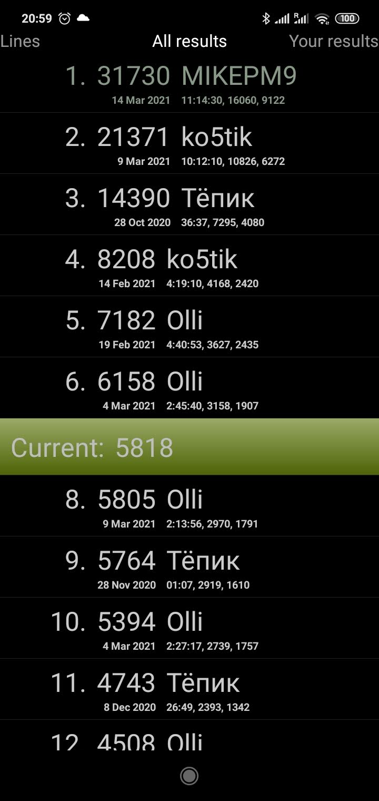

As [lines game](https://play.google.com/store/apps/details?id=de.pribluda.games.android.lines) is very meditative you can play it as long as you manage
to keep field clean - so top players are not receiving enough credit and get may bored. Let's give them credit they deserve. And ample waring that there is 
somebody attacking their highscore. 


<span class="more">
</span>

As every game potentially takes forever, score is not submitted to server.  This means, good players 
do not receive due credit. And do not know about each other. This is uncool. We need to display current game standings for  active games. I do following: 

- app sends  current game state to server  in regular interwalls while active
- server does not persist this data
- server keeps only current instance of shadow score (all games have  UUID to distinguish them)
- shadow scores expire after some time
- shadow scores are returned from server and displayed along regular highscores (in different color)

One game and server update later I open game highscore and:



... see that most loyal and successfull player from older times is back,  and already surpassed my highscore. I do not know him 
personally,   but I to imagine him like Mike Ermenthraut tending parking lot while waiting to tend to someone problems.  

Do  you  like to try to Compete against him? [Get the game!](https://play.google.com/store/apps/details?id=de.pribluda.games.android.lines) 

### How it is done?

Backend server gets 2 new endpoints:

```java

    /**
     * receive shadow highscore entry
     *
     * @param entry
     */
    @RequestMapping(value = "/secured/storeShadow", method = RequestMethod.POST)
    public void storeShadow(@RequestBody Entry entry) {
            log.info("shadow entry: " + entry);
            new Thread(() -> highscore.addShadow(entry)).start();
            }

    /**
     * return list of shadow highscores. shadow scores are not persisted and stored only  for
     * limited time providing overview of games running at the moment
     *
     * @return
     */
    @RequestMapping("/public/shadowScores")
    public Collection<Entry> shadow() {
        return highscore.shadowEntries();
    }

```

And implementation is pretty straightforward. We do not store those scores, we overwrite based on equality (UUID) and entries  expire with the time:

```java
    /**
     * store shadow entry  into list
     *
     * @param entry
     */
    public void addShadow(Entry entry) {
        synchronized (SHADOW_CUTOFF) {
            // overwrite shadow entry with new value
            final int index = shadow.indexOf(entry);
            if (0 <= index) {
                shadow.remove(index);
            }
            shadow.add(entry);
            long cutOff = System.currentTimeMillis() - SHADOW_CUTOFF;
            shadow = shadow.stream().filter(e -> e.getTime() > cutOff).sorted(Comparator.comparing(Entry::getPoints).reversed()).collect(Collectors.toList());
        }
    }

    public List<Entry> shadowEntries() {
        return shadow;
    }

```

[Like this.](https://www.pribluda.de/api/lines/public/shadowScores) 


