Alle reden über schweres Pendlerleben.  Meine Pendelstreccke ist länger wie dein Fax!

Da ich vor einiger Zeit nach  Vilnius gezogen bin, bin ich nun Wochenendheimfahrer und meine Pendelstrecke ist 1225 km. 
Allerdings nit mit DB sondern mit LH - geht schneller, und hat wesentlich weniger Verspätungen.  Und nicht unbedingt 
teuerer. Und man hat den Sitzplatz. Immer. Garantiert.  

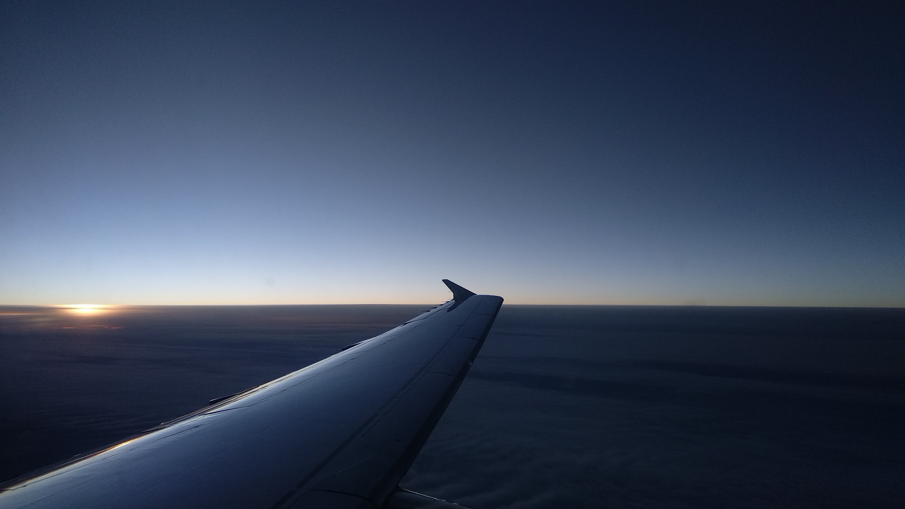

Sonnenaufgang irgendwo über Polen.  Oder Litauen.

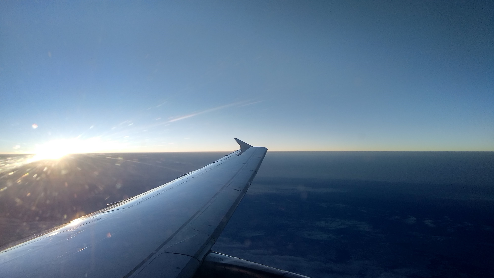

Und es kommt tatsächlich raus. 

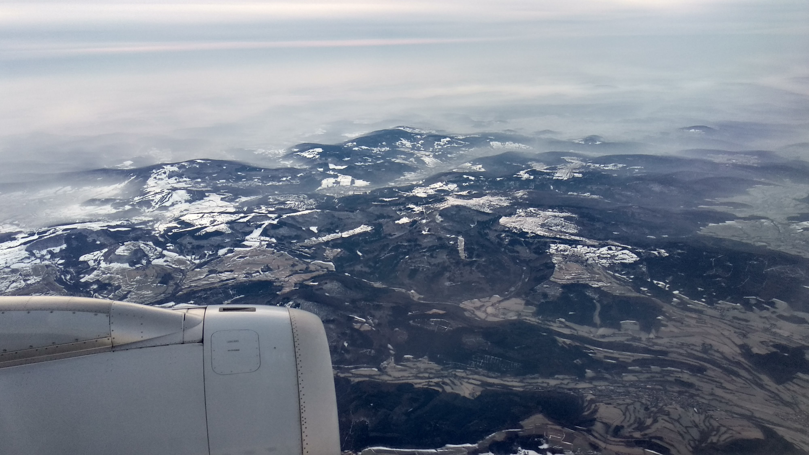

Nebel fließt durch die Täler im Spessart

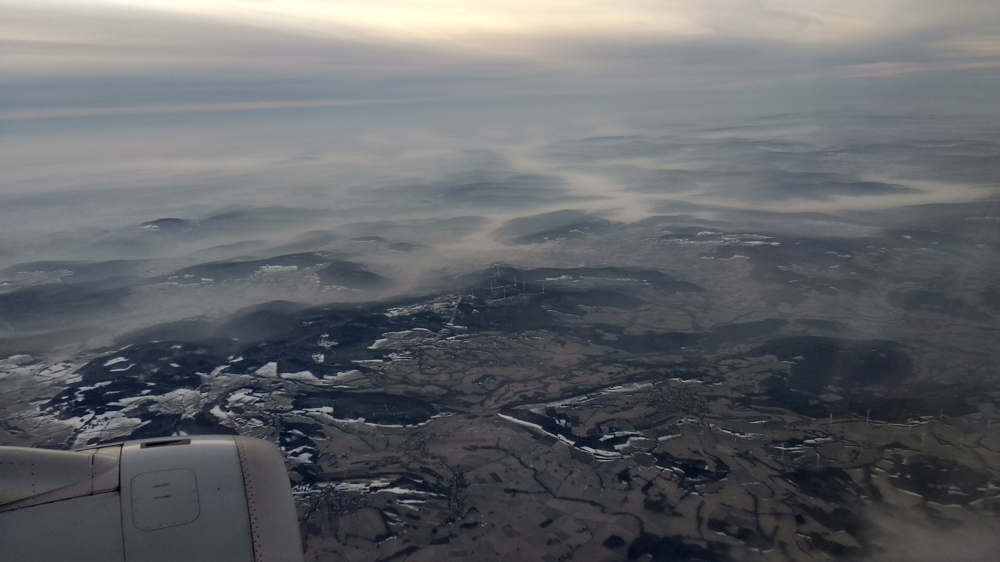

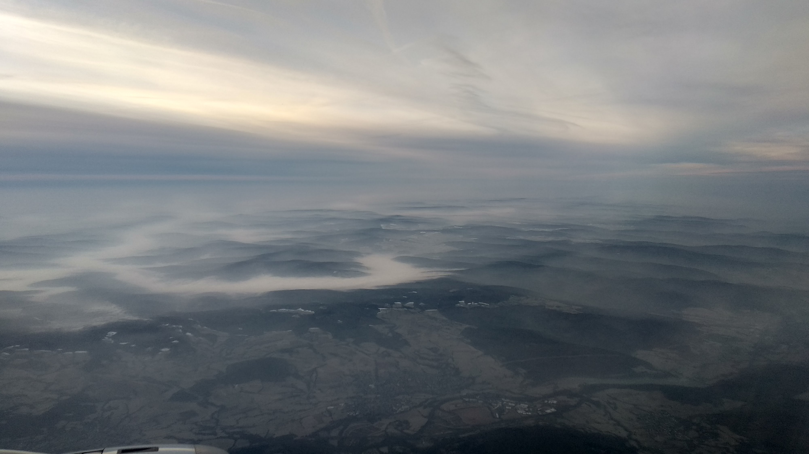

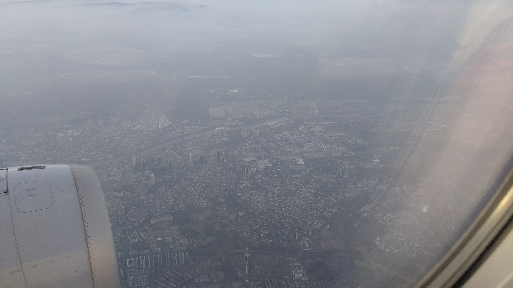

Frankfurt von Oben

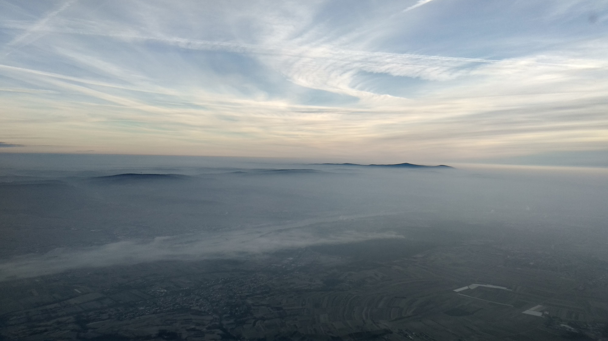

Feldberg und Höhe Wurzel

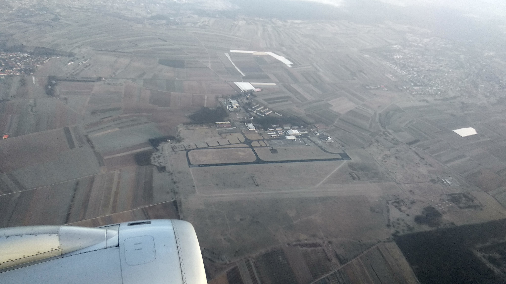

Flughafen wo ich nicht hin muss

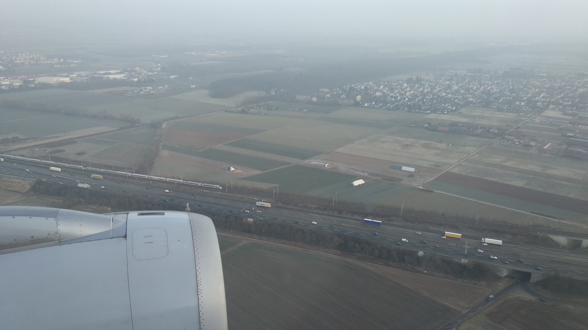

... und wir sind immer noch schneller und punklicher als die Bahn

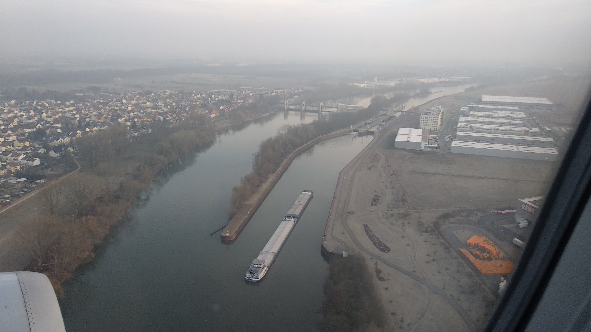

Schleuse im Hattersheim

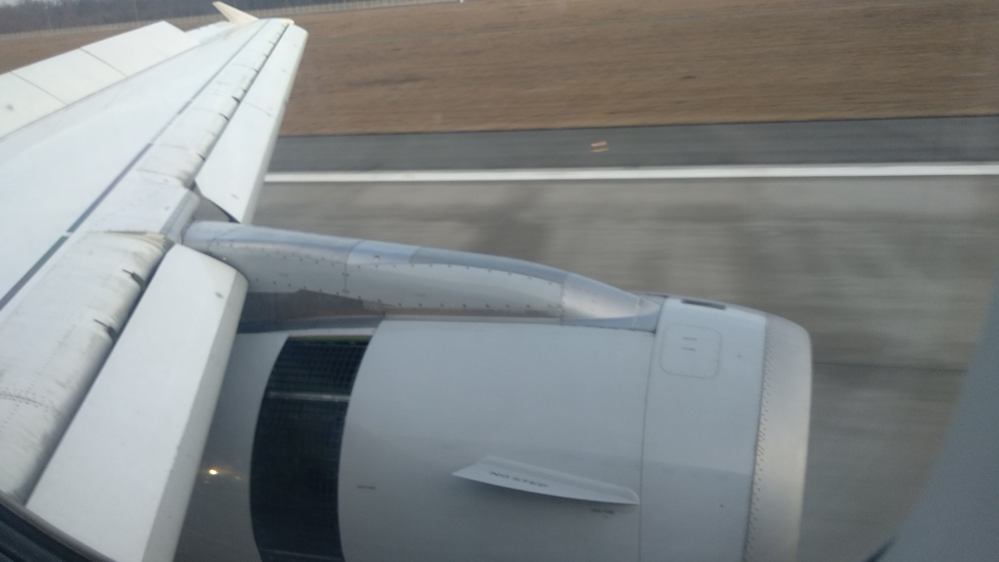

Es wird gebremst

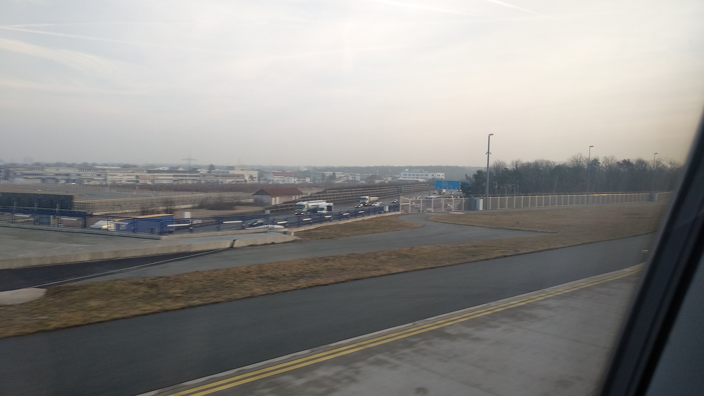

Oder im Stau gestanden.  Oder darauf vorbereiten. 

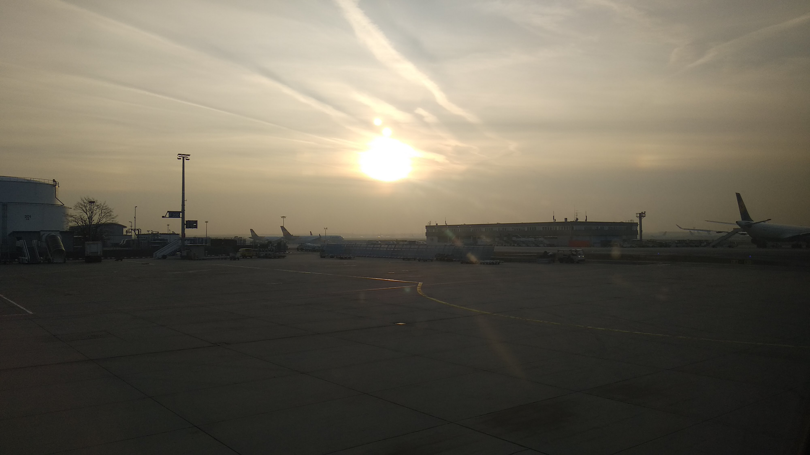

Angekommen.  3 Stunden von Zuhause.  Ab ins Büro! Jetzt wird geschafft.   