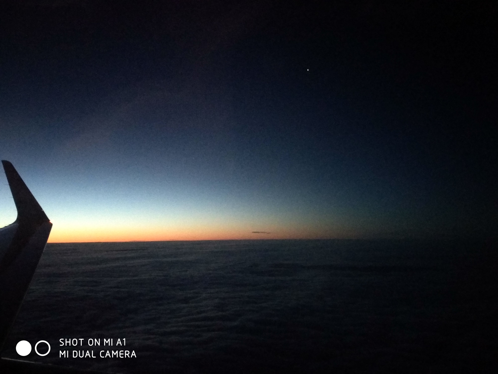
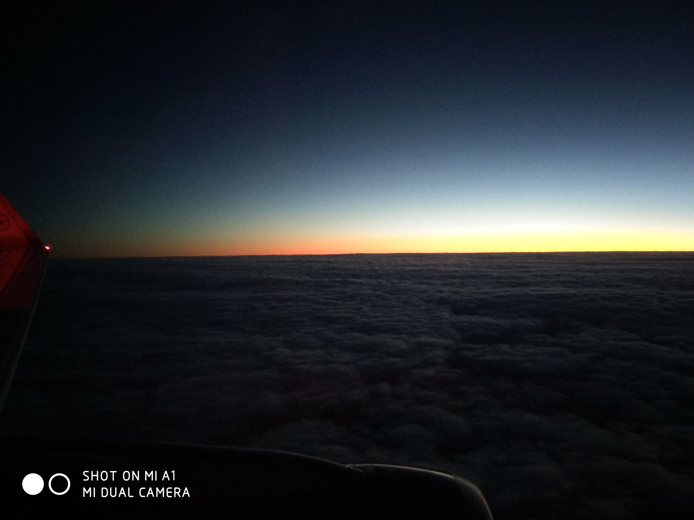
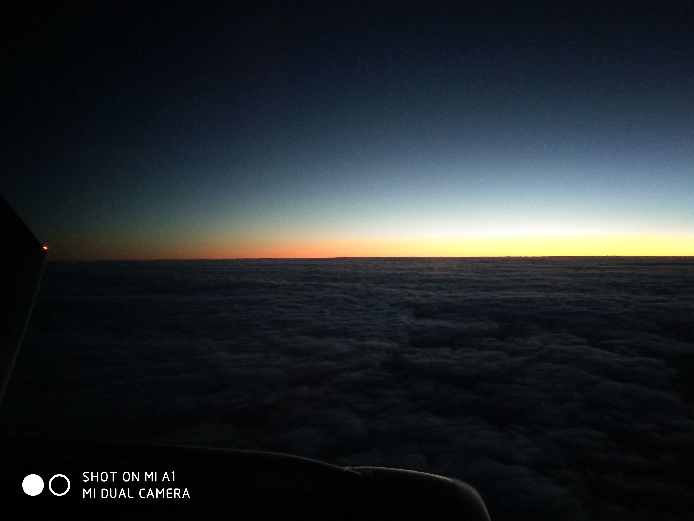
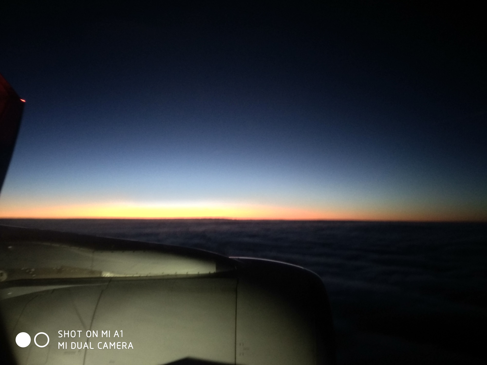
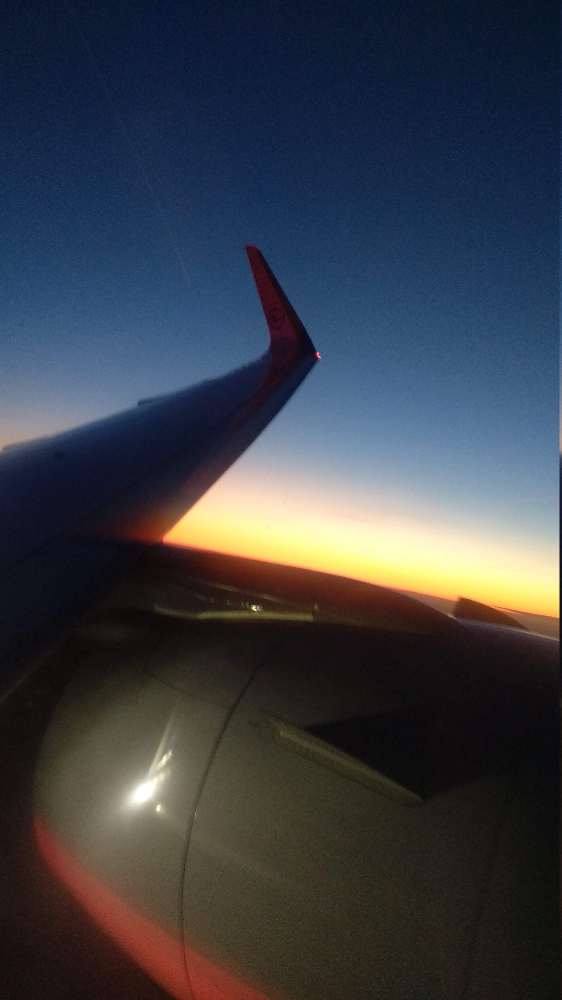
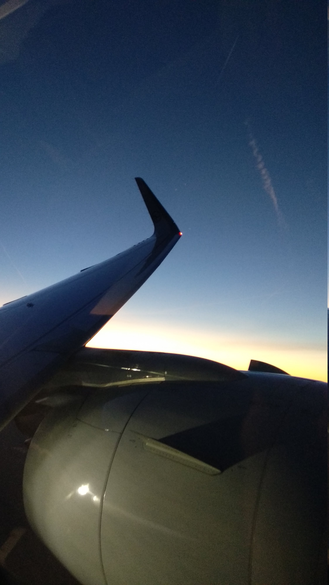
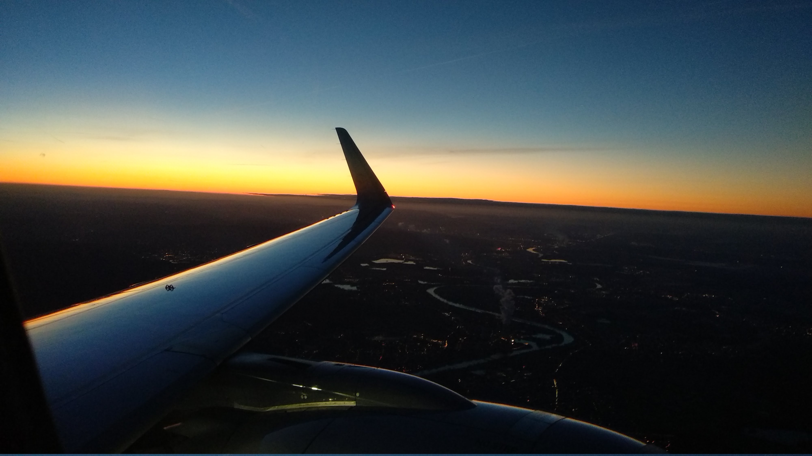
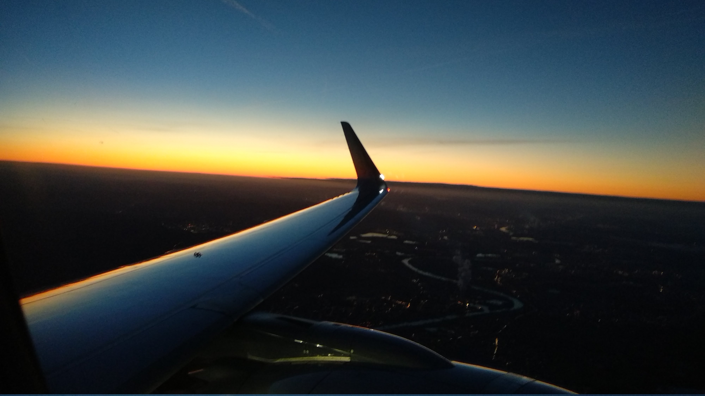
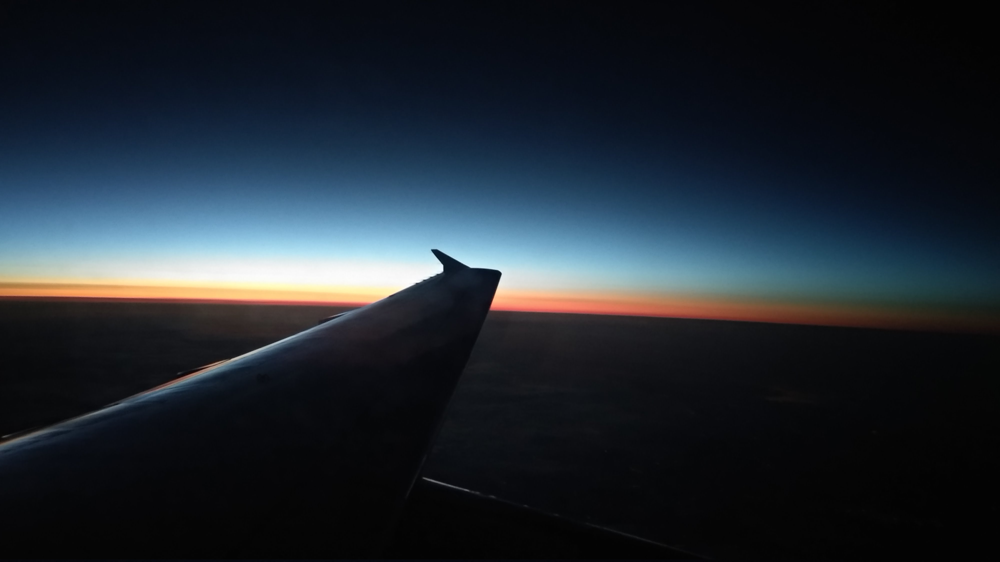
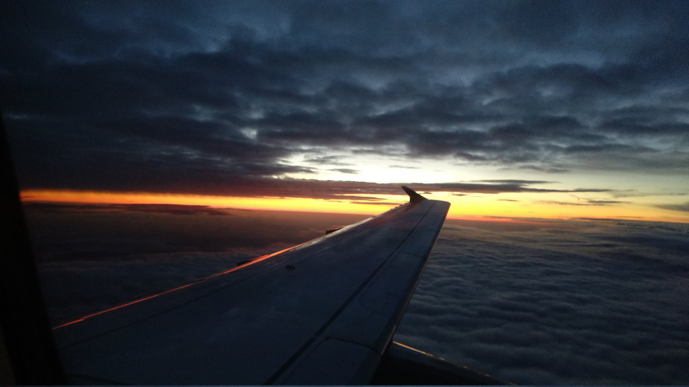

I moved to Vilnius, but still have to visit Germany from time to time. Usually I fly with LH889 VNO-FRA which leaves at 6:35 local time - 
so it means I get to see a lot of sunrises. Sometimes they are really gorgeous. Especially when seen from 12000 meter.   

At the moment there is a lot to see in the skies just before dawn -  Jupiter, Mars and Saturn are really bright. There is also Spika and Antares 
(but no venus ATM,  it is trailing the sun and thus visible only after sunset).  Nevertheless, sunset gives pretty much opptortunities  for taking pictures. 
Most pictures are taken from place 8A (flight goes to the south west). Enjoy.

That bright spot is actually jupiter. Mars is nearby but my phone camera is unable to capture it. 

Approach Frankfurt - over Hanau. You can se Staudinger powerplant (that steam column near the river bend)

Like those photos? You can use them free for non-commercial puposes with proper attribution and backlink 

Comments and discussion on [G+](https://plus.google.com/+KonstantinPribluda/posts/cbpxQP6ro7z)

