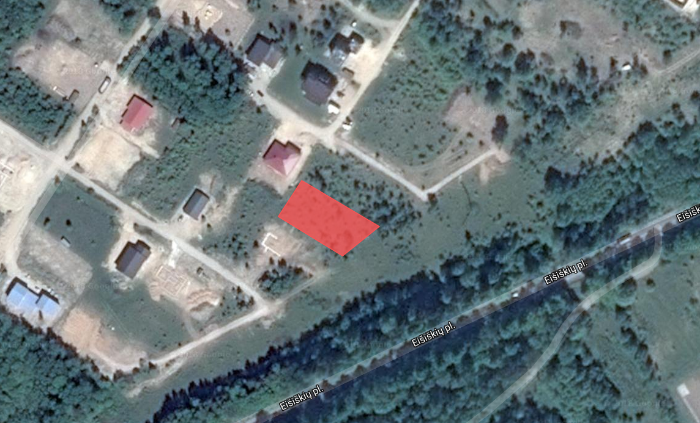
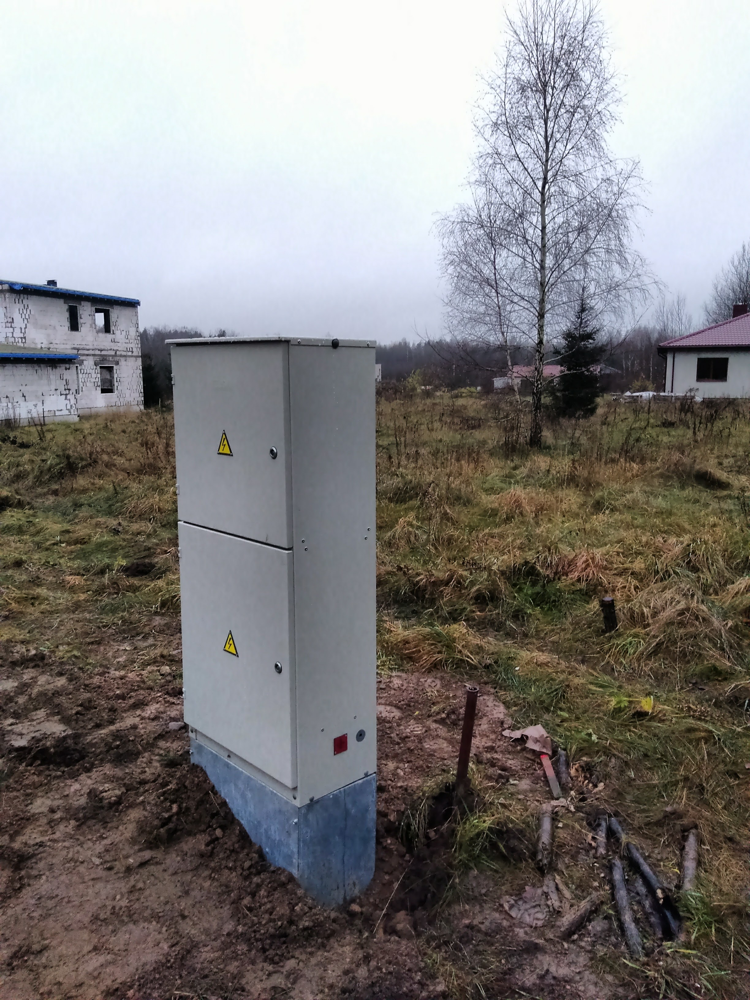

vor einen Jahr bin ich nach Vilnius gezogen. Stadt ist schön, Bier Lecker  - aber eine Wohnung doch zu klein und bietet 
kein Platz für Werkstatt, Fahrrad, Wundssurfzeugs und ist halt klein. Was großeres muss her. Häuser zu kaufen gibt es schon, sogar 
bezahlar - aber wirklich nicht  ganz passend. Also - selber bauen!  

### Grundstück

Wen einer im Littauen  nach einer immobilie sucht, muss wohl zu [Aruodas.lt](http://aruodas.lt) -  ist  neben dem litauischen auch auf russisch 
und englisch - also kommt man damit klar.  Nach etwas suche wurde Grundstuck gefunden, und gekauft:

  
[Hier gugge!](https://drive.google.com/open?id=1j1q53E1mNOPc04ELCR_kuk-tAYc&usp=sharing) 

Es wurde zum angemesenen Preis erstanden ( 20Kk EUR, 1000 m2).   Es gibt aber ein Paar unterschiede zu D - erstens wird Makler von den 
Verkäufer bezahl,  und Grunderwerbsteuer fehlt  komplett. . 214 EUR für Notar - und nun bin ich Grundbesitzer. 
 

Grundstück muss erschlossen werden -  Astrom und Gas  werden gelegt, Nach wasser mus gebphrt werden  und Kläranlage muss man selbst vor Ord bauen - aber 
das ist hier Standart.   Strom ist ja schon gelegt worden (für 670 EUR, alles geht über Internet, ohne persönlichen Kontakt):

### Projekt

Auch hier braucht man eine Baugenehmigung, Energieeffizienzklasse (A oder A+- was sonst) - und natürlich geht das nicht ohne Projekt. Nach langen hin und Her 
mit dem Architekten haben wir nun das Projekt. Aber mehr darüber in den nächsten Post. Diskussion und Kommentare bei 
[G+](https://plus.google.com/+KonstantinPribluda/posts/Cw25dT71nS9)
  
