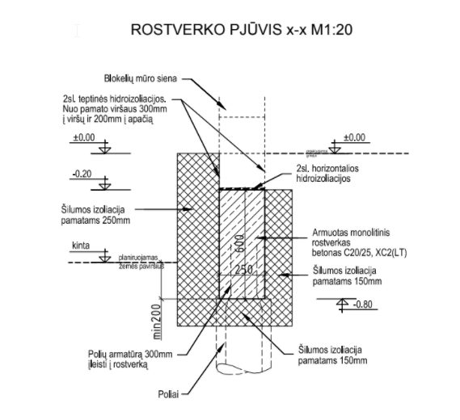
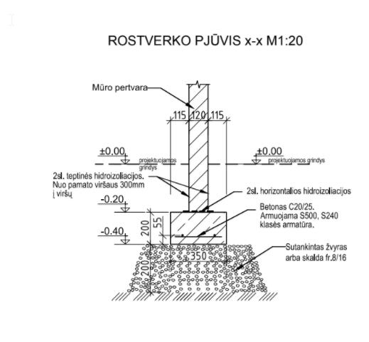
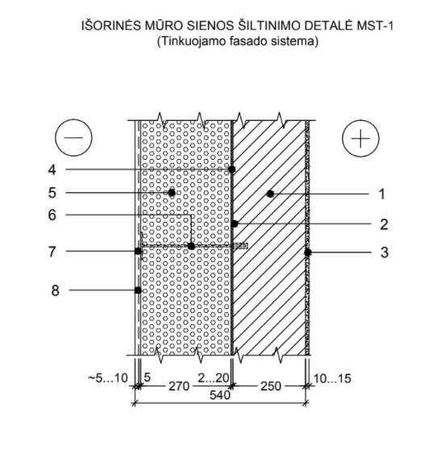
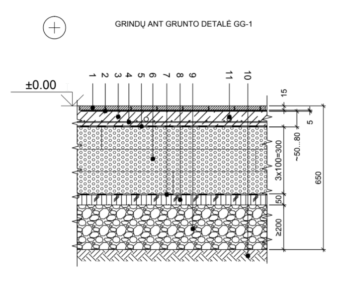
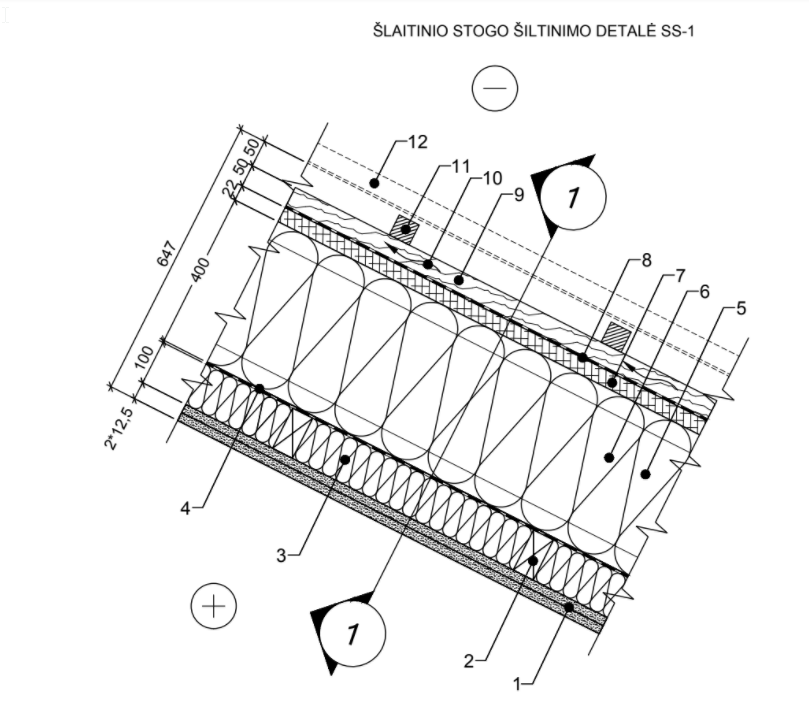
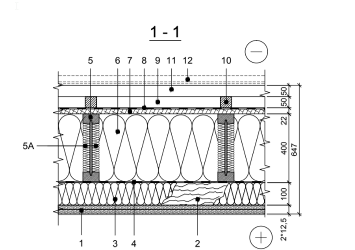
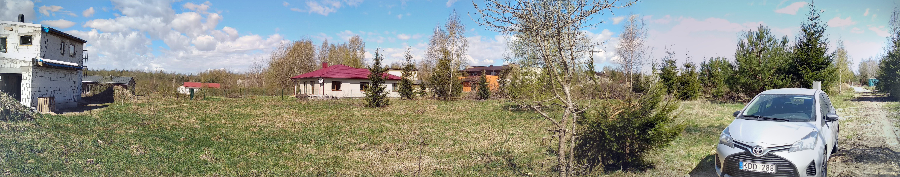

Mühsam ernährt sich der Eichhornchen -  aber Langsam wird der Hausprojekt fertig.  Nun muss Baugenehmigung beantragt werden. 

###  Fundament

Es ist ein hängende Rostwerk mit Pfahlen vorgesehen. Da es Energieeffizienzklasse A+ sein soll, wird es bis 
auf Teufel-komm-raus Isoliert: 

### Mauerwerk

Man nehme 250mm Kalksandstein (oder eher Keramik) und Isoliere es mit 270 mm EPS:

### Boden

Da keine Bodenplatte gegossen wird, wird auf dem Grund aufgebaut:

### Dach

Auch bei dem Dach wird an der Isolierung nicht gespart. Laminierte Balken, und 500 mm Steinwohle. 

Uns so sieht es zur Zeit aus:

 
