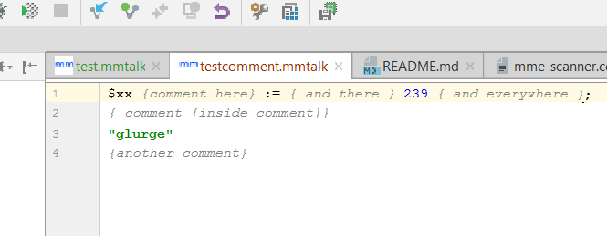

So, we have a plugin, and it recognizes files by extension. We can write parser now.  

<span class="more"/>


### It's a kind of (black) magic

Back then at the university when they tried to teach us building of compilers, there were formal grammatics and 
parsers. But those days are long gone and I did not learned it properly back then anyway.   So now it is time to finally understand it 
and put to use.  Fortunately there is a [Good tutorial](http://www.jetbrains.org/intellij/sdk/docs/tutorials/custom_language_support/grammar_and_parser.html)

It all starts with parser, which is responsible to turning your program text into something useful (for IDEA plugin it 
is called PSI tree).  After defining boilerplate code (for creation and binding it into infrastructure)

  - Lexer adapter
  - Lexer factory
  - Highlighter
  - Highlighter factory 
  - Parser definition
  
Just follow the indstructions in tutorial -  we come to caveats later.  Now as we have infrastructure we can proceed with 
real stuff

### Defining grammar and lexiс

Time to get real.  We start to write  parsing rules for our language. Basically it if functional language, 
and unit (file or whatever)  consist of function invocations and assigments, terminated  by semicolons with last one being returned 
back (thus it does not have semicolon on end, and it can not be an assigment)

So we create rules in our parser:

````bnf

macro ::=   statement* function
//  $foo := bar.baz ;
statement ::= (variable ASSIGMENT)? function TERMINATOR

```` 

Fro readability we are writing **TERMINAL SYMBOLS**  in uppper case ( those are not further processd via parser, they will 
come directly from lexer, and there will be static constants with **EXACT URPPERCASE NAME** generated for them,  for 
use in lexer).  In our case ASSIGMENT will be **":="**  and TERMINATOR **";"**

And of course, there have to be comments.   Comments in our language are delimited with **"{ comment }"** , and can be nested 
so we can not got for just one terminal symbol.  But actually,  we do not need comments in the grammar at all,   as they 
will be ignored anyway.   But it still nice to reference  them in grammar, to get constants generated  for them (for use 
in lexer)

In our BNF:

````bnf

COMMENT ::= COMMENT_START COMMENT_CONTENT* COMMENT_END

```` 

And in generated code:

````java

public interface MMTalkTypes {

  IElementType COMMENT = new MMTalkElementType("COMMENT");
  
  ...
  
  IElementType BRACKET_OPEN = new MMTalkTokenType("BRACKET_OPEN");
  IElementType COMMENT_CONTENT = new MMTalkTokenType("COMMENT_CONTENT");
  IElementType COMMENT_END = new MMTalkTokenType("COMMENT_END");
  
  ...

````

Now,  that we have comment tokens defined (and regenerated parser code - context menu on .bnf file, or just CTRL-ALT-G ), 
we shall register them in parser definition to be ignored:

````java

public class MMTalkParserDefinition implements ParserDefinition {
    public static final TokenSet WHITE_SPACES = TokenSet.create(TokenType.WHITE_SPACE);
    public static final TokenSet COMMENTS = TokenSet.create(MMTalkTypes.COMMENT_CONTENT,  MMTalkTypes.COMMENT_START, MMTalkTypes.COMMENT_END);

    public static final IFileElementType FILE = new IFileElementType(MMTalkLanguage.INSTANCE);


    @NotNull
    @Override
    public TokenSet getWhitespaceTokens() {
        return WHITE_SPACES;
    }


    @NotNull
    @Override
    public TokenSet getCommentTokens() {
        return COMMENTS;
    }
...

````
Now we can place comments everywhere,  and they will be treated just like whitespaces. 


#### Lexer
Now, let's write a lexer (I omit boilerplate -  look into tutorial and follow those steps).   IntelliJ uses
[jFlex](http://jflex.de/manual.html) to generate  lexer to provide tokens to parser.  We start with comments - since 
they are nested, it involves some logic 

````jflex

%%

// regex macros
COMMENT_START=[\{]
COMMENT_END=[\}]
COMMENT_CONTENT=[^\{\}]+

//  oarser state -  we need this for comment nesting  
%state COMMENT

// state handling logic,  will be embessed into generated lexer

%{

    int commentDepth = 0;

    void stepInComment() {
        commentDepth++;
    }
    void stepOutComment() {
        commentDepth--;
    }

%}


%%

//  and finally some rules

//  starting of comment - reset depth and move to in comment state
<YYINITIAL> {COMMENT_START}                                 {

                                                                commentDepth = 0;
                                                                yybegin(COMMENT);
                                                                stepInComment();
                                                                return MMTalkTypes.COMMENT_START;
                                                            }
// in case we are in comment,   move step deeper and treat it as comment content                                                            
<COMMENT>  {COMMENT_START}                                  {
                                                                stepInComment();
                                                                return MMTalkTypes.COMMENT_CONTENT;
                                                            }

//  either we move level up in nested comments,   and treat this as content
// or we have closed last nested comment 
<COMMENT>  {COMMENT_END}                                    {
                                                                System.err.println("comment end in comment");
                                                                stepOutComment();
                                                                if(0 == commentDepth) {
                                                                    yybegin(YYINITIAL);
                                                                    return MMTalkTypes.COMMENT_END;
                                                                }
                                                                return MMTalkTypes.COMMENT_CONTENT;
                                                            }

// while we are inside,  everything is just comment
<COMMENT> {COMMENT_CONTENT}                                  {
                                                                 return MMTalkTypes.COMMENT_CONTENT;
                                                            }


````
   
#### Highlighting
To see that our comments work, we define highlighter (see in tutorial for boilerplate!)

````java


public class MMTalkSyntaxHighlighter extends SyntaxHighlighterBase {

    Logger log = Logger.getInstance(MMTalkSyntaxHighlighter.class);
    // attributes to use
    public static final TextAttributesKey COMMENT =
            createTextAttributesKey("SIMPLE_COMMENT", DefaultLanguageHighlighterColors.BLOCK_COMMENT);

    private static final TextAttributesKey[] COMMENT_KEYS = new TextAttributesKey[]{COMMENT};   
    
    @NotNull
    @Override
    public Lexer getHighlightingLexer() {
        return new MMTalkLexerAdapter();
    }

    @NotNull
    @Override
    public TextAttributesKey[] getTokenHighlights(IElementType tokenType) {
        log.warn("highlighting: " + tokenType.toString());
        if (tokenType.equals(MMTalkTypes.COMMENT_CONTENT) || tokenType.equals(MMTalkTypes.COMMENT_START) || tokenType.equals(MMTalkTypes.COMMENT_END)) {
            return COMMENT_KEYS;
        } else {
                      return EMPTY_KEYS;
                  }
````   

Now, regenerate all the generated sources (parser and lexer), compile, ölaunch and watch miracle happen:



Now I can haz colored comments!


  
