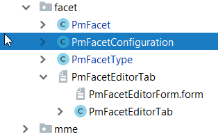
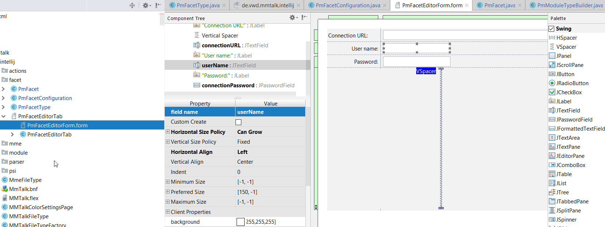
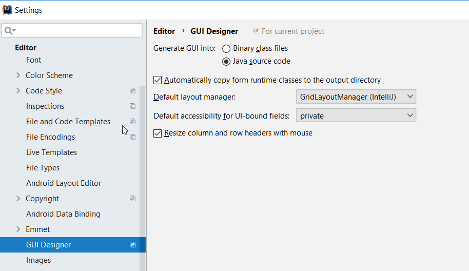
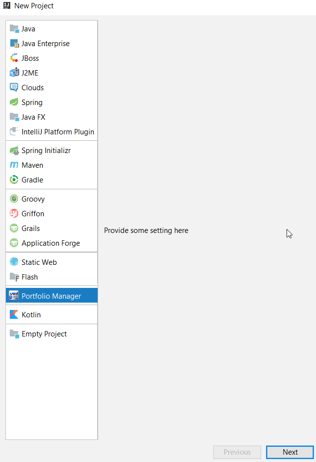
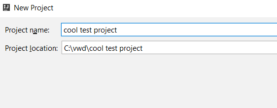
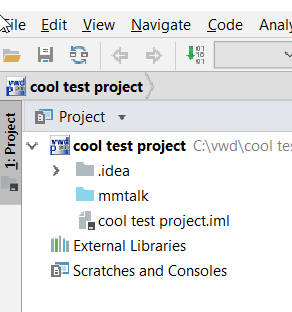
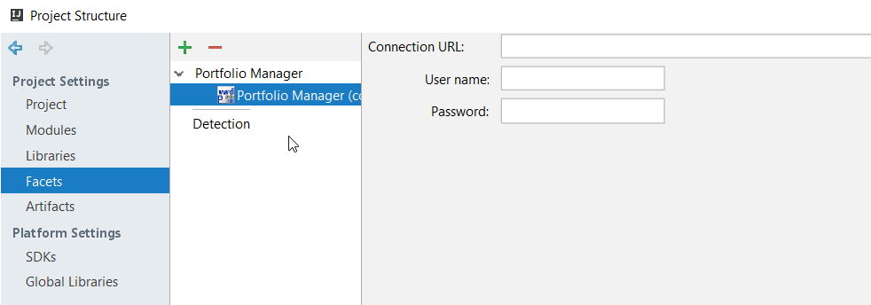

Since  out sources are deployed to database, and executerd from there - we would profit from proper module and 
facet providing configuration (database connection) and predefined directory structure. 

<span class="more"/>

First time here? Loog for [Part 1](../intellijpluginpart1) and [Part 2](../intellijpluginpart2)

### Create module

We start with the module class  -  see comments for fine details. 

````java

// class defining module type,   and also providing reference to builder
public class PmModuleType  extends ModuleType<PmModuleTypeBuilder>{

    // ... unique module ID
    public static final String PM_MODULE="PM_MODULE";
    // ... icon - we need an icon. 
    public static final Icon ICON = IconLoader.getIcon("/icons/mme-16.png");
    
    // we need this constructor
    public PmModuleType(@NotNull String id) {
        super(id);
    }
    
    // ...  and static factory
    public static ModuleType getInstance() {
        return ModuleTypeManager.getInstance().findByID(PM_MODULE);
    }

    // ... boilerplate 
    @NotNull
    @Override
    public PmModuleTypeBuilder createModuleBuilder() {
        return new PmModuleTypeBuilder();
    }

    // ... numan redable name -  will be shown by IDE
    @NotNull
    @Override
    public String getName() {
        return "Portfolio Manager";
    }

    // ... and long description
    @NotNull
    @Override
    public String getDescription() {
        return "Portfolio Manager module provides configuration to access PM database and standard directory structure";
    }

    // and an icon
    @Override
    public Icon getNodeIcon(boolean b) {
        return ICON;
    }
}

````

And of we need our module builder (where all the magic will be happening, see comments in code for explanations):

````java

// module type builder is responsible  for creating  and configuring modules
// it provides instance of module type,  and  IDE does some magic
public class PmModuleTypeBuilder extends ModuleBuilder  {


    /**
     * configure root morel for the module -  source roots, facets etc. 
     * 
     * @param modifiableRootModel
     * @throws ConfigurationException
     */
    @Override
    public void setupRootModel(ModifiableRootModel modifiableRootModel) throws ConfigurationException {
        doAddContentEntry(modifiableRootModel);

        String contentEntryPath = getContentEntryPath();
        if (contentEntryPath == null) return;
        
        VirtualFile contentRoot = LocalFileSystem.getInstance().findFileByPath(contentEntryPath);
        if (contentRoot == null) return;
        
        final Module module = modifiableRootModel.getModule();

        //  create directory for the sources if not already there
        File directory = new File(PathMacroUtil.getModuleDir(module.getModuleFilePath()), "mmtalk");
        if(!directory.exists()) {
            directory.mkdirs();
        }

        // kick  virtual file system in the privates,  so it refreshes
        // and we can mark directory as sources
        VirtualFile virtualFile = LocalFileSystem.getInstance().refreshAndFindFileByIoFile(directory);

        ContentEntry e = getContentRootFor(virtualFile, modifiableRootModel);
        e.addSourceFolder(virtualFile.getUrl(), false);

        // Cave at:  do not commit model,  this will be done by framework
        
        // time to create a facet -  we will need one for this module anyway
        FacetType facetType = FacetTypeRegistry.getInstance().findFacetType(PmFacetType.ID);
        FacetManager.getInstance(module).addFacet(facetType, facetType.getDefaultFacetName(), null);
        
    }

    // provide module type we are creating
    @Override
    public ModuleType getModuleType() {
        return PmModuleType.getInstance();
    }

    // not sure what to do here,   maybe latere there will be proper GUI for configuration.
    // for now - just placeholder
    @Nullable
    @Override
    public ModuleWizardStep getCustomOptionsStep(WizardContext context, Disposable parentDisposable) {
        return new PmModuleWizardStep();
    }


    @Nullable
    private ContentEntry getContentRootFor(VirtualFile url, ModifiableRootModel rootModel) {
        for (ContentEntry e : rootModel.getContentEntries()) {
            if (isEqualOrAncestor(e.getUrl(), url.getUrl())) return e;
        }
        return null;
    }

}
````

And of course register it:

````xml
    <extensions defaultExtensionNs="com.intellij">
        <moduleType id="PM_MODULE" implementationClass="de.vwd.mmtalk.intellij.module.PmModuleType"/>
````

### Facet

Now as we have a module, it is time to create a facet (which we already have referenced).  For it we will need

* Facet class itself
* Facet configuration
* Facet type
* Some GUI forms for configuration
    
Facet class itself:

````java

/**
 * facet encapsulates configurqation logic,  in case of pm - particular PM  installation database
 * 
 * nothink much here,   just a descriptor class referencing creation logic. all the magic happens 
 * in superclass
 */
public class PmFacet extends Facet<PmFacetConfiguration> {
    // provide unique ID
    public static final FacetTypeId<PmFacet> ID = new FacetTypeId<>("pm");


    //  and constructor
    public PmFacet(@NotNull FacetType facetType, @NotNull Module module, @NotNull String name, @NotNull PmFacetConfiguration configuration, Facet underlyingFacet) {
        super(facetType, module, name, configuration, underlyingFacet);
    }
}

```` 

And configuration.   Configuration class holds out franework data.  In our case, it is just JDBC url and credentials. 
Maybe it is better to not to store  db password in cleartext (definitely!) but IDEA seems to stash it somewhere in very 
private place, and  in our typical use case it will be not needed anyway as databasse is local MSSQL and will accept credentials from
actual user. 


````java

/**
 * facet configuration  -  holds data aboit config, provides editors 
 */
// IMPORTANT -  implement PersistentStateComponent so data will be actually saved
public class PmFacetConfiguration implements FacetConfiguration, PersistentStateComponent<PmFacetConfiguration> {

    String databaseConnection;
    String username;
    String password;


    @Override
    public FacetEditorTab[] createEditorTabs(FacetEditorContext facetEditorContext, FacetValidatorsManager facetValidatorsManager) {
        return new FacetEditorTab[]{
                new PmFacetEditorTab(facetEditorContext)
        };
    }


    public String getDatabaseConnection() {
        return databaseConnection;
    }

    public void setDatabaseConnection(String databaseConnection) {
        this.databaseConnection = databaseConnection;
    }

    public String getUsername() {
        return username;
    }

    public void setUsername(String username) {
        this.username = username;
    }

    public String getPassword() {
        return password;
    }

    public void setPassword(String password) {
        this.password = password;
    }

    //  saving
    @Nullable
    @Override
    public PmFacetConfiguration getState() {
        return this;
    }

    // loading 
    @Override
    public void loadState(@NotNull PmFacetConfiguration pmFacetConfiguration) {
        databaseConnection = pmFacetConfiguration.getDatabaseConnection();
        username = pmFacetConfiguration.getUsername();
        password = pmFacetConfiguration.getPassword();
    }
}


````

Facet type itself ( not much magic here)

````java

/**
 * Facet type is being registered  as plugin extension
 */
public class PmFacetType extends FacetType<PmFacet, PmFacetConfiguration> {

    // unique ID
    public static final String  ID = "PM_FACET";

    // icon
    public static final Icon ICON = IconLoader.getIcon("/icons/mme-16.png");

    public PmFacetType() {
        super(PmFacet.ID, ID, "Portfolio Manager");
    }

    /**
     * create default configuration 
     * @return
     */
    @Override
    public PmFacetConfiguration createDefaultConfiguration() {
        return new PmFacetConfiguration();
    }

    // create facet object when requested
    @Override
    public PmFacet createFacet(@NotNull Module module, String name, @NotNull PmFacetConfiguration pmFacetConfiguration, @Nullable Facet underlyingFacet) {
        return new PmFacet(this,module,name, pmFacetConfiguration, underlyingFacet);
    }

    /**
     * whether we like this module type - for now allow everywhere, but normally you would like to 
     * restrict facet availability
     * @param moduleType
     * @return
     */
    @Override
    public boolean isSuitableModuleType(ModuleType moduleType) {
        return true;
    }

    @Nullable
    @Override
    public Icon getIcon() {
        return ICON;
    }
}

````

Of course we register it in **plugin.xml**:

````xml
   <extensions defaultExtensionNs="com.intellij">

        <moduleType id="PM_MODULE" implementationClass="de.vwd.mmtalk.intellij.module.PmModuleType"/>
        <facetType implementation="de.vwd.mmtalk.intellij.facet.PmFacetType"/>
````


### Facet Configuration dialog

Now it is time to create facet configuration  (we aleready referenced this class in FacetConfiguration ).  Create  it via menu
File - New - Gui Form 



Here you can use graphic editor to create fancy swing ide,  and watch that your entry fields are created automatically:

  

 and that source  code is  generated as text,  and not as binary (in case you need some debugging later):
 
 
 
 And source code for it:
 
 ````java

public class PmFacetEditorTab extends FacetEditorTab {
    // editor context,  we will need this
    private final FacetEditorContext facetEditorContext;
    // data fields we are editing
    private JTextField connectionURL;
    private JTextField userName;
    private JPasswordField connectionPassword;
    private JPanel mainPanel;

    public PmFacetEditorTab(FacetEditorContext editorContext) {
        $$$setupUI$$$();
        this.facetEditorContext = editorContext;
    }

    @NotNull
    @Override
    public JComponent createComponent() {
        return mainPanel;
    }

    // important, if you do not o erride it,  you will be unable to save changed data
    @Override
    public boolean isModified() {
        return !Optional.of(connectionURL.getText()).orElse("").equals(getFacetConfiguration().getDatabaseConnection()) ||
                !Optional.of(userName.getText()).orElse("").equals(getFacetConfiguration().getUsername()) ||
                !Optional.of(connectionPassword.getText()).orElse("").equals(getFacetConfiguration().getPassword());
    }

    @Nls
    @Override
    public String getDisplayName() {
        return "PM Database connection";
    }

    // we can create our components here,   but we do not like.  lets have it automatic
    private void createUIComponents() {
        // TODO: place custom component creation code here
    }

    // retrieve facet config out of editor context
    private PmFacetConfiguration getFacetConfiguration() {
        return ((PmFacetConfiguration) facetEditorContext.getFacet().getConfiguration());
    }

    /**
     * store data back to  config
     */
    public void apply() {
        getFacetConfiguration().setDatabaseConnection(connectionURL.getText());
        getFacetConfiguration().setUsername(userName.getText());
        getFacetConfiguration().setPassword(new String(connectionPassword.getPassword()));
    }


    public void reset() {
        connectionURL.setText(getFacetConfiguration().getDatabaseConnection());
        userName.setText(getFacetConfiguration().getUsername());
        connectionPassword.setText(getFacetConfiguration().getPassword());
    }


    /**
     * Method generated by IntelliJ IDEA GUI Designer
     * >>> IMPORTANT!! <<<
     * DO NOT edit this method OR call it in your code!
     *
     * @noinspection ALL
     */
    private void $$$setupUI$$$() {
        mainPanel = new JPanel();
        mainPanel.setLayout(new GridLayoutManager(4, 2, new Insets(0, 0, 0, 0), -1, -1));
        mainPanel.setBorder(BorderFactory.createTitledBorder(BorderFactory.createEmptyBorder(), null));
        final JLabel label1 = new JLabel();
        label1.setText("Connection URL:");
        mainPanel.add(label1, new GridConstraints(0, 0, 1, 1, GridConstraints.ANCHOR_EAST, GridConstraints.FILL_NONE, GridConstraints.SIZEPOLICY_FIXED, GridConstraints.SIZEPOLICY_FIXED, null, new Dimension(109, 16), null, 0, false));
        final Spacer spacer1 = new Spacer();
        mainPanel.add(spacer1, new GridConstraints(3, 0, 1, 2, GridConstraints.ANCHOR_CENTER, GridConstraints.FILL_VERTICAL, 1, GridConstraints.SIZEPOLICY_WANT_GROW, null, new Dimension(109, 14), null, 0, false));
        connectionURL = new JTextField();
        mainPanel.add(connectionURL, new GridConstraints(0, 1, 1, 1, GridConstraints.ANCHOR_WEST, GridConstraints.FILL_HORIZONTAL, GridConstraints.SIZEPOLICY_CAN_GROW, GridConstraints.SIZEPOLICY_FIXED, null, new Dimension(150, -1), null, 0, false));
        final JLabel label2 = new JLabel();
        label2.setText("User name:");
        mainPanel.add(label2, new GridConstraints(1, 0, 1, 1, GridConstraints.ANCHOR_EAST, GridConstraints.FILL_NONE, GridConstraints.SIZEPOLICY_FIXED, GridConstraints.SIZEPOLICY_FIXED, null, null, null, 0, false));
        userName = new JTextField();
        userName.setText("");
        mainPanel.add(userName, new GridConstraints(1, 1, 1, 1, GridConstraints.ANCHOR_WEST, GridConstraints.FILL_NONE, GridConstraints.SIZEPOLICY_CAN_GROW, GridConstraints.SIZEPOLICY_FIXED, null, new Dimension(150, -1), null, 0, false));
        final JLabel label3 = new JLabel();
        label3.setText("Password:");
        mainPanel.add(label3, new GridConstraints(2, 0, 1, 1, GridConstraints.ANCHOR_EAST, GridConstraints.FILL_NONE, GridConstraints.SIZEPOLICY_FIXED, GridConstraints.SIZEPOLICY_FIXED, null, null, null, 0, false));
        connectionPassword = new JPasswordField();
        mainPanel.add(connectionPassword, new GridConstraints(2, 1, 1, 1, GridConstraints.ANCHOR_WEST, GridConstraints.FILL_NONE, GridConstraints.SIZEPOLICY_WANT_GROW, GridConstraints.SIZEPOLICY_FIXED, null, new Dimension(150, -1), null, 0, false));
    }

    /**
     * @noinspection ALL
     */
    public JComponent $$$getRootComponent$$$() {
        return mainPanel;
    }
}

````


### fire in the hole!

We are done,   we can create our project:




Module type and icon are visible.



Configure directory



...  and here is new project structure,   with created source forlder



... and facet is configured and ready to rumble
