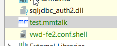

IntelliJ Idea is not a free IDE -  but since 15 years (or longer) the are able to sell against free IDEs like eclipse.   
Because it is just better and easy to expand.  And sometimes there is a need for support of some awkward programming 
language - and you have to bite a bullet and roll your own plugin. 

<span class="more"></span>

### Why? 

Here we have it - programming language for custom tool (which is not going to go away any time soon, and  still good 
to make money).  Language itself is fully functional, but syntax was borrowed from pascal (nobody is sure when it was 
developed,  but must be in pre-java days), and keywords are partly in german language.  Case insensitive. It calls for sane idea 
plugin, with syntax coloring, indexing and navigation.

### Starting 

Fortunately [JetBrains](https://www.jetbrains.com/) folks provide  [good step by step guide](http://www.jetbrains.org/intellij/sdk/docs/welcome.html) - 
but since we are busy,   we will not read explanation part (as always) and [start coding our plugin](http://www.jetbrains.org/intellij/sdk/docs/tutorials/custom_language_support_tutorial.html) 

First 2 steps were easy, and wothout any adventures.   I just followed  explanations in 1 & 2 -   and in some 20 minutes I had my 
file recognized, and opened and provided with icon. 

1.  Created file type

````java
package de.mmtalk.intellij;

import com.intellij.lang.properties.charset.Native2AsciiCharset;
import com.intellij.openapi.fileEditor.impl.LoadTextUtil;
import com.intellij.openapi.fileTypes.LanguageFileType;
import com.intellij.openapi.util.IconLoader;
import com.intellij.openapi.vfs.CharsetToolkit;
import com.intellij.openapi.vfs.VirtualFile;
import com.intellij.openapi.vfs.encoding.EncodingRegistry;
import org.jetbrains.annotations.NotNull;

import javax.swing.*;
import java.nio.charset.Charset;

public class MMTalkFileType extends LanguageFileType {

    public static final LanguageFileType INSTANCE = new MMTalkFileType();
    private static final String DEFAULT_EXTENSION = "mmtalk";
    public static final Icon ICON = IconLoader.getIcon("/icons/mmtalk.png");

    public MMTalkFileType() {
        super(MMTalkLanguage.INSTANCE);
    }

    @NotNull
    @Override
    public String getName() {
        return "MMTalk";
    }

    @NotNull
    @Override
    public String getDescription() {
        return PropertiesBundle.message("mmtalk.description");
    }

    @Override
    @NotNull
    public String getDefaultExtension() {
        return DEFAULT_EXTENSION;
    }

    @Override
    public Icon getIcon() {
        return ICON;
    }

    @Override
    public String getCharset(@NotNull VirtualFile file, @NotNull final byte[] content) {
        LoadTextUtil.DetectResult guessed = LoadTextUtil.guessFromContent(file, content);
        Charset charset = guessed.hardCodedCharset == null ? EncodingRegistry.getInstance().getDefaultCharsetForPropertiesFiles(file) : guessed.hardCodedCharset;
        if (charset == null) {
            charset = CharsetToolkit.getDefaultSystemCharset();
        }
        if (EncodingRegistry.getInstance().isNative2Ascii(file)) {
            charset = Native2AsciiCharset.wrap(charset);
        }
        return charset.name();
    }

}

````
( Icon and exgtension are defined here, make your icon 16x16 PNG, zlu maz need higher resolution for QHD displays tough. ) 


2.  And factory for it
````java
package de.mmtalk.intellij;

import com.intellij.openapi.fileTypes.FileTypeConsumer;
import com.intellij.openapi.fileTypes.FileTypeFactory;
import org.jetbrains.annotations.NotNull;

public class MMTalkFileTypeFactory extends FileTypeFactory {
    @Override
    public void createFileTypes(@NotNull FileTypeConsumer fileTypeConsumer) {
        fileTypeConsumer.consume(MMTalkFileType.INSTANCE);
    }
}

````

3. Custom language definition

````java
package de.mmtalk.intellij;

import com.intellij.lang.Language;

public class MMTalkLanguage  extends Language{

    public static final MMTalkLanguage INSTANCE = new MMTalkLanguage();

    public MMTalkLanguage() {
        super("MMTalk","text/mmtalk");
    }
}
````
And registered mime type just in case

4.  And of course everything goes into *plugin.xml*

````xml

    <extensions defaultExtensionNs="com.intellij">
        <fileTypeFactory implementation="de.mmtalk.intellij.MMTalkFileTypeFactory"/>
````

Now compile,  run and enjoy you new icon in toolbar:




 

