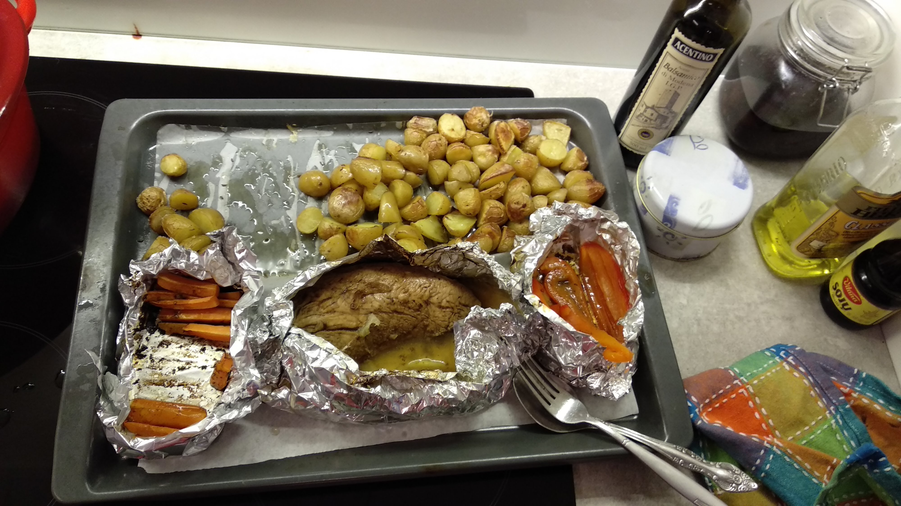
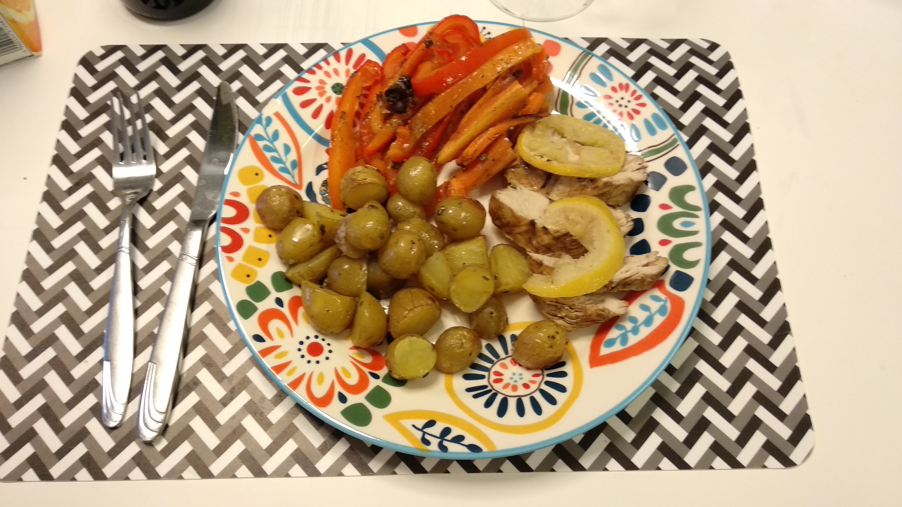

Auch Männer müssen essen. Und in heutigen Zeiten müssen sie sehr of selbst sehen wo die bleiben. Was soll ich heute kochen? 
Wie wäre es mit *Putenbrust mit Kartoffeln und ein Paar Vitaminen und Ballaststoffen für zum kochen unfähigen Männer geeignet*? 
Ich habe es ausprobiert und alle die davon gegessen haben haben 24 Stunden überlebt. 

  
  

### Putenbrust mit Kartoffelnt und ein Paar Vitaminen und Ballaststoffen für zum kochen unfähigen Männer geeignet

Erstmal ein Paar Eckdaten:

 * Arbeitszeit: 30-40 Minuten
 * Garzeit:  1 Stunde,  oder 1:15. So ungefähr
 * Kochgeschirrverbrach: gering
 * Schwierigkeitsgrad: für 2 linke Hände geeignet
 
Es werden folgende essbare und nicht essbare Gegenstände benötigt (alles kann im Supermarket um die Ecke besorgt werden!):

 * Putenbrust (oder 2, oder auch 3)
 * Junge Kartoffeln (schon klein, damit an die nicht schälen muss und nur halbieren), so ungefähr eine Kilo 
 * Karotten
 * Paprika
 * Etwas Olivenöl
 * Salz
 * Rosmarin (oder auch nicht)
 * Knoblauch
 * Sojasoße
 * Balsamiko Essig
 * Backpapier
 * Alufolie
 
### Zubereitung

Putenbrust abwaschen und abtrocknen (Salmonellen kommen im Rezept nicht vor), und zum Marinieren in Sojasoße und Balsamiko und
Paar zerdrückten Knoblauchzehen einlegen.  Oder Phantasie annwerfen und noch was dazu tun.  Je nachdem was gerade da ist. Für einige Zeit beiseite 
stellen- Für eine Stunde oder länger. 

Kartoffeln waschen und halbieren. Olivenöl (nicht viel - 50ml)  mit Salz unr Rosmarin oder Chilipulver  - oder mit dem was gerade da ist -  vernmischen und über
die Kartofeln kippen. So das die gleichmäßig eingeölt sind.  Auf dem mit Backpapier ausgekleideten Backblech  im hinteren bereich verteilen. Zurechtgeschnittene 
Karotten und Paprika daneben aufhäufen (aber so das Platz für Putenbrst bleibt!). Eventuell in die Alufolie einwickeln.  Alles in den aus 120 Grad vorgeheizten 
Backofen schieben (Umluft, mittlere Schiene).

Marinierte Putenbrust\[e\] rausnehmen,   abtropfen lassen und mit Zitronenscheiben dazwischen in die Alufolie einwickeln.  Gemüse etwa 20 Minuten alleine garen lassen, und 
dann  dazu legen.  Nach noch einer Stunde sollte es fertig sein.  Oder etwas länger.

Herausnehmen:

Genießen:

Mir und anderen Anwesenden hat es geschmeckt,  es wird aber keine Haftung fürs gelingen und genießbarkeit übernommen.
