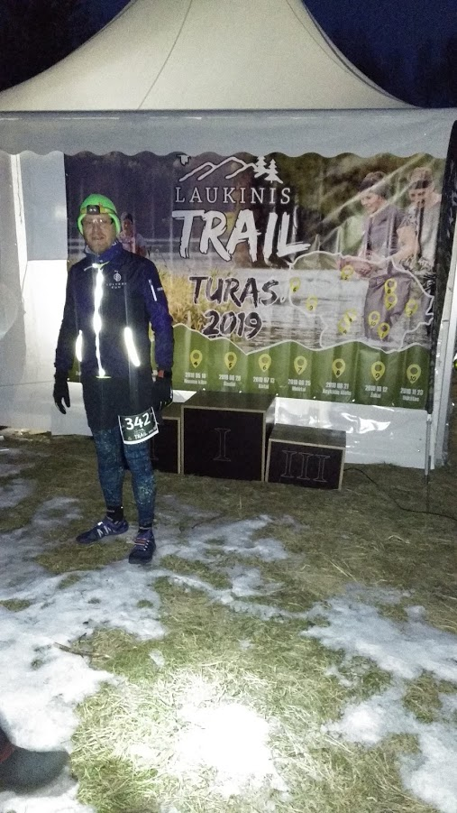
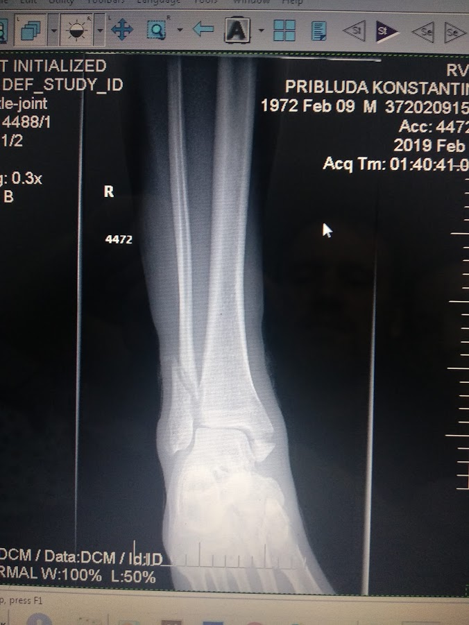
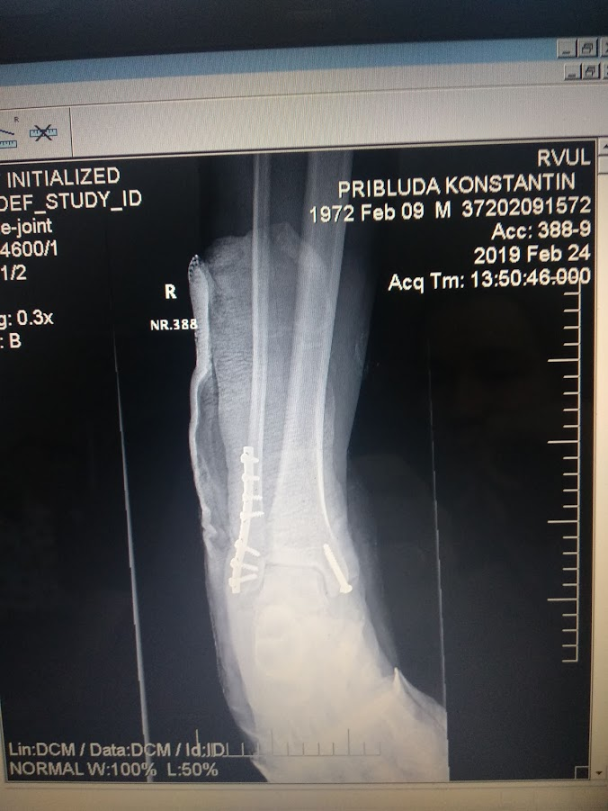

беговых планов на этот год было много,  в первую очередь обьём 2019 километров,  много  полумарафонов. И трэйлов. Сезон был открыт 
23 февраля. И сразу снова закрыт.

### Вокруг зеленого озера

Замечательное  мероприятие для открытия сезеонв.  14  кмоометров, примерно 400 метров набора высоты - легкме трэйлы,  по снегу
и гололёду. Ночью. Что может случиться?

В общем и целом было скользко, круто,  темоно как сами знаете где у кого -  и я даже практически без потерь пробкжал. И даже  с приличным временем. 
Почти.  Вот даже [на страве всё есть](https://www.strava.com/activities/2170105659).  Но метров за 200 до финиша я как то расслабился и поскользнулся.

По очень характеоному звуку "хрусь"  я понял сто всатавть уже не стоит и спортивный сезон на некоторое время откладывается. Добрые соучастники помогли
допрыгать до финишв,  и даже результат [получился доаольно прилмчный](https://dbsportas.lt/en/varz/2019037/rezgru/V14?diena=1)
51 место однако.  

Итоговый разбор полетов проводился в республиканской больнице в Лаздинае -  перелом лодыжки, 8 винтов и пластина, не нагружать ногу 8 недель.

#### Было:

#### Стало:

Осталось 7 недель.  Увидимся на трассе. 

 
