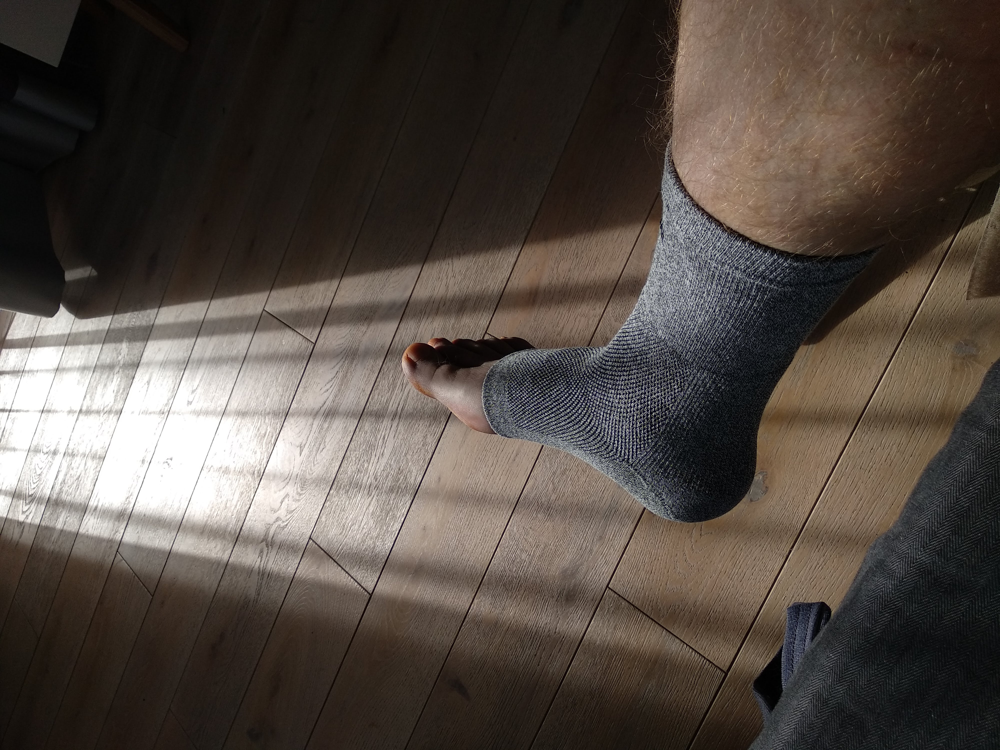
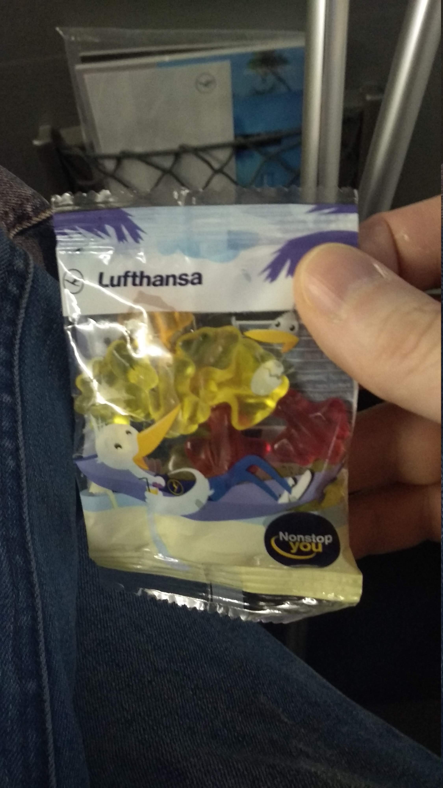
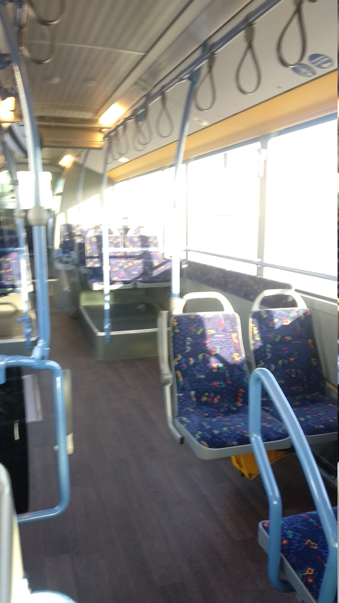
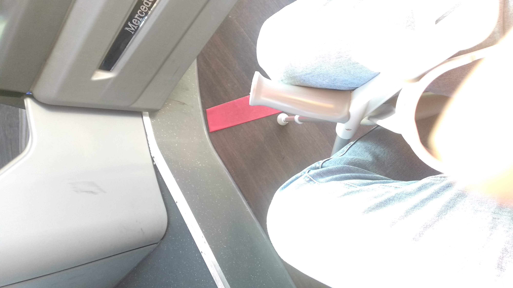
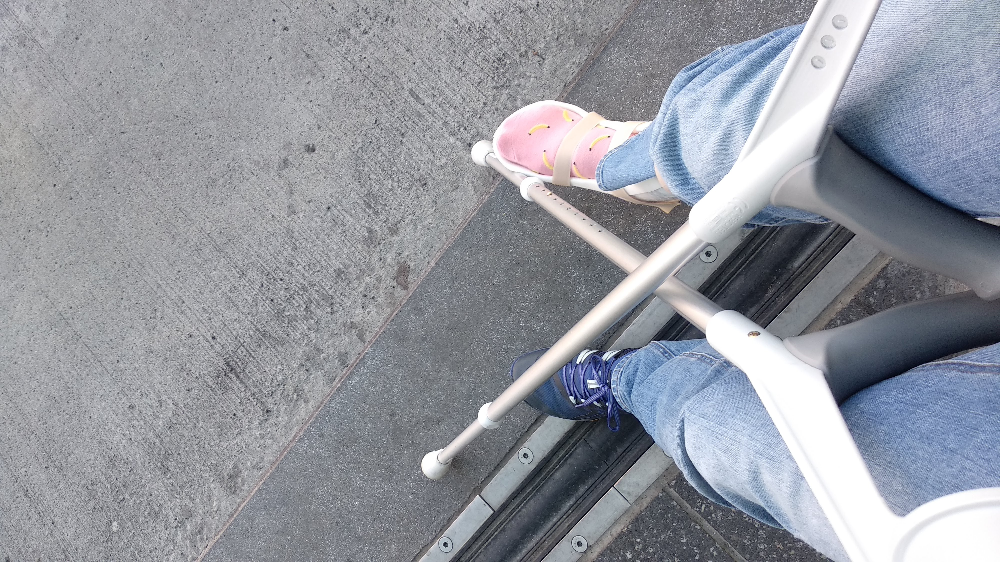

За три недели работы из дома можно изрядно одичать.  Так что самому захочется в уютный оффис. Но до оффиса 2 часа лету самолетом. Но ведь прошло уже три недели на костылях - и столько же осталось. Экватор!

   
 
 
### Волшебный носок

Неделю назад я таки дошел до кинезиотерапевта (они люди редкие и занятые).  Осмотр показал что все очень даже хорошо проходит, пора делать гимнастику для сустава, и никаких возражений против йоги и ОФП нет.  А кроме того мне очень необходим волшебный носок с германием, карбоном и легкой компрессией ускоряющий восстановление на 46%.  Знакомьтесь - [Волшебный носок](https://incrediwear.com/products/incrediwear-ankle-sleeve)

Несмотря на агрессивный маркетинговый буллшит, волшебное воздействие имеется - греет, легонько фиксирует сустав и очень быстро сгоняет отек.
 

### Личные рекорды

Интенсивные тренировки на костылях дают неслабый результат.  Мой пэйс  улучшился с [25:39](https://www.strava.com/activities/2188505173) до [15:39](https://www.strava.com/activities/2228755989)-  А заодно установлен новый рекорд по растоянию.
Наконец то дошел  4 километра своим ходом до субботней тусовки бегового клубв (все собираются в 8 утра и бегут 15-20 километров, а потом пьют кофе с печеньками).

Передвижение на костылях это очень зорошая кардио тренировка для базовай выносливости, баланса, пресса, рук и  кора - но лучшевсе таки не болеть.  

### Полёты с костылями

Как оказалось летать самолетами люфтанзы совсем не страшно. Безопасность в аэропорту проходится без очереди, на посадку пускают в первых рядах,
стюардессы  угощают конфетами:

 
 
а во франфурте дают личный мерседес с водителем:

ну в потом такси и в уютный оффис:

